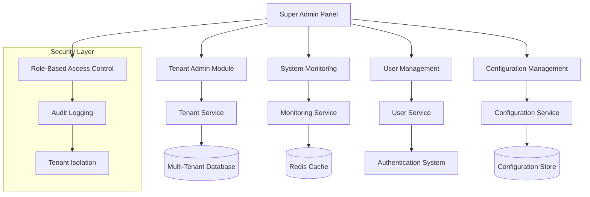

# Super Admin Tenant Control System Design

## Overview

The Super Admin Tenant Control System provides a comprehensive administrative interface for managing multi-tenant applications. Built on Laravel 12 with Filament v4.3+, the system implements a hierarchical permission model where super administrators have system-wide access while maintaining strict tenant isolation for regular users.

The architecture follows clean separation of concerns with dedicated services for tenant management, monitoring, and security. The system integrates with existing authentication, uses Filament Shield for role-based access control, and provides real-time dashboards with advanced filtering and analytics capabilities.

## Architecture

### High-Level Architecture



### Panel Architecture

The system extends the existing Filament admin panel with a dedicated super admin cluster:

```php
// Super Admin Panel Structure
app/Filament/Clusters/SuperAdmin/
├── SuperAdmin.php                    // Main cluster
├── Resources/
│   ├── TenantResource.php           // Tenant CRUD operations
│   ├── SystemUserResource.php       // Cross-tenant user management
│   ├── AuditLogResource.php         // System audit trails
│   └── SystemConfigResource.php     // Global configuration
├── Pages/
│   ├── Dashboard.php                // Super admin dashboard
│   ├── TenantAnalytics.php         // Tenant performance analytics
│   ├── SystemHealth.php            // System monitoring
│   └── BulkOperations.php          // Mass tenant operations
└── Widgets/
    ├── TenantOverviewWidget.php     // Tenant statistics
    ├── SystemMetricsWidget.php      // Performance metrics
    └── RecentActivityWidget.php     // Activity feed
```

## Components and Interfaces

### Core Services

#### TenantManagementService
```php
interface TenantManagementInterface
{
    public function createTenant(CreateTenantData $data): Tenant;
    public function updateTenantSettings(Tenant $tenant, array $settings): void;
    public function suspendTenant(Tenant $tenant, string $reason): void;
    public function activateTenant(Tenant $tenant): void;
    public function deleteTenant(Tenant $tenant): void;
    public function getTenantMetrics(Tenant $tenant): TenantMetrics;
    public function bulkUpdateTenants(Collection $tenants, array $updates): BulkOperationResult;
}
```

#### SystemMonitoringService
```php
interface SystemMonitoringInterface
{
    public function getSystemHealth(): SystemHealthStatus;
    public function getTenantUsageStats(): Collection;
    public function getPerformanceMetrics(DateRange $period): PerformanceReport;
    public function detectAnomalies(): Collection;
    public function generateUsageReport(ReportFilters $filters): UsageReport;
}
```

#### SuperAdminUserService
```php
interface SuperAdminUserInterface
{
    public function impersonateUser(User $user): ImpersonationSession;
    public function endImpersonation(): void;
    public function bulkUpdateUsers(Collection $users, array $updates): BulkOperationResult;
    public function getUserActivityAcrossTenants(User $user): ActivityReport;
    public function suspendUserGlobally(User $user, string $reason): void;
}
```

### Data Models

#### Enhanced Tenant Model
```php
class Tenant extends Model
{
    protected $fillable = [
        'name',
        'slug',
        'domain',
        'status',
        'subscription_plan',
        'settings',
        'resource_quotas',
        'billing_info',
        'primary_contact_email',
        'created_by_admin_id',
    ];

    protected $casts = [
        'settings' => 'array',
        'resource_quotas' => 'array',
        'billing_info' => 'array',
        'status' => TenantStatus::class,
        'subscription_plan' => SubscriptionPlan::class,
    ];

    // Relationships
    public function users(): HasMany;
    public function auditLogs(): HasMany;
    public function usageMetrics(): HasMany;
    public function backups(): HasMany;
}
```

#### System Configuration Model
```php
class SystemConfiguration extends Model
{
    protected $fillable = [
        'key',
        'value',
        'type',
        'description',
        'is_tenant_configurable',
        'requires_restart',
        'updated_by_admin_id',
    ];

    protected $casts = [
        'value' => 'array',
        'type' => ConfigurationType::class,
        'is_tenant_configurable' => 'boolean',
        'requires_restart' => 'boolean',
    ];
}
```

#### Audit Log Model
```php
class SuperAdminAuditLog extends Model
{
    protected $fillable = [
        'admin_id',
        'action',
        'target_type',
        'target_id',
        'tenant_id',
        'changes',
        'ip_address',
        'user_agent',
        'impersonation_session_id',
    ];

    protected $casts = [
        'changes' => 'array',
        'action' => AuditAction::class,
    ];
}
```

## Data Models

### Value Objects

#### TenantMetrics
```php
readonly class TenantMetrics
{
    public function __construct(
        public int $totalUsers,
        public int $activeUsers,
        public float $storageUsedMB,
        public float $storageQuotaMB,
        public int $apiCallsToday,
        public int $apiCallsQuota,
        public Money $monthlyRevenue,
        public Carbon $lastActivity,
        public HealthStatus $healthStatus,
    ) {}
}
```

#### SystemHealthStatus
```php
readonly class SystemHealthStatus
{
    public function __construct(
        public HealthLevel $overall,
        public float $cpuUsage,
        public float $memoryUsage,
        public float $diskUsage,
        public int $activeTenants,
        public int $totalUsers,
        public float $averageResponseTime,
        public Collection $alerts,
    ) {}
}
```

### Enums

```php
enum TenantStatus: string
{
    case ACTIVE = 'active';
    case SUSPENDED = 'suspended';
    case PENDING = 'pending';
    case CANCELLED = 'cancelled';
    
    public function getLabel(): string
    {
        return match($this) {
            self::ACTIVE => __('tenant.status.active'),
            self::SUSPENDED => __('tenant.status.suspended'),
            self::PENDING => __('tenant.status.pending'),
            self::CANCELLED => __('tenant.status.cancelled'),
        };
    }
    
    public function getColor(): string
    {
        return match($this) {
            self::ACTIVE => 'success',
            self::SUSPENDED => 'warning',
            self::PENDING => 'info',
            self::CANCELLED => 'danger',
        };
    }
}

enum SubscriptionPlan: string
{
    case STARTER = 'starter';
    case PROFESSIONAL = 'professional';
    case ENTERPRISE = 'enterprise';
    case CUSTOM = 'custom';
}

enum AuditAction: string
{
    case TENANT_CREATED = 'tenant_created';
    case TENANT_UPDATED = 'tenant_updated';
    case TENANT_SUSPENDED = 'tenant_suspended';
    case TENANT_DELETED = 'tenant_deleted';
    case USER_IMPERSONATED = 'user_impersonated';
    case BULK_OPERATION = 'bulk_operation';
    case SYSTEM_CONFIG_CHANGED = 'system_config_changed';
}
```

## Correctness Properties

*A property is a characteristic or behavior that should hold true across all valid executions of a system-essentially, a formal statement about what the system should do. Properties serve as the bridge between human-readable specifications and machine-verifiable correctness guarantees.*

Based on the prework analysis, the following correctness properties ensure the super admin tenant control system operates correctly across all scenarios:

### Property 1: Super Admin Access Control
*For any* user attempting to access the super admin panel, access should be granted if and only if the user has super admin privileges
**Validates: Requirements 1.2**

### Property 2: Dashboard Metrics Accuracy
*For any* super admin viewing the dashboard, the displayed tenant metrics should accurately reflect the current system state (active tenants, total users, resource usage)
**Validates: Requirements 1.3**

### Property 3: Tenant Context Privilege Preservation
*For any* tenant context switch by a super admin, super admin privileges should be maintained while displaying tenant-specific data
**Validates: Requirements 1.5**

### Property 4: Tenant Creation Validation
*For any* tenant creation attempt, the system should require tenant name, primary contact email, and subscription plan selection before allowing creation
**Validates: Requirements 2.1**

### Property 5: Tenant Isolation Guarantee
*For any* newly created tenant, the system should generate a unique tenant identifier and ensure complete data isolation from other tenants
**Validates: Requirements 2.3**

### Property 6: Welcome Email Delivery
*For any* successfully created tenant, the system should send a welcome email to the primary contact with setup instructions
**Validates: Requirements 2.5**

### Property 7: Metrics Display Completeness
*For any* tenant being monitored, the system should display user activity, storage usage, and API call statistics accurately
**Validates: Requirements 3.1**

### Property 8: Anomaly Detection Alerting
*For any* detected anomaly in tenant activity or performance, the system should alert super admins with relevant details
**Validates: Requirements 3.4**

### Property 9: Multi-Format Report Generation
*For any* analytics data, the system should be able to export reports in PDF, CSV, and Excel formats
**Validates: Requirements 3.5**

### Property 10: Cross-Tenant User Management
*For any* user management operation (enable, disable, remove), the system should allow super admins to perform actions across all tenants
**Validates: Requirements 4.2**

### Property 11: Immediate Permission Updates
*For any* permission modification, the system should update user roles and access levels with immediate effect
**Validates: Requirements 4.3**

### Property 12: Bulk Operation Confirmation
*For any* bulk user management operation, the system should require confirmation prompts before execution
**Validates: Requirements 4.5**

### Property 13: Feature Flag Propagation
*For any* feature flag update, the system should apply changes across all specified tenants or tenant groups consistently
**Validates: Requirements 5.2**

### Property 14: Security Policy Enforcement
*For any* configured security policy, the system should enforce password requirements, session timeouts, and access controls uniformly
**Validates: Requirements 5.3**

### Property 15: Resource Quota Enforcement
*For any* tenant with configured resource quotas, the system should enforce limits on storage, users, and API calls
**Validates: Requirements 6.1**

### Property 16: Usage Monitoring and Alerting
*For any* tenant approaching resource limits, the system should track consumption and generate alerts when thresholds are reached
**Validates: Requirements 6.2**

### Property 17: Billing Calculation Accuracy
*For any* tenant usage and subscription plan combination, the system should calculate charges accurately based on usage patterns
**Validates: Requirements 6.3**

### Property 18: Backup Encryption and Completeness
*For any* initiated backup, the system should create complete tenant data snapshots with proper encryption
**Validates: Requirements 7.1**

### Property 19: Backup Scheduling Reliability
*For any* configured backup schedule, the system should execute backups at the specified intervals without failure
**Validates: Requirements 7.2**

### Property 20: Data Restoration Integrity
*For any* data restoration operation, the system should allow selective restoration with rollback capability while maintaining data integrity
**Validates: Requirements 7.3**

### Property 21: Comprehensive Audit Logging
*For any* user action in the system, all activities should be logged with timestamps, user details, and affected resources
**Validates: Requirements 8.1**

### Property 22: Audit Log Searchability
*For any* audit log query, the system should provide searchable and filterable access to activity history
**Validates: Requirements 8.2**

### Property 23: Notification Delivery Accuracy
*For any* notification sent to tenants, the system should deliver messages to the correct recipients (specific tenants or all tenants)
**Validates: Requirements 9.1**

### Property 24: Communication Scheduling Reliability
*For any* scheduled communication, the system should deliver messages at the specified time with support for recurring patterns
**Validates: Requirements 9.3**

### Property 25: Impersonation Authorization and Logging
*For any* impersonation session, the system should require explicit authorization and maintain complete audit logs of the session
**Validates: Requirements 10.1**

### Property 26: Impersonation Visual Indicators
*For any* active impersonation session, the system should maintain clear visual indicators throughout the session
**Validates: Requirements 10.2**

### Property 27: Impersonation Action Attribution
*For any* action performed during impersonation, the system should attribute the action to the super admin in audit logs
**Validates: Requirements 10.3**

### Property 28: Impersonation Restriction Enforcement
*For any* impersonation session, the system should prevent access to sensitive operations like password changes
**Validates: Requirements 10.5**

## Error Handling

### Validation Errors
- **Tenant Creation**: Validate required fields, unique constraints, and business rules before creation
- **Resource Quotas**: Prevent setting quotas that exceed system limits or are below current usage
- **User Management**: Validate user permissions and prevent privilege escalation
- **Configuration Changes**: Validate system parameters and prevent invalid configurations

### System Errors
- **Database Failures**: Implement retry logic and graceful degradation for database operations
- **External Service Failures**: Handle billing system, email service, and backup service failures
- **Resource Exhaustion**: Monitor system resources and prevent overload conditions
- **Concurrent Operations**: Handle race conditions in tenant creation and bulk operations

### Security Errors
- **Unauthorized Access**: Log and alert on unauthorized access attempts
- **Impersonation Abuse**: Monitor and restrict impersonation usage patterns
- **Data Breach Attempts**: Detect and prevent cross-tenant data access
- **Audit Log Tampering**: Protect audit logs from modification or deletion

### Recovery Procedures
- **Failed Tenant Creation**: Clean up partial tenant data and notify administrators
- **Backup Failures**: Retry backup operations and alert on persistent failures
- **Billing Errors**: Queue failed billing operations for manual review
- **Communication Failures**: Retry message delivery and maintain delivery status

## Testing Strategy

### Unit Testing Approach
The system will use comprehensive unit testing to verify individual components:

- **Service Classes**: Test each service method with various input scenarios
- **Value Objects**: Verify immutability and validation logic
- **Enums**: Test label and color methods for all enum values
- **Data Models**: Test relationships, scopes, and custom methods
- **Form Requests**: Verify validation rules and authorization logic

### Property-Based Testing Approach
Property-based testing will verify universal properties across all inputs using **Pest PHP** with **PestPHP Property Testing**:

- **Minimum 100 iterations** per property test to ensure comprehensive coverage
- **Tagged tests** with format: `**Feature: superadmin-tenant-control, Property {number}: {property_text}**`
- **Single property per test** to maintain clarity and debugging capability
- **Comprehensive input generation** to test edge cases and boundary conditions

### Integration Testing
- **Filament Resource Testing**: Verify CRUD operations, filters, and bulk actions
- **Authentication Flow**: Test super admin access control and impersonation
- **Multi-Tenant Operations**: Verify tenant isolation and cross-tenant management
- **External Service Integration**: Test billing, email, and backup service integration

### Performance Testing
- **Dashboard Load Times**: Ensure dashboard renders within acceptable time limits
- **Bulk Operations**: Test performance with large numbers of tenants and users
- **Report Generation**: Verify export performance for large datasets
- **Concurrent Access**: Test system behavior under concurrent super admin usage

### Security Testing
- **Access Control**: Verify proper authorization at all levels
- **Tenant Isolation**: Ensure no cross-tenant data leakage
- **Audit Trail Integrity**: Verify complete and tamper-proof audit logging
- **Impersonation Security**: Test impersonation restrictions and logging