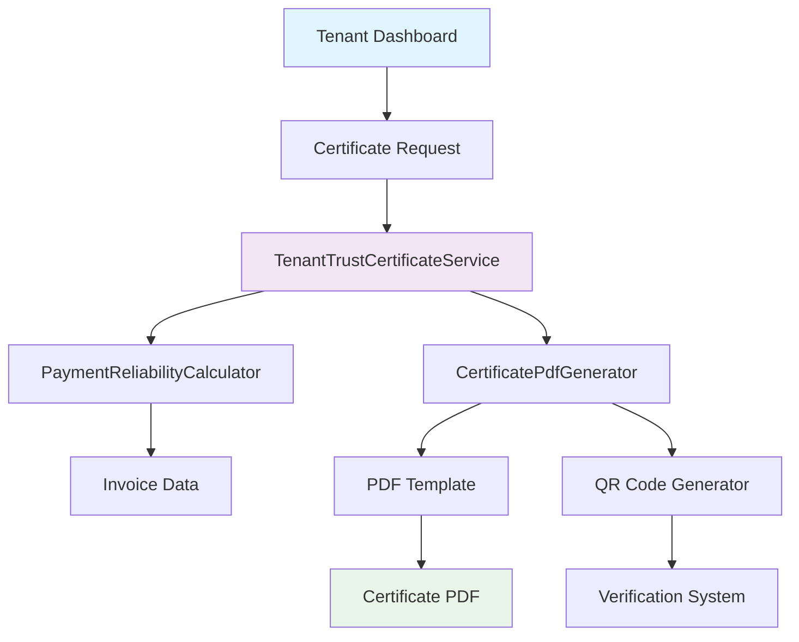

# Design Document

## Overview

The Tenant Trust Certificate system provides tenants with professional PDF certificates showcasing their payment reliability and rental history. The system leverages existing invoice data to calculate reliability scores and generates branded PDF documents with verification capabilities.

## Architecture

### System Components



### Data Flow

1. **Certificate Request**: Tenant initiates certificate generation from dashboard
2. **Authorization Check**: Verify tenant permissions and usage limits
3. **Data Aggregation**: Collect and analyze payment history from invoices
4. **Score Calculation**: Compute reliability score based on payment patterns
5. **PDF Generation**: Create professional certificate with branding and data
6. **Verification Setup**: Generate QR code and store verification metadata
7. **Delivery**: Provide immediate download and usage tracking

## Components and Interfaces

### Core Services

#### TenantTrustCertificateService
```php
declare(strict_types=1);

namespace App\Services\Tenant;

final readonly class TenantTrustCertificateService
{
    public function __construct(
        private PaymentReliabilityCalculator $reliabilityCalculator,
        private CertificatePdfGenerator $pdfGenerator,
        private CertificateUsageTracker $usageTracker,
        private CertificateVerificationService $verificationService,
    ) {}
    
    public function generateCertificate(User $tenant): CertificateResult
    {
        // Validate tenant permissions and usage limits
        // Calculate payment reliability metrics
        // Generate PDF certificate with verification
        // Track usage for billing purposes
        // Return download result
    }
    
    public function canGenerateCertificate(User $tenant): bool
    {
        // Check subscription limits and usage quotas
    }
    
    public function getRemainingFreeGenerations(User $tenant): int
    {
        // Calculate remaining free certificate generations
    }
}
```

#### PaymentReliabilityCalculator
```php
declare(strict_types=1);

namespace App\Services\Tenant;

final readonly class PaymentReliabilityCalculator
{
    public function calculateReliabilityMetrics(User $tenant): ReliabilityMetrics
    {
        // Aggregate invoice payment data
        // Calculate on-time payment percentage
        // Determine reliability score and rating
        // Generate payment trend analysis
    }
    
    public function getPaymentHistory(User $tenant): PaymentHistoryData
    {
        // Collect 12-month payment trends
        // Calculate payment statistics
        // Identify payment patterns
    }
}
```

#### CertificatePdfGenerator
```php
declare(strict_types=1);

namespace App\Services\Tenant;

final readonly class CertificatePdfGenerator
{
    public function __construct(
        private InvoicePdfService $pdfService,
        private QrCodeGenerator $qrGenerator,
    ) {}
    
    public function generatePdf(
        User $tenant,
        ReliabilityMetrics $metrics,
        PaymentHistoryData $history
    ): string {
        // Generate unique certificate ID
        // Create QR code for verification
        // Render PDF template with data
        // Return PDF file path
    }
}
```

### Data Models

#### ReliabilityMetrics Value Object
```php
declare(strict_types=1);

namespace App\ValueObjects\Tenant;

final readonly class ReliabilityMetrics
{
    public function __construct(
        public int $totalInvoices,
        public int $paidInvoices,
        public int $onTimePayments,
        public float $onTimePercentage,
        public float $averagePaymentDelay,
        public ReliabilityRating $rating,
        public int $longestOnTimeStreak,
        public ?Carbon $lastPaymentDate,
    ) {}
    
    public function getScoreColor(): string
    {
        return match($this->rating) {
            ReliabilityRating::EXCELLENT => 'green',
            ReliabilityRating::VERY_GOOD => 'blue',
            ReliabilityRating::GOOD => 'yellow',
            ReliabilityRating::SATISFACTORY => 'orange',
            ReliabilityRating::NEEDS_IMPROVEMENT => 'red',
        };
    }
}
```

#### ReliabilityRating Enum
```php
declare(strict_types=1);

namespace App\Enums\Tenant;

enum ReliabilityRating: string
{
    case EXCELLENT = 'excellent';
    case VERY_GOOD = 'very_good';
    case GOOD = 'good';
    case SATISFACTORY = 'satisfactory';
    case NEEDS_IMPROVEMENT = 'needs_improvement';
    
    public function getLabel(): string
    {
        return match($this) {
            self::EXCELLENT => __('tenant.reliability.excellent'),
            self::VERY_GOOD => __('tenant.reliability.very_good'),
            self::GOOD => __('tenant.reliability.good'),
            self::SATISFACTORY => __('tenant.reliability.satisfactory'),
            self::NEEDS_IMPROVEMENT => __('tenant.reliability.needs_improvement'),
        };
    }
    
    public function getThreshold(): float
    {
        return match($this) {
            self::EXCELLENT => 95.0,
            self::VERY_GOOD => 85.0,
            self::GOOD => 75.0,
            self::SATISFACTORY => 60.0,
            self::NEEDS_IMPROVEMENT => 0.0,
        };
    }
}
```

#### CertificateVerification Model
```php
declare(strict_types=1);

namespace App\Models;

final class CertificateVerification extends Model
{
    protected $fillable = [
        'certificate_id',
        'tenant_id',
        'generated_at',
        'expires_at',
        'verification_hash',
        'metadata',
    ];
    
    protected $casts = [
        'generated_at' => 'datetime',
        'expires_at' => 'datetime',
        'metadata' => 'array',
    ];
    
    public function tenant(): BelongsTo
    {
        return $this->belongsTo(User::class, 'tenant_id');
    }
    
    public function isValid(): bool
    {
        return $this->expires_at->isFuture();
    }
}
```

### Database Schema

#### Certificate Verification Table
```sql
CREATE TABLE certificate_verifications (
    id BIGINT UNSIGNED NOT NULL AUTO_INCREMENT PRIMARY KEY,
    certificate_id VARCHAR(255) NOT NULL UNIQUE,
    tenant_id BIGINT UNSIGNED NOT NULL,
    generated_at TIMESTAMP NOT NULL,
    expires_at TIMESTAMP NOT NULL,
    verification_hash VARCHAR(255) NOT NULL,
    metadata JSON NULL,
    created_at TIMESTAMP NULL,
    updated_at TIMESTAMP NULL,
    
    INDEX idx_certificate_id (certificate_id),
    INDEX idx_tenant_id (tenant_id),
    INDEX idx_expires_at (expires_at),
    
    FOREIGN KEY (tenant_id) REFERENCES users(id) ON DELETE CASCADE
);
```

#### Certificate Usage Tracking Table
```sql
CREATE TABLE certificate_usage_logs (
    id BIGINT UNSIGNED NOT NULL AUTO_INCREMENT PRIMARY KEY,
    tenant_id BIGINT UNSIGNED NOT NULL,
    certificate_id VARCHAR(255) NOT NULL,
    generated_at TIMESTAMP NOT NULL,
    ip_address VARCHAR(45) NULL,
    user_agent TEXT NULL,
    created_at TIMESTAMP NULL,
    
    INDEX idx_tenant_id (tenant_id),
    INDEX idx_generated_at (generated_at),
    
    FOREIGN KEY (tenant_id) REFERENCES users(id) ON DELETE CASCADE
);
```

## Correctness Properties

*A property is a characteristic or behavior that should hold true across all valid executions of a system-essentially, a formal statement about what the system should do. Properties serve as the bridge between human-readable specifications and machine-verifiable correctness guarantees.*

### Property-Based Testing Analysis

Using the prework tool to analyze acceptance criteria for testability:

<function_calls>
<invoke name="prework">
<parameter name="featureName">tenant-trust-certificate

## Correctness Properties

*A property is a characteristic or behavior that should hold true across all valid executions of a system-essentially, a formal statement about what the system should do. Properties serve as the bridge between human-readable specifications and machine-verifiable correctness guarantees.*

### Property-Based Testing Analysis

Based on the acceptance criteria analysis, the following properties must hold for all valid system executions:

#### P1: Data Isolation Property
**Property**: ∀ tenant T, certificate C generated for T → C contains only data belonging to T
**Invariant**: Certificate generation must never leak cross-tenant data
**Test Strategy**: Generate certificates for multiple tenants simultaneously and verify no data mixing occurs

```php
// Property test example
it('never includes cross-tenant data in certificates', function () {
    $tenant1 = User::factory()->tenant()->create();
    $tenant2 = User::factory()->tenant()->create();
    
    // Create invoices for both tenants
    Invoice::factory()->for($tenant1, 'tenant')->count(5)->create();
    Invoice::factory()->for($tenant2, 'tenant')->count(3)->create();
    
    $certificate1 = $this->certificateService->generateCertificate($tenant1);
    $certificate2 = $this->certificateService->generateCertificate($tenant2);
    
    // Verify no cross-contamination
    expect($certificate1->getMetrics()->totalInvoices)->toBe(5);
    expect($certificate2->getMetrics()->totalInvoices)->toBe(3);
});
```

#### P2: Reliability Score Consistency Property
**Property**: ∀ payment history H, reliability score S → S is deterministic and monotonic with payment performance
**Invariant**: Same payment history always produces same reliability score
**Test Strategy**: Generate multiple certificates for same tenant and verify score consistency

```php
// Property test example
it('produces consistent reliability scores for same payment history', function () {
    $tenant = User::factory()->tenant()->create();
    
    // Create consistent payment history
    Invoice::factory()
        ->for($tenant, 'tenant')
        ->paid()
        ->onTime()
        ->count(10)
        ->create();
    
    $certificate1 = $this->certificateService->generateCertificate($tenant);
    $certificate2 = $this->certificateService->generateCertificate($tenant);
    
    expect($certificate1->getMetrics()->onTimePercentage)
        ->toBe($certificate2->getMetrics()->onTimePercentage);
});
```

#### P3: Payment History Completeness Property
**Property**: ∀ tenant T, certificate C → C includes all and only paid invoices for T
**Invariant**: Certificate must include complete payment history without omissions or additions
**Test Strategy**: Create known invoice set and verify certificate includes exact count and amounts

```php
// Property test example
it('includes complete payment history without omissions', function () {
    $tenant = User::factory()->tenant()->create();
    
    // Create mixed invoice statuses
    $paidInvoices = Invoice::factory()
        ->for($tenant, 'tenant')
        ->paid()
        ->count(7)
        ->create();
    
    $draftInvoices = Invoice::factory()
        ->for($tenant, 'tenant')
        ->draft()
        ->count(3)
        ->create();
    
    $certificate = $this->certificateService->generateCertificate($tenant);
    
    // Should only include paid invoices
    expect($certificate->getMetrics()->totalInvoices)->toBe(7);
    expect($certificate->getMetrics()->paidInvoices)->toBe(7);
});
```

#### P4: Usage Limit Enforcement Property
**Property**: ∀ tenant T, generation count G → G ≤ allowed limit OR payment processed
**Invariant**: Free generation limits must be enforced consistently
**Test Strategy**: Attempt to exceed limits and verify proper blocking/payment flow

```php
// Property test example
it('enforces usage limits consistently', function () {
    $tenant = User::factory()->tenant()->create();
    
    // Generate up to free limit
    for ($i = 0; $i < 3; $i++) {
        expect($this->certificateService->canGenerateCertificate($tenant))->toBeTrue();
        $this->certificateService->generateCertificate($tenant);
    }
    
    // Should block further generation
    expect($this->certificateService->canGenerateCertificate($tenant))->toBeFalse();
});
```

#### P5: Certificate Verification Integrity Property
**Property**: ∀ certificate C with verification V → V validates C authenticity within expiry period
**Invariant**: Verification system must correctly validate authentic certificates and reject invalid ones
**Test Strategy**: Generate certificates and verify QR codes validate correctly

```php
// Property test example
it('maintains certificate verification integrity', function () {
    $tenant = User::factory()->tenant()->create();
    $certificate = $this->certificateService->generateCertificate($tenant);
    
    $verificationData = $this->verificationService->verify($certificate->getId());
    
    expect($verificationData->isValid())->toBeTrue();
    expect($verificationData->getTenantId())->toBe($tenant->id);
    expect($verificationData->getGeneratedAt())->toBeInstanceOf(Carbon::class);
});
```

#### P6: PDF Generation Consistency Property
**Property**: ∀ tenant data D, PDF generation → produces valid, readable PDF with complete data
**Invariant**: PDF generation must never fail silently or produce corrupted output
**Test Strategy**: Generate PDFs and verify file integrity and content completeness

```php
// Property test example
it('generates valid PDFs with complete data', function () {
    $tenant = User::factory()->tenant()->create();
    Invoice::factory()->for($tenant, 'tenant')->paid()->count(5)->create();
    
    $certificate = $this->certificateService->generateCertificate($tenant);
    $pdfPath = $certificate->getPdfPath();
    
    expect(file_exists($pdfPath))->toBeTrue();
    expect(filesize($pdfPath))->toBeGreaterThan(1024); // At least 1KB
    
    // Verify PDF contains expected content
    $pdfContent = file_get_contents($pdfPath);
    expect($pdfContent)->toContain($tenant->name);
    expect($pdfContent)->toContain('Reliability Score');
});
```

### Property Test Implementation Strategy

#### Test Data Generation
- Use Laravel factories to create realistic tenant and invoice data
- Generate edge cases: no invoices, all late payments, perfect payment history
- Create boundary conditions: exactly at free limits, score thresholds

#### Invariant Verification
- Run property tests with 100+ iterations to ensure statistical confidence
- Use Pest's property testing features for randomized input generation
- Verify properties hold across different tenant configurations

#### Performance Properties
- Certificate generation completes within 10 seconds
- PDF file size remains under 2MB
- Memory usage stays within reasonable bounds during generation

#### Security Properties
- No tenant can access another tenant's certificate data
- Verification URLs expire properly and cannot be manipulated
- Rate limiting prevents abuse and DoS attacks

### Integration with Existing Testing Infrastructure

The property-based tests will integrate with the existing testing framework:

```php
// tests/Feature/TenantTrustCertificatePropertyTest.php
use Tests\TestCase;
use Illuminate\Foundation\Testing\RefreshDatabase;

class TenantTrustCertificatePropertyTest extends TestCase
{
    use RefreshDatabase;
    
    protected function setUp(): void
    {
        parent::setUp();
        $this->certificateService = app(TenantTrustCertificateService::class);
        $this->verificationService = app(CertificateVerificationService::class);
    }
    
    // Property tests implementation...
}
```

This property-based testing approach ensures the tenant trust certificate system maintains correctness guarantees across all possible execution scenarios, providing confidence in the system's reliability and security.