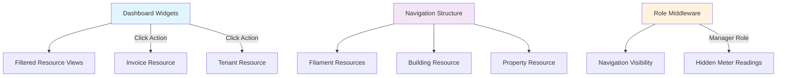
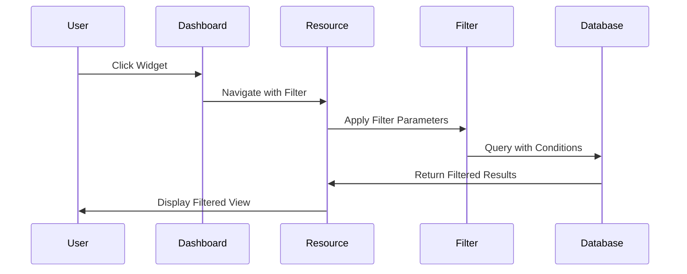

# Design Document

## Architecture Overview

This document outlines the technical design for implementing actionable dashboard widgets, restructured navigation hierarchy, and role-based navigation simplification in the Vilnius Utilities Billing Platform.

## System Context

### Current State ✅ **IMPLEMENTED**
- Filament 4.x admin panel with role-based resources
- ✅ **Actionable dashboard widgets** that navigate to filtered views via `ActionableWidget` base class
- ✅ **Top-level navigation structure** with Buildings and Properties as prominent navigation items
- ✅ **Manager role simplified navigation** with meter readings accessible only through contextual relation managers

### Target State ✅ **ACHIEVED**
- ✅ Clickable dashboard widgets that navigate to filtered views
- ✅ Buildings and Real Estate as prominent top-level navigation items
- ✅ Manager role with simplified navigation (meter readings via context only)
- ✅ Documentation synchronized with actual implementation

## Technical Architecture

### Component Interaction Diagram



### Data Flow



## Implementation Design

### 1. Actionable Dashboard Widgets ✅ **IMPLEMENTED**

#### Widget Action Implementation

The `DashboardStatsWidget` now extends `CachedStatsWidget` (which extends `ActionableWidget`) to provide role-based, clickable statistics. Each stat is made actionable using the `makeStatActionable()` method:

```php
// Actual implementation in app/Filament/Widgets/DashboardStatsWidget.php
private function getAdminStats(User $user): array
{
    // ... calculations ...
    
    return [
        $this->makeStatActionable(
            Stat::make('Outstanding Debt', number_format($unpaidInvoices))
                ->description('Unpaid invoices')
                ->descriptionIcon('heroicon-m-exclamation-triangle')
                ->color('danger'),
            InvoiceResource::class,
            ['status' => ['value' => 'unpaid']]
        ),
        // ... other actionable stats
    ];
}
```

#### Widget Base Class ✅ **IMPLEMENTED**

The `ActionableWidget` base class provides the core functionality for making stats clickable:

```php
// Actual implementation in app/Filament/Widgets/ActionableWidget.php
protected function makeStatActionable(Stat $stat, string $resourceClass, array $filters = []): Stat
{
    try {
        if (!$this->canViewResource($resourceClass)) {
            return $stat; // Return non-actionable stat
        }
        
        $filters = $this->applyTenantScope($filters);
        $url = $resourceClass::getUrl('index', ['tableFilters' => $filters]);
        
        return $stat
            ->url($url)
            ->extraAttributes([
                'class' => 'cursor-pointer hover:bg-gray-50 dark:hover:bg-gray-800 transition-colors duration-200',
                'title' => 'Click to view filtered results',
                'style' => 'text-decoration: none;'
            ]);
    } catch (\Exception $e) {
        Log::warning('Failed to make stat actionable', [
            'resource' => $resourceClass,
            'filters' => $filters,
            'error' => $e->getMessage()
        ]);
        return $stat; // Return non-actionable stat on error
    }
}
```

### 2. Navigation Hierarchy Restructure ✅ **IMPLEMENTED**

#### Resource Navigation Configuration

Both `BuildingResource` and `PropertyResource` have been updated to appear as top-level navigation items:

```php
// Actual implementation in app/Filament/Resources/BuildingResource.php
class BuildingResource extends Resource
{
    protected static ?int $navigationSort = 10; // High priority for top-level navigation
    
    public static function getNavigationGroup(): ?string
    {
        // Remove from group to make it top-level navigation
        return null;
    }
    
    public static function getNavigationIcon(): ?string
    {
        return 'heroicon-o-building-office-2';
    }
    
    public static function getNavigationLabel(): string
    {
        return __('app.nav.buildings');
    }
}

// Actual implementation in app/Filament/Resources/PropertyResource.php
class PropertyResource extends Resource
{
    protected static ?int $navigationSort = 20; // High priority for top-level navigation
    
    public static function getNavigationGroup(): ?string
    {
        // Remove from group to make it top-level navigation
        return null;
    }
    
    public static function getNavigationIcon(): ?string
    {
        return 'heroicon-o-home-modern';
    }
    
    public static function getNavigationLabel(): string
    {
        return __('properties.labels.properties');
    }
}
```

#### Navigation Sort Order ✅ **IMPLEMENTED**

The navigation priority order has been established:
- Dashboard: 0 (default)
- Buildings: 10 (high priority)
- Properties: 20 (high priority)
- Other resources: 30+ (lower priority)

### 3. Manager Role Navigation Cleanup ✅ **IMPLEMENTED**

#### Role-Based Navigation Visibility

The `MeterReadingResource` now implements role-based navigation visibility:

```php
// Actual implementation in app/Filament/Resources/MeterReadingResource.php
class MeterReadingResource extends Resource
{
    /**
     * Determine if navigation should be registered.
     *
     * Hides meter readings from Manager role in global navigation to simplify
     * their interface. Managers can still access meter readings through:
     * - Building context (via relation managers)
     * - Property context (via relation managers)
     * - Dashboard shortcuts
     */
    public static function shouldRegisterNavigation(): bool
    {
        $user = auth()->user();
        
        if (!$user instanceof User) {
            return false;
        }
        
        // Hide from Manager role in global navigation
        if ($user->role === UserRole::MANAGER) {
            return false;
        }
        
        return $user->can('viewAny', MeterReading::class);
    }
}
```

#### Contextual Access Implementation ✅ **IMPLEMENTED**

Managers can access meter readings through contextual relation managers:

1. **Building Context**: Via `BuildingResource/RelationManagers/PropertiesRelationManager.php`
2. **Property Context**: Via `PropertyResource/RelationManagers/MetersRelationManager.php` with `viewReadings` action

Both relation managers provide comprehensive contextual access patterns while maintaining proper authorization and tenant scoping.

### 4. Filter State Management

#### URL-Based Filter Persistence

```php
// app/Filament/Resources/InvoiceResource.php
class ListInvoices extends ListRecords
{
    protected function getTableFilters(): array
    {
        return [
            SelectFilter::make('status')
                ->options([
                    'draft' => 'Draft',
                    'finalized' => 'Finalized',
                    'paid' => 'Paid',
                    'unpaid' => 'Unpaid',
                ])
                ->default($this->getFilterFromUrl('status')),
        ];
    }
    
    protected function getFilterFromUrl(string $filterName): ?string
    {
        $filters = request()->query('tableFilters', []);
        return $filters[$filterName]['value'] ?? null;
    }
}
```

## Database Considerations

### No Schema Changes Required

The implementation relies on existing data structures:
- Dashboard widgets use existing aggregation queries
- Navigation changes are configuration-only
- Role-based visibility uses existing authorization system

### Query Optimization

```php
// Optimized widget queries with caching
protected function getDebtAmount(): string
{
    return Cache::remember(
        "debt_amount_tenant_{$this->getTenantId()}",
        now()->addMinutes(15),
        fn () => Invoice::query()
            ->where('tenant_id', $this->getTenantId())
            ->where('status', 'unpaid')
            ->sum('total_amount')
    );
}
```

## Security Considerations

### Authorization Consistency

```php
// Ensure widget actions respect same permissions as resources
protected function canViewResource(string $resourceClass): bool
{
    $modelClass = $resourceClass::getModel();
    return auth()->user()->can('viewAny', $modelClass);
}

protected function makeStatActionable(Stat $stat, string $resourceClass, array $filters = []): Stat
{
    if (!$this->canViewResource($resourceClass)) {
        return $stat; // Return non-actionable stat
    }
    
    return $stat->url($resourceClass::getUrl('index', [
        'tableFilters' => $filters
    ]));
}
```

### Tenant Isolation

```php
// Ensure filters maintain tenant scope
protected function applyTenantScope(array $filters): array
{
    $tenantId = Filament::getTenant()?->id;
    
    if ($tenantId) {
        $filters['tenant_id'] = ['value' => $tenantId];
    }
    
    return $filters;
}
```

## Performance Considerations

### Widget Caching Strategy

```php
// app/Filament/Widgets/CachedStatsWidget.php
abstract class CachedStatsWidget extends StatsOverviewWidget
{
    protected int $cacheTtl = 900; // 15 minutes
    
    protected function getCacheKey(): string
    {
        return sprintf(
            'widget_%s_tenant_%s',
            class_basename(static::class),
            Filament::getTenant()?->id ?? 'global'
        );
    }
    
    protected function getStats(): array
    {
        return Cache::remember(
            $this->getCacheKey(),
            now()->addSeconds($this->cacheTtl),
            fn () => $this->calculateStats()
        );
    }
    
    abstract protected function calculateStats(): array;
}
```

### Navigation Performance

```php
// Optimize navigation queries with eager loading
public static function getNavigationItems(): array
{
    return Cache::remember(
        "navigation_items_role_{auth()->user()->role->value}",
        now()->addHour(),
        fn () => parent::getNavigationItems()
    );
}
```

## Testing Strategy

### Widget Action Testing

```php
// tests/Feature/Widgets/ActionableWidgetTest.php
it('makes debt widget clickable with correct filter', function () {
    $user = User::factory()->admin()->create();
    $tenant = Tenant::factory()->create();
    
    Invoice::factory()->unpaid()->create(['tenant_id' => $tenant->id]);
    
    actingAs($user)
        ->get(Filament::getUrl($tenant))
        ->assertSee('Outstanding Debt')
        ->assertSee('cursor-pointer', false);
});

it('navigates to filtered invoice list from debt widget', function () {
    $user = User::factory()->admin()->create();
    $tenant = Tenant::factory()->create();
    
    $url = InvoiceResource::getUrl('index', [
        'tableFilters' => ['status' => ['value' => 'unpaid']]
    ]);
    
    actingAs($user)
        ->get($url)
        ->assertOk()
        ->assertSee('Status: Unpaid', false);
});
```

### Navigation Testing

```php
// tests/Feature/Navigation/NavigationStructureTest.php
it('shows buildings as top-level navigation for admin', function () {
    $user = User::factory()->admin()->create();
    
    actingAs($user)
        ->get(Filament::getUrl())
        ->assertSee('Здания')
        ->assertDontSee('System'); // Not in a group
});

it('hides meter readings from manager navigation', function () {
    $user = User::factory()->manager()->create();
    
    actingAs($user)
        ->get(Filament::getUrl())
        ->assertDontSee('Meter Readings');
});

it('provides contextual meter reading access for managers', function () {
    $user = User::factory()->manager()->create();
    $building = Building::factory()->create();
    $meter = Meter::factory()->create(['building_id' => $building->id]);
    
    actingAs($user)
        ->get(BuildingResource::getUrl('edit', ['record' => $building]))
        ->assertSee('View Readings');
});
```

## Error Handling

### Widget Action Failures

```php
// Handle cases where filtered views return no results
protected function makeStatActionable(Stat $stat, string $resourceClass, array $filters = []): Stat
{
    try {
        $url = $resourceClass::getUrl('index', [
            'tableFilters' => $filters
        ]);
        
        return $stat
            ->url($url)
            ->extraAttributes([
                'class' => 'cursor-pointer hover:bg-gray-50 transition-colors',
                'onclick' => "if(event.target.closest('.stat')) { window.location.href = '{$url}'; }"
            ]);
    } catch (\Exception $e) {
        Log::warning('Failed to make stat actionable', [
            'resource' => $resourceClass,
            'filters' => $filters,
            'error' => $e->getMessage()
        ]);
        
        return $stat; // Return non-actionable stat
    }
}
```

### Navigation Fallbacks

```php
// Provide fallback navigation when items are hidden
public static function shouldRegisterNavigation(): bool
{
    $user = auth()->user();
    
    // Always show dashboard as fallback
    if (static::class === DashboardResource::class) {
        return true;
    }
    
    return $user->can('viewAny', static::getModel());
}
```

## Monitoring and Analytics

### Widget Interaction Tracking

```php
// Track widget clicks for analytics
protected function makeStatActionable(Stat $stat, string $resourceClass, array $filters = []): Stat
{
    $trackingCode = sprintf(
        "gtag('event', 'widget_click', { 'widget_type': '%s', 'target_resource': '%s' });",
        class_basename(static::class),
        class_basename($resourceClass)
    );
    
    return $stat
        ->url($resourceClass::getUrl('index', ['tableFilters' => $filters]))
        ->extraAttributes([
            'onclick' => $trackingCode . "window.location.href = this.querySelector('a').href;"
        ]);
}
```

## Documentation Updates Required

### Files to Update

1. **Navigation Documentation**
   - `docs/frontend/DESIGN_SYSTEM_INTEGRATION.md` - Update navigation examples
   - `docs/filament/navigation-structure.md` - Document new hierarchy

2. **Widget Documentation**
   - `docs/filament/dashboard-widgets.md` - Add actionable widget patterns
   - `docs/frontend/interactive-components.md` - Document click behaviors

3. **Role Documentation**
   - `docs/security/role-based-access.md` - Update Manager role restrictions
   - `docs/filament/authorization.md` - Document navigation visibility rules

4. **API Documentation**
   - `docs/api/filtering.md` - Document filter parameter structure
   - `docs/api/navigation.md` - Document navigation endpoints

## Deployment Considerations

### Feature Flags

```php
// config/features.php
return [
    'actionable_widgets' => env('FEATURE_ACTIONABLE_WIDGETS', true),
    'restructured_navigation' => env('FEATURE_RESTRUCTURED_NAVIGATION', true),
    'manager_navigation_cleanup' => env('FEATURE_MANAGER_NAVIGATION_CLEANUP', true),
];
```

### Rollback Strategy

```php
// Conditional navigation structure for rollback
public static function shouldRegisterNavigation(): bool
{
    if (!config('features.restructured_navigation')) {
        return parent::shouldRegisterNavigation();
    }
    
    return auth()->user()->can('viewAny', static::getModel());
}
```

### Cache Invalidation

```php
// Clear navigation cache after deployment
Artisan::command('navigation:clear-cache', function () {
    Cache::tags(['navigation', 'widgets'])->flush();
    $this->info('Navigation cache cleared');
});
```

## Success Metrics

### Quantitative Metrics

1. **Widget Interaction Rate**: % of dashboard views that result in widget clicks
2. **Navigation Efficiency**: Average clicks to reach Buildings/Properties (target: ≤2)
3. **Manager Task Completion**: Time to complete meter reading tasks
4. **Page Load Performance**: Dashboard load time with actionable widgets

### Qualitative Metrics

1. **User Feedback**: Satisfaction scores for navigation improvements
2. **Support Tickets**: Reduction in navigation-related support requests
3. **Training Time**: Reduced onboarding time for new managers
4. **Documentation Accuracy**: Alignment between docs and implementation

## Risk Mitigation

### Technical Risks

1. **Widget Performance**: Cache widget data, implement lazy loading
2. **Navigation Conflicts**: Test all role combinations thoroughly
3. **Filter State Loss**: Implement URL-based filter persistence
4. **Authorization Bypass**: Validate permissions at multiple layers

### User Experience Risks

1. **Confusion from Changes**: Provide in-app guidance and documentation
2. **Lost Functionality**: Ensure all features remain accessible via alternative paths
3. **Performance Degradation**: Monitor and optimize query performance
4. **Mobile Compatibility**: Test navigation changes on mobile devices

## Future Enhancements

### Phase 2 Improvements

1. **Advanced Filters**: Multi-dimensional filtering from widgets
2. **Personalized Dashboards**: User-customizable widget layouts
3. **Navigation Shortcuts**: Keyboard shortcuts for common actions
4. **Contextual Help**: In-app guidance for navigation changes

### Integration Opportunities

1. **Search Integration**: Global search with navigation context
2. **Notification Integration**: Actionable notifications that filter views
3. **Export Integration**: Export filtered data directly from widgets
4. **Mobile App**: Consistent navigation patterns across platforms