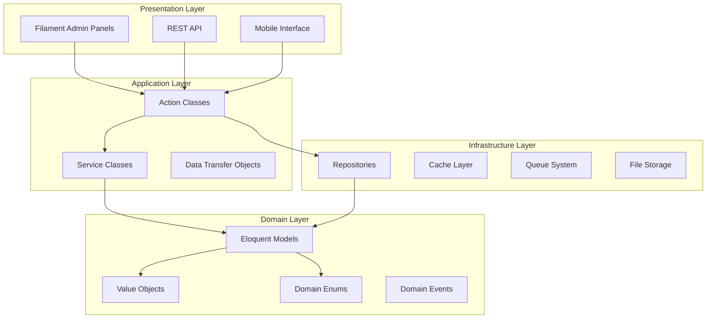
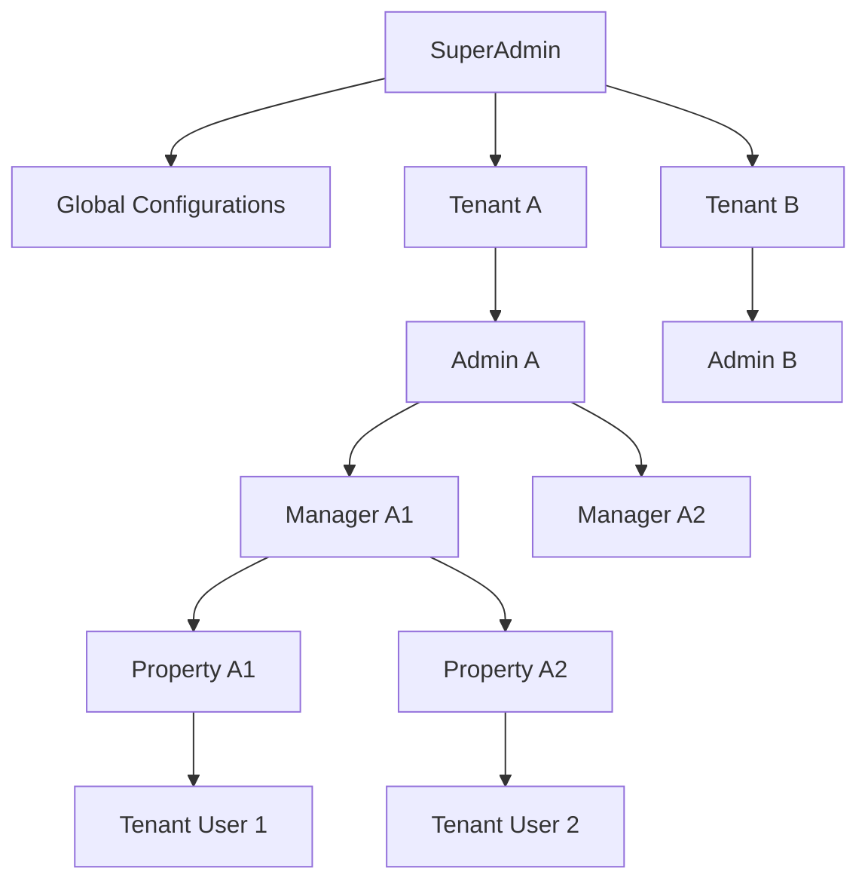
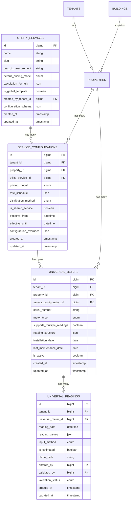

# Design Document

## Overview

The Universal Utility Management System represents a comprehensive refactoring of the existing Lithuanian-specific heating system into a flexible, multi-tenant utility management platform. The system is designed using Clean Architecture principles with Domain-Driven Design (DDD) patterns, supporting multiple utility types, flexible pricing models, and role-based access control across SuperAdmin, Admin, Manager, and Tenant user levels.

The architecture follows Laravel 12 best practices with Action-based business logic, Repository patterns for data access, and comprehensive audit trails. The system maintains backward compatibility with existing heating calculations while providing a migration path to the new universal model.

## Architecture

### High-Level Architecture



### Multi-Tenancy Architecture

The system implements hierarchical multi-tenancy with three levels:
- **Global Level**: SuperAdmin access to all tenants and global configurations
- **Tenant Level**: Admin access within organization boundaries
- **Property Level**: Manager and Tenant access to specific properties



## Components and Interfaces

### Core Domain Models

#### UtilityService
Central configuration entity for utility types (water, electricity, heating, etc.)

```php
class UtilityService extends Model
{
    protected $fillable = [
        'name',
        'slug',
        'unit_of_measurement',
        'default_pricing_model',
        'calculation_formula',
        'is_global_template',
        'created_by_tenant_id',
        'configuration_schema',
    ];
    
    protected $casts = [
        'default_pricing_model' => PricingModel::class,
        'calculation_formula' => 'array',
        'configuration_schema' => 'array',
        'is_global_template' => 'boolean',
    ];
}
```

#### ServiceConfiguration
Property-specific utility service configuration with pricing and distribution rules

```php
class ServiceConfiguration extends Model
{
    protected $fillable = [
        'tenant_id',
        'property_id',
        'utility_service_id',
        'pricing_model',
        'rate_schedule',
        'distribution_method',
        'is_shared_service',
        'effective_from',
        'effective_until',
        'configuration_overrides',
    ];
    
    protected $casts = [
        'pricing_model' => PricingModel::class,
        'rate_schedule' => 'array',
        'distribution_method' => DistributionMethod::class,
        'is_shared_service' => 'boolean',
        'effective_from' => 'datetime',
        'effective_until' => 'datetime',
        'configuration_overrides' => 'array',
    ];
}
```

#### UniversalMeter
Enhanced meter model supporting multiple utility types and flexible reading structures

```php
class UniversalMeter extends Model
{
    protected $fillable = [
        'tenant_id',
        'property_id',
        'service_configuration_id',
        'serial_number',
        'meter_type',
        'supports_multiple_readings',
        'reading_structure',
        'installation_date',
        'last_maintenance_date',
        'is_active',
    ];
    
    protected $casts = [
        'meter_type' => MeterType::class,
        'supports_multiple_readings' => 'boolean',
        'reading_structure' => 'array',
        'installation_date' => 'date',
        'last_maintenance_date' => 'date',
        'is_active' => 'boolean',
    ];
}
```

#### UniversalReading
Flexible reading model supporting various input methods and validation

```php
class UniversalReading extends Model
{
    protected $fillable = [
        'tenant_id',
        'universal_meter_id',
        'reading_date',
        'reading_values',
        'input_method',
        'is_estimated',
        'photo_path',
        'entered_by',
        'validated_by',
        'validation_status',
    ];
    
    protected $casts = [
        'reading_date' => 'datetime',
        'reading_values' => 'array',
        'input_method' => InputMethod::class,
        'is_estimated' => 'boolean',
        'validation_status' => ValidationStatus::class,
    ];
}
```

### Key Enums

```php
enum PricingModel: string
{
    case FIXED_MONTHLY = 'fixed_monthly';
    case CONSUMPTION_BASED = 'consumption_based';
    case TIERED_RATES = 'tiered_rates';
    case HYBRID = 'hybrid';
    case CUSTOM_FORMULA = 'custom_formula';
}

enum DistributionMethod: string
{
    case EQUAL = 'equal';
    case BY_AREA = 'by_area';
    case BY_CONSUMPTION = 'by_consumption';
    case CUSTOM_FORMULA = 'custom_formula';
}

enum InputMethod: string
{
    case MANUAL = 'manual';
    case PHOTO_OCR = 'photo_ocr';
    case CSV_IMPORT = 'csv_import';
    case API_INTEGRATION = 'api_integration';
    case ESTIMATED = 'estimated';
}

enum ValidationStatus: string
{
    case PENDING = 'pending';
    case VALIDATED = 'validated';
    case REJECTED = 'rejected';
    case REQUIRES_REVIEW = 'requires_review';
}
```

### Action Classes

#### CreateUtilityServiceAction
```php
final readonly class CreateUtilityServiceAction
{
    public function __construct(
        private UtilityServiceRepository $repository,
        private AuditLogger $auditLogger,
    ) {}
    
    public function execute(CreateUtilityServiceData $data): UtilityService
    {
        $service = $this->repository->create($data->toArray());
        
        $this->auditLogger->log('utility_service_created', $service);
        
        return $service;
    }
}
```

#### CalculateUtilityBillAction
```php
final readonly class CalculateUtilityBillAction
{
    public function __construct(
        private BillingCalculatorService $calculator,
        private PricingEngineService $pricingEngine,
    ) {}
    
    public function execute(CalculateBillData $data): BillCalculationResult
    {
        $consumption = $this->calculator->calculateConsumption($data);
        $charges = $this->pricingEngine->calculateCharges($consumption, $data->serviceConfiguration);
        
        return new BillCalculationResult($consumption, $charges);
    }
}
```

## Data Models

### Database Schema Overview



### Migration Strategy

The migration from the existing heating system will be handled through a dedicated migration service:

```php
final readonly class HeatingToUniversalMigrationService
{
    public function migrate(): MigrationResult
    {
        // 1. Create backup of existing data
        // 2. Create universal heating service configuration
        // 3. Migrate existing buildings and properties
        // 4. Convert heating calculations to universal format
        // 5. Migrate historical readings and invoices
        // 6. Validate migrated data
    }
}
```

## Correctness Properties

*A property is a characteristic or behavior that should hold true across all valid executions of a system-essentially, a formal statement about what the system should do. Properties serve as the bridge between human-readable specifications and machine-verifiable correctness guarantees.*

### Property Reflection

After analyzing all acceptance criteria, several properties can be consolidated to eliminate redundancy:

- **Service Configuration Properties**: Multiple criteria about service configuration can be combined into comprehensive properties that test all configuration aspects together
- **Billing Calculation Properties**: Various billing-related criteria can be consolidated into properties that test the complete billing pipeline
- **Data Isolation Properties**: Multiple tenant isolation criteria can be combined into comprehensive multi-tenancy properties
- **Audit Trail Properties**: Various audit requirements can be consolidated into properties that test complete audit functionality

### Core System Properties

**Property 1: Universal Service Creation and Configuration**
*For any* valid utility service configuration, creating the service should result in a properly configured service that supports all specified pricing models and calculation methods
**Validates: Requirements 1.1, 1.2, 1.5, 2.1, 2.2, 2.3, 2.4**

**Property 2: Property Service Assignment with Audit Trail**
*For any* property and utility service combination, assigning the service should create proper configuration records with complete audit trails and validation
**Validates: Requirements 3.1, 3.2, 3.3, 9.1**

**Property 3: Multi-Input Reading Validation**
*For any* meter reading submitted through any input method, the system should validate the reading against all configured rules and maintain proper audit trails
**Validates: Requirements 4.1, 4.2, 4.4, 9.1**

**Property 4: Billing Calculation Accuracy**
*For any* service configuration and consumption data, calculating charges should apply the correct pricing model and produce consistent, auditable results
**Validates: Requirements 5.1, 5.2, 5.4, 5.5, 9.3**

**Property 5: Shared Service Cost Distribution**
*For any* shared service configuration and property set, distributing costs should allocate charges according to the configured method and ensure total accuracy
**Validates: Requirements 3.5, 5.3, 6.1, 6.2, 6.3, 6.4**

**Property 6: Automated Billing Cycle Execution**
*For any* configured billing cycle, execution should collect readings, calculate charges, generate invoices, and handle errors gracefully while maintaining data integrity
**Validates: Requirements 7.1, 7.2, 7.3, 7.4**

**Property 7: Multi-Tenant Data Isolation**
*For any* user authentication and data access, the system should enforce complete tenant isolation while allowing appropriate SuperAdmin access with audit trails
**Validates: Requirements 10.1, 10.2, 10.3, 10.4, 10.5**

**Property 8: Service Configuration Validation and Business Rules**
*For any* utility service configuration, the system should enforce all validation rules, business logic, and constraints while providing appropriate error handling
**Validates: Requirements 11.1, 11.2, 11.3, 11.4, 11.5**

**Property 9: Tenant Lifecycle Management**
*For any* tenant move-in or move-out scenario, the system should handle all service transitions, final billing, and account management while preserving historical data
**Validates: Requirements 12.1, 12.2, 12.3, 12.4, 12.5**

**Property 10: Heating Migration Accuracy**
*For any* existing heating calculation, migration to the universal system should preserve calculation accuracy within acceptable tolerance while maintaining complete data lineage
**Validates: Requirements 13.2, 13.3, 13.4**

**Property 11: External Integration Resilience**
*For any* external system integration, the system should handle data import, validation, synchronization, and offline scenarios while maintaining data integrity
**Validates: Requirements 14.1, 14.2, 14.3, 14.4, 14.5**

**Property 12: Mobile Offline Synchronization**
*For any* offline data collection scenario, the system should cache essential data, queue updates, and synchronize correctly when connectivity is restored
**Validates: Requirements 15.2, 15.4**

## Error Handling

### Exception Hierarchy

```php
abstract class UtilityManagementException extends Exception {}

class ServiceConfigurationException extends UtilityManagementException {}
class BillingCalculationException extends UtilityManagementException {}
class MeterReadingValidationException extends UtilityManagementException {}
class TenantIsolationException extends UtilityManagementException {}
class MigrationException extends UtilityManagementException {}
```

### Error Recovery Strategies

1. **Graceful Degradation**: When external services are unavailable, use cached data
2. **Retry Mechanisms**: Implement exponential backoff for transient failures
3. **Circuit Breakers**: Prevent cascade failures in distributed operations
4. **Rollback Capabilities**: Provide transaction rollback for critical operations

## Testing Strategy

### Dual Testing Approach

The system requires both unit testing and property-based testing for comprehensive coverage:

**Unit Tests**:
- Specific examples of service configurations and calculations
- Edge cases for billing scenarios and data validation
- Integration points between components
- Error conditions and exception handling

**Property-Based Tests**:
- Universal properties that should hold across all inputs
- Billing calculation accuracy across various scenarios
- Data isolation enforcement across tenant boundaries
- Migration accuracy validation

### Property-Based Testing Requirements

- Use **Pest PHP** as the primary testing framework with property-based testing extensions
- Configure each property-based test to run a minimum of **100 iterations**
- Tag each property-based test with comments referencing the design document properties
- Use the format: `**Feature: universal-utility-management, Property {number}: {property_text}**`

### Testing Configuration

```php
// Property-based test example
it('validates universal service creation and configuration', function () {
    // **Feature: universal-utility-management, Property 1: Universal Service Creation and Configuration**
    
    $this->forAll(
        Generator\utilityServiceConfiguration(),
        Generator\pricingModel(),
        Generator\calculationFormula()
    )->then(function ($config, $pricing, $formula) {
        $service = $this->createUtilityService($config, $pricing, $formula);
        
        expect($service)->toBeInstanceOf(UtilityService::class);
        expect($service->pricing_model)->toBe($pricing);
        expect($service->calculation_formula)->toBe($formula);
        expect($service->configuration_schema)->toMatchSchema($config);
    });
})->repeat(100);
```

### Integration Testing

- Test complete billing workflows from reading to invoice generation
- Validate multi-tenant data isolation across all operations
- Test migration scenarios with real heating data
- Verify external API integrations with mock services

### Performance Testing

- Load testing for billing calculations with large property sets
- Stress testing for concurrent meter reading submissions
- Memory usage testing for batch operations
- Database query optimization validation