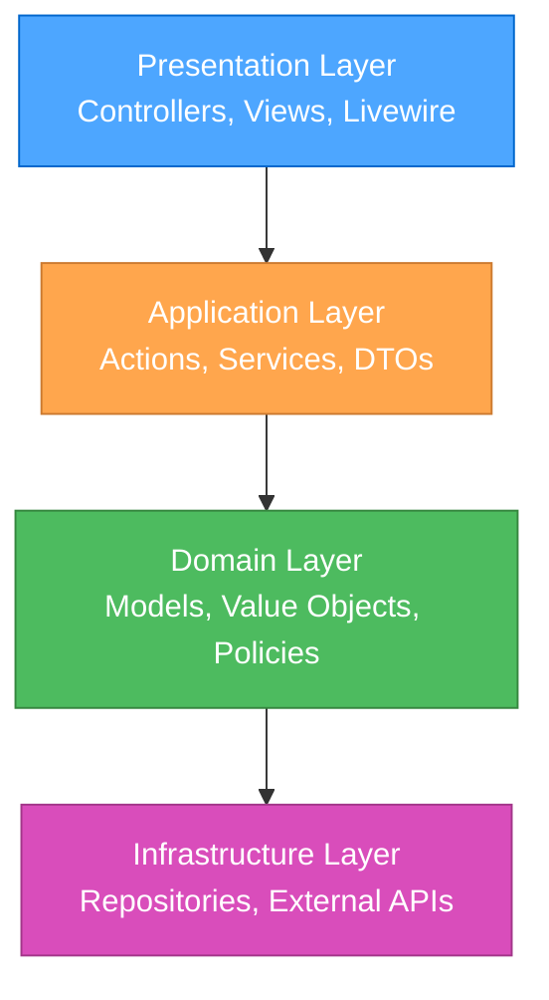

# LARAVEL ARCHITECTURE PATTERNS & CLEAN CODE

> **TL;DR:** This document integrates modern Laravel architectural patterns including Clean Architecture, Domain-Driven Design (DDD), Action-based architecture, SOLID principles, and N+1 query prevention for building maintainable, scalable applications.

## 🏗️ ARCHITECTURAL LAYERS



## 📋 CORE ARCHITECTURAL PRINCIPLES

### 1. Action-Based Architecture

**Principle**: Each business operation is encapsulated in a single Action class with one responsibility.

```php
declare(strict_types=1);

namespace App\Actions\User;

use App\Data\User\CreateUserData;
use App\Models\User;
use Illuminate\Support\Facades\Hash;

final readonly class CreateUserAction
{
    public function __construct(
        private UserRepository $repository,
        private SendWelcomeEmailAction $sendWelcomeEmail,
    ) {}
    
    public function execute(CreateUserData $data): User
    {
        $user = $this->repository->create([
            'name' => $data->name,
            'email' => $data->email,
            'password' => Hash::make($data->password),
        ]);
        
        $this->sendWelcomeEmail->execute($user);
        
        return $user;
    }
}
```

**Benefits**:
- Single Responsibility Principle
- Easy to test in isolation
- Reusable across controllers, commands, jobs
- Clear business logic flow

### 2. Data Transfer Objects (DTOs)

**Principle**: Use typed DTOs instead of arrays for data transfer between layers.

```php
declare(strict_types=1);

namespace App\Data\User;

final readonly class CreateUserData
{
    public function __construct(
        public string $name,
        public string $email,
        public string $password,
    ) {}
    
    public static function fromRequest(CreateUserRequest $request): self
    {
        return new self(
            name: $request->validated('name'),
            email: $request->validated('email'),
            password: $request->validated('password'),
        );
    }
}
```

**Benefits**:
- Type safety
- IDE autocomplete
- Clear data contracts
- Easy validation

### 3. Repository Pattern

**Principle**: Abstract data access logic behind repository interfaces.

```php
declare(strict_types=1);

namespace App\Repositories;

use App\Models\User;
use Illuminate\Database\Eloquent\Collection;

interface UserRepository
{
    public function find(int $id): ?User;
    public function findByEmail(string $email): ?User;
    public function create(array $data): User;
    public function update(User $user, array $data): User;
    public function delete(User $user): bool;
    public function getActive(): Collection;
}
```

```php
declare(strict_types=1);

namespace App\Repositories\Eloquent;

use App\Models\User;
use App\Repositories\UserRepository;
use Illuminate\Database\Eloquent\Collection;

final readonly class EloquentUserRepository implements UserRepository
{
    public function find(int $id): ?User
    {
        return User::find($id);
    }
    
    public function findByEmail(string $email): ?User
    {
        return User::where('email', $email)->first();
    }
    
    public function create(array $data): User
    {
        return User::create($data);
    }
    
    public function update(User $user, array $data): User
    {
        $user->update($data);
        return $user->fresh();
    }
    
    public function delete(User $user): bool
    {
        return $user->delete();
    }
    
    public function getActive(): Collection
    {
        return User::where('is_active', true)->get();
    }
}
```

### 4. Value Objects

**Principle**: Encapsulate primitive values with validation and behavior.

```php
declare(strict_types=1);

namespace App\ValueObjects;

use InvalidArgumentException;

final readonly class Email
{
    public function __construct(
        private string $value,
    ) {
        if (!filter_var($value, FILTER_VALIDATE_EMAIL)) {
            throw new InvalidArgumentException("Invalid email: {$value}");
        }
    }
    
    public function getValue(): string
    {
        return $this->value;
    }
    
    public function getDomain(): string
    {
        return substr($this->value, strpos($this->value, '@') + 1);
    }
    
    public function equals(Email $other): bool
    {
        return $this->value === $other->value;
    }
    
    public function __toString(): string
    {
        return $this->value;
    }
}
```

## 🎯 CONTROLLER PATTERNS

### Thin Controllers

**Principle**: Controllers should only handle HTTP concerns, delegate business logic to Actions.

```php
declare(strict_types=1);

namespace App\Http\Controllers\User;

use App\Actions\User\CreateUserAction;
use App\Data\User\CreateUserData;
use App\Http\Requests\User\CreateUserRequest;
use App\Http\Resources\UserResource;
use Illuminate\Http\JsonResponse;

final class UserController
{
    public function __construct(
        private readonly CreateUserAction $createUser,
    ) {}
    
    public function store(CreateUserRequest $request): JsonResponse
    {
        $data = CreateUserData::fromRequest($request);
        $user = $this->createUser->execute($data);
        
        return response()->json([
            'data' => new UserResource($user),
        ], 201);
    }
}
```

**Controller Responsibilities**:
- ✅ HTTP request/response handling
- ✅ Input validation (via Form Requests)
- ✅ Authorization (via Policies)
- ✅ Response formatting
- ❌ Business logic
- ❌ Database queries
- ❌ External API calls

## 📦 SERVICE LAYER PATTERNS

### Query Services

**Principle**: Separate read operations from write operations (CQRS-lite).

```php
declare(strict_types=1);

namespace App\Services\Job;

use App\Data\Job\JobSearchFilters;
use Illuminate\Contracts\Pagination\LengthAwarePaginator;
use Illuminate\Support\Facades\Cache;

final readonly class JobQueryService
{
    public function search(JobSearchFilters $filters): LengthAwarePaginator
    {
        $cacheKey = "jobs.search." . md5(serialize($filters));
        
        return Cache::remember($cacheKey, 300, function () use ($filters) {
            return Job::query()
                ->with(['company', 'city', 'category', 'type'])
                ->when($filters->search, fn($q) => $q->where('title', 'like', "%{$filters->search}%"))
                ->when($filters->categoryId, fn($q) => $q->where('category_id', $filters->categoryId))
                ->when($filters->typeId, fn($q) => $q->where('type_id', $filters->typeId))
                ->when($filters->cityId, fn($q) => $q->where('city_id', $filters->cityId))
                ->latest()
                ->paginate($filters->perPage);
        });
    }
}
```

### Command Services

**Principle**: Handle complex write operations with multiple steps.

```php
declare(strict_types=1);

namespace App\Services\Job;

use App\Data\Job\CreateJobData;
use App\Events\Job\JobCreated;
use App\Models\Job;
use Illuminate\Support\Facades\DB;

final readonly class JobCommandService
{
    public function create(CreateJobData $data): Job
    {
        return DB::transaction(function () use ($data) {
            $job = Job::create([
                'title' => $data->title,
                'description' => $data->description,
                'company_id' => $data->companyId,
                'category_id' => $data->categoryId,
                'type_id' => $data->typeId,
                'city_id' => $data->cityId,
                'salary_min' => $data->salaryMin,
                'salary_max' => $data->salaryMax,
            ]);
            
            event(new JobCreated($job));
            
            return $job;
        });
    }
}
```

## 🔄 EVENT-DRIVEN ARCHITECTURE

### Domain Events

**Principle**: Use events to decouple business logic and enable side effects.

```php
declare(strict_types=1);

namespace App\Events\Job;

use App\Models\Job;
use Illuminate\Foundation\Events\Dispatchable;
use Illuminate\Queue\SerializesModels;

final class JobCreated
{
    use Dispatchable, SerializesModels;
    
    public function __construct(
        public readonly Job $job,
    ) {}
}
```

### Event Listeners

```php
declare(strict_types=1);

namespace App\Listeners\Job;

use App\Events\Job\JobCreated;
use App\Notifications\Job\NewJobNotification;
use App\Models\User;

final readonly class NotifySubscribersAboutNewJob
{
    public function handle(JobCreated $event): void
    {
        User::whereHas('subscriptions', function ($query) use ($event) {
            $query->where('category_id', $event->job->category_id);
        })->each(function (User $user) use ($event) {
            $user->notify(new NewJobNotification($event->job));
        });
    }
}
```

## 🧪 TESTING PATTERNS

### Action Testing

```php
declare(strict_types=1);

namespace Tests\Unit\Actions\User;

use App\Actions\User\CreateUserAction;
use App\Data\User\CreateUserData;
use App\Repositories\UserRepository;
use Mockery;
use Tests\TestCase;

final class CreateUserActionTest extends TestCase
{
    public function test_creates_user_with_hashed_password(): void
    {
        $repository = Mockery::mock(UserRepository::class);
        $repository->shouldReceive('create')
            ->once()
            ->with(Mockery::on(function ($data) {
                return isset($data['password']) 
                    && strlen($data['password']) > 50; // Hashed
            }))
            ->andReturn(new User());
        
        $action = new CreateUserAction($repository);
        $data = new CreateUserData(
            name: 'John Doe',
            email: 'john@example.com',
            password: 'password123',
        );
        
        $user = $action->execute($data);
        
        $this->assertInstanceOf(User::class, $user);
    }
}
```

### Feature Testing with Actions

```php
declare(strict_types=1);

namespace Tests\Feature\User;

use App\Models\User;
use Tests\TestCase;

final class UserRegistrationTest extends TestCase
{
    public function test_user_can_register(): void
    {
        $response = $this->postJson('/api/users', [
            'name' => 'John Doe',
            'email' => 'john@example.com',
            'password' => 'password123',
            'password_confirmation' => 'password123',
        ]);
        
        $response->assertCreated();
        $response->assertJsonStructure([
            'data' => ['id', 'name', 'email'],
        ]);
        
        $this->assertDatabaseHas('users', [
            'email' => 'john@example.com',
        ]);
    }
}
```

## 📁 DIRECTORY STRUCTURE

```
app/
├── Actions/              # Business logic actions
│   ├── User/
│   │   ├── CreateUserAction.php
│   │   ├── UpdateUserAction.php
│   │   └── DeleteUserAction.php
│   └── Job/
│       ├── CreateJobAction.php
│       └── PublishJobAction.php
├── Data/                 # DTOs
│   ├── User/
│   │   ├── CreateUserData.php
│   │   └── UpdateUserData.php
│   └── Job/
│       ├── CreateJobData.php
│       └── JobSearchFilters.php
├── Events/               # Domain events
│   ├── User/
│   │   └── UserCreated.php
│   └── Job/
│       └── JobCreated.php
├── Listeners/            # Event listeners
│   ├── User/
│   │   └── SendWelcomeEmail.php
│   └── Job/
│       └── NotifySubscribersAboutNewJob.php
├── Http/
│   ├── Controllers/      # Thin controllers
│   ├── Requests/         # Form validation
│   └── Resources/        # API resources
├── Models/               # Eloquent models
├── Repositories/         # Repository interfaces
│   └── Eloquent/         # Eloquent implementations
├── Services/             # Complex services
│   ├── Query/            # Read operations
│   └── Command/          # Write operations
└── ValueObjects/         # Value objects
```

## 🎯 MIGRATION STRATEGY FOR EXISTING CODE

### Step 1: Identify Business Logic in Controllers

```php
// ❌ BEFORE: Fat controller
class JobController extends Controller
{
    public function store(Request $request)
    {
        $validated = $request->validate([
            'title' => 'required|string|max:255',
            'description' => 'required|string',
            // ... more validation
        ]);
        
        $job = Job::create($validated);
        
        // Send notifications
        User::whereHas('subscriptions')->each(function ($user) use ($job) {
            $user->notify(new NewJobNotification($job));
        });
        
        return response()->json($job, 201);
    }
}
```

### Step 2: Extract to Action

```php
// ✅ AFTER: Thin controller with Action
class JobController extends Controller
{
    public function __construct(
        private readonly CreateJobAction $createJob,
    ) {}
    
    public function store(CreateJobRequest $request)
    {
        $data = CreateJobData::fromRequest($request);
        $job = $this->createJob->execute($data);
        
        return response()->json(new JobResource($job), 201);
    }
}
```

### Step 3: Create Action Class

```php
// Action with single responsibility
final readonly class CreateJobAction
{
    public function __construct(
        private JobRepository $repository,
    ) {}
    
    public function execute(CreateJobData $data): Job
    {
        $job = $this->repository->create([
            'title' => $data->title,
            'description' => $data->description,
            'company_id' => $data->companyId,
            'category_id' => $data->categoryId,
        ]);
        
        event(new JobCreated($job));
        
        return $job;
    }
}
```

## 🔍 CODE QUALITY CHECKLIST

```
✓ ARCHITECTURE QUALITY CHECKLIST

Action Classes
- [ ] Each action has single responsibility
- [ ] Actions are final and readonly
- [ ] Actions use dependency injection
- [ ] Actions return typed results
- [ ] Actions have unit tests

DTOs
- [ ] All DTOs are readonly
- [ ] DTOs have typed properties
- [ ] DTOs have factory methods (fromRequest, fromArray)
- [ ] DTOs validate data in constructor

Controllers
- [ ] Controllers are thin (<50 lines)
- [ ] Controllers delegate to Actions
- [ ] Controllers use Form Requests for validation
- [ ] Controllers use Policies for authorization
- [ ] Controllers return Resources for API responses

Repositories
- [ ] Repositories implement interfaces
- [ ] Repositories abstract database logic
- [ ] Repositories use Eloquent efficiently with eager loading
- [ ] Repositories define default relationships to load
- [ ] Repositories are injected via DI

Services
- [ ] Query services separate from Command services
- [ ] Services handle complex operations
- [ ] Services use transactions when needed
- [ ] Services prevent N+1 queries with eager loading
- [ ] Services are testable

Events & Listeners
- [ ] Events are immutable
- [ ] Listeners have single responsibility
- [ ] Listeners are queued when appropriate
- [ ] Event flow is documented

Performance
- [ ] N+1 queries prevented with eager loading
- [ ] Relationships loaded with selective columns
- [ ] Query counts tested in feature tests
- [ ] Slow queries logged and monitored
- [ ] Caching implemented for expensive queries

Testing
- [ ] Actions have unit tests
- [ ] Controllers have feature tests
- [ ] Repositories have integration tests
- [ ] N+1 queries tested with query count assertions
- [ ] Test coverage > 80%
```

## 🚀 PERFORMANCE CONSIDERATIONS

### 1. N+1 Query Prevention

> **Critical**: N+1 queries are one of the most common performance issues in Laravel applications. Always use eager loading to prevent them.

#### Understanding N+1 Queries

**The Problem**:
```php
// ❌ WRONG: N+1 Query Problem
$jobs = Job::all(); // 1 query

foreach ($jobs as $job) {
    echo $job->company->name; // N additional queries (one per job)
}
// Total: 1 + N queries
```

**The Solution**:
```php
// ✅ CORRECT: Eager Loading
$jobs = Job::with('company')->get(); // 2 queries total

foreach ($jobs as $job) {
    echo $job->company->name; // No additional queries
}
// Total: 2 queries (1 for jobs, 1 for companies)
```

#### Eager Loading Strategies

**1. Basic Eager Loading**:
```php
// Load single relationship
$jobs = Job::with('company')->get();

// Load multiple relationships
$jobs = Job::with(['company', 'city', 'category'])->get();

// Load nested relationships
$jobs = Job::with('company.employees')->get();
```

**2. Selective Column Loading**:
```php
// Only load specific columns from relationships
$jobs = Job::with([
    'company:id,name,logo',
    'city:id,name',
    'category:id,name',
])->get();
```

**3. Conditional Eager Loading**:
```php
// Load relationships based on conditions
$jobs = Job::with([
    'company',
    'applications' => function ($query) {
        $query->where('status', 'pending')
              ->orderBy('created_at', 'desc');
    }
])->get();
```

**4. Lazy Eager Loading**:
```php
// Load relationships after initial query
$jobs = Job::all();

if ($needsCompanyData) {
    $jobs->load('company');
}
```

**5. Eager Loading Counts**:
```php
// Load relationship counts efficiently
$jobs = Job::withCount('applications')->get();

foreach ($jobs as $job) {
    echo $job->applications_count; // No additional queries
}
```

#### Repository Pattern with Eager Loading

```php
declare(strict_types=1);

namespace App\Repositories\Eloquent;

use App\Models\Job;
use App\Repositories\JobRepository;
use Illuminate\Database\Eloquent\Collection;

final readonly class EloquentJobRepository implements JobRepository
{
    /**
     * Default relationships to always eager load
     */
    private const DEFAULT_RELATIONS = [
        'company:id,name,logo',
        'city:id,name',
        'category:id,name',
        'type:id,name',
    ];
    
    public function all(): Collection
    {
        return Job::with(self::DEFAULT_RELATIONS)->get();
    }
    
    public function findWithRelations(int $id): ?Job
    {
        return Job::with(self::DEFAULT_RELATIONS)->find($id);
    }
    
    public function getActiveWithApplications(): Collection
    {
        return Job::with([
            ...self::DEFAULT_RELATIONS,
            'applications' => fn($q) => $q->where('status', 'active'),
        ])
        ->where('is_active', true)
        ->get();
    }
    
    public function searchWithFilters(array $filters): Collection
    {
        return Job::query()
            ->with(self::DEFAULT_RELATIONS)
            ->when($filters['category_id'] ?? null, 
                fn($q, $categoryId) => $q->where('category_id', $categoryId))
            ->when($filters['search'] ?? null,
                fn($q, $search) => $q->where('title', 'like', "%{$search}%"))
            ->get();
    }
}
```

#### Query Service with N+1 Prevention

```php
declare(strict_types=1);

namespace App\Services\Job;

use App\Data\Job\JobSearchFilters;
use Illuminate\Contracts\Pagination\LengthAwarePaginator;
use Illuminate\Support\Facades\Cache;

final readonly class JobQueryService
{
    public function search(JobSearchFilters $filters): LengthAwarePaginator
    {
        $cacheKey = "jobs.search." . md5(serialize($filters));
        
        return Cache::remember($cacheKey, 300, function () use ($filters) {
            return Job::query()
                // Eager load all necessary relationships
                ->with([
                    'company:id,name,logo,city_id',
                    'company.city:id,name', // Nested relationship
                    'city:id,name',
                    'category:id,name,slug',
                    'type:id,name',
                ])
                // Load counts efficiently
                ->withCount([
                    'applications',
                    'applications as pending_applications_count' => fn($q) => 
                        $q->where('status', 'pending'),
                ])
                // Apply filters
                ->when($filters->search, 
                    fn($q) => $q->where('title', 'like', "%{$filters->search}%"))
                ->when($filters->categoryId, 
                    fn($q) => $q->where('category_id', $filters->categoryId))
                ->when($filters->typeId, 
                    fn($q) => $q->where('type_id', $filters->typeId))
                ->when($filters->cityId, 
                    fn($q) => $q->where('city_id', $filters->cityId))
                ->latest()
                ->paginate($filters->perPage);
        });
    }
    
    public function getPopularJobs(int $limit = 10): Collection
    {
        return Cache::remember("jobs.popular.{$limit}", 3600, function () use ($limit) {
            return Job::query()
                ->with([
                    'company:id,name,logo',
                    'category:id,name',
                ])
                ->withCount('applications')
                ->orderByDesc('applications_count')
                ->limit($limit)
                ->get();
        });
    }
}
```

#### Action Pattern with Eager Loading

```php
declare(strict_types=1);

namespace App\Actions\Job;

use App\Data\Job\JobFilters;
use App\Models\Job;
use Illuminate\Database\Eloquent\Collection;

final readonly class GetJobsWithDetailsAction
{
    public function execute(JobFilters $filters): Collection
    {
        return Job::query()
            // Always eager load to prevent N+1
            ->with([
                'company:id,name,logo,description',
                'company.employees:id,company_id,name,position',
                'city:id,name,country_id',
                'city.country:id,name',
                'category:id,name,parent_id',
                'category.parent:id,name',
                'type:id,name',
                'skills:id,name',
            ])
            ->withCount([
                'applications',
                'views',
            ])
            ->when($filters->categoryId, 
                fn($q) => $q->where('category_id', $filters->categoryId))
            ->when($filters->featured, 
                fn($q) => $q->where('is_featured', true))
            ->latest()
            ->get();
    }
}
```

#### Detecting N+1 Queries

**1. Laravel Debugbar**:
```php
// Install Laravel Debugbar
composer require barryvdh/laravel-debugbar --dev

// Check the "Queries" tab to see all executed queries
```

**2. Laravel Telescope**:
```php
// Telescope automatically tracks N+1 queries
// Visit /telescope/queries to see slow queries and N+1 issues
```

**3. Custom Query Logging**:
```php
// In AppServiceProvider
use Illuminate\Support\Facades\DB;
use Illuminate\Support\Facades\Log;

public function boot(): void
{
    if (app()->environment('local')) {
        DB::listen(function ($query) {
            if ($query->time > 100) { // Log queries taking > 100ms
                Log::warning('Slow query detected', [
                    'sql' => $query->sql,
                    'bindings' => $query->bindings,
                    'time' => $query->time,
                ]);
            }
        });
    }
}
```

**4. Testing for N+1 Queries**:
```php
use Illuminate\Support\Facades\DB;

public function test_job_listing_prevents_n_plus_one(): void
{
    // Create test data
    $jobs = Job::factory()
        ->count(10)
        ->create();
    
    // Enable query logging
    DB::enableQueryLog();
    
    // Execute the action
    $result = $this->jobQueryService->search(new JobSearchFilters());
    
    // Get executed queries
    $queries = DB::getQueryLog();
    
    // Assert reasonable number of queries (not N+1)
    // Should be around 2-3 queries, not 10+
    $this->assertLessThan(5, count($queries));
}
```

#### Common N+1 Scenarios and Solutions

**Scenario 1: Accessing Relationships in Loops**
```php
// ❌ WRONG
$jobs = Job::all();
foreach ($jobs as $job) {
    echo $job->company->name; // N+1
}

// ✅ CORRECT
$jobs = Job::with('company')->get();
foreach ($jobs as $job) {
    echo $job->company->name; // No N+1
}
```

**Scenario 2: Nested Relationships**
```php
// ❌ WRONG
$jobs = Job::with('company')->get();
foreach ($jobs as $job) {
    echo $job->company->city->name; // N+1 on city
}

// ✅ CORRECT
$jobs = Job::with('company.city')->get();
foreach ($jobs as $job) {
    echo $job->company->city->name; // No N+1
}
```

**Scenario 3: Relationship Counts**
```php
// ❌ WRONG
$jobs = Job::all();
foreach ($jobs as $job) {
    echo $job->applications->count(); // N+1
}

// ✅ CORRECT
$jobs = Job::withCount('applications')->get();
foreach ($jobs as $job) {
    echo $job->applications_count; // No N+1
}
```

**Scenario 4: Conditional Relationships**
```php
// ❌ WRONG
$jobs = Job::all();
foreach ($jobs as $job) {
    if ($job->is_featured) {
        echo $job->company->name; // N+1 for featured jobs
    }
}

// ✅ CORRECT
$jobs = Job::with('company')->get();
foreach ($jobs as $job) {
    if ($job->is_featured) {
        echo $job->company->name; // No N+1
    }
}
```

**Scenario 5: Polymorphic Relationships**
```php
// ❌ WRONG
$comments = Comment::all();
foreach ($comments as $comment) {
    echo $comment->commentable->title; // N+1
}

// ✅ CORRECT
$comments = Comment::with('commentable')->get();
foreach ($comments as $comment) {
    echo $comment->commentable->title; // No N+1
}
```

#### Best Practices for N+1 Prevention

1. **Always Use Eager Loading in Repositories**:
   - Define default relationships to load
   - Create specific methods for different loading scenarios
   - Document which relationships are loaded

2. **Use Query Services for Complex Queries**:
   - Centralize query logic with eager loading
   - Cache results when appropriate
   - Test for N+1 queries

3. **Monitor Query Performance**:
   - Use Laravel Debugbar in development
   - Use Telescope in staging
   - Log slow queries in production
   - Set up alerts for query performance issues

4. **Test for N+1 Queries**:
   - Write tests that verify query counts
   - Use DB::enableQueryLog() in tests
   - Assert maximum query counts

5. **Document Relationship Loading**:
   - Document which relationships are loaded by default
   - Document when lazy loading is acceptable
   - Document performance implications

### 2. Query Caching in Services

```php
public function getPopularJobs(): Collection
{
    return Cache::remember('jobs.popular', 3600, function () {
        return Job::with([
            'company:id,name,logo',
            'category:id,name',
        ])
        ->withCount('applications')
        ->orderByDesc('applications_count')
        ->limit(10)
        ->get();
    });
}
```

### 3. Database Transactions in Actions

```php
public function execute(CreateJobData $data): Job
{
    return DB::transaction(function () use ($data) {
        $job = $this->repository->create($data->toArray());
        $this->attachSkills($job, $data->skills);
        event(new JobCreated($job));
        return $job;
    });
}
```

### 4. Selective Column Loading

```php
// Only load necessary columns to reduce memory usage
public function getJobListings(): Collection
{
    return Job::query()
        ->select(['id', 'title', 'company_id', 'city_id', 'created_at'])
        ->with([
            'company:id,name,logo',
            'city:id,name',
        ])
        ->get();
}
```

## 📚 INTEGRATION WITH EXISTING RULES

This architecture integrates with:
- **ILO-LARAVEL12.md**: Action-based architecture aligns with Laravel 12 best practices
- **php.md**: Strict typing and readonly properties enforced
- **oop-best-practices.md**: SOLID principles applied throughout
- **phpstan-larastan-guide.md**: Type safety maintained at all levels
- **laravel.md**: Clean Architecture structure follows Laravel conventions

## 🎓 LEARNING RESOURCES

- **Clean Architecture**: Robert C. Martin
- **Domain-Driven Design**: Eric Evans
- **Laravel Beyond CRUD**: Spatie
- **Action-Domain-Responder**: Paul M. Jones
- **CQRS Pattern**: Martin Fowler

---

**Remember**: Architecture is about making code maintainable, testable, and scalable. Start simple, refactor as complexity grows, and always prioritize readability over cleverness.
