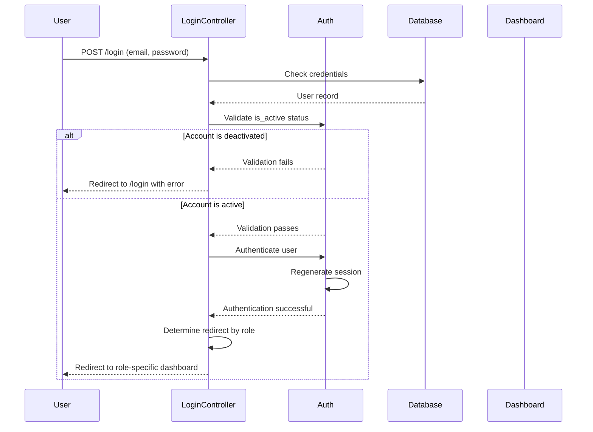

# Authentication API Documentation

## Overview

This document describes the authentication endpoints used in the Vilnius Utilities Billing System. The system implements role-based authentication with hierarchical access control for Superadmin, Admin, Manager, and Tenant users.

## Authentication Flow



## Endpoints

### POST /login

Authenticates a user and establishes a session.

#### Request

**URL**: `/login`

**Method**: `POST`

**Content-Type**: `application/x-www-form-urlencoded` or `application/json`

**Parameters**:

| Parameter | Type | Required | Description |
|-----------|------|----------|-------------|
| email | string | Yes | User's email address |
| password | string | Yes | User's password |
| remember | boolean | No | Enable "remember me" functionality (default: false) |

**Example Request (Form)**:
```http
POST /login HTTP/1.1
Host: example.com
Content-Type: application/x-www-form-urlencoded

email=admin@example.com&password=secretpassword&remember=1
```

**Example Request (JSON)**:
```json
{
  "email": "admin@example.com",
  "password": "secretpassword",
  "remember": true
}
```

#### Response

**Success Response**:

**Code**: `302 Found`

**Headers**:
```
Location: /[role]/dashboard
Set-Cookie: laravel_session=...; Path=/; HttpOnly
```

**Redirect URLs by Role**:
- Superadmin: `/superadmin/dashboard`
- Admin: `/admin/dashboard`
- Manager: `/manager/dashboard`
- Tenant: `/tenant/dashboard`

**Error Responses**:

**1. Invalid Credentials**

**Code**: `302 Found`

**Headers**:
```
Location: /login
```

**Session Errors**:
```json
{
  "email": [
    "The provided credentials do not match our records."
  ]
}
```

**2. Deactivated Account**

**Code**: `302 Found`

**Headers**:
```
Location: /login
```

**Session Errors**:
```json
{
  "email": [
    "Your account has been deactivated. Please contact your administrator for assistance."
  ]
}
```

**3. Validation Errors**

**Code**: `302 Found`

**Headers**:
```
Location: /login
```

**Session Errors**:
```json
{
  "email": [
    "The email field is required."
  ],
  "password": [
    "The password field is required."
  ]
}
```

#### Security Features

1. **Session Regeneration**: Session ID is regenerated upon successful login to prevent session fixation attacks
2. **Password Hashing**: Passwords are hashed using bcrypt (Laravel default)
3. **Rate Limiting**: Login attempts are rate-limited (configured in `config/throttle.php`)
4. **CSRF Protection**: All POST requests require valid CSRF token
5. **Account Status Check**: `is_active` flag is validated before authentication

#### Remember Me

When `remember` parameter is set to `true`:
- A remember token is generated and stored in the database
- A long-lived cookie is set (default: 5 years)
- User remains authenticated across browser sessions

---

### POST /logout

Logs out the authenticated user and invalidates the session.

#### Request

**URL**: `/logout`

**Method**: `POST`

**Authentication**: Required

**CSRF Token**: Required

**Example Request**:
```http
POST /logout HTTP/1.1
Host: example.com
Cookie: laravel_session=...
X-CSRF-TOKEN: ...
```

#### Response

**Success Response**:

**Code**: `302 Found`

**Headers**:
```
Location: /
Set-Cookie: laravel_session=deleted; expires=Thu, 01-Jan-1970 00:00:01 GMT
```

**Behavior**:
- Session is invalidated
- Remember token is cleared (if set)
- User is redirected to home page

---

## Authentication Middleware

### auth

Ensures the user is authenticated. Redirects to login page if not authenticated.

**Usage**:
```php
Route::get('/dashboard', [DashboardController::class, 'index'])
    ->middleware('auth');
```

### guest

Ensures the user is NOT authenticated. Redirects to dashboard if authenticated.

**Usage**:
```php
Route::get('/login', [LoginController::class, 'show'])
    ->middleware('guest');
```

### role

Ensures the user has a specific role.

**Usage**:
```php
Route::get('/superadmin/dashboard', [SuperadminController::class, 'dashboard'])
    ->middleware(['auth', 'role:superadmin']);
```

**Available Roles**:
- `superadmin`
- `admin`
- `manager`
- `tenant`

---

## User Roles and Permissions

### Superadmin

**Access Level**: System-wide

**Capabilities**:
- View all organizations and users
- Create and manage admin accounts
- Manage subscriptions
- Access all system resources
- Bypass tenant scope restrictions

**Dashboard**: `/superadmin/dashboard`

**tenant_id**: `null`

---

### Admin (Property Owner)

**Access Level**: Organization-wide (scoped by tenant_id)

**Capabilities**:
- Manage buildings and properties
- Create and manage tenant accounts
- View and manage invoices
- Configure meters and tariffs
- Access organization-level reports

**Dashboard**: `/admin/dashboard`

**tenant_id**: Unique integer assigned at account creation

---

### Manager

**Access Level**: Organization-wide (scoped by tenant_id)

**Capabilities**:
- Similar to Admin role
- Manage meter readings
- Generate invoices
- View reports

**Dashboard**: `/manager/dashboard`

**tenant_id**: Shared with Admin

---

### Tenant (Resident)

**Access Level**: Property-specific (scoped by tenant_id and property_id)

**Capabilities**:
- View assigned property information
- Submit meter readings
- View invoices and payment history
- Update profile information

**Dashboard**: `/tenant/dashboard`

**tenant_id**: Inherited from Admin
**property_id**: Assigned by Admin

---

## Account Status

### is_active Flag

The `is_active` boolean field on the User model controls account access:

**Active (is_active = true)**:
- User can log in
- Full access to permitted resources
- Normal functionality

**Deactivated (is_active = false)**:
- User cannot log in
- Authentication fails with specific error message
- Historical data is preserved
- Account can be reactivated

### Deactivation Scenarios

1. **Admin Deactivation**: Superadmin deactivates an admin account
2. **Tenant Deactivation**: Admin deactivates a tenant account (e.g., tenant moves out)
3. **Subscription Expiry**: Admin account may be deactivated when subscription expires

---

## Error Handling

### Error Messages

All authentication errors are returned as session flash data under the `errors` key.

**Accessing Errors in Blade**:
```blade
@if ($errors->has('email'))
    <div class="error">
        {{ $errors->first('email') }}
    </div>
@endif
```

**Accessing Errors in JavaScript**:
```javascript
// Errors are available in the session
const errors = @json($errors->all());
```

### HTTP Status Codes

| Code | Meaning | Scenario |
|------|---------|----------|
| 200 | OK | Login page displayed |
| 302 | Found | Redirect after login/logout |
| 401 | Unauthorized | Not authenticated (API) |
| 403 | Forbidden | Authenticated but insufficient permissions |
| 419 | Page Expired | CSRF token invalid/expired |
| 422 | Unprocessable Entity | Validation errors (API) |
| 429 | Too Many Requests | Rate limit exceeded |

---

## Rate Limiting

Login attempts are rate-limited to prevent brute force attacks.

**Configuration**: `config/throttle.php`

**Default Limits**:
- 5 attempts per minute per email
- 10 attempts per minute per IP address

**Behavior**:
- After limit is exceeded, user receives 429 error
- Lockout duration: 1 minute
- Counter resets after successful login

**Bypass**:
- Rate limiting can be disabled in testing environment
- Superadmin accounts may have higher limits (configurable)

---

## Session Management

### Session Configuration

**Driver**: `file` (default), `database`, `redis` (production)

**Lifetime**: 120 minutes (configurable in `config/session.php`)

**Cookie Settings**:
- `secure`: true (HTTPS only in production)
- `httponly`: true (prevents JavaScript access)
- `samesite`: 'lax' (CSRF protection)

### Session Regeneration

Sessions are regenerated on:
1. Successful login
2. Password change
3. Role change
4. Explicit regeneration request

**Purpose**: Prevent session fixation attacks

---

## Testing

### Test Coverage

Authentication functionality is tested in:
- `tests/Feature/SuperadminAuthenticationTest.php` (8 tests)
- `tests/Feature/AuthenticationTest.php` (15 tests)

### Running Tests

```bash
# Run all authentication tests
php artisan test --filter=Authentication

# Run specific test suite
php artisan test tests/Feature/SuperadminAuthenticationTest.php

# Run with coverage
php artisan test tests/Feature/SuperadminAuthenticationTest.php --coverage
```

### Test Scenarios Covered

1. ✅ Superadmin login and redirect
2. ✅ Deactivated account prevention (all roles)
3. ✅ Invalid credentials rejection
4. ✅ Session regeneration
5. ✅ Remember me functionality
6. ✅ Role-based redirects
7. ✅ CSRF protection
8. ✅ Rate limiting

---

## Security Best Practices

### For Developers

1. **Always validate is_active**: Check account status before authentication
2. **Regenerate sessions**: Call `session()->regenerate()` after login
3. **Use CSRF protection**: Include `@csrf` in all forms
4. **Hash passwords**: Use `Hash::make()` for password storage
5. **Rate limit endpoints**: Apply throttle middleware to login routes
6. **Log authentication events**: Track login attempts and failures

### For Administrators

1. **Strong password policy**: Enforce minimum password requirements
2. **Regular audits**: Review authentication logs regularly
3. **Deactivate unused accounts**: Disable accounts for inactive users
4. **Monitor failed logins**: Alert on suspicious login patterns
5. **Use HTTPS**: Always use secure connections in production

---

## Related Documentation

- [Superadmin Authentication Test Documentation](../testing/SUPERADMIN_AUTHENTICATION_TEST.md)
- [Hierarchical User Management Spec](../../.kiro/specs/3-hierarchical-user-management/)
- [User Model Documentation](../models/USER_MODEL.md)
- [Security Best Practices](../security/BEST_PRACTICES.md)
- [Session Configuration](../configuration/SESSION.md)

---

## Changelog

### 2024-11-26
- ✅ Initial API documentation created
- ✅ Authentication flow documented
- ✅ Error handling documented
- ✅ Security features documented
- ✅ Test coverage documented

---

## Support

For authentication-related issues:
1. Check the [Testing Guide](../guides/TESTING_GUIDE.md)
2. Review [Security Best Practices](../security/BEST_PRACTICES.md)
3. Consult the [Hierarchical User Management Spec](../../.kiro/specs/3-hierarchical-user-management/)
