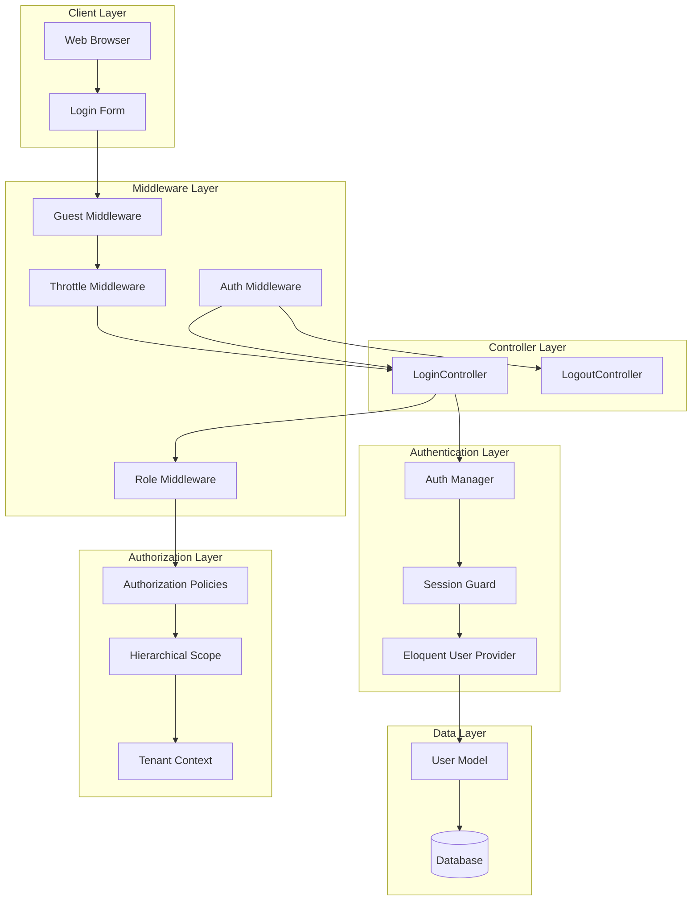
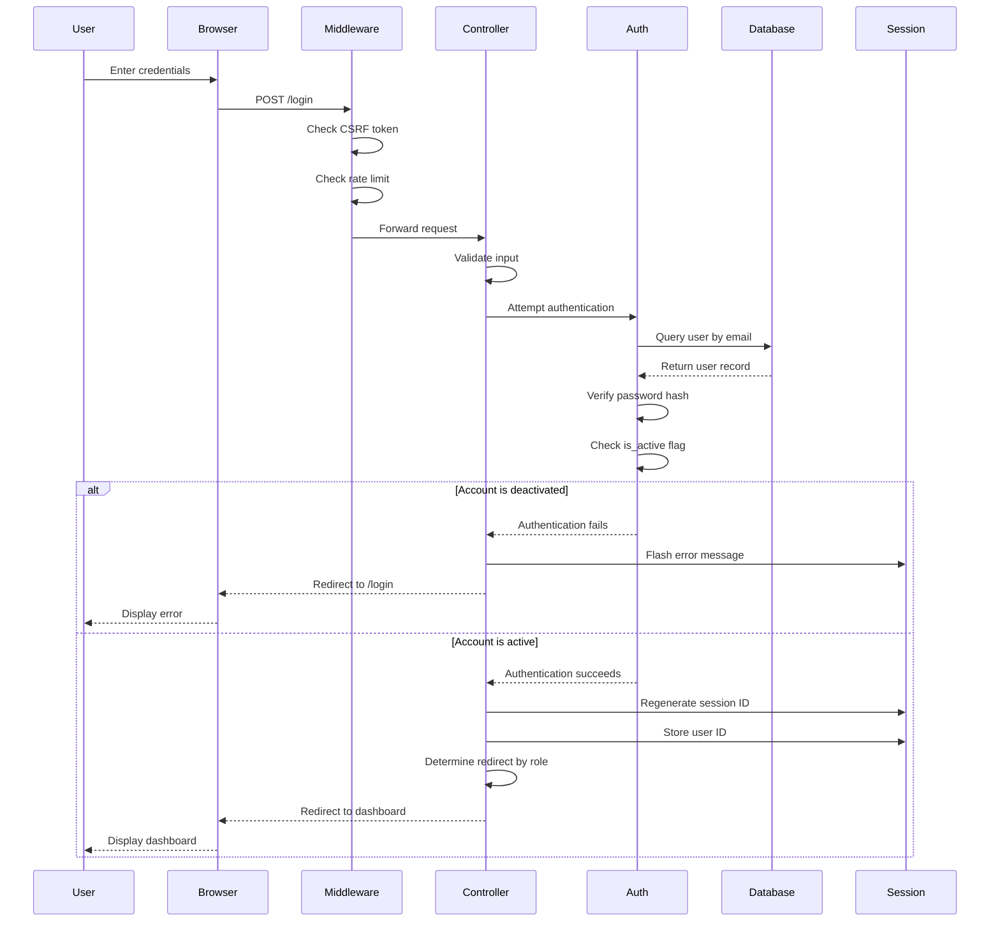
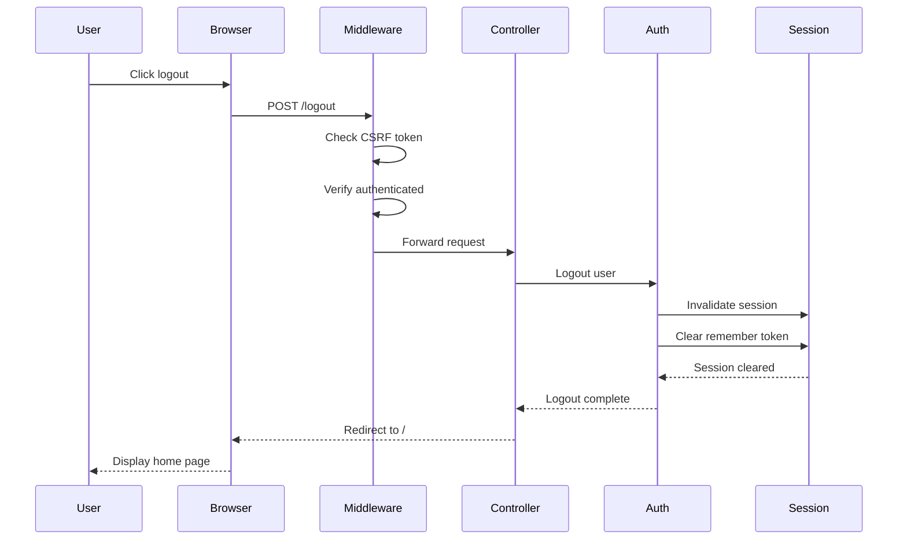
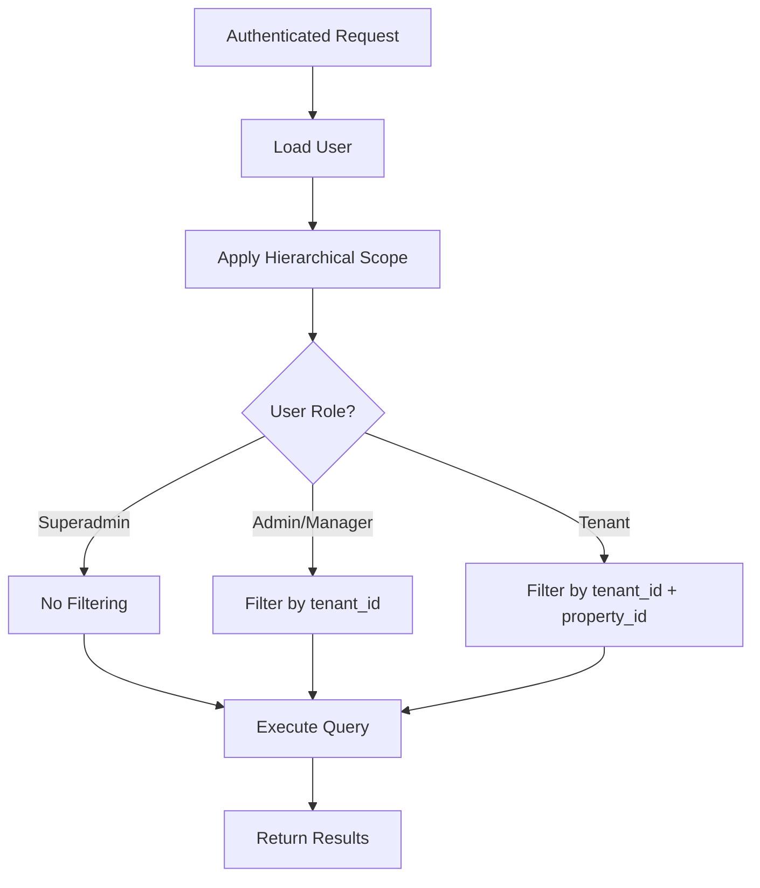

# Authentication Architecture

## Overview

The Vilnius Utilities Billing System implements a hierarchical, role-based authentication system with four distinct user levels: Superadmin, Admin, Manager, and Tenant. This document describes the architectural patterns, components, and data flow for the authentication system.

## Architecture Diagram



## Component Architecture

### 1. Authentication Components

#### LoginController
**Location**: `app/Http/Controllers/Auth/LoginController.php`

**Responsibilities**:
- Handle login form display
- Process login credentials
- Validate `is_active` status
- Regenerate session on successful login
- Redirect to role-specific dashboard

**Key Methods**:
```php
public function showLoginForm(): View
public function login(Request $request): RedirectResponse
protected function authenticated(Request $request, User $user): RedirectResponse
protected function credentials(Request $request): array
```

**Dependencies**:
- `Illuminate\Foundation\Auth\AuthenticatesUsers` trait
- `App\Models\User`
- `App\Enums\UserRole`

---

#### Auth Middleware
**Location**: `app/Http/Middleware/Authenticate.php`

**Responsibilities**:
- Verify user is authenticated
- Redirect unauthenticated users to login
- Handle API authentication differently

**Configuration**:
```php
protected function redirectTo($request): ?string
{
    return $request->expectsJson() 
        ? null 
        : route('login');
}
```

---

#### Guest Middleware
**Location**: `app/Http/Middleware/RedirectIfAuthenticated.php`

**Responsibilities**:
- Prevent authenticated users from accessing guest routes
- Redirect authenticated users to appropriate dashboard

**Role-Based Redirects**:
```php
protected function redirectTo(User $user): string
{
    return match($user->role) {
        UserRole::SUPERADMIN => '/superadmin/dashboard',
        UserRole::ADMIN => '/admin/dashboard',
        UserRole::MANAGER => '/manager/dashboard',
        UserRole::TENANT => '/tenant/dashboard',
    };
}
```

---

#### Role Middleware
**Location**: `app/Http/Middleware/CheckRole.php`

**Responsibilities**:
- Verify user has required role
- Return 403 if role check fails
- Support multiple role checking

**Usage**:
```php
Route::middleware(['auth', 'role:superadmin'])
    ->group(function () {
        // Superadmin routes
    });
```

---

### 2. User Model

**Location**: `app/Models/User.php`

**Key Fields**:
```php
protected $fillable = [
    'name',
    'email',
    'password',
    'role',
    'tenant_id',
    'property_id',
    'parent_user_id',
    'organization_name',
    'is_active',
];

protected $casts = [
    'role' => UserRole::class,
    'is_active' => 'boolean',
    'email_verified_at' => 'datetime',
    'password' => 'hashed',
];
```

**Key Methods**:
```php
public function isActive(): bool
public function isSuperadmin(): bool
public function isAdmin(): bool
public function isManager(): bool
public function isTenant(): bool
public function canAccessPanel(Panel $panel): bool
```

**Relationships**:
```php
public function property(): BelongsTo
public function parentUser(): BelongsTo
public function childUsers(): HasMany
public function subscription(): HasOne
```

**Global Scopes**:
- `HierarchicalScope`: Filters queries based on user role and tenant_id

---

### 3. Session Management

#### Session Configuration
**Location**: `config/session.php`

**Key Settings**:
```php
'driver' => env('SESSION_DRIVER', 'file'),
'lifetime' => 120, // minutes
'expire_on_close' => false,
'encrypt' => false,
'files' => storage_path('framework/sessions'),
'connection' => null,
'table' => 'sessions',
'store' => null,
'lottery' => [2, 100],
'cookie' => env('SESSION_COOKIE', 'laravel_session'),
'path' => '/',
'domain' => env('SESSION_DOMAIN'),
'secure' => env('SESSION_SECURE_COOKIE'),
'http_only' => true,
'same_site' => 'lax',
```

#### Session Regeneration
Sessions are regenerated on:
1. Successful login
2. Password change
3. Role change
4. Explicit regeneration request

**Implementation**:
```php
// In LoginController
protected function authenticated(Request $request, $user)
{
    $request->session()->regenerate();
    
    return redirect()->intended($this->redirectPath());
}
```

---

### 4. Authorization Integration

#### Hierarchical Scope
**Location**: `app/Scopes/HierarchicalScope.php`

**Purpose**: Automatically filter queries based on user role and tenant_id

**Behavior**:
- **Superadmin**: No filtering (sees all data)
- **Admin/Manager**: Filter by `tenant_id`
- **Tenant**: Filter by `tenant_id` AND `property_id`

**Integration**:
```php
// Applied automatically via global scope
protected static function booted()
{
    static::addGlobalScope(new HierarchicalScope);
}
```

---

#### Tenant Context
**Location**: `app/Services/TenantContext.php`

**Purpose**: Manage current tenant context for queries and operations

**Key Methods**:
```php
public static function set(?int $tenantId): void
public static function get(): ?int
public static function clear(): void
public static function switch(int $tenantId, Closure $callback): mixed
```

---

## Authentication Flow

### Login Flow



### Logout Flow



---

## Security Architecture

### 1. Password Security

**Hashing Algorithm**: bcrypt (Laravel default)

**Configuration**: `config/hashing.php`

**Implementation**:
```php
use Illuminate\Support\Facades\Hash;

// Hashing
$hashedPassword = Hash::make($plainPassword);

// Verification
if (Hash::check($plainPassword, $hashedPassword)) {
    // Password matches
}
```

**Best Practices**:
- Never store plain text passwords
- Use `Hash::make()` for password storage
- Use `Hash::check()` for verification
- Passwords automatically hashed via model cast

---

### 2. Session Security

**Session Fixation Prevention**:
- Session ID regenerated on login
- Session ID regenerated on privilege escalation
- Old session data preserved during regeneration

**Session Hijacking Prevention**:
- HttpOnly cookies (JavaScript cannot access)
- Secure cookies in production (HTTPS only)
- SameSite cookie attribute (CSRF protection)

**Session Configuration**:
```php
'http_only' => true,        // Prevent JavaScript access
'secure' => env('SESSION_SECURE_COOKIE'), // HTTPS only in production
'same_site' => 'lax',       // CSRF protection
```

---

### 3. CSRF Protection

**Implementation**: Laravel's built-in CSRF protection

**Middleware**: `VerifyCsrfToken`

**Usage in Forms**:
```blade
<form method="POST" action="/login">
    @csrf
    <!-- Form fields -->
</form>
```

**AJAX Requests**:
```javascript
axios.defaults.headers.common['X-CSRF-TOKEN'] = 
    document.querySelector('meta[name="csrf-token"]').content;
```

---

### 4. Rate Limiting

**Configuration**: `config/throttle.php`

**Default Limits**:
- 5 attempts per minute per email
- 10 attempts per minute per IP address

**Implementation**:
```php
Route::post('/login', [LoginController::class, 'login'])
    ->middleware('throttle:login');
```

**Behavior**:
- Returns 429 Too Many Requests when limit exceeded
- Lockout duration: 1 minute
- Counter resets after successful login

---

### 5. Account Status Validation

**is_active Flag**: Boolean field on User model

**Validation Point**: Before authentication

**Implementation**:
```php
protected function credentials(Request $request): array
{
    return array_merge(
        $request->only('email', 'password'),
        ['is_active' => true]
    );
}
```

**Error Handling**:
```php
if (!$user->is_active) {
    return back()->withErrors([
        'email' => 'Your account has been deactivated. Please contact your administrator for assistance.',
    ]);
}
```

---

## Data Flow

### Authentication Data Flow

```mermaid
graph LR
    A[Login Form] --> B[Validation]
    B --> C[Credential Check]
    C --> D{Valid?}
    D -->|No| E[Error Response]
    D -->|Yes| F{is_active?}
    F -->|No| G[Deactivation Error]
    F -->|Yes| H[Create Session]
    H --> I[Regenerate Session ID]
    I --> J[Store User ID]
    J --> K{Role?}
    K -->|Superadmin| L[/superadmin/dashboard]
    K -->|Admin| M[/admin/dashboard]
    K -->|Manager| N[/manager/dashboard]
    K -->|Tenant| O[/tenant/dashboard]
```

### Authorization Data Flow



---

## Design Patterns

### 1. Strategy Pattern

**Usage**: Role-based redirect logic

**Implementation**:
```php
protected function redirectPath(): string
{
    return match($this->user()->role) {
        UserRole::SUPERADMIN => '/superadmin/dashboard',
        UserRole::ADMIN => '/admin/dashboard',
        UserRole::MANAGER => '/manager/dashboard',
        UserRole::TENANT => '/tenant/dashboard',
    };
}
```

---

### 2. Guard Pattern

**Usage**: Session guard for authentication

**Implementation**:
```php
// config/auth.php
'guards' => [
    'web' => [
        'driver' => 'session',
        'provider' => 'users',
    ],
],
```

---

### 3. Provider Pattern

**Usage**: User provider for authentication

**Implementation**:
```php
// config/auth.php
'providers' => [
    'users' => [
        'driver' => 'eloquent',
        'model' => App\Models\User::class,
    ],
],
```

---

### 4. Middleware Pipeline Pattern

**Usage**: Request processing pipeline

**Implementation**:
```php
Route::post('/login')
    ->middleware(['guest', 'throttle:login'])
    ->uses([LoginController::class, 'login']);
```

---

## Performance Considerations

### 1. Session Storage

**Recommended Drivers**:
- **Development**: `file` (simple, no setup)
- **Production**: `redis` or `database` (scalable, persistent)

**Configuration**:
```php
// .env
SESSION_DRIVER=redis
REDIS_CLIENT=phpredis
```

---

### 2. Query Optimization

**Hierarchical Scope Caching**:
- Column existence cached for 24 hours
- Reduces schema queries by ~90%

**User Loading**:
```php
// Eager load relationships when needed
$user = User::with(['property', 'subscription'])->find($id);
```

---

### 3. Rate Limiting

**Cache Driver**: Redis recommended for production

**Configuration**:
```php
// config/cache.php
'default' => env('CACHE_DRIVER', 'redis'),
```

---

## Testing Strategy

### Test Coverage

**Test Files**:
- `tests/Feature/SuperadminAuthenticationTest.php` (8 tests)
- `tests/Feature/AuthenticationTest.php` (15 tests)

**Test Categories**:
1. ✅ Role-based authentication and redirects
2. ✅ Account deactivation enforcement
3. ✅ Session security (regeneration, remember me)
4. ✅ Invalid credential handling
5. ✅ CSRF protection
6. ✅ Rate limiting

**Test Isolation**:
- Each test uses unique `tenant_id`
- `RefreshDatabase` trait ensures clean state
- Factories create consistent test data

---

## Related Documentation

- [Superadmin Authentication Test Documentation](../testing/SUPERADMIN_AUTHENTICATION_TEST.md)
- [Authentication API Reference](../api/AUTHENTICATION_API.md)
- [Hierarchical User Management Spec](../../.kiro/specs/3-hierarchical-user-management/)
- [User Model Documentation](../models/USER_MODEL.md)
- [Security Best Practices](../security/BEST_PRACTICES.md)
- [Hierarchical Scope Documentation](HIERARCHICAL_SCOPE.md)

---

## Changelog

### 2024-11-26
- ✅ Initial architecture documentation created
- ✅ Component architecture documented
- ✅ Authentication flow documented
- ✅ Security architecture documented
- ✅ Data flow diagrams created
- ✅ Design patterns documented
