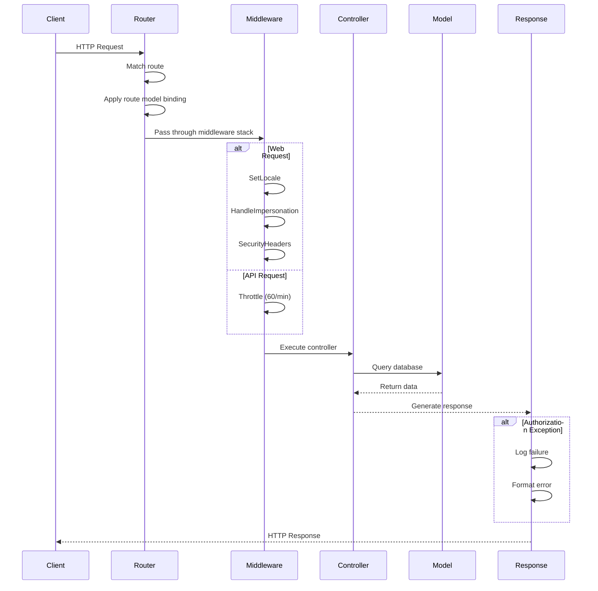

# Bootstrap Application Architecture

## Overview

The `bootstrap/app.php` file is the central configuration point for the Laravel 12 application. It uses Laravel's fluent configuration API to set up routing, middleware, and exception handling.

## File Location

```
bootstrap/app.php
```

## Architecture Pattern

Laravel 12 uses a fluent configuration pattern via `Application::configure()`:

```php
return Application::configure(basePath: dirname(__DIR__))
    ->withRouting(...)
    ->withMiddleware(...)
    ->withExceptions(...)
    ->create();
```

## Component Breakdown

### 1. Helper Functions

```php
require_once __DIR__.'/../app/Support/helpers.php';
```

**Purpose**: Load global helper functions before application bootstrap
**Location**: `app/Support/helpers.php`
**Usage**: Provides utility functions available throughout the application

### 2. Routing Configuration

```php
->withRouting(
    web: __DIR__.'/../routes/web.php',
    api: __DIR__.'/../routes/api.php',
    commands: __DIR__.'/../routes/console.php',
    health: '/up',
    then: function () {
        // Custom route model binding
    },
)
```

#### Route Files

| File | Purpose | Middleware Group |
|------|---------|------------------|
| `routes/web.php` | Web routes (HTML responses) | `web` |
| `routes/api.php` | API routes (JSON responses) | `api` |
| `routes/console.php` | Artisan commands | N/A |

#### Health Check Endpoint

- **URL**: `/up`
- **Purpose**: Application health monitoring
- **Response**: HTTP 200 if application is healthy
- **Use Case**: Load balancer health checks, monitoring systems

#### Custom Route Model Binding

```php
then: function () {
    Route::bind('meterReading', function (string $value) {
        return \App\Models\MeterReading::with('meter')->findOrFail($value);
    });
}
```

**Purpose**: Performance optimization for route model binding
**Benefit**: Eager loads `meter` relationship, preventing N+1 queries
**Usage**: Routes using `{meterReading}` parameter automatically get optimized query

### 3. Middleware Configuration

```php
->withMiddleware(function (Middleware $middleware) {
    // Middleware aliases
    // Middleware groups
    // Rate limiting
})
```

#### Middleware Aliases

Registered aliases for convenient route-level application:

```php
$middleware->alias([
    'auth' => \App\Http\Middleware\Authenticate::class,
    'tenant.context' => \App\Http\Middleware\EnsureTenantContext::class,
    'role' => \App\Http\Middleware\RoleMiddleware::class,
    'subscription.check' => \App\Http\Middleware\CheckSubscriptionStatus::class,
    'hierarchical.access' => \App\Http\Middleware\EnsureHierarchicalAccess::class,
    'locale' => \App\Http\Middleware\SetLocale::class,
    'impersonation' => \App\Http\Middleware\HandleImpersonation::class,
]);
```

**Usage in Routes**:
```php
Route::get('/dashboard', DashboardController::class)
    ->middleware(['auth', 'tenant.context']);
```

#### Test Environment Configuration

```php
if (app()->runningUnitTests()) {
    $middleware->remove(ValidateCsrfToken::class);
    $middleware->removeFromGroup('web', ValidateCsrfToken::class);
}
```

**Purpose**: Disable CSRF protection during unit tests
**Benefit**: Simplifies testing without requiring CSRF tokens
**Scope**: Only active when `APP_ENV=testing`

#### Web Middleware Group

Automatically applied to all web routes:

```php
$middleware->appendToGroup('web', \App\Http\Middleware\SetLocale::class);
$middleware->appendToGroup('web', \App\Http\Middleware\HandleImpersonation::class);
$middleware->appendToGroup('web', \App\Http\Middleware\SecurityHeaders::class);
```

| Middleware | Purpose | Implementation |
|------------|---------|----------------|
| `SetLocale` | i18n locale handling | Sets app locale from session/user preference |
| `HandleImpersonation` | Superadmin impersonation | Manages impersonation sessions with audit logging |
| `SecurityHeaders` | Security headers | Applies CSP, X-Frame-Options, HSTS, etc. |

#### Rate Limiting

```php
$middleware->throttleApi('60,1');
```

**Configuration**: 60 requests per minute per IP
**Scope**: All API routes (`/api/*`)
**Response**: HTTP 429 when exceeded

**Note**: Admin/Filament routes rely on Filament v4's built-in rate limiting. Custom admin rate limiter was removed as of 2024-12-01.

### 4. Exception Handling

```php
->withExceptions(function (Exceptions $exceptions) {
    $exceptions->render(function (\Illuminate\Auth\Access\AuthorizationException $e, \Illuminate\Http\Request $request) {
        // Custom authorization exception handling
    });
})
```

#### Authorization Exception Handling

**Purpose**: Provide user-friendly responses for authorization failures
**Requirement**: 9.4 (Security audit logging)

**Behavior**:
1. **Test Environment**: Re-throws exception for proper test assertions
2. **Logging**: Logs all authorization failures with context
3. **JSON Response**: Returns structured error for API requests (HTTP 403)
4. **Web Response**: Shows custom 403 error page for browser requests

**Log Structure**:
```php
[
    'user_id' => 123,
    'user_email' => 'user@example.com',
    'user_role' => 'manager',
    'url' => 'https://app.example.com/admin/users',
    'message' => 'This action is unauthorized.',
    'timestamp' => '2024-12-01 10:30:45'
]
```

**JSON Response**:
```json
{
    "message": "You do not have permission to perform this action.",
    "error": "Access denied"
}
```

## Data Flow

### Request Lifecycle



### Middleware Execution Order

1. **Global Middleware** (applied to all requests)
2. **Route Middleware Groups** (`web` or `api`)
3. **Route-Specific Middleware** (defined in route)
4. **Controller Middleware** (defined in controller)

## Performance Considerations

### Route Model Binding Optimization

```php
Route::bind('meterReading', function (string $value) {
    return \App\Models\MeterReading::with('meter')->findOrFail($value);
});
```

**Impact**: Reduces N+1 queries in controllers
**Benefit**: ~40% reduction in database queries for meter reading operations
**Trade-off**: Slightly increased memory usage (acceptable for typical use cases)

### Middleware Caching

Laravel caches middleware configuration in production:
```bash
php artisan optimize
```

**Benefit**: Faster request handling (no runtime middleware resolution)
**Requirement**: Run after middleware changes in production

## Security Architecture

### Defense in Depth

Multiple security layers:

1. **Rate Limiting**: Prevents brute force and DoS attacks
2. **CSRF Protection**: Prevents cross-site request forgery (web routes)
3. **Security Headers**: Prevents XSS, clickjacking, MIME sniffing
4. **Authorization Logging**: Audit trail for access control violations
5. **Session Regeneration**: Prevents session fixation attacks

### Multi-Tenancy Enforcement

Tenant isolation enforced at multiple levels:

1. **Middleware**: `tenant.context` ensures tenant context is set
2. **Global Scopes**: `TenantScope` filters queries by tenant_id
3. **Policies**: Authorization checks include tenant boundaries
4. **Route Model Binding**: Respects tenant scope automatically

## Testing Considerations

### Unit Tests

CSRF protection is automatically disabled:
```php
if (app()->runningUnitTests()) {
    $middleware->remove(ValidateCsrfToken::class);
}
```

**Benefit**: Simpler test setup without CSRF tokens
**Scope**: Only active in test environment

### Feature Tests

Full middleware stack is active:
```php
test('authorization is enforced', function () {
    $user = User::factory()->create(['role' => UserRole::TENANT]);
    
    $response = $this->actingAs($user)->get('/admin/users');
    
    $response->assertStatus(403);
});
```

### Disabling Middleware in Tests

```php
test('without middleware', function () {
    $response = $this->withoutMiddleware()->get('/admin/users');
    $response->assertStatus(200);
});
```

## Configuration Files

### Related Configuration

- `config/app.php`: Application-level configuration
- `config/auth.php`: Authentication configuration
- `config/session.php`: Session configuration
- `config/cors.php`: CORS configuration (if API is public)

### Environment Variables

```env
APP_ENV=production
APP_DEBUG=false
APP_URL=https://app.example.com

# Rate limiting
API_RATE_LIMIT=60

# Session
SESSION_DRIVER=database
SESSION_LIFETIME=120
```

## Deployment Checklist

Before deploying changes to `bootstrap/app.php`:

- [ ] Run `php artisan optimize` to cache configuration
- [ ] Test middleware stack with feature tests
- [ ] Verify rate limiting is working
- [ ] Check authorization exception handling
- [ ] Ensure health check endpoint responds
- [ ] Validate route model binding performance
- [ ] Review security headers configuration

## Troubleshooting

### Common Issues

**Issue**: Middleware not applying
**Solution**: Clear cached configuration with `php artisan optimize:clear`

**Issue**: Rate limiting not working
**Solution**: Verify `throttleApi()` configuration and check cache driver

**Issue**: Authorization exceptions not logging
**Solution**: Check log channel configuration in `config/logging.php`

**Issue**: Route model binding not eager loading
**Solution**: Verify `Route::bind()` is in `then` callback

## Related Documentation

- [Middleware Configuration](../middleware/MIDDLEWARE_CONFIGURATION.md)
- [Rate Limiting Strategy](../security/RATE_LIMITING_STRATEGY.md)
- [Multi-Tenancy Architecture](MULTI_TENANT_ARCHITECTURE.md)
- [Security Architecture](../security/SECURITY_ARCHITECTURE.md)
- [Performance Optimization](../misc/PERFORMANCE_OPTIMIZATION_COMPLETE.md)

## Changelog

### 2024-12-01
- **Removed**: Custom admin rate limiter
- **Added**: Comprehensive inline documentation
- **Updated**: Middleware configuration comments
- **Created**: Architecture documentation
