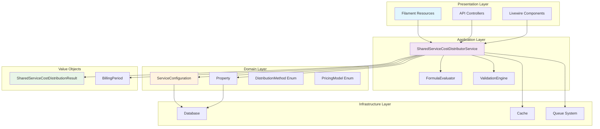
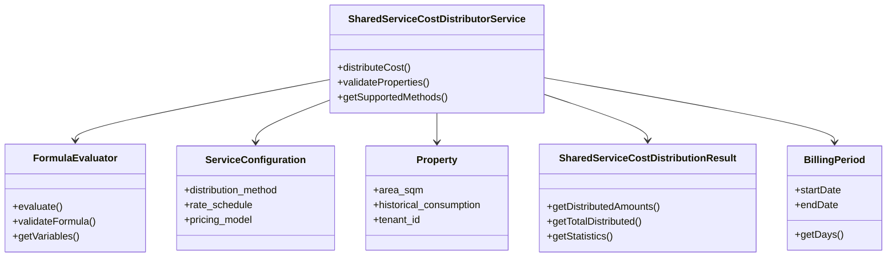
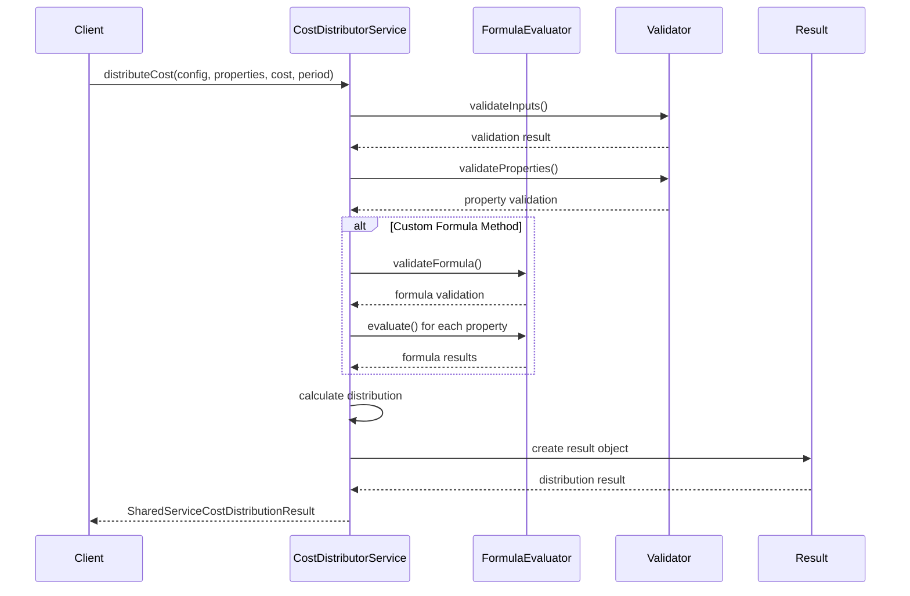
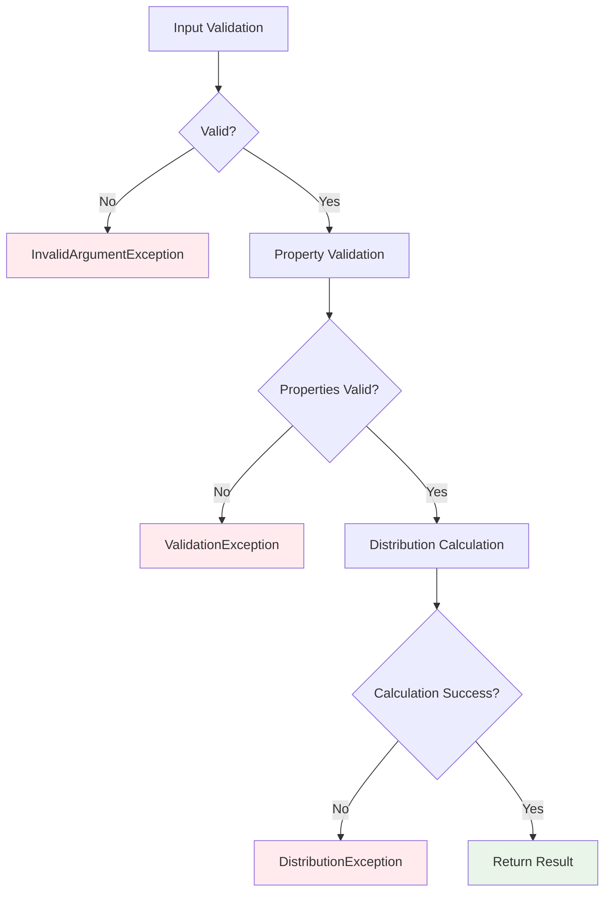

# Cost Distribution System Architecture

## Overview

The Cost Distribution System is a core component of the universal utility management platform that handles the allocation of shared service costs among multiple properties. The system is designed with flexibility, accuracy, and auditability as primary concerns.

## System Architecture

### High-Level Architecture



### Component Relationships



## Core Components

### 1. SharedServiceCostDistributorService

**Responsibility**: Main orchestrator for cost distribution operations.

**Key Methods**:
- `distributeCost()`: Primary distribution logic
- `validateProperties()`: Input validation
- `getSupportedMethods()`: Method enumeration

**Design Patterns**:
- **Strategy Pattern**: Different distribution methods
- **Template Method**: Common validation and result creation
- **Factory Pattern**: Result object creation

```php
final readonly class SharedServiceCostDistributorService implements SharedServiceCostDistributor
{
    public function __construct(
        private FormulaEvaluator $formulaEvaluator,
    ) {}

    public function distributeCost(/* ... */): SharedServiceCostDistributionResult
    {
        // 1. Validate inputs
        $this->validateInputs($serviceConfig, $properties, $totalCost);
        
        // 2. Validate properties for method
        $validationErrors = $this->validateProperties($serviceConfig, $properties);
        if (!empty($validationErrors)) {
            throw new InvalidArgumentException(/* ... */);
        }

        // 3. Handle edge cases
        if ($totalCost <= 0) {
            return $this->createZeroDistribution($properties);
        }

        // 4. Distribute based on method (Strategy Pattern)
        return match ($serviceConfig->distribution_method) {
            DistributionMethod::EQUAL => $this->distributeEqually($properties, $totalCost),
            DistributionMethod::AREA => $this->distributeByArea($properties, $totalCost, $serviceConfig),
            DistributionMethod::BY_CONSUMPTION => $this->distributeByConsumption($properties, $totalCost, $billingPeriod),
            DistributionMethod::CUSTOM_FORMULA => $this->distributeByFormula($properties, $totalCost, $serviceConfig, $billingPeriod),
        };
    }
}
```

### 2. FormulaEvaluator

**Responsibility**: Safe evaluation of mathematical expressions for custom distribution formulas.

**Security Features**:
- No `eval()` usage - implements recursive descent parser
- Input sanitization and validation
- Whitelist of allowed operations and functions
- Protection against code injection

**Architecture**:
```php
final readonly class FormulaEvaluator
{
    // Tokenization -> Parsing -> Evaluation
    private function parseExpression(string $expression): float
    {
        $tokens = $this->tokenize($expression);
        return $this->parseTokens($tokens);
    }
    
    // Recursive descent parser
    private function parseAddition(array &$tokens): float { /* ... */ }
    private function parseMultiplication(array &$tokens): float { /* ... */ }
    private function parseFactor(array &$tokens): float { /* ... */ }
}
```

### 3. Value Objects

#### SharedServiceCostDistributionResult

**Responsibility**: Immutable container for distribution results with analysis capabilities.

**Key Features**:
- Immutable state
- Rich statistical methods
- Balance validation
- Metadata tracking

```php
final readonly class SharedServiceCostDistributionResult
{
    public function __construct(
        private Collection $distributedAmounts,
        private float $totalDistributed = 0.0,
        private array $metadata = [],
    ) {
        // Validation in constructor ensures invariants
    }
    
    // Analysis methods
    public function isBalanced(float $tolerance = 0.01): bool
    public function getStatistics(): array
    public function getPropertiesByAllocation(): Collection
}
```

#### BillingPeriod

**Responsibility**: Represents time periods for billing operations.

**Features**:
- Immutable date ranges
- Validation of period validity
- Utility methods for period calculations
- Human-readable labels

## Distribution Methods

### 1. Equal Distribution

**Algorithm**: `amount_per_property = total_cost / property_count`

**Complexity**: O(n) where n = number of properties

**Use Cases**:
- Fixed service fees
- Shared maintenance costs
- Common area utilities

### 2. Area-Based Distribution

**Algorithm**: `property_amount = (property_area / total_area) * total_cost`

**Complexity**: O(n) - single pass to calculate total area, second pass to distribute

**Requirements**:
- Properties must have valid `area_sqm` values
- Supports different area types (total, heated, commercial)

**Fallback**: Equal distribution if no area data available

### 3. Consumption-Based Distribution

**Algorithm**: `property_amount = (property_consumption / total_consumption) * total_cost`

**Complexity**: O(n) - similar to area-based

**Requirements**:
- Properties must have `historical_consumption` data
- Consumption values must be non-negative

**Fallback**: Equal distribution if no consumption data available

### 4. Custom Formula Distribution

**Algorithm**: User-defined mathematical expression

**Complexity**: O(n * f) where f = formula evaluation complexity

**Features**:
- Variable substitution (area, consumption, property_id)
- Safe expression evaluation
- Arithmetic operations and basic functions
- Proportional distribution based on formula results

**Fallback**: Equal distribution if formula evaluation fails

## Data Flow

### Distribution Process Flow



### Error Handling Flow



## Performance Characteristics

### Time Complexity

| Method | Best Case | Average Case | Worst Case |
|--------|-----------|--------------|------------|
| Equal | O(n) | O(n) | O(n) |
| Area | O(n) | O(n) | O(n) |
| Consumption | O(n) | O(n) | O(n) |
| Custom Formula | O(n) | O(n * f) | O(n * f) |

Where:
- n = number of properties
- f = formula evaluation complexity

### Space Complexity

- **Memory Usage**: O(n) for storing distributed amounts
- **Temporary Storage**: O(1) for calculations (streaming approach)
- **Result Object**: O(n) for amounts + O(1) for metadata

### Performance Optimizations

1. **Early Validation**: Fail fast on invalid inputs
2. **Streaming Calculations**: Process properties one at a time
3. **Caching**: Cache formula evaluation results for repeated calculations
4. **Batch Processing**: Handle large property sets asynchronously

## Scalability Considerations

### Horizontal Scaling

- **Stateless Service**: No shared state between requests
- **Database Scaling**: Read replicas for property data
- **Caching Layer**: Redis for frequently accessed configurations

### Vertical Scaling

- **Memory Optimization**: Lazy loading of property relationships
- **CPU Optimization**: Efficient formula parsing and evaluation
- **I/O Optimization**: Batch database queries

### Limits and Constraints

- **Maximum Properties**: 10,000 per distribution (configurable)
- **Formula Complexity**: Limited to prevent DoS attacks
- **Calculation Timeout**: 30 seconds for complex distributions
- **Memory Limit**: 512MB per distribution operation

## Security Architecture

### Input Validation

```php
// Multi-layer validation approach
class SharedServiceCostDistributorService
{
    private function validateInputs(/* ... */): void
    {
        // 1. Type validation (handled by PHP type system)
        // 2. Range validation
        if ($totalCost < 0) {
            throw new InvalidArgumentException('Total cost cannot be negative');
        }
        
        // 3. Business rule validation
        if (!in_array($serviceConfig->distribution_method, $this->getSupportedMethods())) {
            throw new InvalidArgumentException('Unsupported distribution method');
        }
    }
}
```

### Formula Security

```php
class FormulaEvaluator
{
    private const ALLOWED_OPERATORS = ['+', '-', '*', '/', '(', ')'];
    private const ALLOWED_FUNCTIONS = ['min', 'max', 'abs', 'round'];
    
    private function sanitizeFormula(string $formula): string
    {
        // Remove dangerous patterns
        $dangerousPatterns = [
            '/\$/',           // PHP variables
            '/;/',            // Statement separators
            '/exec|system|shell_exec|passthru|eval/', // Dangerous functions
        ];
        
        foreach ($dangerousPatterns as $pattern) {
            if (preg_match($pattern, $formula)) {
                throw new InvalidArgumentException('Formula contains dangerous patterns');
            }
        }
        
        return $formula;
    }
}
```

### Authorization

- **Tenant Isolation**: All operations scoped to user's tenant
- **Property Access**: Verify user can access all properties in distribution
- **Configuration Access**: Ensure user can use the service configuration
- **Audit Logging**: Log all distribution operations for compliance

## Integration Points

### Database Integration

```sql
-- Core tables involved
service_configurations (
    id, tenant_id, distribution_method, rate_schedule, 
    pricing_model, is_shared_service, effective_from, effective_until
)

properties (
    id, tenant_id, building_id, area_sqm, 
    created_at, updated_at
)

-- Audit table for distribution results
cost_distributions (
    id, service_configuration_id, total_cost, 
    billing_period_start, billing_period_end,
    distributed_amounts, metadata, created_at
)
```

### Cache Integration

```php
// Cache expensive calculations
$cacheKey = "distribution.{$serviceConfigId}.{$propertyHash}.{$totalCost}";
$result = Cache::remember($cacheKey, 3600, function () {
    return $this->performDistribution(/* ... */);
});
```

### Queue Integration

```php
// For large distributions, use background processing
class DistributeCostsJob implements ShouldQueue
{
    public function handle(SharedServiceCostDistributorService $distributor): void
    {
        $result = $distributor->distributeCost(/* ... */);
        
        // Store results and notify completion
        CostDistribution::create([
            'service_configuration_id' => $this->serviceConfigId,
            'distributed_amounts' => $result->getDistributedAmounts(),
            'metadata' => $result->getMetadata(),
        ]);
        
        event(new CostDistributionCompleted($result));
    }
}
```

## Monitoring and Observability

### Metrics Collection

```php
// Performance metrics
Log::info('Cost distribution completed', [
    'method' => $serviceConfig->distribution_method->value,
    'property_count' => $properties->count(),
    'total_cost' => $totalCost,
    'duration_ms' => $duration,
    'balanced' => $result->isBalanced(),
]);

// Business metrics
Metrics::increment('cost_distribution.completed', [
    'method' => $serviceConfig->distribution_method->value,
    'tenant_id' => $serviceConfig->tenant_id,
]);

Metrics::histogram('cost_distribution.duration', $duration, [
    'method' => $serviceConfig->distribution_method->value,
]);
```

### Health Checks

```php
// Service health endpoint
class CostDistributionHealthCheck
{
    public function check(): HealthCheckResult
    {
        try {
            // Test basic distribution
            $testResult = $this->distributor->distributeCost(/* test data */);
            
            return HealthCheckResult::ok('Cost distribution service operational');
        } catch (\Exception $e) {
            return HealthCheckResult::failed('Cost distribution service failed: ' . $e->getMessage());
        }
    }
}
```

## Testing Strategy

### Unit Testing

- **Service Methods**: Test each distribution method in isolation
- **Formula Evaluator**: Test expression parsing and evaluation
- **Value Objects**: Test immutability and validation
- **Edge Cases**: Zero costs, single properties, invalid inputs

### Integration Testing

- **Database Integration**: Test with real property data
- **Cache Integration**: Test caching behavior
- **Queue Integration**: Test background processing

### Property-Based Testing

- **Invariant Testing**: Mathematical properties that must always hold
- **Random Input Generation**: Test with thousands of input combinations
- **Statistical Validation**: Ensure distributions are mathematically correct

### Performance Testing

- **Load Testing**: Test with large property sets
- **Stress Testing**: Test under high concurrent load
- **Memory Testing**: Ensure no memory leaks with large datasets

## Deployment Considerations

### Configuration Management

```php
// Environment-specific settings
'cost_distribution' => [
    'max_properties_per_distribution' => env('COST_DIST_MAX_PROPERTIES', 1000),
    'calculation_timeout' => env('COST_DIST_TIMEOUT', 30),
    'cache_ttl' => env('COST_DIST_CACHE_TTL', 3600),
    'enable_async_processing' => env('COST_DIST_ASYNC', false),
],
```

### Database Migrations

```php
// Migration for audit table
Schema::create('cost_distributions', function (Blueprint $table) {
    $table->id();
    $table->foreignId('service_configuration_id')->constrained();
    $table->decimal('total_cost', 10, 2);
    $table->date('billing_period_start');
    $table->date('billing_period_end');
    $table->json('distributed_amounts');
    $table->json('metadata')->nullable();
    $table->timestamps();
    
    $table->index(['service_configuration_id', 'billing_period_start']);
});
```

### Feature Flags

```php
// Gradual rollout of new features
if (Feature::active('custom-formula-distribution')) {
    $supportedMethods[] = DistributionMethod::CUSTOM_FORMULA;
}
```

## Future Enhancements

### Planned Features

1. **Advanced Formula Functions**: Support for more mathematical functions
2. **Multi-Currency Support**: Handle distributions in different currencies
3. **Batch Processing**: Optimize for large-scale distributions
4. **Machine Learning**: Predictive distribution based on historical patterns
5. **Real-time Updates**: Live recalculation as property data changes

### Architectural Evolution

1. **Microservice Split**: Extract formula evaluation to separate service
2. **Event Sourcing**: Track all distribution events for audit trail
3. **CQRS Implementation**: Separate read/write models for better performance
4. **GraphQL API**: More flexible API for complex queries

## Related Documentation

- [Shared Service Cost Distribution Service](../services/SHARED_SERVICE_COST_DISTRIBUTION.md)
- [Property-Based Testing Guide](../testing/PROPERTY_BASED_TESTING_SHARED_SERVICES.md)
- [API Documentation](../api/SHARED_SERVICE_COST_DISTRIBUTION_API.md)
- [Universal Utility Management Spec](../../.kiro/specs/universal-utility-management/)
- [Distribution Method Enhancement](../DISTRIBUTION_METHOD_ENHANCEMENT_COMPLETE.md)