# Meter Reading Architecture Documentation

## Overview

The meter reading system implements a multi-layered architecture supporting the Truth-but-Verify workflow, enabling tenant participation while maintaining data integrity through manager validation. The system enforces strict tenant boundaries and provides comprehensive audit trails.

## Architecture Diagram

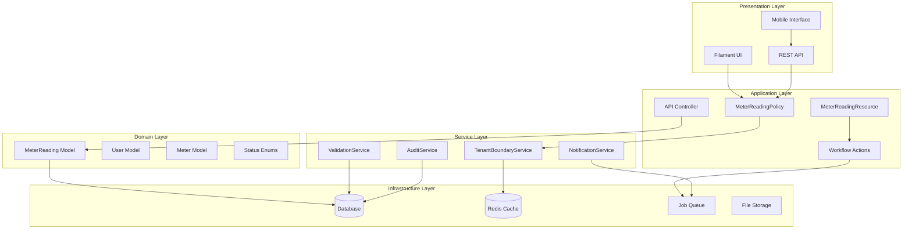

## Component Architecture

### 1. Authorization Layer

#### MeterReadingPolicy
**Purpose**: Centralized authorization for all meter reading operations

**Key Responsibilities**:
- Role-based access control (RBAC)
- Tenant boundary enforcement
- Workflow state validation
- Audit logging for sensitive operations

**Truth-but-Verify Integration**:
```php
// Tenant creation rights (NEW in v7.0)
public function create(User $user): bool
{
    return in_array($user->role, [
        UserRole::SUPERADMIN,
        UserRole::ADMIN,
        UserRole::MANAGER,
        UserRole::TENANT, // NEW: Tenant participation
    ], true);
}

// Manager approval workflow
public function approve(User $user, MeterReading $meterReading): bool
{
    // Validation logic for approval authorization
}
```

**Dependencies**:
- `TenantBoundaryService`: Property-based access validation
- `BasePolicy`: Common authorization patterns
- `AuditService`: Sensitive operation logging

### 2. Domain Models

#### MeterReading Model
**Purpose**: Core domain entity representing meter readings with validation workflow

**Key Attributes**:
```php
// Core reading data
'meter_id' => 'integer',
'value' => 'decimal',
'reading_date' => 'date',
'zone' => 'string|nullable',

// Workflow fields (NEW in v7.0)
'validation_status' => ValidationStatus::class,
'validated_by' => 'integer|nullable',
'validated_at' => 'datetime|nullable',
'validation_notes' => 'text|nullable',

// Input tracking
'input_method' => InputMethod::class,
'entered_by' => 'integer',
'photo_path' => 'string|nullable',
```

**Workflow Methods**:
```php
// Check if reading requires validation
public function requiresValidation(): bool
{
    return $this->enteredBy?->submissionsRequireValidation() ?? false;
}

// Workflow state transitions
public function markAsValidated(int $validatedBy): void
public function markAsRejected(int $validatedBy): void
```

**Relationships**:
- `belongsTo(Meter::class)`: Associated meter
- `belongsTo(User::class, 'entered_by')`: Reading creator
- `belongsTo(User::class, 'validated_by')`: Validator (manager)

#### User Model Extensions
**Purpose**: User capabilities for meter reading workflow participation

**Capability Methods**:
```php
// Truth-but-Verify workflow capabilities
public function canCreateMeterReadings(): bool
public function canManageMeterReadings(): bool
public function canValidateMeterReadings(): bool
public function submissionsRequireValidation(): bool
```

**Role Matrix**:
| Capability | Superadmin | Admin | Manager | Tenant |
|------------|------------|-------|---------|--------|
| Create | ✅ | ✅ | ✅ | ✅ (NEW) |
| Manage | ✅ | ✅ | ✅ | ❌ |
| Validate | ✅ | ✅ | ✅ | ❌ |
| Requires Validation | ❌ | ❌ | ❌ | ✅ |

### 3. Service Layer

#### TenantBoundaryService
**Purpose**: Enforce tenant isolation and property-based access control

**Key Methods**:
```php
// Tenant access validation
public function canTenantAccessMeterReading(User $tenantUser, MeterReading $meterReading): bool
{
    // Property-based access check with caching
}

// Meter submission validation
public function canTenantSubmitReadingForMeter(User $tenantUser, int $meterId): bool
{
    // Meter accessibility check for tenant
}

// Cache management
public function clearTenantMeterCache(int $tenantId, ?int $meterId = null): void
```

**Caching Strategy**:
- 5-minute TTL for access checks
- Tenant-scoped cache keys
- Automatic invalidation on property changes

**Performance Optimizations**:
```php
// Cached access check
$cacheKey = "tenant_meter_access_{$tenantId}_{$meterId}";
return Cache::remember($cacheKey, 300, function () use ($tenant, $meter) {
    return $tenant->properties()
        ->whereHas('meters', fn($q) => $q->where('id', $meter->id))
        ->exists();
});
```

#### ValidationService
**Purpose**: Business rule validation for meter readings

**Validation Rules**:
- Monotonic progression validation
- Temporal validation (reading dates)
- Zone validation for multi-zone meters
- Value range validation
- Anomaly detection (future enhancement)

**Integration Points**:
- Form Request validation
- API endpoint validation
- Filament resource validation
- Bulk import validation

### 4. Presentation Layer

#### Filament Resource Integration
**Purpose**: Admin interface for meter reading management with workflow support

**Truth-but-Verify Actions**:
```php
// Approve action
Action::make('approve')
    ->visible(fn (MeterReading $record): bool => 
        $record->validation_status === ValidationStatus::PENDING
    )
    ->authorize('approve', $record)
    ->action(function (MeterReading $record): void {
        $record->markAsValidated(auth()->id());
    });

// Reject action with validation notes
Action::make('reject')
    ->form([
        Textarea::make('validation_notes')->required()
    ])
    ->authorize('reject', $record)
    ->action(function (MeterReading $record, array $data): void {
        $record->validation_notes = $data['validation_notes'];
        $record->markAsRejected(auth()->id());
    });
```

**Table Columns**:
```php
// Validation status with color coding
TextColumn::make('validation_status')
    ->badge()
    ->color(fn ($state): string => match ($state) {
        'validated' => 'success',
        'pending' => 'warning',
        'requires_review' => 'info',
        'rejected' => 'danger',
        default => 'gray',
    });
```

#### API Layer
**Purpose**: RESTful API for external integrations and mobile applications

**Endpoints**:
- `GET /api/meter-readings`: List readings (scoped by role)
- `POST /api/meter-readings`: Create reading (all roles)
- `PATCH /api/meter-readings/{id}/approve`: Approve reading (managers+)
- `PATCH /api/meter-readings/{id}/reject`: Reject reading (managers+)

**Authorization Middleware**:
```php
// API routes with policy authorization
Route::middleware(['auth:sanctum', 'tenant.scope'])
    ->group(function () {
        Route::apiResource('meter-readings', MeterReadingController::class);
        Route::patch('meter-readings/{reading}/approve', [MeterReadingController::class, 'approve']);
        Route::patch('meter-readings/{reading}/reject', [MeterReadingController::class, 'reject']);
    });
```

## Data Flow Architecture

### 1. Tenant Submission Flow

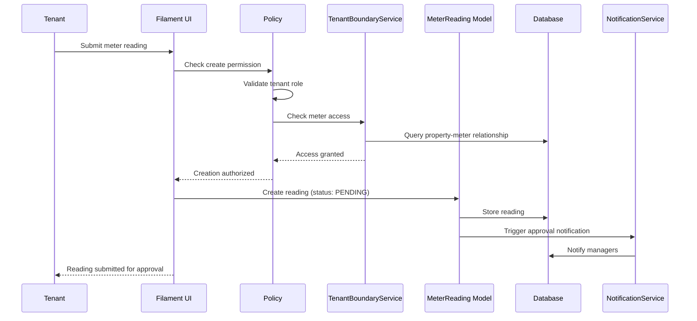

### 2. Manager Approval Flow

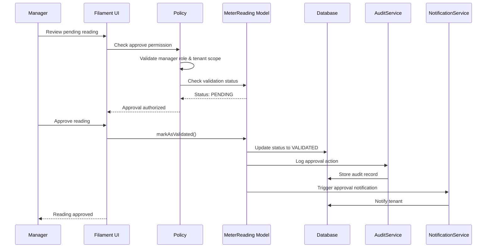

### 3. Tenant Boundary Enforcement

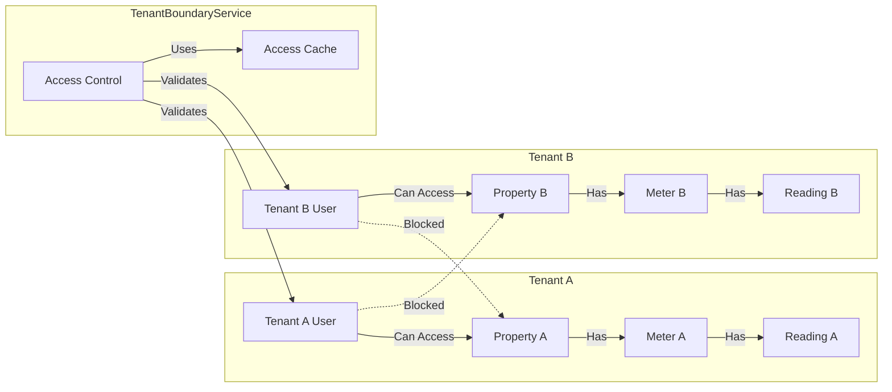

## Security Architecture

### 1. Multi-Layer Authorization

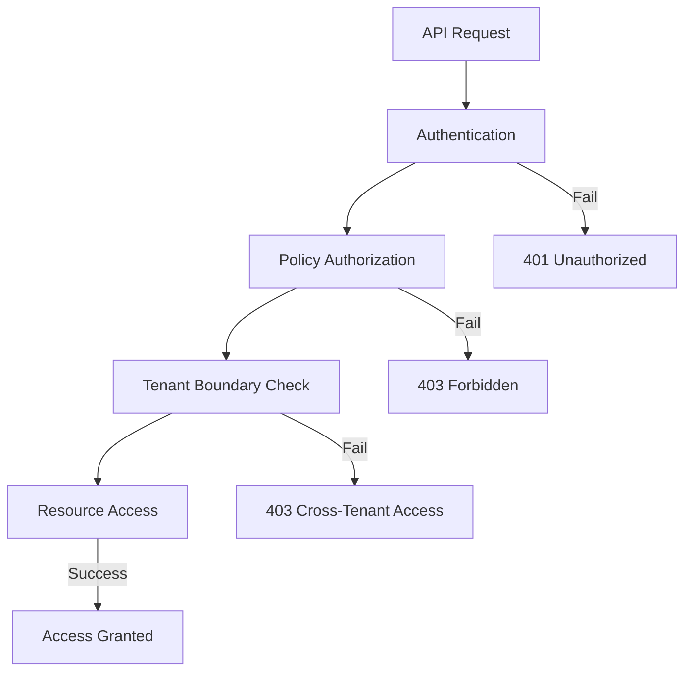

**Security Layers**:
1. **Authentication**: Laravel Sanctum token validation
2. **Authorization**: Policy-based role checking
3. **Tenant Isolation**: Property-based access control
4. **Resource Validation**: Model-level business rules

### 2. Audit Trail Architecture

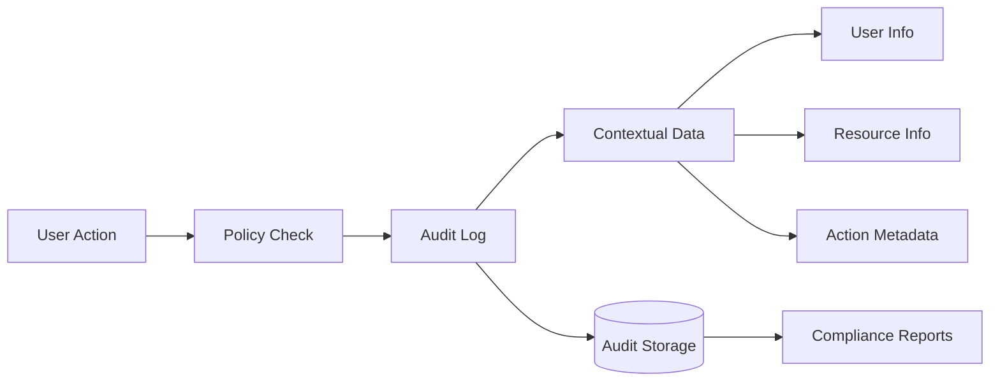

**Audit Data Structure**:
```php
[
    'operation' => 'approve',
    'actor_id' => 123,
    'actor_email' => 'manager@example.com',
    'actor_role' => 'manager',
    'actor_tenant_id' => 1,
    'target_id' => 456,
    'target_type' => 'MeterReading',
    'target_tenant_id' => 1,
    'validation_status' => 'pending',
    'input_method' => 'manual',
    'ip' => '192.168.1.100',
    'user_agent' => 'Mozilla/5.0...',
    'timestamp' => '2024-01-15T12:00:00Z',
]
```

## Performance Architecture

### 1. Caching Strategy

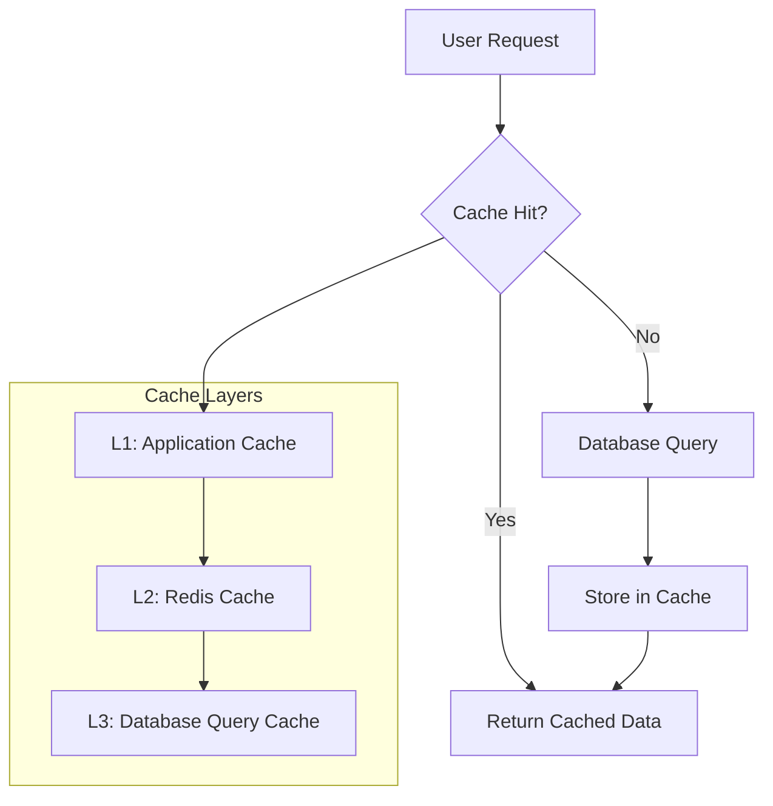

**Cache Keys and TTL**:
- `tenant_meter_access_{tenant_id}_{meter_id}`: 5 minutes
- `pending_readings_{tenant_id}`: 1 minute
- `user_capabilities_{user_id}`: 15 minutes
- `meter_validation_rules_{meter_id}`: 1 hour

### 2. Database Optimization

**Indexes**:
```sql
-- Validation status queries
CREATE INDEX idx_meter_readings_validation_status ON meter_readings(tenant_id, validation_status);

-- Approval workflow queries
CREATE INDEX idx_meter_readings_validated_by ON meter_readings(validated_by, validated_at);

-- Tenant boundary queries
CREATE INDEX idx_meter_readings_meter_tenant ON meter_readings(meter_id, tenant_id);

-- Audit queries
CREATE INDEX idx_meter_readings_entered_by ON meter_readings(entered_by, created_at);
```

**Query Optimization**:
```php
// Optimized pending readings query
MeterReading::query()
    ->with(['meter:id,serial_number', 'enteredBy:id,name'])
    ->where('tenant_id', $tenantId)
    ->where('validation_status', ValidationStatus::PENDING)
    ->orderBy('created_at', 'desc')
    ->paginate(25);
```

## Integration Architecture

### 1. External System Integration

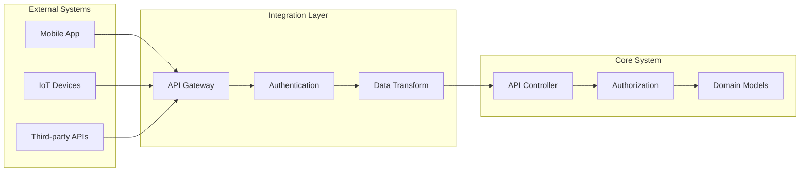

### 2. Event-Driven Architecture

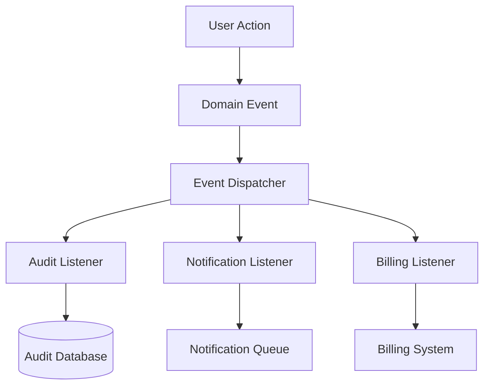

**Domain Events**:
- `MeterReadingCreated`: Triggered on reading submission
- `MeterReadingApproved`: Triggered on manager approval
- `MeterReadingRejected`: Triggered on manager rejection
- `ValidationStatusChanged`: Triggered on status transitions

## Deployment Architecture

### 1. Environment Configuration

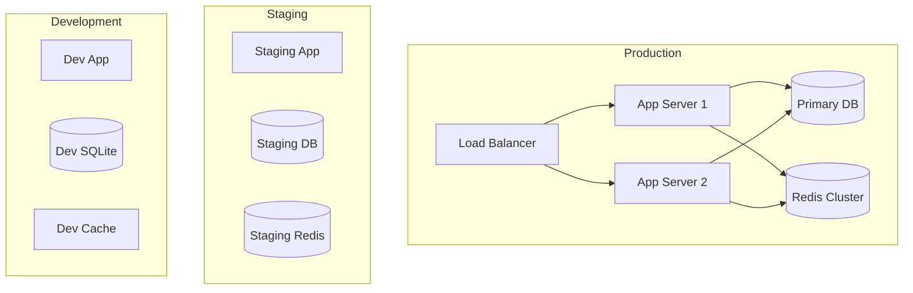

### 2. Scaling Considerations

**Horizontal Scaling**:
- Stateless application servers
- Shared Redis cache cluster
- Database read replicas for reporting
- Queue workers for background processing

**Vertical Scaling**:
- Database connection pooling
- Redis memory optimization
- Application server resource allocation
- File storage optimization

## Monitoring and Observability

### 1. Metrics Collection

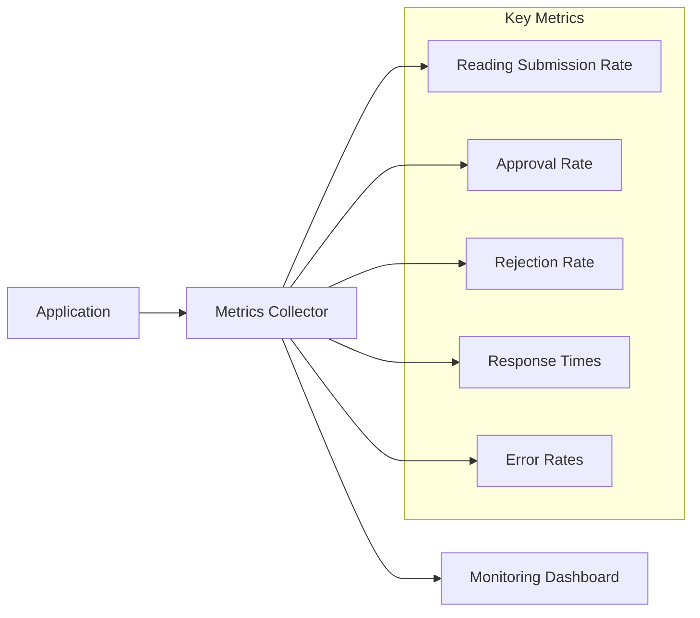

**Key Performance Indicators**:
- Tenant submission rate: Target 80% participation
- Manager approval rate: Target 95% for valid readings
- Reading rejection rate: Target <5% after training
- Approval time: Target <24 hours
- System availability: Target 99.9% uptime

### 2. Alerting Strategy

**Critical Alerts**:
- High rejection rates (>20%)
- Pending readings aging (>48 hours)
- Cross-tenant access attempts
- System errors (>1% error rate)
- Performance degradation (>2s response time)

**Warning Alerts**:
- Unusual submission patterns
- Cache hit rate degradation
- Database connection issues
- Queue processing delays

## Future Architecture Enhancements

### 1. Planned Improvements

**Machine Learning Integration**:
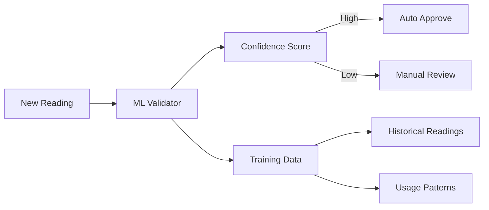

**Real-time Validation**:
- WebSocket connections for live feedback
- Instant validation results
- Real-time anomaly detection
- Live collaboration features

### 2. Scalability Roadmap

**Phase 1**: Current implementation (Truth-but-Verify)
**Phase 2**: Machine learning validation
**Phase 3**: IoT device integration
**Phase 4**: Predictive analytics
**Phase 5**: Fully automated validation

## Related Documentation

- [MeterReadingPolicy](../policies/METER_READING_POLICY.md)
- [Truth-but-Verify Workflow](../workflows/TRUTH_BUT_VERIFY.md)
- [TenantBoundaryService](../services/TENANT_BOUNDARY_SERVICE.md)
- [API Documentation](../api/METER_READING_API.md)
- [Performance Guidelines](../performance/METER_READING_PERFORMANCE.md)