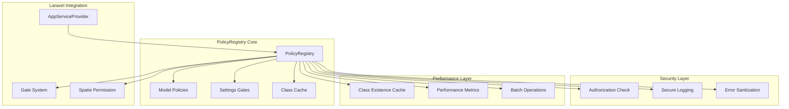
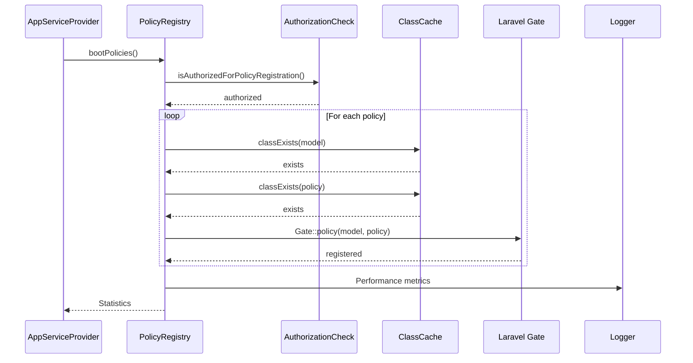
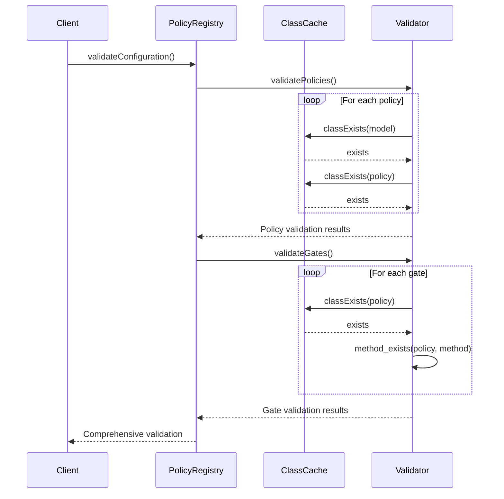
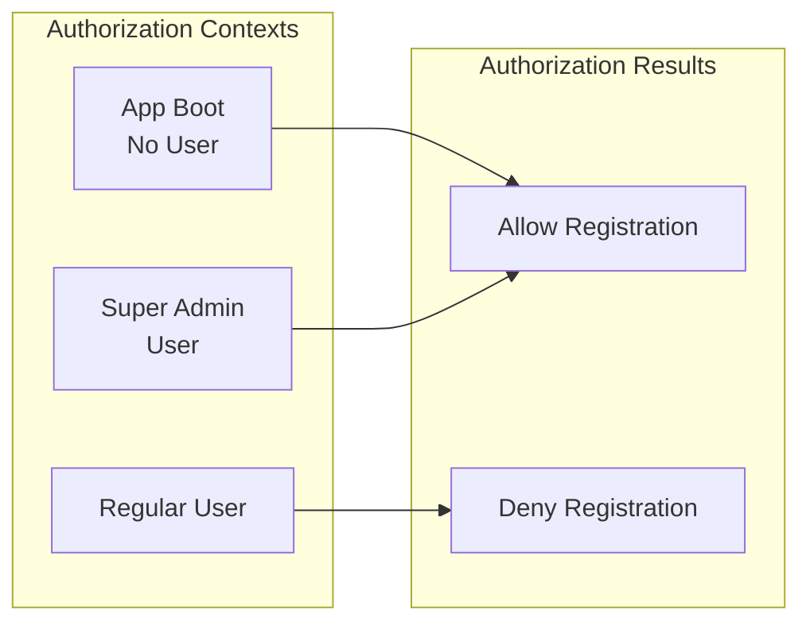
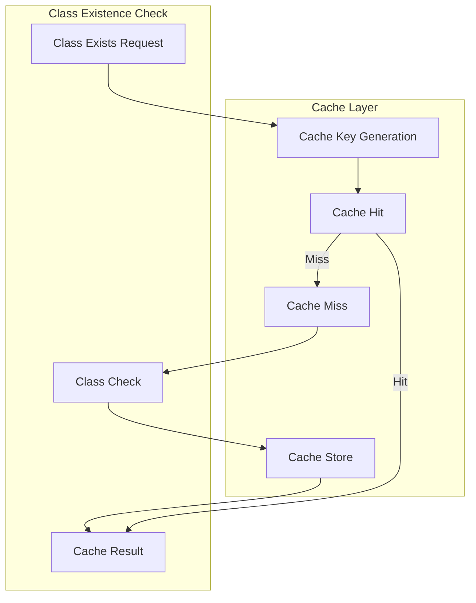
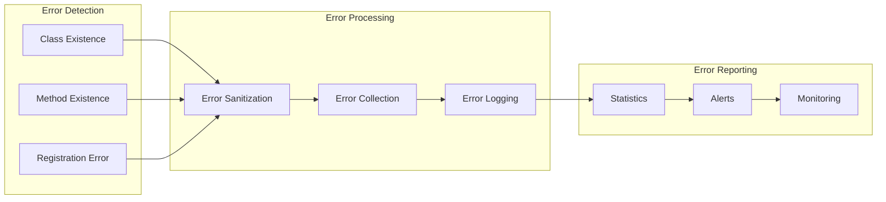

# PolicyRegistry Architecture

## Overview

The `PolicyRegistry` is a security-critical component that implements a defensive, performance-optimized approach to Laravel policy and gate registration. It serves as the central authority for authorization configuration while providing comprehensive error handling and monitoring capabilities.

## Architectural Principles

### 1. Defensive Programming
- **Graceful Degradation**: Continues operation even when some policies fail to register
- **Error Tolerance**: Collects and reports errors without breaking the system
- **Comprehensive Validation**: Validates configuration without affecting runtime
- **Fail-Safe Defaults**: Provides sensible behavior under adverse conditions

### 2. Security-First Design
- **Authorization Control**: Restricts policy registration to authorized contexts
- **Data Protection**: Hashes sensitive information before logging
- **Secure Caching**: Uses SHA-256 hashed cache keys
- **Information Disclosure Prevention**: Sanitizes error messages

### 3. Performance Optimization
- **Cached Operations**: Caches class existence checks for 1 hour
- **Batch Processing**: Registers all policies in single operations
- **Performance Monitoring**: Tracks timing and success metrics
- **Efficient Validation**: Separates validation from registration

## Component Architecture



## Data Flow

### 1. Registration Flow



### 2. Validation Flow



## Security Architecture

### Authorization Model



### Data Protection Strategy

1. **Sensitive Data Identification**:
   - Full class names
   - File paths
   - Internal configuration details

2. **Protection Methods**:
   - SHA-256 hashing for logging
   - Sanitized error messages
   - Secure cache keys

3. **Logging Strategy**:
   ```php
   // Secure logging example
   Log::warning('Policy registration: Model class missing', [
       'model_hash' => hash('sha256', $model),
       'context' => 'policy_registration'
   ]);
   ```

## Performance Architecture

### Caching Strategy



### Performance Metrics

1. **Timing Metrics**:
   - Registration duration
   - Validation duration
   - Cache hit rates

2. **Success Metrics**:
   - Policies registered
   - Policies skipped
   - Errors encountered

3. **Monitoring Integration**:
   ```php
   Log::debug("Policy registration completed", [
       'registered' => $registered,
       'skipped' => $skipped,
       'errors_count' => count($errors),
       'duration_ms' => round($duration * 1000, 2),
   ]);
   ```

## Error Handling Architecture

### Error Categories

1. **Configuration Errors**:
   - Missing model classes
   - Missing policy classes
   - Missing policy methods

2. **Runtime Errors**:
   - Gate registration failures
   - Authorization failures
   - Cache failures

3. **Security Errors**:
   - Unauthorized registration attempts
   - Invalid authorization contexts

### Error Processing Pipeline



## Integration Architecture

### Laravel Framework Integration

1. **Gate System Integration**:
   ```php
   Gate::policy($model, $policy);
   Gate::define($gate, [$policy, $method]);
   ```

2. **Service Provider Integration**:
   ```php
   // In AppServiceProvider::boot()
   $this->bootPolicies();
   ```

3. **Cache System Integration**:
   ```php
   Cache::remember($cacheKey, $ttl, $callback);
   ```

### Multi-Tenancy Integration

1. **Tenant-Aware Policies**: All registered policies respect tenant boundaries
2. **Hierarchical Authorization**: Supports complex authorization hierarchies
3. **Context Preservation**: Maintains authorization context across requests

### Spatie Permission Integration

1. **Role Checking**: Integrates with Spatie's role system
2. **Permission Validation**: Validates super_admin permissions
3. **Team Scoping**: Supports team-scoped permissions

## Configuration Management

### Model-Policy Mappings

```php
private const MODEL_POLICIES = [
    \App\Models\User::class => \App\Policies\UserPolicy::class,
    \App\Models\Tariff::class => \App\Policies\TariffPolicy::class,
    // ... additional mappings
];
```

### Settings Gate Definitions

```php
private const SETTINGS_GATES = [
    'viewSettings' => [\App\Policies\SettingsPolicy::class, 'viewSettings'],
    'updateSettings' => [\App\Policies\SettingsPolicy::class, 'updateSettings'],
    // ... additional gates
];
```

### Configuration Validation

1. **Pre-Registration Validation**: Validates configuration before attempting registration
2. **Runtime Validation**: Continuous validation during registration
3. **Post-Registration Validation**: Verifies successful registration

## Monitoring and Observability

### Metrics Collection

1. **Registration Metrics**:
   - Success/failure rates
   - Performance timing
   - Error frequencies

2. **Security Metrics**:
   - Authorization attempts
   - Unauthorized access attempts
   - Security violations

3. **Performance Metrics**:
   - Cache hit rates
   - Registration duration
   - Memory usage

### Logging Strategy

1. **Development Logging**: Verbose logging for debugging
2. **Production Logging**: Security-focused logging with data protection
3. **Performance Logging**: Timing and performance metrics

### Alerting Integration

1. **Error Rate Alerts**: Alert on high error rates
2. **Performance Alerts**: Alert on performance degradation
3. **Security Alerts**: Alert on security violations

## Scalability Considerations

### Performance Scaling

1. **Cache Optimization**: Efficient caching reduces repeated operations
2. **Batch Processing**: Processes all policies in single operations
3. **Memory Efficiency**: Readonly class with minimal memory footprint

### Operational Scaling

1. **Monitoring Integration**: Comprehensive metrics for operational visibility
2. **Error Handling**: Graceful degradation under load
3. **Configuration Management**: Centralized configuration for easy updates

## Future Enhancements

### Planned Improvements

1. **Dynamic Policy Loading**: Support for runtime policy registration
2. **Enhanced Monitoring**: More detailed performance and security metrics
3. **Configuration UI**: Administrative interface for policy management
4. **Advanced Caching**: More sophisticated caching strategies

### Extension Points

1. **Custom Validators**: Support for custom validation logic
2. **Plugin Architecture**: Support for policy registration plugins
3. **Event Integration**: Integration with Laravel's event system
4. **API Integration**: RESTful API for policy management

## Related Documentation

- [PolicyRegistry Security Guide](../security/POLICY_REGISTRY_SECURITY_GUIDE.md)
- [PolicyRegistry Testing Guide](../testing/POLICY_REGISTRY_TESTING_GUIDE.md)
- [Defensive Programming Patterns](DEFENSIVE_PROGRAMMING_PATTERNS.md)
- [Laravel Authorization Documentation](https://laravel.com/docs/authorization)