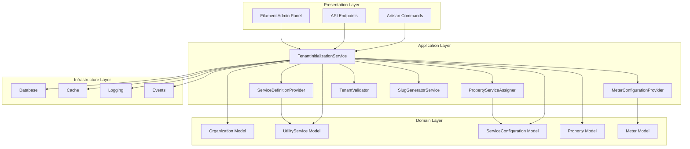
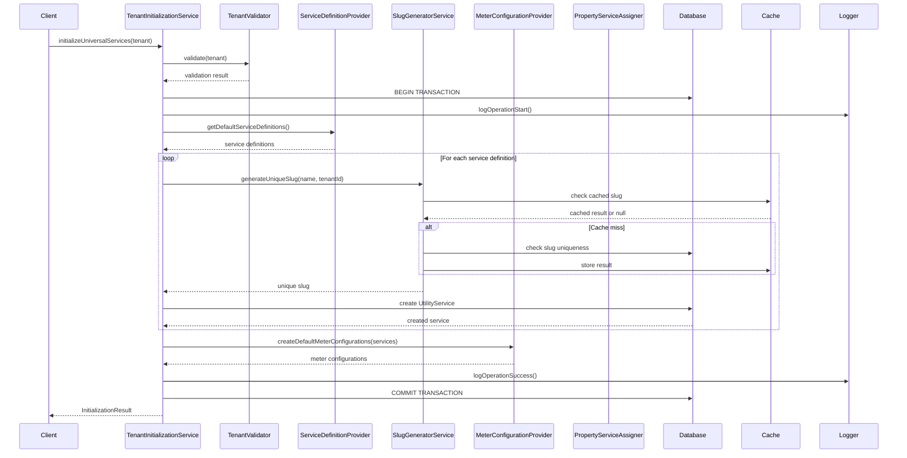
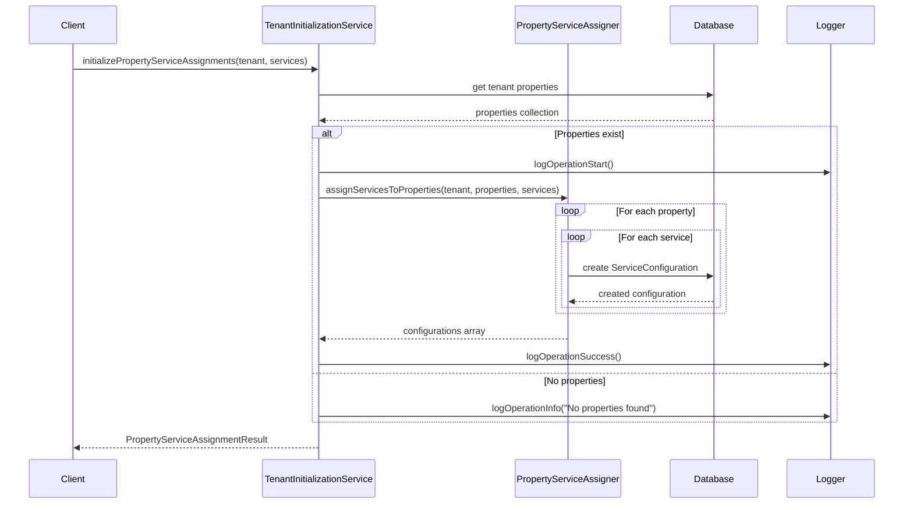
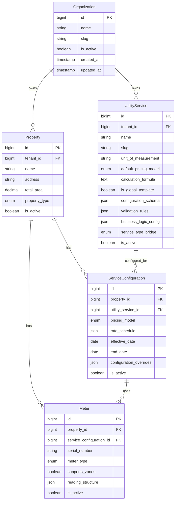

# Tenant Initialization Architecture

## Overview

The Tenant Initialization system is a critical component of the multi-tenant utilities billing platform that handles the setup of new tenants with default utility services, configurations, and property assignments. This document outlines the architectural design, data flow, and integration patterns.

## System Architecture

### High-Level Architecture



### Component Responsibilities

#### TenantInitializationService (Orchestrator)
- **Primary Role**: Coordinates the entire tenant initialization process
- **Responsibilities**:
  - Validates tenant data before initialization
  - Orchestrates service creation workflow
  - Manages database transactions
  - Handles error recovery and logging
  - Ensures backward compatibility with existing systems

#### ServiceDefinitionProvider (Configuration)
- **Primary Role**: Provides default service definitions and templates
- **Responsibilities**:
  - Defines default utility service configurations
  - Manages regional and tenant-specific customizations
  - Provides pricing model templates
  - Maintains validation rule sets

#### MeterConfigurationProvider (Meter Setup)
- **Primary Role**: Creates meter configurations for utility services
- **Responsibilities**:
  - Generates meter type configurations
  - Sets up reading structures (zones, multi-value readings)
  - Configures validation rules per service type
  - Manages meter-specific business logic

#### PropertyServiceAssigner (Property Integration)
- **Primary Role**: Assigns utility services to existing properties
- **Responsibilities**:
  - Creates ServiceConfiguration records
  - Links properties to utility services
  - Applies property-specific overrides
  - Manages service activation states

#### TenantValidator (Data Validation)
- **Primary Role**: Validates tenant data before operations
- **Responsibilities**:
  - Ensures tenant exists and is persisted
  - Validates required tenant attributes
  - Checks tenant state consistency
  - Provides operation-specific validation

#### SlugGeneratorService (Unique Identifiers)
- **Primary Role**: Generates unique slugs for utility services
- **Responsibilities**:
  - Creates URL-friendly slugs from service names
  - Ensures uniqueness within tenant scope
  - Caches slug generation for performance
  - Handles slug collision resolution

## Data Flow

### Initialization Process Flow



### Property Assignment Flow



## Database Schema

### Core Tables

#### utility_services
```sql
CREATE TABLE utility_services (
    id BIGINT PRIMARY KEY AUTO_INCREMENT,
    tenant_id BIGINT NOT NULL,
    name VARCHAR(255) NOT NULL,
    slug VARCHAR(255) NOT NULL,
    unit_of_measurement VARCHAR(50) NOT NULL,
    default_pricing_model ENUM('flat', 'time_of_use', 'tiered', 'hybrid', 'custom_formula') NOT NULL,
    calculation_formula TEXT,
    is_global_template BOOLEAN DEFAULT FALSE,
    created_by_tenant_id BIGINT,
    configuration_schema JSON,
    validation_rules JSON,
    business_logic_config JSON,
    service_type_bridge ENUM('electricity', 'water', 'heating', 'gas') NOT NULL,
    description TEXT,
    is_active BOOLEAN DEFAULT TRUE,
    created_at TIMESTAMP DEFAULT CURRENT_TIMESTAMP,
    updated_at TIMESTAMP DEFAULT CURRENT_TIMESTAMP ON UPDATE CURRENT_TIMESTAMP,
    
    UNIQUE KEY unique_tenant_slug (tenant_id, slug),
    INDEX idx_tenant_service_type (tenant_id, service_type_bridge),
    INDEX idx_global_template (is_global_template, service_type_bridge),
    FOREIGN KEY (tenant_id) REFERENCES organizations(id) ON DELETE CASCADE
);
```

#### service_configurations
```sql
CREATE TABLE service_configurations (
    id BIGINT PRIMARY KEY AUTO_INCREMENT,
    property_id BIGINT NOT NULL,
    utility_service_id BIGINT NOT NULL,
    pricing_model ENUM('flat', 'time_of_use', 'tiered', 'hybrid', 'custom_formula'),
    rate_schedule JSON,
    effective_date DATE NOT NULL,
    end_date DATE,
    configuration_overrides JSON,
    is_active BOOLEAN DEFAULT TRUE,
    created_at TIMESTAMP DEFAULT CURRENT_TIMESTAMP,
    updated_at TIMESTAMP DEFAULT CURRENT_TIMESTAMP ON UPDATE CURRENT_TIMESTAMP,
    
    UNIQUE KEY unique_property_service (property_id, utility_service_id, effective_date),
    INDEX idx_property_active (property_id, is_active),
    INDEX idx_service_active (utility_service_id, is_active),
    FOREIGN KEY (property_id) REFERENCES properties(id) ON DELETE CASCADE,
    FOREIGN KEY (utility_service_id) REFERENCES utility_services(id) ON DELETE CASCADE
);
```

### Relationships



## Integration Patterns

### Filament Integration

#### Resource Actions
```php
// In OrganizationResource
Action::make('initializeServices')
    ->label('Initialize Services')
    ->icon('heroicon-o-cog-6-tooth')
    ->action(function (Organization $record) {
        $service = app(TenantInitializationService::class);
        
        try {
            $result = $service->initializeUniversalServices($record);
            
            Notification::make()
                ->title('Services Initialized')
                ->body("Created {$result->getServiceCount()} utility services")
                ->success()
                ->send();
                
        } catch (TenantInitializationException $e) {
            Notification::make()
                ->title('Initialization Failed')
                ->body($e->getMessage())
                ->danger()
                ->send();
        }
    })
    ->requiresConfirmation()
    ->visible(fn (Organization $record) => 
        auth()->user()->can('initialize', $record)
    );
```

#### Bulk Actions
```php
// In OrganizationResource
BulkAction::make('initializeServices')
    ->label('Initialize Services')
    ->action(function (Collection $records) {
        $service = app(TenantInitializationService::class);
        $successful = 0;
        $failed = 0;
        
        foreach ($records as $tenant) {
            try {
                $service->initializeUniversalServices($tenant);
                $successful++;
            } catch (TenantInitializationException $e) {
                $failed++;
                Log::error('Bulk initialization failed', [
                    'tenant_id' => $tenant->id,
                    'error' => $e->getMessage(),
                ]);
            }
        }
        
        Notification::make()
            ->title('Bulk Initialization Complete')
            ->body("Successful: {$successful}, Failed: {$failed}")
            ->success()
            ->send();
    })
    ->deselectRecordsAfterCompletion();
```

### Event Integration

#### Domain Events
```php
// Events dispatched during initialization
event(new TenantServicesInitialized($tenant, $result));
event(new PropertyServicesAssigned($tenant, $propertyAssignments));
event(new HeatingCompatibilityChecked($tenant, $isCompatible));
```

#### Event Listeners
```php
// Listener for post-initialization tasks
class TenantServicesInitializedListener
{
    public function handle(TenantServicesInitialized $event): void
    {
        // Send welcome email with service information
        Mail::to($event->tenant->email)
            ->send(new TenantServicesWelcomeMail($event->tenant, $event->result));
        
        // Create default meter readings if needed
        $this->createInitialMeterReadings($event->tenant, $event->result);
        
        // Update tenant status
        $event->tenant->update(['initialization_status' => 'completed']);
    }
}
```

### Command Integration

#### Artisan Commands
```php
// Command for bulk tenant initialization
class InitializeTenantsCommand extends Command
{
    protected $signature = 'tenants:initialize 
                           {--tenant= : Specific tenant ID to initialize}
                           {--force : Force reinitialize existing services}
                           {--dry-run : Show what would be done without executing}';

    public function handle(TenantInitializationService $service): int
    {
        $tenants = $this->option('tenant') 
            ? Organization::where('id', $this->option('tenant'))->get()
            : Organization::whereDoesntHave('utilityServices')->get();

        if ($this->option('dry-run')) {
            $this->info("Would initialize {$tenants->count()} tenants");
            return 0;
        }

        $bar = $this->output->createProgressBar($tenants->count());
        $successful = 0;
        $failed = 0;

        foreach ($tenants as $tenant) {
            try {
                $result = $service->initializeUniversalServices($tenant);
                $this->info("✓ Initialized {$tenant->name} with {$result->getServiceCount()} services");
                $successful++;
            } catch (TenantInitializationException $e) {
                $this->error("✗ Failed to initialize {$tenant->name}: {$e->getMessage()}");
                $failed++;
            }
            
            $bar->advance();
        }

        $bar->finish();
        $this->newLine();
        $this->info("Initialization complete. Successful: {$successful}, Failed: {$failed}");

        return $failed > 0 ? 1 : 0;
    }
}
```

## Performance Considerations

### Caching Strategy

#### Slug Generation Caching
```php
// Cache unique slug checks to avoid repeated database queries
$cacheKey = "tenant_slugs:{$tenantId}:{$baseSlug}";
$slug = Cache::remember($cacheKey, 3600, function () use ($baseSlug, $tenantId) {
    return $this->findUniqueSlug($baseSlug, $tenantId);
});
```

#### Service Definition Caching
```php
// Cache service definitions to avoid repeated configuration loading
$definitions = Cache::remember('service_definitions', 3600, function () {
    return $this->loadServiceDefinitionsFromConfig();
});
```

### Database Optimization

#### Transaction Management
```php
// Use database transactions to ensure data consistency
DB::transaction(function () use ($tenant) {
    // All service creation operations
    $services = $this->createDefaultUtilityServices($tenant);
    $configurations = $this->createMeterConfigurations($services);
    
    // Log success only after transaction commits
    $this->logTenantOperationSuccess($tenant, $operation, $context);
});
```

#### Batch Operations
```php
// Create multiple services in batches to reduce database round trips
$serviceData = collect($definitions)->map(function ($definition, $key) use ($tenant) {
    return [
        'tenant_id' => $tenant->id,
        'name' => $definition['name'],
        'slug' => $this->generateUniqueSlug($definition['name'], $tenant->id),
        // ... other fields
        'created_at' => now(),
        'updated_at' => now(),
    ];
});

UtilityService::insert($serviceData->toArray());
```

### Memory Management

#### Lazy Loading
```php
// Use lazy loading for large collections
$properties = Property::where('tenant_id', $tenant->id)
    ->lazy()
    ->each(function ($property) use ($services) {
        $this->assignServicesToProperty($property, $services);
    });
```

#### Resource Cleanup
```php
// Clean up resources after processing
unset($serviceDefinitions, $meterConfigurations);
gc_collect_cycles();
```

## Error Handling Strategy

### Exception Hierarchy
```php
TenantInitializationException
├── ServiceCreationFailedException
├── PropertyAssignmentFailedException  
├── InvalidTenantDataException
├── HeatingCompatibilityException
├── MeterConfigurationException
├── TemplateCreationException
├── ConfigurationValidationException
└── DependencyResolutionException
```

### Error Recovery
```php
// Implement retry logic for transient failures
$maxRetries = 3;
$attempt = 0;

while ($attempt < $maxRetries) {
    try {
        return $this->createUtilityService($tenant, $serviceKey, $definition);
    } catch (TransientException $e) {
        $attempt++;
        if ($attempt >= $maxRetries) {
            throw TenantInitializationException::serviceCreationFailed($tenant, $serviceKey, $e);
        }
        
        // Exponential backoff
        sleep(pow(2, $attempt));
    }
}
```

### Rollback Strategy
```php
// Implement rollback for partial failures
DB::transaction(function () use ($tenant) {
    try {
        $services = $this->createDefaultUtilityServices($tenant);
        $configurations = $this->createMeterConfigurations($services);
    } catch (Exception $e) {
        // Transaction will automatically rollback
        $this->logTenantOperationError($tenant, $operation, $e);
        throw $e;
    }
});
```

## Security Considerations

### Authorization
- All initialization operations require appropriate permissions
- Tenant isolation is enforced at the service level
- SuperAdmin can initialize any tenant, Admin only their own tenant

### Data Validation
- All input is validated before processing
- Tenant data is validated for consistency and completeness
- Service definitions are validated against schemas

### Audit Logging
- All operations are logged with full context
- Failed operations include error details and stack traces
- User actions are tracked for security auditing

## Monitoring and Observability

### Metrics Collection
```php
// Collect performance metrics
$startTime = microtime(true);
$result = $this->initializeUniversalServices($tenant);
$duration = microtime(true) - $startTime;

$this->logTenantOperationPerformance($tenant, $operation, [
    'duration_ms' => $duration * 1000,
    'services_created' => $result->getServiceCount(),
    'memory_peak_mb' => memory_get_peak_usage(true) / 1024 / 1024,
]);
```

### Health Checks
```php
// Health check endpoint for initialization service
Route::get('/health/tenant-initialization', function () {
    $service = app(TenantInitializationService::class);
    
    // Test with a dummy tenant (don't persist)
    $testTenant = new Organization(['name' => 'Test', 'id' => 999999]);
    
    try {
        // Validate dependencies are available
        $definitions = $service->getServiceDefinitions();
        
        return response()->json([
            'status' => 'healthy',
            'service_definitions_count' => count($definitions),
            'timestamp' => now()->toISOString(),
        ]);
    } catch (Exception $e) {
        return response()->json([
            'status' => 'unhealthy',
            'error' => $e->getMessage(),
            'timestamp' => now()->toISOString(),
        ], 503);
    }
});
```

## Testing Strategy

### Unit Tests
- Test individual service methods in isolation
- Mock all dependencies for fast execution
- Focus on business logic and edge cases

### Integration Tests  
- Test complete workflows with real database
- Verify data consistency and relationships
- Test error handling and rollback scenarios

### Performance Tests
- Measure initialization time for different tenant sizes
- Test memory usage with large numbers of properties
- Verify caching effectiveness

### Contract Tests
- Verify API contracts remain stable
- Test backward compatibility with existing systems
- Validate event contracts for external integrations

## Related Documentation

- [TenantInitializationService API Documentation](../services/TENANT_INITIALIZATION_SERVICE.md)
- [Multi-Tenant Architecture Guide](MULTI_TENANT_ARCHITECTURE.md)
- [Universal Utility Management Specification](../../.kiro/specs/universal-utility-management/)
- [Database Schema Documentation](DATABASE_SCHEMA.md)
- [Performance Optimization Guide](PERFORMANCE_OPTIMIZATION.md)