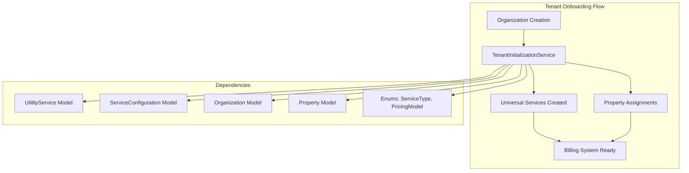
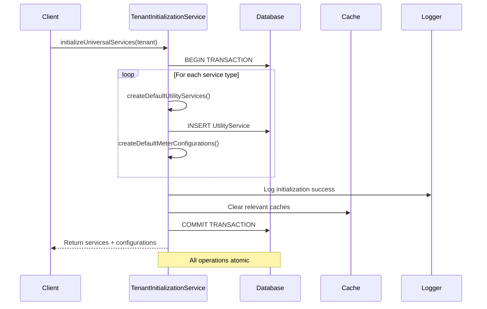
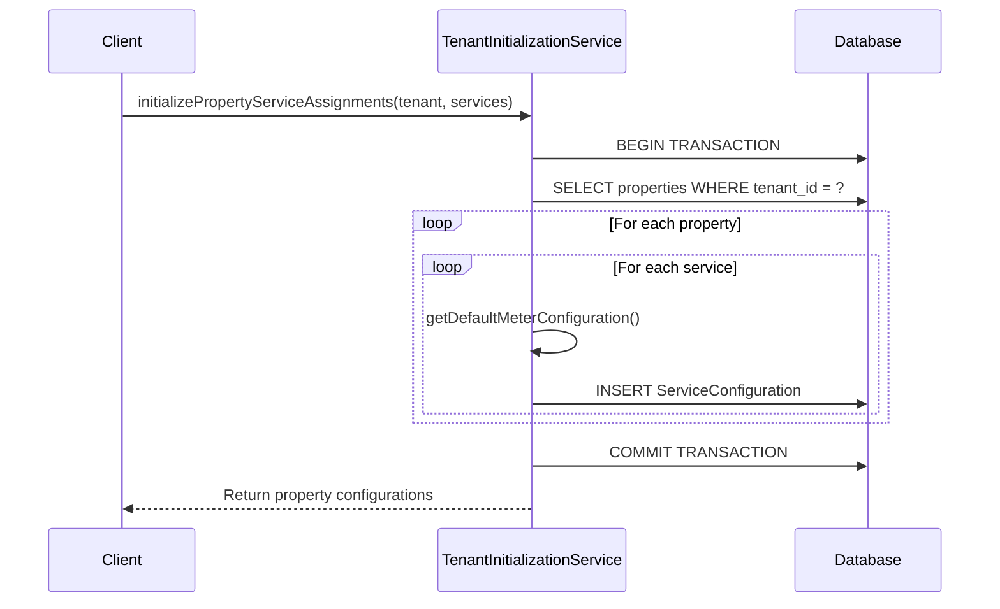
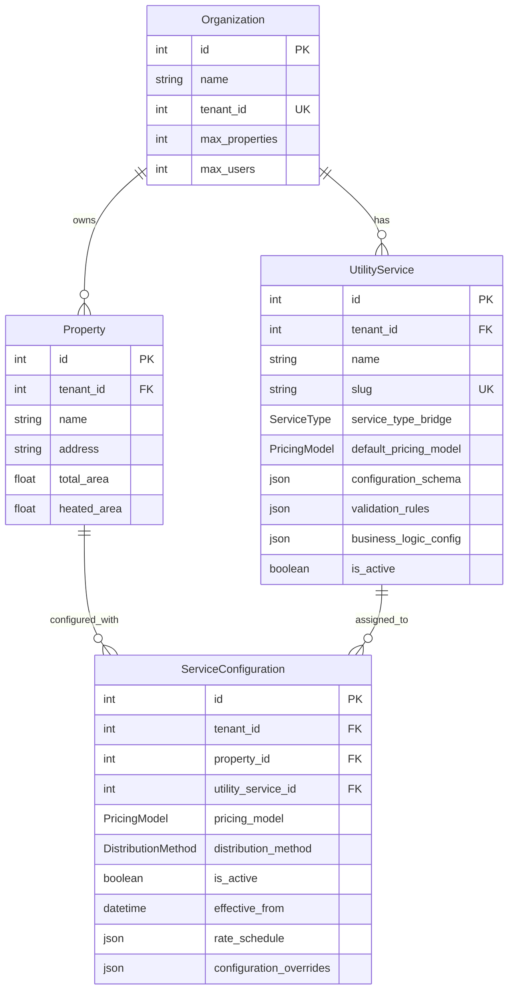
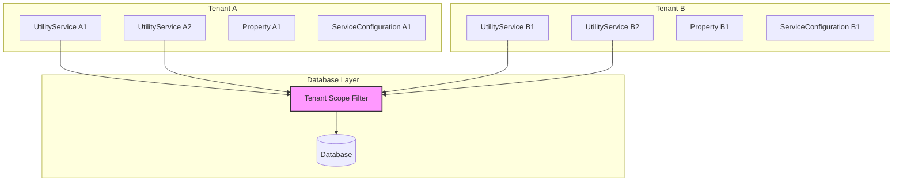
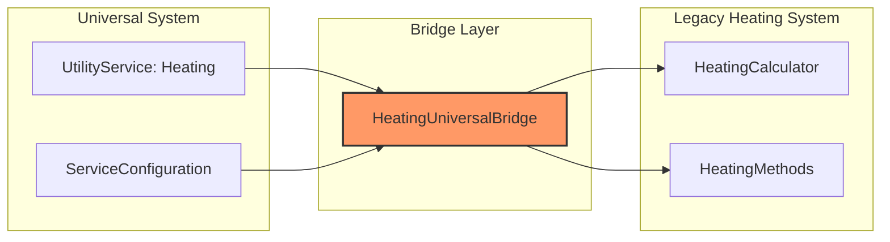
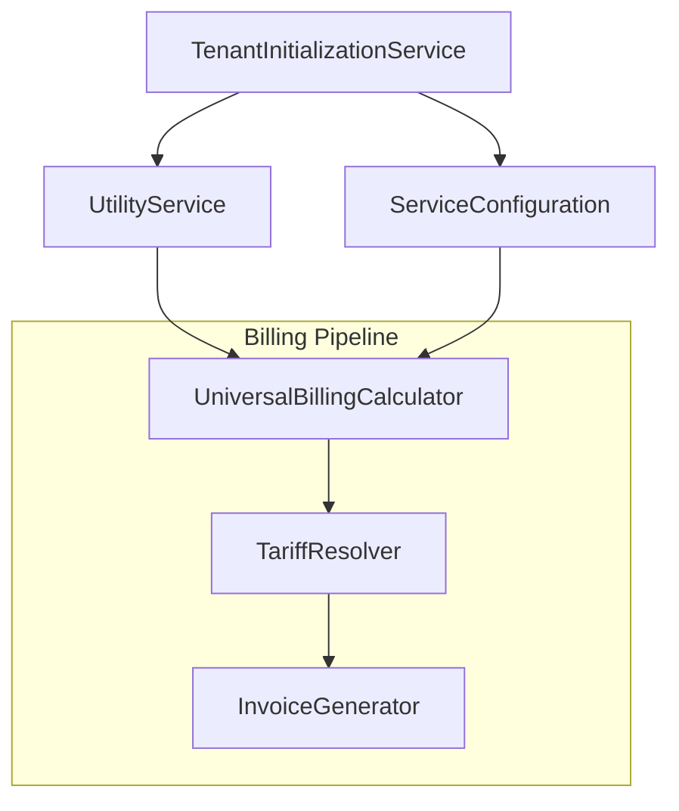
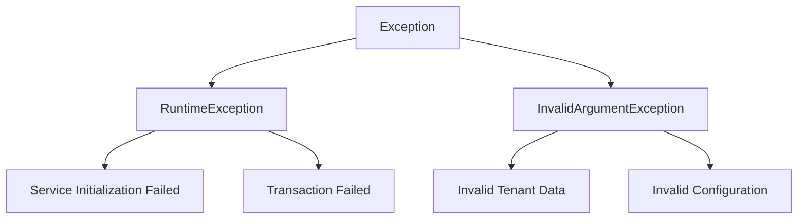
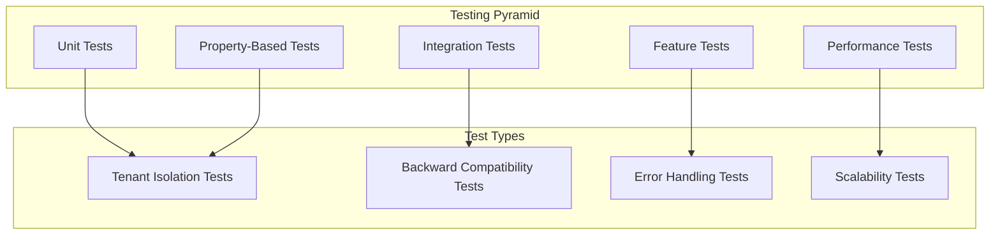

# TenantInitializationService Architecture

## Overview

The `TenantInitializationService` is a critical component in the multi-tenant utilities billing platform's architecture. It serves as the foundation for tenant onboarding by establishing the universal utility service framework while maintaining backward compatibility with existing heating systems.

## Architectural Position

### System Context



### Layer Architecture

The service operates within the **Service Layer** of the application's clean architecture:

```
┌─────────────────────────────────────┐
│           Presentation Layer        │
│  (Filament Resources, Controllers)  │
└─────────────────┬───────────────────┘
                  │
┌─────────────────▼───────────────────┐
│          Application Layer          │
│    (TenantInitializationService)    │ ◄── Current Focus
└─────────────────┬───────────────────┘
                  │
┌─────────────────▼───────────────────┐
│            Domain Layer             │
│   (Models, Enums, Value Objects)   │
└─────────────────┬───────────────────┘
                  │
┌─────────────────▼───────────────────┐
│        Infrastructure Layer         │
│      (Database, External APIs)     │
└─────────────────────────────────────┘
```

## Service Architecture

### Core Responsibilities

1. **Universal Service Creation**: Establishes four core utility services for each tenant
2. **Configuration Management**: Sets up default configurations and pricing models
3. **Property Assignment**: Links services to tenant properties
4. **Backward Compatibility**: Maintains integration with existing heating systems
5. **Tenant Isolation**: Ensures proper multi-tenant data separation

### Service Pattern Implementation

```php
final readonly class TenantInitializationService
{
    // Readonly service - no mutable state
    // All operations are stateless and transaction-safe
    // Follows single responsibility principle
}
```

**Key Architectural Decisions**:
- **Readonly Class**: Prevents state mutations and ensures thread safety
- **Final Class**: Prevents inheritance to maintain architectural integrity
- **Dependency Injection**: All dependencies injected via constructor
- **Transaction Wrapping**: All operations are atomic and rollback-safe

## Data Flow Architecture

### Service Initialization Flow



### Property Assignment Flow



## Domain Model Integration

### Entity Relationships



### Service Type Architecture

The service implements a **Strategy Pattern** for different utility types:

```php
// Service definitions act as strategies
private function getDefaultServiceDefinitions(): array
{
    return [
        'electricity' => [
            'pricing_model' => PricingModel::TIME_OF_USE,
            'supports_zones' => true,
            // ... electricity-specific configuration
        ],
        'water' => [
            'pricing_model' => PricingModel::CONSUMPTION_BASED,
            'supports_zones' => false,
            // ... water-specific configuration
        ],
        'heating' => [
            'pricing_model' => PricingModel::HYBRID,
            'supports_shared_distribution' => true,
            // ... heating-specific configuration
        ],
        'gas' => [
            'pricing_model' => PricingModel::TIERED_RATES,
            'supports_tiered_rates' => true,
            // ... gas-specific configuration
        ],
    ];
}
```

## Multi-Tenancy Architecture

### Tenant Isolation Strategy



**Isolation Mechanisms**:
1. **Tenant ID Scoping**: All entities include `tenant_id` foreign key
2. **Unique Constraints**: Slugs unique within tenant scope only
3. **Query Scoping**: All queries automatically filtered by tenant
4. **Transaction Isolation**: Each tenant's operations are atomic

### Slug Generation Strategy

```php
private function generateUniqueSlug(string $name, int $tenantId): string
{
    $baseSlug = Str::slug($name);
    $slug = $baseSlug;
    $counter = 1;

    // Tenant-scoped uniqueness check
    while (UtilityService::where('slug', $slug)
        ->where('tenant_id', $tenantId)  // Scoped to tenant
        ->exists()) {
        $slug = "{$baseSlug}-{$counter}";
        $counter++;
    }

    return $slug;
}
```

## Integration Architecture

### Heating System Integration

The service maintains backward compatibility with the existing heating calculator through a **Bridge Pattern**:



**Integration Points**:
- **Pricing Model**: Heating uses `HYBRID` model compatible with existing calculator
- **Distribution Method**: Defaults to `BY_AREA` for shared heating costs
- **Business Logic**: Preserves `supports_shared_distribution` flag
- **Seasonal Factors**: Maintains winter/summer calculation adjustments

### Billing System Integration



## Performance Architecture

### Optimization Strategies

1. **Database Optimization**:
   - Indexes on `tenant_id` and `slug` columns
   - Batch operations for property assignments
   - Transaction grouping for atomic operations

2. **Memory Management**:
   - Readonly service class prevents state accumulation
   - Batch processing for large property sets
   - Garbage collection friendly object lifecycle

3. **Caching Strategy**:
   - Service definitions cached for repeated initializations
   - Configuration templates cached per service type
   - Cache invalidation on service creation

### Scalability Considerations

```php
// Batch processing for large property sets
public function initializePropertyServiceAssignments(
    Organization $tenant, 
    array $utilityServices
): array {
    $properties = Property::where('tenant_id', $tenant->id)->get();
    
    if ($properties->isEmpty()) {
        return [];
    }

    return DB::transaction(function () use ($properties, $utilityServices, $tenant) {
        // Process in batches to manage memory
        $serviceConfigurations = [];
        
        foreach ($properties as $property) {
            foreach ($utilityServices as $serviceKey => $utilityService) {
                // Create configuration for each property-service pair
                $configData = $this->getDefaultMeterConfiguration($serviceKey, $utilityService);
                $configData['tenant_id'] = $tenant->id;
                $configData['property_id'] = $property->id;

                $serviceConfiguration = ServiceConfiguration::create($configData);
                $serviceConfigurations[$property->id][$serviceKey] = $serviceConfiguration;
            }
        }

        return $serviceConfigurations;
    });
}
```

## Error Handling Architecture

### Exception Hierarchy



### Error Recovery Strategy

```php
public function initializeUniversalServices(Organization $tenant): array
{
    return DB::transaction(function () use ($tenant) {
        try {
            // Service creation logic
            $utilityServices = $this->createDefaultUtilityServices($tenant);
            $meterConfigurations = $this->createDefaultMeterConfigurations($utilityServices);

            Log::info('Universal services initialized successfully', [
                'tenant_id' => $tenant->id,
                'services_created' => count($utilityServices),
            ]);

            return [
                'utility_services' => $utilityServices,
                'meter_configurations' => $meterConfigurations,
            ];
        } catch (\Exception $e) {
            Log::error('Failed to initialize universal services for tenant', [
                'tenant_id' => $tenant->id,
                'error' => $e->getMessage(),
                'stack_trace' => $e->getTraceAsString(),
            ]);
            
            // Transaction automatically rolls back
            throw new \RuntimeException(
                'Failed to initialize universal services: ' . $e->getMessage(), 
                0, 
                $e
            );
        }
    });
}
```

## Security Architecture

### Tenant Isolation Security

1. **Data Scoping**: All queries automatically scoped by tenant ID
2. **Slug Uniqueness**: Prevents cross-tenant slug conflicts
3. **Property Validation**: Ensures properties belong to correct tenant
4. **Transaction Isolation**: Prevents partial state corruption

### Input Validation

```php
// Validation occurs at multiple layers
private function validateTenant(Organization $tenant): void
{
    if (!$tenant->exists) {
        throw new InvalidArgumentException('Tenant must exist in database');
    }
    
    if (!$tenant->is_active) {
        throw new InvalidArgumentException('Cannot initialize services for inactive tenant');
    }
}
```

## Testing Architecture

### Test Strategy Layers



### Test Architecture Patterns

1. **Feature Tests**: Full integration with database and Laravel context
2. **Performance Tests**: Benchmarking under various loads
3. **Property Tests**: Invariant verification across input combinations
4. **Unit Tests**: Isolated method testing with mocks

## Deployment Architecture

### Service Registration

```php
// In AppServiceProvider
public function register(): void
{
    $this->app->singleton(TenantInitializationService::class);
}
```

### Configuration Management

Service configurations are managed through:
- **Environment Variables**: For deployment-specific settings
- **Config Files**: For service definitions and defaults
- **Database**: For tenant-specific overrides

## Future Architecture Considerations

### Extensibility Points

1. **Service Type Extension**: New utility types can be added to service definitions
2. **Pricing Model Extension**: New pricing models can be integrated
3. **Configuration Schema**: Flexible JSON schemas allow for service customization
4. **Integration Points**: Bridge pattern allows for additional system integrations

### Scalability Roadmap

1. **Microservice Migration**: Service could be extracted to dedicated microservice
2. **Event-Driven Architecture**: Service initialization could trigger domain events
3. **Async Processing**: Large tenant initializations could be queued
4. **Caching Layer**: Redis caching for service definitions and configurations

## Related Documentation

- [Multi-Tenancy Architecture](./multi-tenancy.md)
- [Universal Utility Management Spec](.kiro/specs/universal-utility-management/)
- [Service Layer Patterns](./service-layer-patterns.md)
- [Database Architecture](./database-architecture.md)
- [Performance Architecture](./performance-architecture.md)