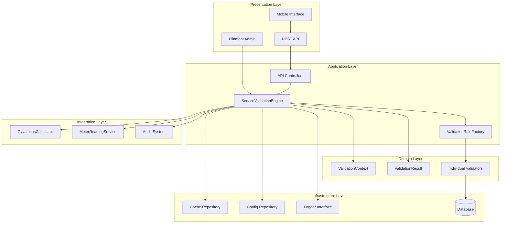
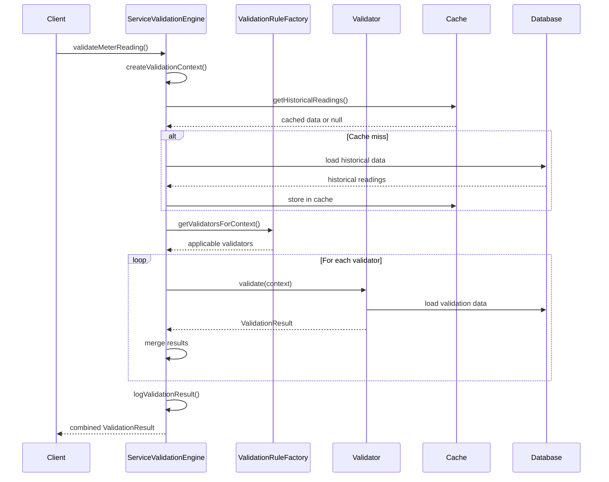
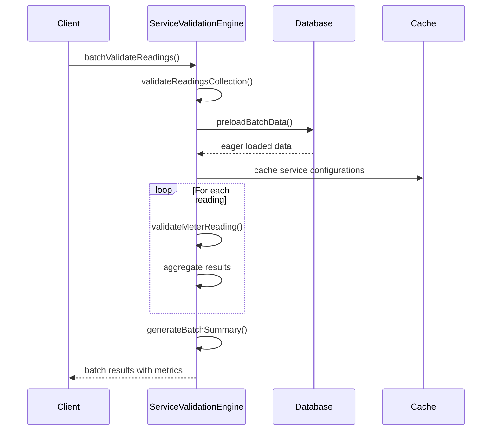
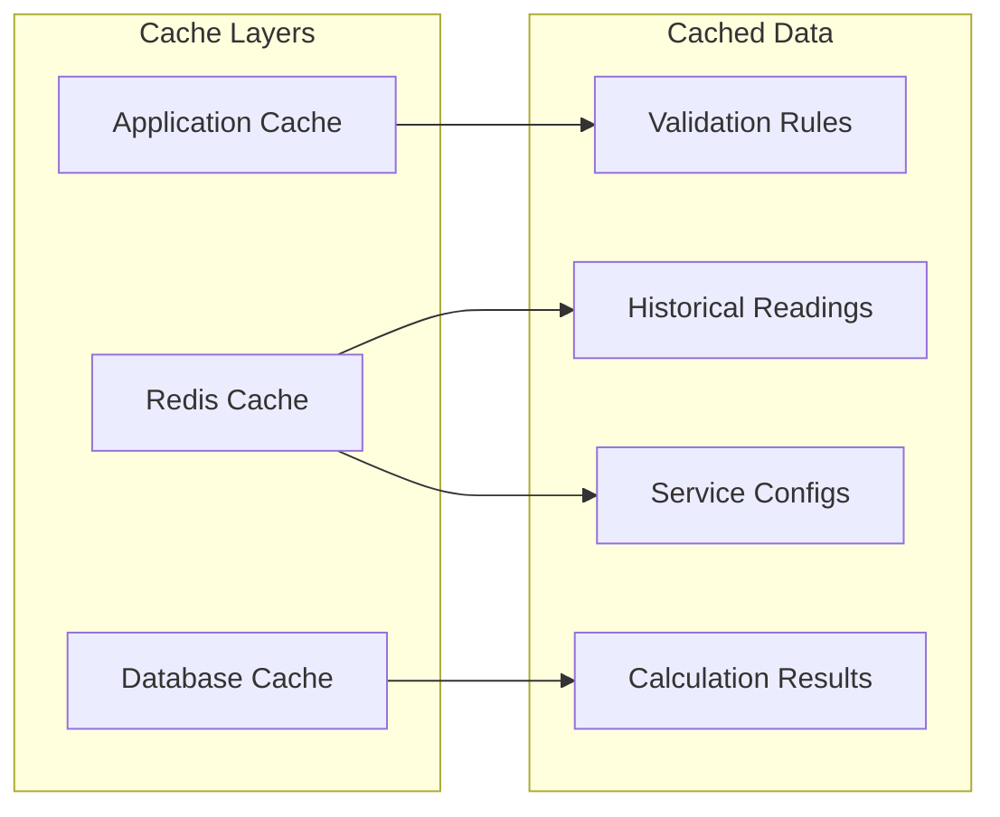
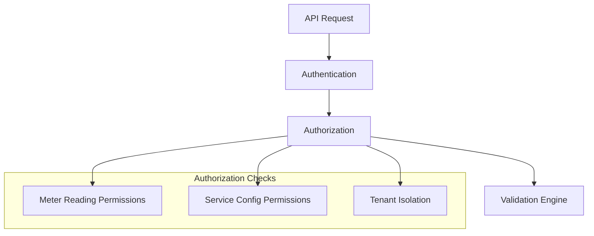
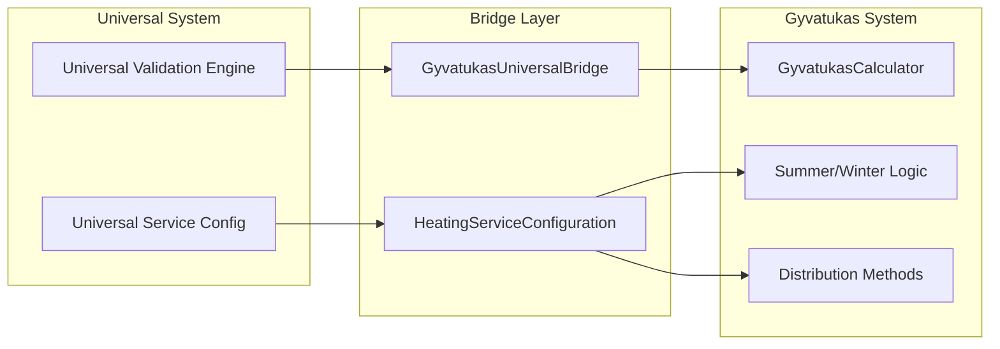

# Validation Architecture Documentation

## Overview

The Service Validation Architecture implements a modular, extensible validation system for utility services using modern design patterns. This architecture supports the Universal Utility Management System while maintaining full backward compatibility with the existing gyvatukas system.

## Architectural Principles

### 1. Single Responsibility Principle
Each validator has a single, well-defined responsibility:
- `ConsumptionValidator`: Validates consumption limits and patterns
- `SeasonalValidator`: Applies seasonal adjustments and patterns
- `DataQualityValidator`: Ensures data integrity and quality
- `BusinessRuleValidator`: Enforces business-specific constraints
- `InputMethodValidator`: Validates input method-specific rules
- `RateChangeValidator`: Validates rate change restrictions

### 2. Open/Closed Principle
The system is open for extension but closed for modification:
- New validators can be added without changing existing code
- Validation rules can be extended through configuration
- Custom validation logic can be injected via the factory pattern

### 3. Dependency Inversion Principle
High-level modules don't depend on low-level modules:
- `ServiceValidationEngine` depends on abstractions (`ValidatorInterface`)
- Concrete validators implement the interface contract
- Dependencies are injected through the container

## System Architecture



## Design Patterns Implementation

### 1. Strategy Pattern

The validation system uses the Strategy pattern to select appropriate validation strategies based on context.

```php
// Context determines which validators apply
$validators = $this->validatorFactory->getValidatorsForContext($context);

// Each validator implements the same interface
foreach ($validators as $validator) {
    $result = $validator->validate($context);
    $combinedResult = $combinedResult->merge($result);
}
```

**Benefits:**
- Runtime selection of validation algorithms
- Easy addition of new validation strategies
- Separation of validation logic from orchestration

### 2. Factory Pattern

The `ValidationRuleFactory` creates and manages validator instances.

```php
class ValidationRuleFactory
{
    public function getValidatorsForContext(ValidationContext $context): array
    {
        return array_filter(
            $this->validators,
            fn(ValidatorInterface $validator) => $validator->appliesTo($context)
        );
    }

    public function registerValidator(string $name, ValidatorInterface $validator): void
    {
        $this->validators[$name] = $validator;
    }
}
```

**Benefits:**
- Centralized validator creation and management
- Lazy loading of validators
- Easy registration of custom validators

### 3. Value Object Pattern

Immutable value objects ensure data integrity and thread safety.

```php
final readonly class ValidationContext
{
    public function __construct(
        public MeterReading $reading,
        public ?ServiceConfiguration $serviceConfiguration = null,
        public ?array $validationConfig = null,
        // ... other properties
    ) {}
}

final readonly class ValidationResult
{
    public function merge(ValidationResult $other): self
    {
        return new self(
            isValid: $this->isValid && $other->isValid,
            errors: array_merge($this->errors, $other->errors),
            // ... merge other properties
        );
    }
}
```

**Benefits:**
- Immutable data structures prevent accidental modification
- Thread-safe operations
- Clear data contracts between components

### 4. Chain of Responsibility Pattern

Validators can be chained to build complex validation workflows.

```php
interface ValidatorInterface
{
    public function validate(ValidationContext $context): ValidationResult;
    public function appliesTo(ValidationContext $context): bool;
    public function getName(): string;
}
```

**Benefits:**
- Flexible validation chains
- Conditional validator application
- Composable validation logic

## Component Interactions

### 1. Validation Flow



### 2. Batch Validation Flow



## Data Flow Architecture

### 1. Input Processing

```
Raw Input → Validation → Sanitization → Context Creation → Validation Execution
```

1. **Raw Input**: Meter readings, rate schedules, configuration data
2. **Validation**: Type checking, authorization, basic validation
3. **Sanitization**: Input cleaning, injection prevention
4. **Context Creation**: Immutable context object with all required data
5. **Validation Execution**: Strategy-based validation with result aggregation

### 2. Result Processing

```
Individual Results → Merging → Aggregation → Logging → Response Formation
```

1. **Individual Results**: Each validator returns a `ValidationResult`
2. **Merging**: Results are merged using immutable operations
3. **Aggregation**: Summary statistics and metadata calculation
4. **Logging**: Audit trail creation and performance metrics
5. **Response Formation**: Consistent API response structure

## Performance Architecture

### 1. Caching Strategy



**Cache TTL Strategy:**
- Validation Rules: 1 hour (frequently accessed, rarely changed)
- Historical Readings: 24 hours (stable data, expensive queries)
- Service Configurations: 30 minutes (moderate change frequency)
- Calculation Results: 15 minutes (dynamic data, expensive calculations)

### 2. Performance Optimizations

#### Database Optimization
```php
// Eager loading to prevent N+1 queries
$readings->load([
    'meter.serviceConfiguration.utilityService',
    'meter.serviceConfiguration.tariff', 
    'meter.serviceConfiguration.provider'
]);

// Selective column loading
$query->select(['id', 'value', 'reading_date', 'meter_id']);

// Batch operations
ServiceConfiguration::whereIn('id', $serviceConfigIds)->get();
```

#### Memory Optimization
```php
// Batch size limits
$maxBatchSize = $this->config->get('service_validation.performance.batch_validation_size', 100);

// Streaming for large datasets
$readings->chunk(50, function ($chunk) {
    // Process chunk
});

// Memoization for repeated calculations
private ?array $validationConfig = null;
```

### 3. Monitoring and Metrics

```php
$batchResult['performance_metrics'] = [
    'start_time' => microtime(true),
    'cache_hits' => 0,
    'database_queries' => 0,
    'memory_peak_mb' => memory_get_peak_usage(true) / 1024 / 1024,
    'duration' => $endTime - $startTime,
];
```

## Security Architecture

### 1. Authorization Layer



### 2. Input Sanitization

```php
private function sanitizeRateSchedule(array $rateSchedule): array
{
    $sanitized = [];
    $allowedKeys = [
        'rate_per_unit', 'monthly_rate', 'base_rate', 'default_rate',
        'effective_from', 'effective_until', 'time_slots', 'tiers'
    ];

    foreach ($rateSchedule as $key => $value) {
        if (!in_array($key, $allowedKeys, true)) {
            continue; // Whitelist approach
        }
        
        $sanitized[$key] = match ($key) {
            'rate_per_unit', 'monthly_rate' => is_numeric($value) ? (float) $value : null,
            'effective_from', 'effective_until' => filter_var($value, FILTER_SANITIZE_STRING),
            default => $this->sanitizeValue($value),
        };
    }

    return $sanitized;
}
```

### 3. Audit Trail

```php
private function logValidationResult(MeterReading $reading, array $validationResult): void
{
    $this->logger->info('Meter reading validation completed', [
        'reading_id' => $reading->id,
        'meter_id' => $reading->meter_id,
        'user_id' => auth()->id(),
        'tenant_id' => $reading->tenant_id,
        'is_valid' => $validationResult['is_valid'],
        'error_count' => count($validationResult['errors'] ?? []),
        'validation_timestamp' => now()->toISOString(),
    ]);
}
```

## Integration Architecture

### 1. Gyvatukas Integration



### 2. Multi-Tenant Architecture

```php
// Automatic tenant scoping
class ServiceValidationEngine
{
    public function validateMeterReading(MeterReading $reading): array
    {
        // Authorization check with tenant context
        if (auth()->check() && !auth()->user()->can('view', $reading)) {
            return ValidationResult::withError(__('validation.unauthorized_meter_reading'))->toArray();
        }
        
        // Tenant-scoped data loading
        $context = $this->createValidationContext($reading, $serviceConfig);
        // ... validation logic
    }
}
```

## Extension Points

### 1. Custom Validators

```php
class CustomBusinessRuleValidator implements ValidatorInterface
{
    public function validate(ValidationContext $context): ValidationResult
    {
        // Custom validation logic
        return ValidationResult::valid();
    }
    
    public function appliesTo(ValidationContext $context): bool
    {
        // Determine if this validator applies
        return $context->hasServiceConfiguration();
    }
    
    public function getName(): string
    {
        return 'custom_business_rules';
    }
}

// Registration
$factory->registerValidator('custom_business_rules', new CustomBusinessRuleValidator());
```

### 2. Custom Configuration

```php
// config/service_validation.php
'custom_validators' => [
    'my_validator' => [
        'class' => MyCustomValidator::class,
        'config' => [
            'threshold' => 0.5,
            'enabled' => true,
        ],
    ],
],
```

### 3. Event Hooks

```php
// Events for extension points
Event::listen('validation.before', function (ValidationContext $context) {
    // Pre-validation hooks
});

Event::listen('validation.after', function (ValidationResult $result) {
    // Post-validation hooks
});
```

## Testing Architecture

### 1. Property-Based Testing

```php
// Property: All valid readings should pass validation
Property::forAll(
    Generator::meterReading(),
    Generator::serviceConfiguration()
)->then(function ($reading, $config) {
    $result = $this->validator->validateMeterReading($reading, $config);
    return $result['is_valid'] === true;
});
```

### 2. Integration Testing

```php
class ValidationIntegrationTest extends TestCase
{
    public function test_validation_with_gyvatukas_integration()
    {
        // Test that universal validation produces same results as gyvatukas
        $gyvatukasResult = $this->gyvatukasCalculator->calculate($reading);
        $universalResult = $this->validationEngine->validateMeterReading($reading);
        
        $this->assertEquals($gyvatukasResult, $universalResult);
    }
}
```

### 3. Performance Testing

```php
class ValidationPerformanceTest extends TestCase
{
    public function test_batch_validation_performance()
    {
        $readings = MeterReading::factory()->count(100)->create();
        
        $startTime = microtime(true);
        $result = $this->validator->batchValidateReadings($readings);
        $duration = microtime(true) - $startTime;
        
        $this->assertLessThan(1.0, $duration); // Should complete in under 1 second
        $this->assertGreaterThan(0.8, $result['summary']['validation_rate']); // 80% success rate
    }
}
```

## Deployment Architecture

### 1. Environment Configuration

```yaml
# Production
SERVICE_VALIDATION_CACHE_TTL=3600
SERVICE_VALIDATION_BATCH_SIZE=100
SERVICE_VALIDATION_ALERTS=true

# Development
SERVICE_VALIDATION_CACHE_TTL=60
SERVICE_VALIDATION_BATCH_SIZE=10
SERVICE_VALIDATION_ALERTS=false
```

### 2. Scaling Considerations

- **Horizontal Scaling**: Stateless validation engine supports horizontal scaling
- **Cache Scaling**: Redis cluster for distributed caching
- **Database Scaling**: Read replicas for validation queries
- **Queue Scaling**: Background validation processing for large batches

### 3. Monitoring

```php
// Health check endpoint
Route::get('/validation/health', function () {
    return [
        'status' => 'healthy',
        'validators' => $factory->getValidatorNames(),
        'cache_status' => Cache::getStore()->getRedis()->ping(),
        'performance_metrics' => $metrics->getValidationMetrics(),
    ];
});
```

## Future Enhancements

### 1. Machine Learning Integration

```php
class MLAnomalyValidator implements ValidatorInterface
{
    public function validate(ValidationContext $context): ValidationResult
    {
        $prediction = $this->mlModel->predict($context->reading);
        
        if ($prediction['anomaly_score'] > $this->threshold) {
            return ValidationResult::withWarning('Potential anomaly detected');
        }
        
        return ValidationResult::valid();
    }
}
```

### 2. Real-time Validation

```php
// WebSocket integration for real-time validation
class RealtimeValidationService
{
    public function validateInRealtime(MeterReading $reading): void
    {
        $result = $this->validator->validateMeterReading($reading);
        
        broadcast(new ValidationResultEvent($result));
    }
}
```

### 3. Advanced Analytics

```php
class ValidationAnalyticsService
{
    public function getValidationTrends(): array
    {
        return [
            'success_rate_trend' => $this->calculateTrend('success_rate'),
            'error_pattern_analysis' => $this->analyzeErrorPatterns(),
            'performance_optimization_suggestions' => $this->getOptimizationSuggestions(),
        ];
    }
}
```