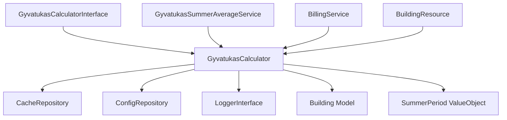
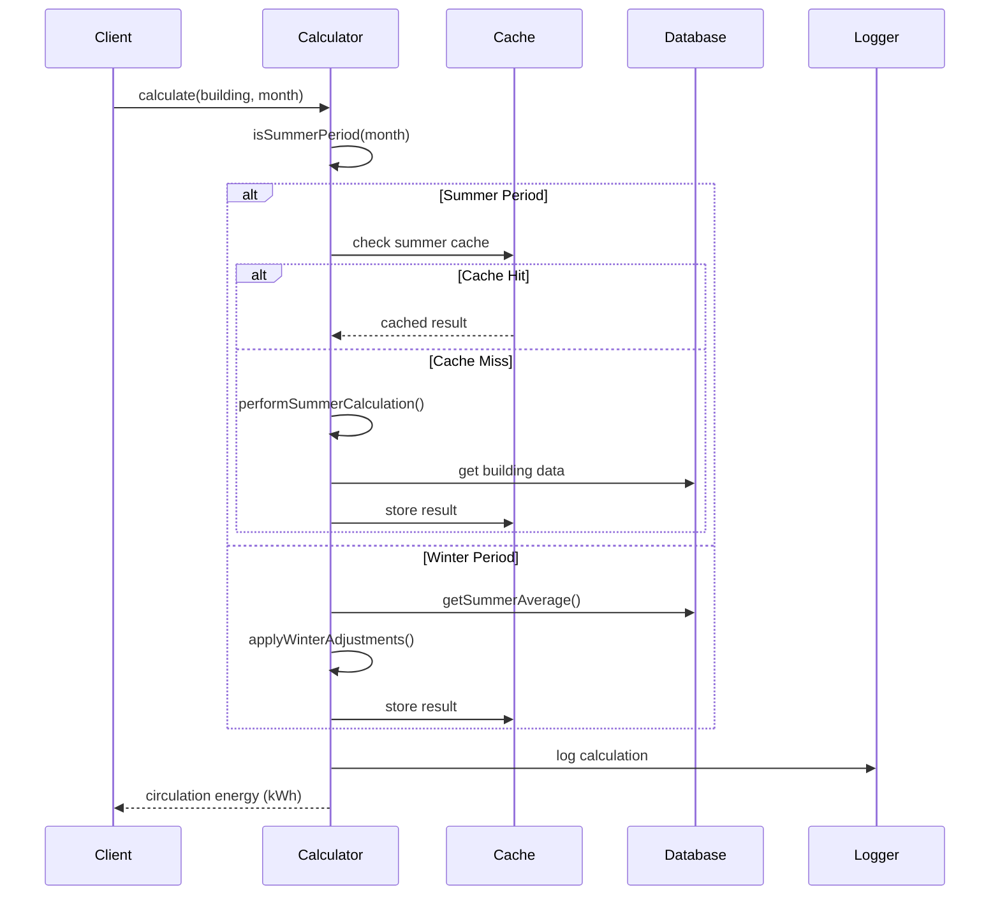
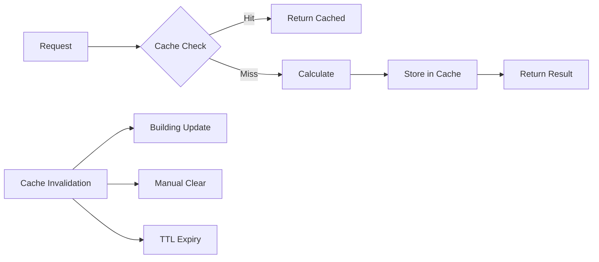

# Gyvatukas System Architecture

## Overview

The Gyvatukas system handles circulation energy calculations for Lithuanian utilities billing. It implements a sophisticated caching and calculation engine that adapts to seasonal variations in heating requirements.

## System Components

### Core Service Layer



### Data Flow Architecture



## Component Relationships

### Service Dependencies

#### GyvatukasCalculator
- **Primary Service**: Core calculation engine
- **Dependencies**: Cache, Config, Logger
- **Implements**: GyvatukasCalculatorInterface
- **Used By**: BillingService, GyvatukasSummerAverageService

#### GyvatukasSummerAverageService
- **Purpose**: Batch calculation of summer averages
- **Dependencies**: GyvatukasCalculator
- **Scope**: Administrative operations

### Model Integration

#### Building Model
```php
// Database columns used by gyvatukas system
- total_apartments: int (required for calculations)
- gyvatukas_summer_average: float (cached baseline)
- gyvatukas_last_calculated: timestamp (cache validity)
```

#### Property Model
```php
// Used for cost distribution
- building_id: foreign key
- area_sqm: float (for area-based distribution)
```

### Value Objects

#### SummerPeriod
- **Purpose**: Encapsulates summer period logic
- **Validation**: Year range validation
- **Configuration**: Configurable start/end months

## Configuration Architecture

### Hierarchical Configuration
```php
// Environment variables (highest priority)
GYVATUKAS_SUMMER_START_MONTH=5
GYVATUKAS_DEFAULT_RATE=15.0
GYVATUKAS_CACHE_TTL=86400

// Configuration file (config/gyvatukas.php)
'summer_months' => [5, 6, 7, 8, 9]
'peak_winter_adjustment' => 1.3

// Service constants (fallback)
private const DEFAULT_CIRCULATION_RATE = 15.0;
```

### Configuration Categories
1. **Seasonal Parameters**: Summer/winter periods and adjustments
2. **Calculation Parameters**: Base rates and thresholds
3. **Performance Settings**: Cache TTL and batch sizes
4. **Validation Rules**: Apartment limits and year ranges

## Caching Strategy

### Cache Architecture


### Cache Key Structure
```
gyvatukas:{type}:{building_id}:{period}

Examples:
- gyvatukas:summer:123:2024-06
- gyvatukas:winter:456:2024-12
```

### Cache Policies
- **TTL**: 24 hours (configurable)
- **Invalidation**: Building updates, manual clearing
- **Fallback**: Direct calculation on cache failure
- **Scope**: Building-specific to prevent cross-contamination

## Error Handling Architecture

### Exception Hierarchy
```php
InvalidArgumentException
├── Invalid apartment count (≤ 0)
├── Exceeds maximum apartments (> 1000)
└── Invalid year range

CacheException (handled gracefully)
├── Connection failures
├── Timeout errors
└── Storage errors
```

### Resilience Patterns

#### Graceful Degradation
```php
try {
    return $this->cache->remember($key, $ttl, $callback);
} catch (\Exception $e) {
    $this->logger->error('Cache failure, falling back', $context);
    return $callback(); // Direct calculation
}
```

#### Circuit Breaker Pattern
- Cache failures don't break the service
- Automatic fallback to direct calculation
- Error logging for monitoring

## Performance Architecture

### Optimization Strategies

#### Database Optimization
- Selective column loading in queries
- Eager loading of relationships
- Indexed columns for lookups
- Batch processing for bulk operations

#### Memory Management
- Readonly properties for immutability
- Minimal object creation
- Efficient array operations
- Chunk processing for large datasets

#### Calculation Optimization
- Pre-calculated summer averages
- Cached intermediate results
- Lazy evaluation of expensive operations

### Performance Metrics
- **Cache Hit Rate**: Target >90%
- **Calculation Time**: <100ms per building
- **Memory Usage**: <50MB for batch operations
- **Database Queries**: <5 per calculation

## Integration Patterns

### Service Integration

#### Dependency Injection
```php
// Service registration
$this->app->bind(
    GyvatukasCalculatorInterface::class,
    GyvatukasCalculator::class
);

// Usage in controllers
public function __construct(
    private readonly GyvatukasCalculatorInterface $calculator
) {}
```

#### Event-Driven Updates
```php
// Building model events
Building::updated(function ($building) {
    if ($building->wasChanged('total_apartments')) {
        app(GyvatukasCalculatorInterface::class)
            ->clearBuildingCache($building);
    }
});
```

### Filament Integration

#### Resource Integration
```php
// BuildingResource.php
TextInput::make('total_apartments')
    ->required()
    ->numeric()
    ->minValue(1)
    ->maxValue(1000)
    ->helperText(__('building.fields.total_apartments_help'));
```

#### Action Integration
```php
// Custom actions for recalculation
Action::make('recalculate_summer_average')
    ->action(function (Building $record) {
        $calculator = app(GyvatukasCalculatorInterface::class);
        $average = $calculator->calculateAndStoreSummerAverage($record);
        
        Notification::make()
            ->title("Summer average updated: {$average} kWh")
            ->success()
            ->send();
    });
```

## Security Considerations

### Data Protection
- No sensitive data in calculations
- Audit logging for administrative actions
- Tenant isolation in multi-tenant setup

### Input Validation
- Strict type checking on all inputs
- Range validation for apartment counts
- Date validation for calculation periods

### Access Control
- Service-level authorization checks
- Filament resource permissions
- API rate limiting (if exposed)

## Monitoring and Observability

### Logging Strategy
```php
// Structured logging with context
$this->logger->info('Summer average calculated', [
    'building_id' => $building->id,
    'summer_average' => $average,
    'month_count' => $monthCount,
    'period' => $summerPeriod->description(),
]);
```

### Metrics Collection
- Calculation performance metrics
- Cache hit/miss ratios
- Error rates and types
- Business metrics (average consumption)

### Health Checks
- Cache connectivity
- Database performance
- Configuration validation
- Service availability

## Scalability Considerations

### Horizontal Scaling
- Stateless service design
- Shared cache layer (Redis)
- Database read replicas
- Load balancer compatibility

### Vertical Scaling
- Memory-efficient algorithms
- CPU optimization for calculations
- I/O optimization for cache access
- Database query optimization

### Future Enhancements
- Microservice extraction potential
- API gateway integration
- Event sourcing for audit trails
- Machine learning for consumption prediction

## Testing Architecture

### Test Categories
1. **Unit Tests**: Service logic and calculations
2. **Integration Tests**: Database and cache interactions
3. **Performance Tests**: Load and stress testing
4. **Contract Tests**: Interface compliance

### Test Data Strategy
- Factory-generated test buildings
- Configurable test scenarios
- Isolated test environments
- Reproducible test data

## Deployment Considerations

### Environment Configuration
- Environment-specific settings
- Feature flags for new functionality
- Gradual rollout capabilities
- Rollback procedures

### Migration Strategy
- Database schema updates
- Configuration changes
- Cache warming procedures
- Data migration scripts

This architecture supports the Lithuanian utilities billing requirements while maintaining high performance, reliability, and maintainability.