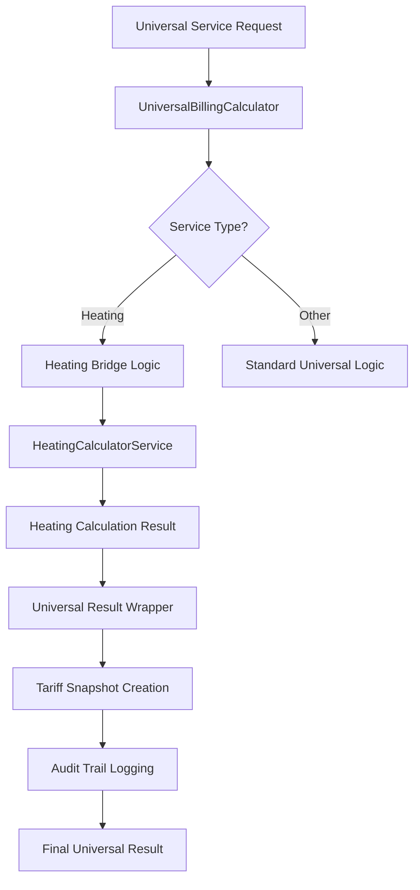

# Heating Integration Bridge Architecture

## Overview

The Heating Integration Bridge enables seamless integration between the existing heating calculator system and the new universal utility management framework. This bridge preserves all existing heating calculation logic while enabling universal service features.

## Architecture Components

### Core Services

#### HeatingCalculatorService (Existing)
- **Purpose**: Lithuanian heating system calculations
- **Features**: Seasonal adjustments, building factors, distribution methods
- **Preservation**: All existing logic maintained unchanged

#### UniversalBillingCalculator (New)
- **Purpose**: Universal utility billing across all service types
- **Integration**: Detects heating services and delegates to heating-specific logic
- **Enhancement**: Adds universal features (snapshots, audit trails, multi-tenancy)

#### ServiceConfiguration (Bridge)
- **Purpose**: Maps universal service definitions to heating calculator inputs
- **Configuration**: Rate schedules, seasonal factors, distribution methods
- **Compatibility**: Translates between universal and heating-specific formats

### Integration Flow



## Bridge Implementation

### Service Type Detection
```php
public function calculateBill(
    ServiceConfiguration $config,
    UniversalConsumptionData $consumption,
    BillingPeriod $period
): UniversalBillingResult {
    if ($config->utility_service->service_type === ServiceType::HEATING) {
        return $this->calculateHeatingBill($config, $consumption, $period);
    }
    
    return $this->calculateStandardBill($config, $consumption, $period);
}
```

### Configuration Translation
```php
private function translateToHeatingConfig(ServiceConfiguration $config): array
{
    return [
        'fixed_fee' => $config->rate_schedule['fixed_fee'] ?? 0,
        'unit_rate' => $config->rate_schedule['unit_rate'] ?? 0,
        'seasonal_adjustments' => $config->rate_schedule['seasonal_adjustments'] ?? [],
        'distribution_method' => $config->distribution_method,
    ];
}
```

### Result Wrapping
```php
private function wrapHeatingResult(
    array $heatingResult,
    ServiceConfiguration $config,
    BillingPeriod $period
): UniversalBillingResult {
    return new UniversalBillingResult([
        'total_amount' => $heatingResult['total_charge'],
        'fixed_amount' => $heatingResult['base_charge'] ?? 0,
        'consumption_amount' => $heatingResult['consumption_charge'] ?? 0,
        'tariff_snapshot' => $this->createTariffSnapshot($config, $period),
        'calculation_details' => $heatingResult,
    ]);
}
```

## Preserved Features

### Seasonal Adjustments
- **Winter Multiplier**: 1.5x base rate (Oct-Apr)
- **Summer Multiplier**: 0.3x base rate (May-Sep)
- **Transition Logic**: Smooth transitions between seasons
- **Building Factors**: Age-based efficiency adjustments

### Distribution Methods
- **Equal Distribution**: Cost split equally among properties
- **Area-Based**: Cost allocated by property square meters
- **Consumption-Based**: Cost allocated by actual usage
- **Custom Formulas**: Tenant-specific distribution rules

### Building Characteristics
- **Age Factors**: Older buildings have higher heating costs
- **Size Factors**: Larger buildings benefit from economies of scale
- **Efficiency Ratings**: Modern buildings have lower base costs
- **Insulation Factors**: Building envelope quality impacts

## Enhanced Features

### Universal Service Integration
- **Multi-Service Billing**: Heating combined with other utilities
- **Unified Invoicing**: Single invoice for all services
- **Cross-Service Analytics**: Consumption patterns across utilities
- **Tenant Portal**: Unified view of all utility costs

### Audit and Compliance
- **Tariff Snapshots**: Historical rate preservation for invoices
- **Calculation Audits**: Complete audit trail of all calculations
- **Change Tracking**: Monitor configuration changes over time
- **Compliance Reporting**: Regulatory compliance across all services

### Performance Optimizations
- **Caching**: Calculation results cached per tenant/period
- **Batch Processing**: Multiple properties processed efficiently
- **Query Optimization**: Reduced database queries through eager loading
- **Memory Management**: Efficient handling of large property portfolios

## Configuration Examples

### Basic Heating Service
```php
ServiceConfiguration::create([
    'utility_service_id' => $heatingService->id,
    'property_id' => $property->id,
    'pricing_model' => PricingModel::HYBRID,
    'rate_schedule' => [
        'fixed_fee' => 125.0,  // €125/month base
        'unit_rate' => 0.08,   // €0.08/kWh
        'seasonal_adjustments' => [
            'summer_multiplier' => 0.3,
            'winter_multiplier' => 1.5,
        ],
    ],
    'distribution_method' => DistributionMethod::AREA,
]);
```

### Shared Heating Service
```php
ServiceConfiguration::create([
    'utility_service_id' => $sharedHeatingService->id,
    'pricing_model' => PricingModel::FIXED_MONTHLY,
    'rate_schedule' => [
        'monthly_rate' => 2000.0,  // €2000/month total
    ],
    'distribution_method' => DistributionMethod::AREA,
    'is_shared_service' => true,
]);
```

## Testing Strategy

### Property-Based Testing
The bridge is validated through comprehensive property-based tests that ensure:

1. **Calculation Accuracy**: Universal results match existing calculator exactly
2. **Seasonal Preservation**: Winter/summer adjustments maintained
3. **Building Factors**: Age/size/efficiency factors preserved
4. **Distribution Accuracy**: Shared cost allocation matches
5. **Consistency**: Deterministic behavior across periods
6. **Snapshot Integrity**: Tariff snapshots created correctly

### Test Coverage
- **50 iterations**: Core calculation accuracy
- **30 iterations**: Seasonal adjustment validation
- **25 iterations**: Building factor preservation
- **20 iterations**: Distribution method accuracy
- **15 iterations**: Calculation consistency
- **10 iterations**: Tariff snapshot validation

## Migration Strategy

### Phase 1: Bridge Implementation
- ✅ Create ServiceConfiguration bridge model
- ✅ Implement UniversalBillingCalculator with heating detection
- ✅ Add result wrapping and snapshot creation
- ✅ Comprehensive property-based testing

### Phase 2: Gradual Rollout
- 🔄 Enable universal services for new tenants
- 🔄 Migrate existing tenants incrementally
- 🔄 Monitor calculation accuracy during migration
- 🔄 Maintain dual-system support during transition

### Phase 3: Full Integration
- ⏳ Complete tenant migration
- ⏳ Deprecate direct heating calculator usage
- ⏳ Optimize universal system performance
- ⏳ Remove legacy integration code

## Monitoring and Maintenance

### Key Metrics
- **Calculation Accuracy**: 100% match rate with existing calculator
- **Performance**: <100ms average calculation time
- **Error Rate**: <0.1% calculation failures
- **Migration Progress**: Tenant adoption rate

### Alerts and Monitoring
- **Calculation Mismatches**: Alert on any discrepancies
- **Performance Degradation**: Monitor calculation times
- **Error Spikes**: Track and investigate failures
- **Migration Issues**: Monitor tenant migration success

## Related Documentation
- [Universal Utility Management System](./universal-utility-management.md)
- [Property-Based Testing Guide](../testing/property-based-testing-guide.md)
- [Heating Calculator Service](../services/heating-calculator-service.md)
- [Service Configuration Model](../models/service-configuration.md)