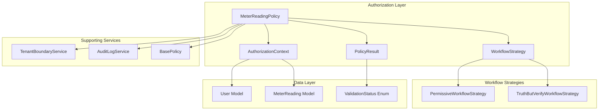
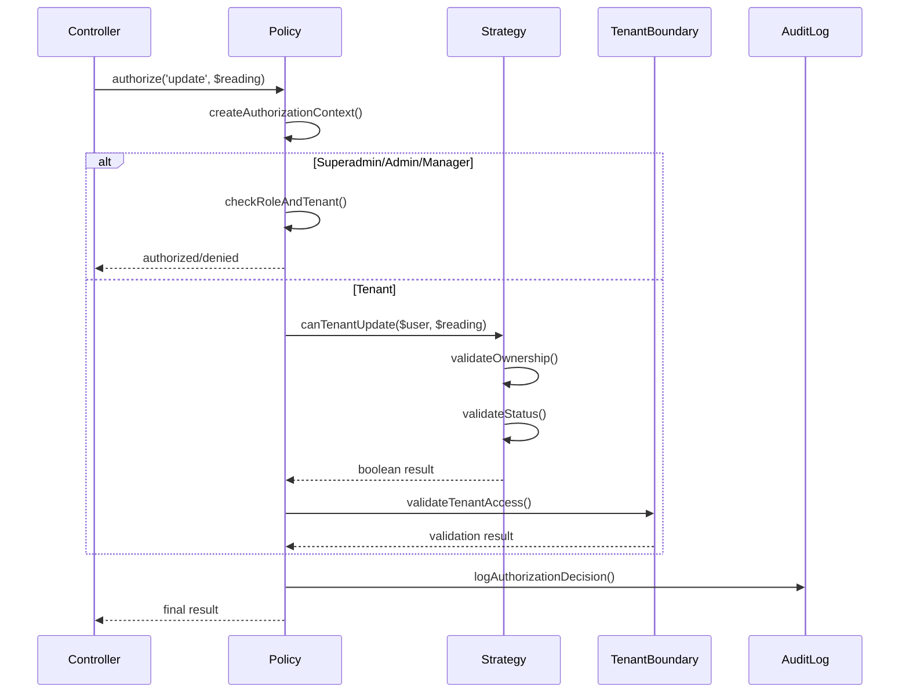

# Meter Reading Authorization Architecture

## Overview

The meter reading authorization system implements a sophisticated multi-layered approach that balances security with operational efficiency. It uses configurable workflow strategies to adapt authorization rules based on business requirements while maintaining strict tenant isolation.

## Architecture Components



## Core Components

### 1. MeterReadingPolicy

**Role**: Central authorization orchestrator
**Responsibilities**:
- Coordinate authorization decisions across all operations
- Integrate workflow strategies for tenant permissions
- Enforce tenant boundary validation
- Generate structured authorization results
- Log authorization decisions for audit compliance

**Key Design Patterns**:
- **Strategy Pattern**: Delegates tenant authorization to configurable workflow strategies
- **Value Object Pattern**: Uses `PolicyResult` and `AuthorizationContext` for structured data
- **Template Method Pattern**: Defines authorization flow with customizable steps

```php
// Authorization flow template
public function update(User $user, MeterReading $meterReading): bool
{
    $context = AuthorizationContext::forResource(/* ... */);
    $result = $this->authorizeUpdateAccess($user, $meterReading);
    
    if ($result->isAuthorized()) {
        $this->logAuthorizationSuccess($context, $result);
    }
    
    return $result->toBool();
}
```

### 2. Workflow Strategy System

**Role**: Configurable business rule engine
**Purpose**: Adapt authorization rules based on operational requirements

#### Strategy Interface

```php
interface WorkflowStrategyInterface
{
    public function canTenantUpdate(User $tenant, MeterReading $meterReading): bool;
    public function canTenantDelete(User $tenant, MeterReading $meterReading): bool;
    public function canTenantApprove(User $tenant, MeterReading $meterReading): bool;
    public function canTenantReject(User $tenant, MeterReading $meterReading): bool;
    public function getWorkflowName(): string;
    public function getWorkflowDescription(): string;
}
```

#### Permissive Workflow Strategy

**Business Logic**:
- Enables tenant self-service for operational efficiency
- Allows tenants to edit/delete their own pending readings
- Maintains security through ownership and status validation
- Reduces support tickets and admin intervention

**Implementation**:
```php
public function canTenantUpdate(User $tenant, MeterReading $meterReading): bool
{
    return $this->isTenantOwner($tenant, $meterReading) 
        && $this->isPendingStatus($meterReading);
}
```

**Security Safeguards**:
- Ownership validation: `$tenant->id === $meterReading->entered_by`
- Status validation: `$meterReading->validation_status === ValidationStatus::PENDING`
- Tenant scope enforcement through `TenantBoundaryService`

#### Truth-but-Verify Workflow Strategy

**Business Logic**:
- Prioritizes security over operational efficiency
- Prevents tenant modifications once readings are submitted
- Requires manager intervention for all changes
- Suitable for high-security or regulatory environments

**Implementation**:
```php
public function canTenantUpdate(User $tenant, MeterReading $meterReading): bool
{
    return false; // Tenants cannot modify readings once submitted
}
```

### 3. Value Objects

#### AuthorizationContext

**Purpose**: Encapsulate authorization request context
**Benefits**:
- Type safety for authorization parameters
- Consistent audit logging format
- Reduced parameter passing complexity

```php
final readonly class AuthorizationContext
{
    public function __construct(
        public User $user,
        public string $operation,
        public ?string $resourceType = null,
        public ?int $resourceId = null,
        public array $additionalData = []
    ) {}
}
```

#### PolicyResult

**Purpose**: Structured authorization response
**Benefits**:
- Detailed authorization reasoning
- Audit-friendly context data
- Backward compatibility with boolean results

```php
final readonly class PolicyResult
{
    public function __construct(
        public bool $authorized,
        public ?string $reason = null,
        public array $context = []
    ) {}
}
```

### 4. Tenant Boundary Service

**Role**: Cross-tenant access prevention
**Responsibilities**:
- Validate tenant ownership of resources
- Enforce property-level access for tenants
- Prevent data leakage between tenants

**Integration Points**:
- Called by policy for tenant-specific validations
- Used in repository queries for automatic scoping
- Integrated with Filament resources for UI filtering

## Authorization Flow

### 1. Request Authorization



### 2. Workflow Strategy Selection

The policy uses dependency injection to receive workflow strategies:

```php
public function __construct(
    private readonly TenantBoundaryService $tenantBoundaryService,
    ?WorkflowStrategyInterface $workflowStrategy = null
) {
    // Default to Permissive workflow if none provided
    $this->workflowStrategy = $workflowStrategy ?? new PermissiveWorkflowStrategy();
}
```

**Configuration Options**:

1. **Service Provider Binding**:
```php
// In AppServiceProvider
$this->app->when(MeterReadingPolicy::class)
    ->needs(WorkflowStrategyInterface::class)
    ->give(PermissiveWorkflowStrategy::class);
```

2. **Environment-Based Selection**:
```php
$strategy = config('meter_reading.workflow') === 'strict' 
    ? new TruthButVerifyWorkflowStrategy()
    : new PermissiveWorkflowStrategy();
```

3. **Tenant-Specific Configuration**:
```php
$strategy = $tenant->workflow_preference === 'strict'
    ? new TruthButVerifyWorkflowStrategy()
    : new PermissiveWorkflowStrategy();
```

## Security Architecture

### 1. Defense in Depth

**Layer 1: Route Middleware**
- Authentication verification
- Basic role validation
- Rate limiting

**Layer 2: Controller Authorization**
- Policy-based authorization
- Resource-specific checks
- Bulk operation validation

**Layer 3: Policy Logic**
- Workflow strategy integration
- Tenant boundary enforcement
- Status-based validation

**Layer 4: Model Scopes**
- Automatic tenant filtering
- Global scope application
- Query-level protection

### 2. Tenant Isolation

**Horizontal Isolation**:
- Tenant ID validation on all operations
- Automatic query scoping via global scopes
- Cross-tenant access prevention

**Vertical Isolation**:
- Role-based access control
- Hierarchical permission inheritance
- Operation-specific restrictions

### 3. Audit Trail

**Authorization Logging**:
```php
private function logAuthorizationSuccess(
    AuthorizationContext $context, 
    PolicyResult $result
): void {
    $this->logSensitiveOperation(
        $context->operation, 
        $context->user, 
        null, 
        array_merge($context->additionalData, $result->context)
    );
}
```

**Audit Data Structure**:
- User identification and role
- Resource type and ID
- Operation attempted
- Authorization result and reason
- Workflow context
- Timestamp and session data

## Performance Considerations

### 1. Caching Strategy

**Policy Result Caching**:
- Cache authorization decisions for repeated checks
- Invalidate on user role changes
- Tenant-scoped cache keys

**Workflow Strategy Caching**:
- Cache workflow instances per request
- Avoid repeated strategy instantiation
- Memory-efficient strategy reuse

### 2. Query Optimization

**Eager Loading**:
```php
// In policy methods
$meterReading->load(['meter', 'property', 'enteredBy']);
```

**Selective Queries**:
```php
// Only load necessary fields for authorization
$reading = MeterReading::select(['id', 'entered_by', 'validation_status', 'tenant_id'])
    ->find($id);
```

### 3. Database Indexes

**Required Indexes**:
- `meter_readings(tenant_id, validation_status)`
- `meter_readings(entered_by, validation_status)`
- `meter_readings(tenant_id, entered_by)`

## Integration Patterns

### 1. Filament Resource Integration

```php
class MeterReadingResource extends Resource
{
    public static function canEdit(Model $record): bool
    {
        return auth()->user()->can('update', $record);
    }
    
    public static function table(Table $table): Table
    {
        return $table->actions([
            EditAction::make()
                ->visible(fn ($record) => auth()->user()->can('update', $record)),
        ]);
    }
}
```

### 2. API Controller Integration

```php
class MeterReadingController extends Controller
{
    public function update(UpdateMeterReadingRequest $request, MeterReading $meterReading)
    {
        $this->authorize('update', $meterReading);
        
        // Business logic here
    }
}
```

### 3. Livewire Component Integration

```php
class MeterReadingForm extends Component
{
    public function mount(MeterReading $meterReading)
    {
        $this->authorize('update', $meterReading);
    }
    
    public function save()
    {
        $this->authorize('update', $this->meterReading);
        // Save logic
    }
}
```

## Error Handling Architecture

### 1. Authorization Exceptions

**Standard Laravel Exceptions**:
- `AuthorizationException` for policy failures
- `ModelNotFoundException` for invalid resources
- `ValidationException` for invalid input

**Custom Exception Handling**:
```php
// In Handler.php
public function render($request, Throwable $exception)
{
    if ($exception instanceof AuthorizationException) {
        return $this->handleAuthorizationException($request, $exception);
    }
    
    return parent::render($request, $exception);
}

private function handleAuthorizationException($request, AuthorizationException $exception)
{
    if ($request->expectsJson()) {
        return response()->json([
            'message' => 'This action is unauthorized.',
            'errors' => [
                'authorization' => [$this->getWorkflowSpecificMessage($exception)],
            ],
        ], 403);
    }
    
    return redirect()->back()->withErrors([
        'authorization' => $this->getWorkflowSpecificMessage($exception),
    ]);
}
```

### 2. Graceful Degradation

**UI Adaptation**:
- Hide unauthorized actions instead of showing errors
- Provide alternative workflows for restricted users
- Clear messaging about permission requirements

**API Responses**:
- Consistent error format across endpoints
- Workflow-specific error messages
- Actionable guidance for users

## Testing Architecture

### 1. Unit Testing Strategy

**Policy Testing**:
```php
// Test each authorization method with all role combinations
public function test_authorization_matrix()
{
    $roles = [UserRole::SUPERADMIN, UserRole::ADMIN, UserRole::MANAGER, UserRole::TENANT];
    $operations = ['view', 'create', 'update', 'delete', 'approve'];
    
    foreach ($roles as $role) {
        foreach ($operations as $operation) {
            $this->assertAuthorizationBehavior($role, $operation);
        }
    }
}
```

**Workflow Strategy Testing**:
```php
// Test workflow-specific behavior
public function test_permissive_workflow_allows_tenant_self_service()
{
    $strategy = new PermissiveWorkflowStrategy();
    $tenant = User::factory()->tenant()->create();
    $reading = MeterReading::factory()->pending()->create(['entered_by' => $tenant->id]);
    
    $this->assertTrue($strategy->canTenantUpdate($tenant, $reading));
}
```

### 2. Integration Testing

**Controller Integration**:
```php
public function test_tenant_can_update_own_pending_reading()
{
    $tenant = User::factory()->tenant()->create();
    $reading = MeterReading::factory()->create([
        'entered_by' => $tenant->id,
        'validation_status' => ValidationStatus::PENDING,
    ]);
    
    $this->actingAs($tenant)
        ->putJson("/api/meter-readings/{$reading->id}", ['value' => 1000])
        ->assertOk();
}
```

**Filament Testing**:
```php
public function test_filament_respects_authorization()
{
    $tenant = User::factory()->tenant()->create();
    $reading = MeterReading::factory()->validated()->create(['entered_by' => $tenant->id]);
    
    livewire(EditMeterReading::class, ['record' => $reading->id])
        ->assertForbidden();
}
```

### 3. Property-Based Testing

**Authorization Invariants**:
```php
public function test_tenant_isolation_property()
{
    $this->forAll(
        Generator::tenantPair(),
        Generator::meterReading()
    )->then(function ($tenant1, $tenant2, $reading) {
        // Tenant 1 creates reading
        $reading->update(['entered_by' => $tenant1->id]);
        
        // Tenant 2 cannot access it
        $this->assertFalse(
            (new MeterReadingPolicy($this->tenantBoundaryService))
                ->view($tenant2, $reading)
        );
    });
}
```

## Monitoring and Observability

### 1. Authorization Metrics

**Key Metrics**:
- Authorization success/failure rates by role
- Workflow strategy usage patterns
- Cross-tenant access attempts
- Policy performance metrics

**Monitoring Implementation**:
```php
// In policy methods
Metrics::increment('meter_reading.authorization.attempts', [
    'operation' => $operation,
    'role' => $user->role->value,
    'workflow' => $this->workflowStrategy->getWorkflowName(),
    'result' => $result->authorized ? 'success' : 'failure',
]);
```

### 2. Audit Dashboard

**Authorization Analytics**:
- Failed authorization attempts by user/role
- Workflow effectiveness metrics
- Tenant boundary violation attempts
- Performance bottlenecks in authorization

### 3. Alerting

**Security Alerts**:
- Repeated authorization failures
- Cross-tenant access attempts
- Unusual authorization patterns
- Policy configuration changes

## Future Enhancements

### 1. Dynamic Workflow Configuration

**Tenant-Specific Workflows**:
- Allow tenants to choose their preferred workflow
- Admin override capabilities
- Workflow transition management

### 2. Advanced Authorization Rules

**Time-Based Restrictions**:
- Business hours limitations
- Seasonal workflow changes
- Temporary permission grants

**Context-Aware Authorization**:
- Location-based restrictions
- Device-based permissions
- IP-based access control

### 3. Machine Learning Integration

**Anomaly Detection**:
- Unusual authorization patterns
- Potential security threats
- Workflow optimization suggestions

**Predictive Authorization**:
- Pre-compute authorization decisions
- Cache likely authorization requests
- Optimize policy performance

## Related Documentation

- [Multi-Tenant Data Management Design](../../.kiro/specs/multi-tenant-data-management/design.md)
- [Workflow Strategies Implementation](../services/workflow-strategies.md)
- [Tenant Boundary Service Architecture](../services/tenant-boundary-service.md)
- [Authorization Testing Guide](../testing/authorization-testing.md)
- [Security Architecture Overview](security-architecture.md)