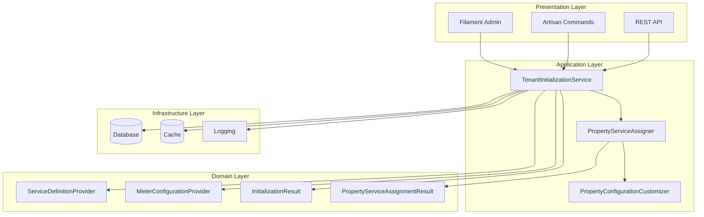
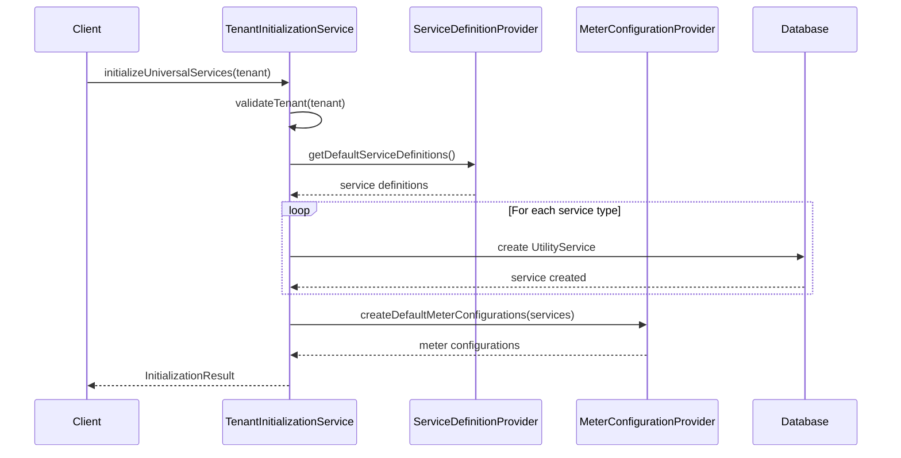
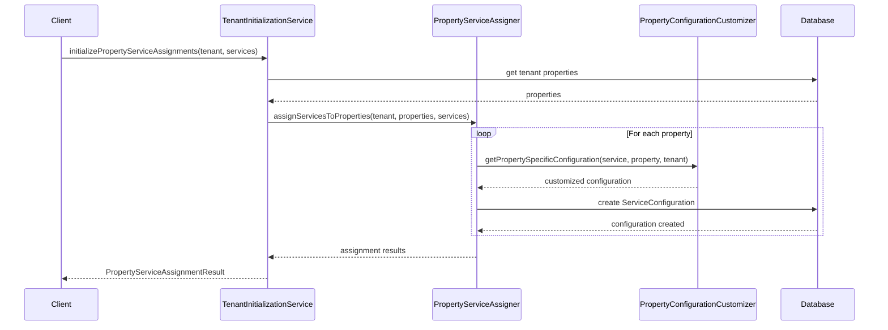

# Tenant Initialization Architecture

## Overview

The Tenant Initialization Architecture provides a comprehensive framework for setting up new tenants with default utility service configurations, property-level assignments, and meter configurations. This architecture ensures consistent, scalable, and maintainable tenant onboarding while supporting regional customization and property-specific requirements.

## Architectural Principles

### 1. Separation of Concerns
- **Service Definition**: Centralized utility service templates
- **Configuration Customization**: Property and regional-specific adjustments
- **Assignment Logic**: Property-service relationship management
- **Validation**: Data integrity and business rule enforcement

### 2. Extensibility
- Pluggable service definitions
- Configurable regional defaults
- Customizable property type handlers
- Extensible validation rules

### 3. Consistency
- Standardized service configurations
- Uniform property assignment patterns
- Consistent validation across service types
- Predictable error handling

### 4. Performance
- Batch processing for multiple properties
- Caching for repeated operations
- Transaction-based consistency
- Efficient database queries

## System Architecture



## Core Components

### 1. TenantInitializationService

**Responsibility**: Orchestrates the entire tenant initialization process

**Key Methods**:
- `initializeUniversalServices()`: Creates default utility services
- `initializePropertyServiceAssignments()`: Assigns services to properties
- `initializeDefaultMeterConfigurations()`: Sets up meter configurations
- `ensureHeatingCompatibility()`: Validates heating system compatibility

**Dependencies**:
- ServiceDefinitionProvider
- MeterConfigurationProvider
- PropertyServiceAssigner

### 2. ServiceDefinitionProvider

**Responsibility**: Provides standardized service definitions

**Service Types**:
- **Electricity**: Time-of-use pricing, zone support
- **Water**: Consumption-based billing
- **Heating**: Hybrid pricing, seasonal adjustments
- **Gas**: Tiered rate structures

**Configuration Schema**:
```php
[
    'name' => 'Service Name',
    'unit_of_measurement' => 'kWh|m³',
    'default_pricing_model' => PricingModel::ENUM,
    'calculation_formula' => [...],
    'configuration_schema' => [...],
    'validation_rules' => [...],
    'business_logic_config' => [...],
]
```

### 3. PropertyServiceAssigner

**Responsibility**: Manages property-service assignments

**Process Flow**:
1. Iterate through tenant properties
2. Apply property-specific customizations
3. Create ServiceConfiguration records
4. Log assignment results

**Transaction Safety**: All assignments wrapped in database transactions

### 4. PropertyConfigurationCustomizer

**Responsibility**: Customizes configurations based on property characteristics

**Customization Types**:
- **Property Type**: Commercial vs. residential adjustments
- **Property Size**: Enhanced monitoring for large properties
- **Regional Settings**: Locale-based rate structures
- **Provider Assignment**: Automatic provider selection

## Data Flow

### 1. Service Initialization Flow



### 2. Property Assignment Flow



## Configuration Customization

### Property Type Matrix

| Property Type | Electricity | Water | Heating | Gas |
|---------------|-------------|-------|---------|-----|
| **Residential** | Standard rates | Basic billing | Shared/individual | Standard tiers |
| **Commercial** | Demand charges | Sewer charges | Higher base fees | Commercial rates |
| **Apartment** | Standard rates | Basic billing | Shared services | Standard tiers |
| **Office** | Peak hour rates | Commercial rates | Individual | Commercial tiers |

### Regional Configuration

#### Lithuanian Settings
```php
[
    'electricity' => [
        'day_rate' => 0.1547,    // EUR/kWh
        'night_rate' => 0.1047,  // EUR/kWh
        'network_fee' => 0.0234,
        'vat_rate' => 0.21,
    ],
    'water' => [
        'unit_rate' => 1.89,     // EUR/m³
        'wastewater_rate' => 1.45,
        'connection_fee' => 3.50,
    ],
    'heating' => [
        'base_fee' => 12.50,
        'unit_rate' => 0.0687,   // EUR/kWh
        'winter_factor' => 1.3,
        'summer_factor' => 0.6,
        'heating_season' => ['october', 'april'],
    ],
]
```

#### EU Default Settings
```php
[
    'regulatory_region' => 'EU',
    'currency' => 'EUR',
    'vat_rate' => 0.20,
    'compliance_standards' => ['EU_ENERGY_DIRECTIVE'],
]
```

## Validation Framework

### Tenant Validation
- Tenant must be persisted to database
- Tenant name is required
- Tenant ID must be present
- Tenant must be active

### Service Validation
- Service definitions must be complete
- Pricing models must be valid
- Configuration schemas must be valid JSON
- Business logic configurations must be consistent

### Property Validation
- Properties must belong to the tenant
- Property types must be recognized
- Area measurements must be positive
- Building relationships must be valid

## Error Handling Strategy

### Exception Hierarchy

```php
TenantInitializationException
├── ServiceCreationFailedException
├── PropertyAssignmentFailedException
├── InvalidTenantDataException
└── HeatingCompatibilityFailedException
```

### Error Context

Each exception includes:
- Tenant information
- Operation context
- Specific error details
- Suggested resolution steps

### Recovery Mechanisms

1. **Transaction Rollback**: Automatic rollback on failure
2. **Partial Recovery**: Continue with successful operations
3. **Retry Logic**: Configurable retry for transient failures
4. **Fallback Options**: Default configurations when customization fails

## Performance Optimization

### Caching Strategy

1. **Service Definitions**: Cache for 1 hour
2. **Provider Lookups**: Cache for 30 minutes
3. **Regional Settings**: Cache for 24 hours
4. **Slug Generation**: Cache for 1 hour

### Database Optimization

1. **Batch Operations**: Process multiple properties together
2. **Eager Loading**: Load related models efficiently
3. **Selective Queries**: Only fetch required columns
4. **Index Usage**: Optimize for tenant_id and service_type queries

### Memory Management

1. **Streaming Processing**: Handle large property sets
2. **Lazy Loading**: Load configurations on demand
3. **Collection Efficiency**: Use Laravel collections optimally
4. **Garbage Collection**: Clean up temporary objects

## Security Considerations

### Tenant Isolation

1. **Scope Validation**: All operations scoped to tenant
2. **Access Control**: Verify tenant ownership
3. **Data Segregation**: Prevent cross-tenant data access
4. **Audit Logging**: Track all initialization operations

### Configuration Security

1. **Input Validation**: Sanitize all configuration inputs
2. **Schema Validation**: Validate against defined schemas
3. **Rate Limiting**: Prevent abuse of initialization endpoints
4. **Encryption**: Encrypt sensitive configuration data

## Monitoring and Observability

### Metrics Collection

1. **Initialization Success Rate**: Track successful vs. failed initializations
2. **Performance Metrics**: Monitor initialization duration
3. **Resource Usage**: Track memory and CPU usage
4. **Error Rates**: Monitor exception frequencies

### Logging Strategy

1. **Operation Logging**: Log all major operations
2. **Error Logging**: Detailed error information
3. **Performance Logging**: Track slow operations
4. **Audit Logging**: Security-relevant events

### Health Checks

1. **Service Health**: Verify service availability
2. **Database Health**: Check database connectivity
3. **Cache Health**: Verify cache functionality
4. **Provider Health**: Check external provider connectivity

## Testing Strategy

### Unit Testing

1. **Service Logic**: Test individual service methods
2. **Configuration Logic**: Test customization rules
3. **Validation Logic**: Test all validation scenarios
4. **Error Handling**: Test exception scenarios

### Integration Testing

1. **End-to-End Flows**: Test complete initialization process
2. **Database Integration**: Test data persistence
3. **Cache Integration**: Test caching behavior
4. **External Integration**: Test provider interactions

### Performance Testing

1. **Load Testing**: Test with multiple concurrent initializations
2. **Stress Testing**: Test system limits
3. **Memory Testing**: Test memory usage patterns
4. **Database Testing**: Test query performance

## Deployment Considerations

### Environment Configuration

1. **Development**: Full logging, test data
2. **Staging**: Production-like configuration
3. **Production**: Optimized performance, minimal logging

### Migration Strategy

1. **Backward Compatibility**: Support existing tenants
2. **Gradual Rollout**: Phase deployment across tenants
3. **Rollback Plan**: Quick rollback capability
4. **Data Migration**: Migrate existing configurations

### Scaling Considerations

1. **Horizontal Scaling**: Support multiple application instances
2. **Database Scaling**: Optimize for high tenant counts
3. **Cache Scaling**: Distribute cache across nodes
4. **Queue Processing**: Handle background initialization

## Future Enhancements

### Planned Features

1. **Custom Service Types**: Support for additional utility types
2. **Advanced Regional Settings**: More granular regional customization
3. **Bulk Operations**: Batch initialization for multiple tenants
4. **Configuration Templates**: Reusable configuration templates

### Extension Points

1. **Custom Property Handlers**: Pluggable property type handlers
2. **Regional Providers**: Additional regional configuration providers
3. **Validation Plugins**: Custom validation rule plugins
4. **Integration Hooks**: Webhooks for external system integration

## Related Documentation

- [Tenant Initialization Service Documentation](../services/tenant-initialization-service.md)
- [Tenant Initialization API Documentation](../api/tenant-initialization-api.md)
- [Universal Utility Management Specification](../../.kiro/specs/universal-utility-management/)
- [Multi-Tenant Architecture Guide](multi-tenancy.md)
- [Service Configuration Guide](../services/service-configuration.md)