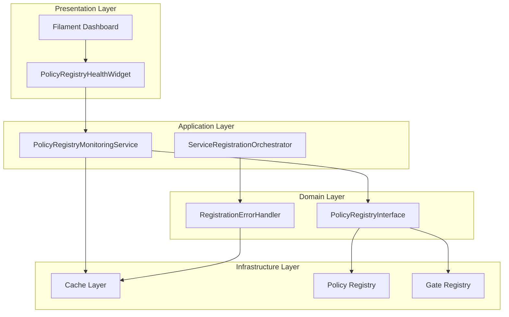
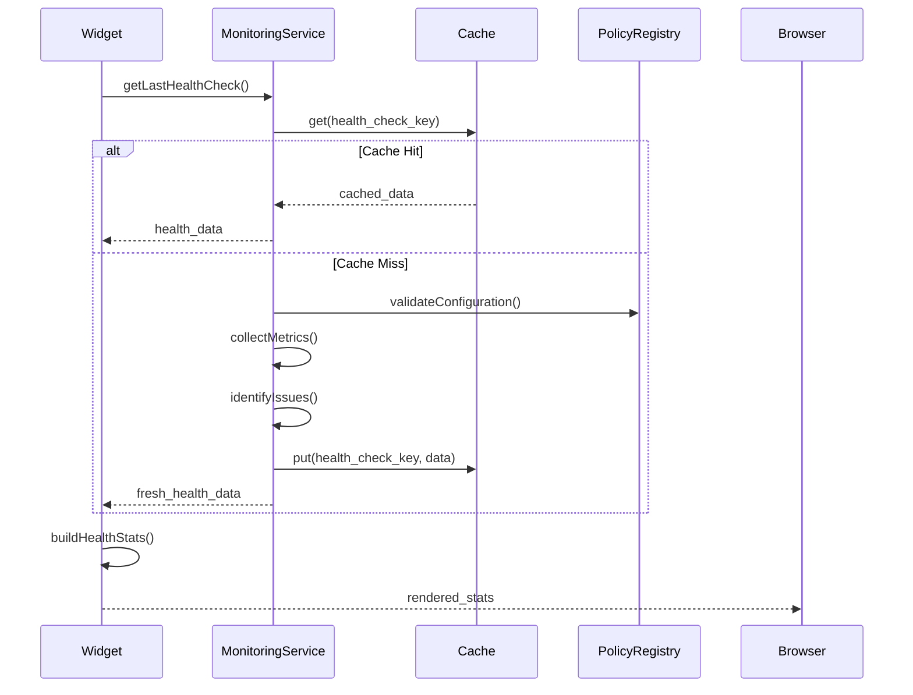
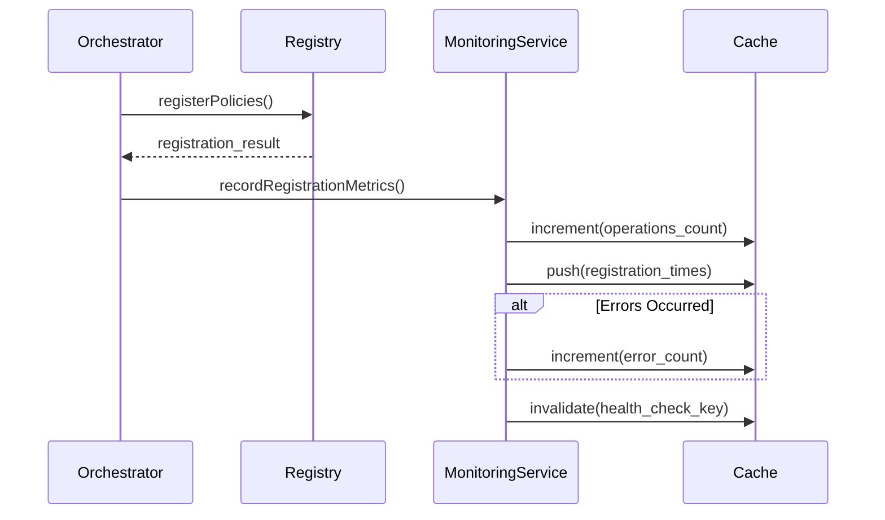
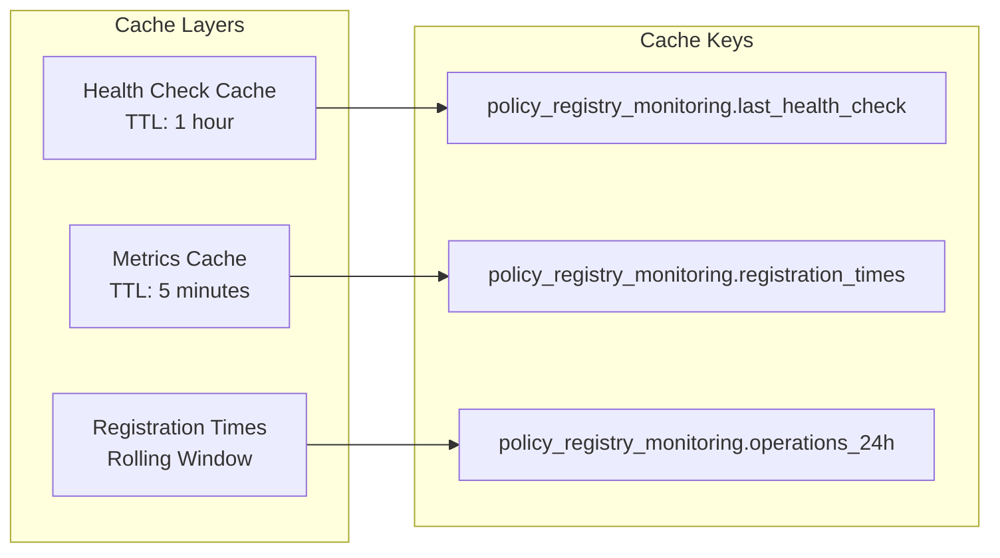

# Policy Registry Health Monitoring Architecture

## Overview

The Policy Registry Health Monitoring system provides real-time visibility into the health and performance of the application's policy registration system. This architecture ensures system administrators can quickly identify and respond to policy-related issues that could impact application security and functionality.

## System Components



## Component Responsibilities

### PolicyRegistryHealthWidget

**Role**: Presentation layer component for displaying health metrics
**Responsibilities**:
- Render health statistics in Filament dashboard
- Format metrics for human consumption
- Handle authorization and access control
- Provide real-time updates via polling
- Graceful error handling and fallback states

**Key Patterns**:
- **Widget Pattern**: Extends Filament StatsOverviewWidget
- **Dependency Injection**: Receives monitoring service via constructor
- **Authorization Pattern**: Role-based access control
- **Error Handling**: Comprehensive exception catching with logging

### PolicyRegistryMonitoringService

**Role**: Application service for health data collection and analysis
**Responsibilities**:
- Collect policy and gate registration metrics
- Perform health checks and validation
- Cache health data for performance
- Identify system issues and categorize severity
- Track performance metrics over time

**Key Patterns**:
- **Service Pattern**: Encapsulates monitoring logic
- **Cache-Aside Pattern**: Caches expensive health checks
- **Strategy Pattern**: Different health check strategies
- **Observer Pattern**: Monitors registration events

### ServiceRegistrationOrchestrator

**Role**: Coordinates policy registration with monitoring
**Responsibilities**:
- Orchestrate policy and gate registration
- Record registration metrics
- Handle registration errors
- Trigger health check updates

## Data Flow Architecture

### Health Check Flow



### Registration Monitoring Flow



## Health Metrics Architecture

### Metric Categories

1. **System Health**
   - Overall health status (boolean)
   - Critical issues count
   - Warning issues count

2. **Registration Counts**
   - Total policies registered
   - Total gates registered
   - Registration success rate

3. **Performance Metrics**
   - Average registration time
   - Cache hit rate
   - Query performance

4. **Error Tracking**
   - 24-hour error rate
   - Error categorization
   - Failure patterns

### Metric Collection Strategy

```php
// Metrics collection architecture
interface MetricsCollector
{
    public function collectSystemMetrics(): array;
    public function collectPerformanceMetrics(): array;
    public function collectErrorMetrics(): array;
}

class PolicyRegistryMetricsCollector implements MetricsCollector
{
    public function collectSystemMetrics(): array
    {
        return [
            'total_policies' => $this->countPolicies(),
            'total_gates' => $this->countGates(),
            'health_status' => $this->checkSystemHealth(),
        ];
    }
}
```

## Caching Strategy

### Cache Architecture



### Cache Invalidation Strategy

1. **Time-based**: Automatic expiration after TTL
2. **Event-based**: Invalidation on registration events
3. **Manual**: Admin-triggered cache clearing
4. **Graceful**: Stale data served during cache rebuilding

## Error Handling Architecture

### Error Categories

1. **Service Errors**
   - Monitoring service unavailable
   - Policy registry connection failures
   - Cache system failures

2. **Data Errors**
   - Invalid health data structure
   - Missing required metrics
   - Corrupted cache data

3. **Authorization Errors**
   - Insufficient permissions
   - Authentication failures
   - Role validation errors

### Error Recovery Patterns

```php
// Error handling architecture
class HealthWidgetErrorHandler
{
    public function handleServiceError(\Throwable $e): array
    {
        Log::error('Health widget service error', [
            'error' => $e->getMessage(),
            'trace' => $e->getTraceAsString(),
        ]);
        
        return $this->getErrorFallbackStats();
    }
    
    public function handleDataError(array $invalidData): array
    {
        Log::warning('Invalid health data structure', [
            'data' => $invalidData,
        ]);
        
        return $this->getDataErrorStats();
    }
}
```

## Performance Considerations

### Widget Performance

1. **Polling Strategy**: 30-second intervals balance freshness with load
2. **Cache-First**: Prioritizes cached data over fresh computation
3. **Lazy Loading**: Disabled for immediate visibility
4. **Error Caching**: Prevents repeated failures from overwhelming system

### Monitoring Service Performance

1. **Batch Operations**: Collect multiple metrics in single operation
2. **Async Processing**: Non-blocking health checks where possible
3. **Circuit Breaker**: Prevents cascade failures
4. **Resource Limits**: Bounded memory usage for metric storage

## Security Architecture

### Access Control

```php
// Multi-layer authorization
class PolicyRegistryHealthWidget
{
    public static function canView(): bool
    {
        return auth()->check() 
            && auth()->user()->hasRole('super_admin')
            && Gate::allows('view-system-health');
    }
}
```

### Data Protection

1. **Sensitive Data**: No sensitive information in health metrics
2. **Audit Logging**: All access attempts logged
3. **Rate Limiting**: Prevents abuse of health endpoints
4. **Encryption**: Cache data encrypted at rest

## Scalability Patterns

### Horizontal Scaling

1. **Stateless Design**: Widget and service are stateless
2. **Cache Distribution**: Redis cluster for cache layer
3. **Load Balancing**: Multiple monitoring service instances
4. **Event Sourcing**: Registration events for metric reconstruction

### Vertical Scaling

1. **Memory Optimization**: Bounded metric storage
2. **CPU Optimization**: Efficient metric calculations
3. **I/O Optimization**: Batch cache operations
4. **Connection Pooling**: Reuse database connections

## Monitoring and Observability

### Health Check Monitoring

```php
// Self-monitoring architecture
class HealthMonitoringObserver
{
    public function onHealthCheckCompleted(HealthCheckEvent $event): void
    {
        $this->recordHealthCheckMetrics($event);
        $this->alertOnCriticalIssues($event);
        $this->updateSystemDashboard($event);
    }
}
```

### Alerting Strategy

1. **Critical Alerts**: Immediate notification for system failures
2. **Warning Alerts**: Degraded performance notifications
3. **Trend Alerts**: Long-term performance degradation
4. **Recovery Alerts**: System recovery confirmations

## Integration Points

### Filament Integration

- **Dashboard Placement**: Superadmin dashboard priority widget
- **Theme Integration**: Follows Filament color and styling conventions
- **Localization**: Full i18n support for multi-language deployments
- **Authorization**: Integrates with Filament auth system

### Laravel Integration

- **Service Container**: Proper dependency injection
- **Event System**: Listens to policy registration events
- **Cache System**: Uses Laravel cache abstraction
- **Logging System**: Structured logging with context

## Future Enhancements

### Planned Features

1. **Historical Trends**: Long-term metric storage and trending
2. **Predictive Analytics**: ML-based performance prediction
3. **Custom Thresholds**: User-configurable alert thresholds
4. **Export Capabilities**: Health report generation and export

### Architectural Evolution

1. **Microservices**: Extract monitoring to dedicated service
2. **Event Streaming**: Real-time event processing
3. **API Gateway**: Centralized health API management
4. **Container Orchestration**: Kubernetes-based deployment

## Related Documentation

- [PolicyRegistryMonitoringService Architecture](../services/policy-registry-monitoring-architecture.md)
- [Service Registration Architecture](../service-registration-architecture.md)
- [Filament Widget Development Guide](../../filament/development/widget-development.md)
- [Multi-tenant Dashboard Architecture](../multi-tenant-dashboard-architecture.md)
- [System Health Monitoring Strategy](../monitoring/system-health-strategy.md)