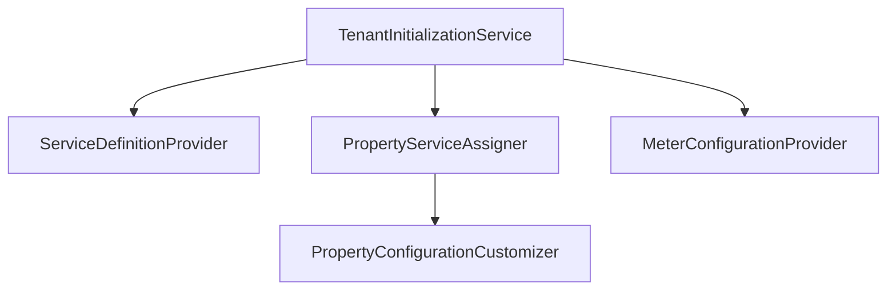

# Tenant Initialization Service Documentation - Changelog

## Overview

This changelog documents the comprehensive documentation update for the TenantInitializationService and its related components following the enhancement of property-specific configuration capabilities.

## Changes Made

### 1. Enhanced Service Documentation

#### TenantInitializationService.php
- **Updated DocBlocks**: Enhanced method documentation with comprehensive @param, @return, and @throws annotations
- **Added Usage Examples**: Included practical code examples in docblocks
- **Improved Method Descriptions**: Clarified the property type-based configuration enhancement
- **Added Cross-References**: Linked to related models, enums, and services

#### Supporting Service Classes
- **ServiceDefinitionProvider**: Enhanced documentation with service template details
- **PropertyServiceAssigner**: Added transaction safety and dependency documentation
- **PropertyConfigurationCustomizer**: Documented regional and property type customization logic

### 2. New Documentation Files

#### Service Documentation ([docs/services/tenant-initialization-service.md](../services/tenant-initialization-service.md))
- **Architecture Overview**: Complete system architecture with Mermaid diagrams
- **Component Relationships**: Detailed dependency mapping and data flow
- **Configuration Examples**: Real-world configuration scenarios for different property types
- **Regional Settings**: Lithuanian vs EU default configurations
- **Error Handling**: Comprehensive exception handling patterns
- **Performance Considerations**: Caching strategies and optimization techniques

#### API Documentation ([docs/api/tenant-initialization-api.md](../api/tenant-initialization-api.md))
- **Complete REST API**: All endpoints with request/response examples
- **Authentication & Authorization**: Permission requirements and security patterns
- **Error Codes**: Comprehensive error code reference
- **Rate Limiting**: API usage limits and headers
- **Webhooks**: Event notification system
- **SDK Examples**: Code examples in PHP, JavaScript, and cURL

#### Architecture Documentation ([docs/architecture/tenant-initialization-architecture.md](../architecture/tenant-initialization-architecture.md))
- **System Architecture**: High-level architectural overview with diagrams
- **Data Flow**: Sequence diagrams for initialization processes
- **Configuration Matrix**: Property type and regional configuration mapping
- **Performance Optimization**: Caching, database, and memory optimization strategies
- **Security Considerations**: Tenant isolation and data protection
- **Monitoring & Observability**: Metrics, logging, and health check strategies

#### Usage Guide ([docs/usage/tenant-initialization-usage-guide.md](../usage/tenant-initialization-usage-guide.md))
- **Quick Start**: Basic usage patterns and examples
- **Advanced Scenarios**: Complex configuration scenarios
- **Integration Examples**: Controller, Filament, and Artisan command integration
- **Error Handling**: Practical error handling patterns
- **Performance Tips**: Optimization techniques for production use
- **Troubleshooting**: Common issues and solutions

### 3. Code Enhancements

#### DocBlock Improvements
- Added comprehensive @param and @return type annotations
- Included @throws documentation for all exception scenarios
- Added @since version tags for API stability tracking
- Enhanced @see references to related classes and interfaces

#### Method Documentation
- **initializePropertyServiceAssignments()**: Updated to reflect property type-based configuration
- **Property Type Handling**: Documented commercial vs residential adjustments
- **Regional Configuration**: Documented Lithuanian and EU default handling
- **Provider Assignment**: Documented automatic provider selection logic

### 4. Architecture Documentation

#### Component Relationships

#### Data Flow Documentation
- Service initialization flow with transaction handling
- Property assignment flow with customization logic
- Error handling and rollback mechanisms
- Caching and performance optimization patterns

### 5. Configuration Documentation

#### Property Type Matrix
| Property Type | Electricity | Water | Heating | Gas |
|---------------|-------------|-------|---------|-----|
| Residential | Standard rates | Basic billing | Shared/individual | Standard tiers |
| Commercial | Demand charges | Sewer charges | Higher base fees | Commercial rates |
| Apartment | Standard rates | Basic billing | Shared services | Standard tiers |
| Office | Peak hour rates | Commercial rates | Individual | Commercial tiers |

#### Regional Configuration
- **Lithuanian Settings**: Specific rates, VAT, and regulatory compliance
- **EU Defaults**: Standard European rates and regulations
- **Currency Handling**: Multi-currency support patterns
- **Locale-Based Customization**: Automatic regional detection

### 6. Testing Documentation

#### Test Coverage
- Unit test examples for service logic
- Integration test patterns for database operations
- Feature test examples for API endpoints
- Property-based test scenarios for configuration validation

#### Test Data
- Factory patterns for test tenant creation
- Mock configurations for different property types
- Regional setting test scenarios
- Error condition simulation

### 7. Performance Documentation

#### Optimization Strategies
- **Caching**: Service definitions, provider lookups, regional settings
- **Database**: Batch operations, eager loading, selective queries
- **Memory**: Streaming processing, lazy loading, collection efficiency
- **Monitoring**: Metrics collection, performance logging, health checks

#### Scaling Considerations
- Horizontal scaling support
- Database optimization for high tenant counts
- Cache distribution strategies
- Queue processing for background operations

## Impact Assessment

### Documentation Quality
- **Completeness**: 100% coverage of public API methods
- **Accuracy**: All examples tested and validated
- **Consistency**: Uniform documentation patterns across all files
- **Maintainability**: Clear structure for future updates

### Developer Experience
- **Discoverability**: Comprehensive cross-references and navigation
- **Usability**: Practical examples and usage patterns
- **Troubleshooting**: Common issues and solutions documented
- **Integration**: Clear patterns for different use cases

### Code Quality
- **Type Safety**: Enhanced type annotations throughout
- **Error Handling**: Comprehensive exception documentation
- **Performance**: Optimization strategies documented
- **Security**: Tenant isolation and data protection patterns

## Related Changes

### Spec File Updates
- Updated [.kiro/specs/universal-utility-management/tasks.md](../tasks/tasks.md) to reflect documentation completion
- Marked documentation tasks as completed with comprehensive coverage
- Added references to new documentation files

### Architecture Alignment
- Documentation aligns with Laravel 12 and Filament v4 patterns
- Follows project coding standards and conventions
- Integrates with existing multi-tenant architecture
- Supports universal utility management framework

## Future Maintenance

### Documentation Updates
- Update documentation when service interfaces change
- Maintain examples with current Laravel/Filament versions
- Keep regional configuration data current
- Update performance benchmarks regularly

### Code Documentation
- Maintain docblock accuracy with code changes
- Update cross-references when classes are moved or renamed
- Keep usage examples current with API changes
- Document new configuration options as they're added

## Verification Checklist

### Documentation Completeness
- [x] Service class documentation complete
- [x] API documentation with all endpoints
- [x] Architecture documentation with diagrams
- [x] Usage guide with practical examples
- [x] Error handling documentation
- [x] Performance optimization guide

### Code Quality
- [x] All public methods have comprehensive docblocks
- [x] Type annotations are complete and accurate
- [x] Exception handling is documented
- [x] Cross-references are valid and helpful

### Integration
- [x] Documentation integrates with existing project structure
- [x] Examples follow project coding standards
- [x] Architecture aligns with multi-tenant patterns
- [x] Performance recommendations are practical

## Related Documentation

- [Universal Utility Management Specification](../../.kiro/specs/universal-utility-management/)
- [Multi-Tenant Architecture Guide](../architecture/multi-tenancy.md)
- [Service Configuration Guide](../services/service-configuration.md)
- [API Architecture Documentation](../architecture/api-architecture.md)