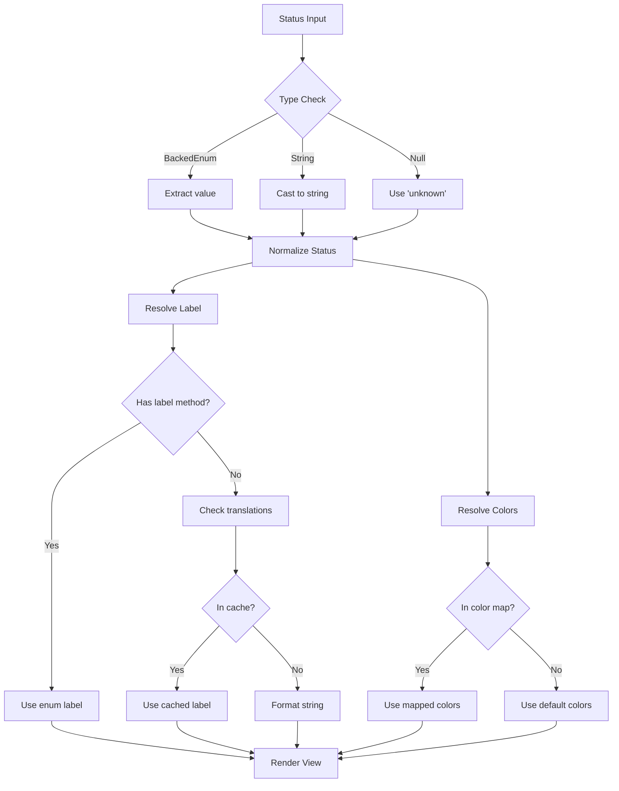

# Status Badge Component

## Overview

The `StatusBadge` component provides a consistent, accessible way to display status information across the application. It supports both enum instances and string values, with automatic label resolution and color coding.

## Location

- **Component Class**: `app/View/Components/StatusBadge.php`
- **Blade Template**: `resources/views/components/status-badge.blade.php`

## Features

- **Flexible Input**: Accepts `BackedEnum` instances, string values, or `null`
- **Automatic Label Resolution**: Uses enum `label()` methods or translation keys
- **Performance Optimized**: Cached translation lookups (24-hour TTL)
- **Consistent Styling**: Predefined color schemes for all status types
- **Accessible**: Includes ARIA attributes and semantic markup
- **Customizable**: Supports custom labels via slot content

## Supported Status Types

### Invoice Statuses
- `draft` - Amber styling for in-progress invoices
- `finalized` - Indigo styling for completed invoices
- `paid` - Green styling for paid invoices

### Subscription Statuses
- `active` - Green styling for active subscriptions
- `inactive` - Gray styling for inactive subscriptions
- `expired` - Red styling for expired subscriptions
- `suspended` - Amber styling for suspended subscriptions
- `cancelled` - Gray styling for cancelled subscriptions

### User Roles
- All roles from `UserRole` enum with appropriate styling

### Meter Types
- All types from `MeterType` enum (electricity, water, gas, heating)

### Property Types
- All types from `PropertyType` enum (apartment, house, commercial)

### Service Types
- All types from `ServiceType` enum

### Subscription Plan Types
- All types from `SubscriptionPlanType` enum

### User Assignment Actions
- All actions from `UserAssignmentAction` enum

## Usage Examples

### Basic Usage with Enum

```blade
{{-- Invoice status --}}
<x-status-badge :status="$invoice->status" />

{{-- Subscription status --}}
<x-status-badge :status="$subscription->status" />

{{-- User role --}}
<x-status-badge :status="$user->role" />
```

### Usage with String Values

```blade
{{-- Direct string value --}}
<x-status-badge status="active" />

{{-- Dynamic string value --}}
<x-status-badge :status="$statusString" />
```

### Custom Label via Slot

```blade
{{-- Override the default label --}}
<x-status-badge :status="$invoice->status">
    Custom Label Text
</x-status-badge>

{{-- Conditional custom label --}}
<x-status-badge :status="$subscription->status">
    @if($subscription->isExpiringSoon())
        Expiring Soon
    @else
        {{ $subscription->status->label() }}
    @endif
</x-status-badge>
```

### Handling Nullable Status

```blade
{{-- Gracefully handles null values --}}
<x-status-badge :status="$optionalStatus" />
{{-- Displays "Unknown" with gray styling --}}
```

### In Filament Tables

```php
use Filament\Tables\Columns\ViewColumn;

ViewColumn::make('status')
    ->view('components.status-badge')
    ->label('Status'),
```

### In Blade Components

```blade
{{-- In a card component --}}
<div class="card">
    <div class="card-header">
        <h3>Invoice #{{ $invoice->id }}</h3>
        <x-status-badge :status="$invoice->status" />
    </div>
    <div class="card-body">
        {{-- Invoice details --}}
    </div>
</div>
```

### In Data Tables

```blade
<table>
    <thead>
        <tr>
            <th>ID</th>
            <th>Status</th>
            <th>Amount</th>
        </tr>
    </thead>
    <tbody>
        @foreach($invoices as $invoice)
            <tr>
                <td>{{ $invoice->id }}</td>
                <td><x-status-badge :status="$invoice->status" /></td>
                <td>{{ $invoice->total }}</td>
            </tr>
        @endforeach
    </tbody>
</table>
```

## Architecture

### Component Structure

```
StatusBadge Component
├── Constructor
│   ├── Accepts: BackedEnum|string|null
│   ├── Normalizes status value
│   ├── Resolves display label
│   └── Determines color classes
├── Label Resolution
│   ├── 1. Check enum label() method
│   ├── 2. Check cached translations
│   └── 3. Fallback to formatted string
├── Color Resolution
│   ├── Lookup in STATUS_COLORS map
│   └── Fallback to DEFAULT_COLORS
└── View Rendering
    ├── Badge container with classes
    ├── Status indicator dot
    └── Label text (slot or resolved)
```

### Data Flow



### Caching Strategy

The component uses Laravel's cache system with tags for efficient translation lookups:

```php
Cache::tags(['status-badge', 'translations'])
    ->remember('status-badge.translations', now()->addDay(), function () {
        return array_merge(
            InvoiceStatus::labels(),
            ServiceType::labels(),
            // ... other enum labels
        );
    });
```

**Cache Invalidation:**
```php
// Clear status badge cache
Cache::tags(['status-badge', 'translations'])->flush();

// Or clear all translations
Cache::tags('translations')->flush();
```

## Color Scheme

### Status Colors Map

| Status | Badge Style | Dot Color | Use Case |
|--------|-------------|-----------|----------|
| `draft` | Amber | Amber | In-progress items |
| `finalized` | Indigo | Indigo | Completed items |
| `paid` | Green | Green | Successful payments |
| `active` | Green | Green | Active subscriptions |
| `inactive` | Gray | Gray | Inactive items |
| `expired` | Red | Red | Expired items |
| `suspended` | Amber | Amber | Temporarily suspended |
| `cancelled` | Gray | Gray | Cancelled items |
| `pending` | Blue | Blue | Awaiting action |
| `processing` | Purple | Purple | In processing |
| `unknown` | Gray | Gray | Unknown/null status |

### Tailwind Classes

All colors use Tailwind CSS utility classes:
- Background: `bg-{color}-50`
- Text: `text-{color}-700`
- Border: `border-{color}-200`
- Dot: `bg-{color}-400` or `bg-{color}-500`

## Accessibility

### ARIA Attributes

The component includes proper ARIA attributes:

```blade
<span class="..." role="status" aria-label="Status: {{ $label }}">
    <span class="..." aria-hidden="true"></span>
    <span>{{ $label }}</span>
</span>
```

### Screen Reader Support

- Status indicator dot is hidden from screen readers (`aria-hidden="true"`)
- Label text is properly exposed to assistive technologies
- Semantic HTML with appropriate roles

### Keyboard Navigation

The badge is not interactive by default. If you need clickable badges:

```blade
<button type="button" class="...">
    <x-status-badge :status="$status" />
</button>
```

## Performance Considerations

### Translation Caching

- Translations are cached for 24 hours
- Cache is tagged for selective invalidation
- Reduces database/file system lookups

### Enum Label Methods

- Enum `label()` methods are called directly (no caching needed)
- Faster than translation file lookups
- Recommended approach for new enums

### View Compilation

- Blade templates are compiled and cached
- Component instances are lightweight
- Minimal overhead per render

## Testing

### Unit Tests

```php
use App\View\Components\StatusBadge;
use App\Enums\InvoiceStatus;

test('resolves enum status correctly', function () {
    $component = new StatusBadge(InvoiceStatus::PAID);
    
    expect($component->statusValue)->toBe('paid')
        ->and($component->label)->toBe('Paid')
        ->and($component->badgeClasses)->toContain('bg-emerald-50');
});

test('handles string status', function () {
    $component = new StatusBadge('active');
    
    expect($component->statusValue)->toBe('active')
        ->and($component->label)->toBe('Active');
});

test('handles null status gracefully', function () {
    $component = new StatusBadge(null);
    
    expect($component->statusValue)->toBe('unknown')
        ->and($component->label)->toBe('Unknown');
});
```

### Feature Tests

```php
test('status badge renders in invoice list', function () {
    $invoice = Invoice::factory()->create(['status' => InvoiceStatus::PAID]);
    
    $response = $this->actingAsManager()
        ->get(route('manager.invoices.index'));
    
    $response->assertSee('Paid')
        ->assertSee('bg-emerald-50');
});
```

## Extending the Component

### Adding New Status Types

1. **Create the Enum:**

```php
namespace App\Enums;

enum OrderStatus: string
{
    case PENDING = 'pending';
    case CONFIRMED = 'confirmed';
    case SHIPPED = 'shipped';
    case DELIVERED = 'delivered';
    
    public function label(): string
    {
        return match($this) {
            self::PENDING => __('common.status.pending'),
            self::CONFIRMED => __('common.status.confirmed'),
            self::SHIPPED => __('common.status.shipped'),
            self::DELIVERED => __('common.status.delivered'),
        };
    }
    
    public static function labels(): array
    {
        return [
            self::PENDING->value => self::PENDING->label(),
            self::CONFIRMED->value => self::CONFIRMED->label(),
            self::SHIPPED->value => self::SHIPPED->label(),
            self::DELIVERED->value => self::DELIVERED->label(),
        ];
    }
}
```

2. **Add to Translation Cache:**

```php
// In StatusBadge::getMergedTranslations()
return array_merge(
    InvoiceStatus::labels(),
    ServiceType::labels(),
    OrderStatus::labels(), // Add new enum
    // ... other enums
);
```

3. **Add Color Mapping (Optional):**

```php
// In StatusBadge::STATUS_COLORS
'confirmed' => [
    'badge' => 'bg-blue-50 text-blue-700 border-blue-200',
    'dot' => 'bg-blue-500',
],
'shipped' => [
    'badge' => 'bg-purple-50 text-purple-700 border-purple-200',
    'dot' => 'bg-purple-500',
],
```

### Custom Color Schemes

To add custom colors for specific statuses:

```php
// In StatusBadge class
private const STATUS_COLORS = [
    // ... existing colors
    'custom_status' => [
        'badge' => 'bg-custom-50 text-custom-700 border-custom-200',
        'dot' => 'bg-custom-500',
    ],
];
```

## Troubleshooting

### Label Not Displaying

**Problem:** Status shows as raw value instead of label.

**Solution:**
1. Ensure enum has `label()` method
2. Check translation cache is populated
3. Verify enum is added to `getMergedTranslations()`

### Wrong Colors

**Problem:** Status displays with incorrect colors.

**Solution:**
1. Check status value matches key in `STATUS_COLORS`
2. Verify Tailwind classes are not purged
3. Ensure color classes are in safelist if using JIT

### Cache Issues

**Problem:** Labels not updating after translation changes.

**Solution:**
```bash
# Clear status badge cache
php artisan cache:clear

# Or in code
Cache::tags(['status-badge', 'translations'])->flush();
```

## Related Components

- **Icon Component**: `app/View/Components/Icon.php`
- **Card Component**: `resources/views/components/card.blade.php`
- **Data Table Component**: `resources/views/components/data-table.blade.php`

## Related Documentation

- [Enum Documentation](../api/ENUMS.md)
- [Blade Components Guide](../frontend/BLADE_COMPONENTS.md)
- [Tailwind Configuration](../frontend/TAILWIND_SETUP.md)
- [Caching Strategy](../architecture/CACHING.md)

## Changelog

### 2024-12-02
- **Fixed**: Blade template now properly handles both enum objects and string values
- **Improved**: Added explicit type checking for `BackedEnum` instances
- **Enhanced**: Documentation with comprehensive usage examples and architecture notes
