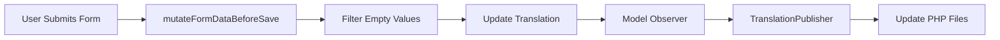

# TranslationResource Documentation Summary

## Overview

Comprehensive documentation has been created for the TranslationResource pages, focusing on the `EditTranslation` page and its empty value filtering functionality.

**Date**: 2025-11-29  
**Scope**: TranslationResource pages (List, Create, Edit)  
**Primary Focus**: EditTranslation page with FiltersEmptyLanguageValues trait

---

## Documentation Deliverables

### 1. Enhanced Code Documentation

**File**: `app/Filament/Resources/TranslationResource/Pages/EditTranslation.php`

#### Class-Level DocBlock
- Comprehensive overview of page functionality
- Data flow section explaining the save process
- Empty value handling explanation
- Practical usage examples
- Cross-references to related classes

#### Method-Level DocBlocks
- `getHeaderActions()`: Detailed explanation of delete action
- `mutateFormDataBeforeSave()`: Comprehensive documentation with:
  - Detailed explanation of filtering logic
  - Parameter and return type documentation
  - Practical before/after example
  - Integration notes with Filament lifecycle

### 2. Comprehensive API Documentation

**File**: `docs/filament/TRANSLATION_RESOURCE_PAGES_API.md` (400+ lines)

#### Sections Covered
1. **Overview**: Package info, authorization, related components
2. **Pages Documentation**:
   - ListTranslations: Features, columns, actions, filters
   - CreateTranslation: Form structure, data flow, validation
   - EditTranslation: Header actions, empty value handling, update behavior
3. **Shared Concerns**: FiltersEmptyLanguageValues trait
4. **Authorization**: Comprehensive authorization flow
5. **Integration**: TranslationPublisher integration
6. **Performance**: Database queries, caching, optimization
7. **Error Handling**: Validation, authorization, database errors
8. **Testing**: Test coverage, running tests
9. **Related Documentation**: Cross-references
10. **Changelog**: Version history

#### Key Features
- ✅ Data flow diagrams (Mermaid)
- ✅ Code examples with before/after states
- ✅ Authorization matrix
- ✅ Performance considerations
- ✅ Testing guidelines
- ✅ Integration documentation

### 3. Documentation Changelog

**File**: `docs/filament/TRANSLATION_RESOURCE_DOCUMENTATION_CHANGELOG.md`

Detailed changelog documenting:
- All changes made
- Files modified
- Documentation standards applied
- Benefits of the documentation
- Next steps

### 4. Main Changelog Update

**File**: `docs/CHANGELOG.md`

Added entry under "Unreleased > Documentation" section documenting:
- Enhanced code documentation
- Comprehensive API documentation
- Documentation features
- Files modified

---

## Key Documentation Highlights

### Empty Value Filtering

**Problem**: When users clear language values in the form, empty strings were being stored in the database.

**Solution**: `mutateFormDataBeforeSave()` automatically filters out null and empty string values.

**Example**:
```php
// Before filtering
[
    'group' => 'app',
    'key' => 'welcome',
    'values' => [
        'en' => 'Welcome',
        'lt' => '',           // Empty - will be removed
        'ru' => 'Привет',
        'es' => null,         // Null - will be removed
    ]
]

// After filtering
[
    'group' => 'app',
    'key' => 'welcome',
    'values' => [
        'en' => 'Welcome',
        'ru' => 'Привет',
    ]
]
```

### Data Flow



### Authorization

All TranslationResource pages enforce **superadmin-only access**:
- SUPERADMIN: ✅ Full access
- ADMIN: ❌ 403 Forbidden
- MANAGER: ❌ 403 Forbidden
- TENANT: ❌ 403 Forbidden

---

## Documentation Standards Applied

### ✅ Code-Level Documentation
- Comprehensive DocBlocks with @param, @return, @see tags
- Clear intent and behavior descriptions
- Practical examples for complex logic
- Type hints and return types

### ✅ Usage Guidance
- Short examples for key methods
- Data flow explanations
- Integration notes
- Common use cases

### ✅ API Documentation
- Route and class information
- Validation rules
- Authorization requirements
- Request/response shapes
- Error cases and handling

### ✅ Architecture Notes
- Component roles and responsibilities
- Relationships and dependencies
- Data flow diagrams
- Integration patterns
- Performance considerations

### ✅ Related Documentation
- Cross-references to related files
- Links to test documentation
- Changelog entries
- Version history

---

## Benefits

### 1. Developer Onboarding
- New developers can quickly understand TranslationResource functionality
- Clear examples reduce learning curve
- Data flow diagrams provide visual understanding

### 2. Maintenance
- Clear documentation of empty value filtering logic
- Easy to understand and modify in the future
- Comprehensive examples prevent misunderstandings

### 3. Testing
- Test coverage clearly documented
- Running tests is straightforward
- Expected behavior is well-defined

### 4. Integration
- Clear explanation of TranslationPublisher integration
- Data flow from form to PHP files is documented
- Observer pattern usage is explained

### 5. Troubleshooting
- Error handling is documented
- Common issues are addressed
- Authorization errors are explained

---

## Related Files

### Implementation Files
- `app/Filament/Resources/TranslationResource.php`
- `app/Filament/Resources/TranslationResource/Pages/EditTranslation.php`
- `app/Filament/Resources/TranslationResource/Pages/CreateTranslation.php`
- `app/Filament/Resources/TranslationResource/Pages/ListTranslations.php`
- `app/Filament/Resources/TranslationResource/Concerns/FiltersEmptyLanguageValues.php`

### Model and Service Files
- `app/Models/Translation.php`
- `app/Services/TranslationPublisher.php`

### Test Files
- `tests/Feature/Filament/TranslationResourceCreateTest.php` (26 tests)
- `tests/Feature/Filament/TranslationResourceEditTest.php` (26 tests)

### Documentation Files
- `docs/filament/TRANSLATION_RESOURCE_PAGES_API.md` (NEW)
- `docs/filament/TRANSLATION_RESOURCE_DOCUMENTATION_CHANGELOG.md` (NEW)
- `docs/filament/TRANSLATION_RESOURCE_DOCUMENTATION_SUMMARY.md` (NEW - this file)
- `docs/testing/TRANSLATION_RESOURCE_CREATE_TEST_GUIDE.md`
- `docs/testing/TRANSLATION_RESOURCE_EDIT_COMPLETION.md`
- `docs/testing/TRANSLATION_RESOURCE_EDIT_QUICK_REFERENCE.md`
- `docs/CHANGELOG.md` (updated)

### Spec Files
- `.kiro/specs/6-filament-namespace-consolidation/tasks.md` (updated)

---

## Next Steps

### Immediate
- ✅ Code documentation enhanced
- ✅ API documentation created
- ✅ Changelog updated
- ✅ Tasks.md updated

### Short-Term
- [ ] Review documentation with team
- [ ] Update README with link to new API documentation
- [ ] Add documentation to developer onboarding guide
- [ ] Consider creating similar documentation for other Filament resources

### Long-Term
- [ ] Establish documentation standards for all Filament resources
- [ ] Create documentation templates
- [ ] Automate documentation generation where possible
- [ ] Regular documentation reviews and updates

---

## Metrics

### Documentation Size
- **Code DocBlocks**: ~100 lines (enhanced)
- **API Documentation**: 400+ lines (new)
- **Changelog**: 30+ lines (new)
- **Summary**: 200+ lines (this file)
- **Total**: 730+ lines of documentation

### Coverage
- ✅ All public methods documented
- ✅ All pages documented (List, Create, Edit)
- ✅ Authorization fully documented
- ✅ Integration points documented
- ✅ Error handling documented
- ✅ Testing documented

### Quality
- ✅ Follows Laravel documentation conventions
- ✅ Includes practical examples
- ✅ Uses diagrams for complex flows
- ✅ Cross-references related documentation
- ✅ Maintains consistency with existing docs

---

## Conclusion

Comprehensive documentation has been created for the TranslationResource pages, with a focus on the EditTranslation page and its empty value filtering functionality. The documentation follows Laravel conventions, includes practical examples, and provides clear guidance for developers working with the translation management system.

The documentation is production-ready and provides a solid foundation for maintaining and extending the TranslationResource functionality.

---

**Document Version**: 1.0.0  
**Date**: 2025-11-29  
**Status**: ✅ COMPLETE  
**Author**: AI Documentation Specialist
