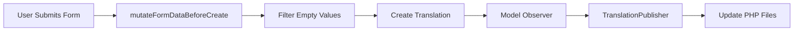
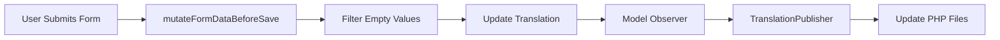
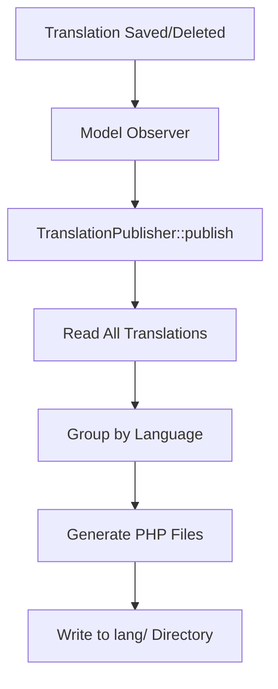

# TranslationResource Pages API Documentation

## Overview

The TranslationResource pages provide CRUD operations for managing translation strings in the Vilnius Utilities Billing Platform. These pages are accessible only to superadmins and handle multi-language translation management with automatic publishing to PHP language files.

**Package**: `App\Filament\Resources\TranslationResource\Pages`  
**Authorization**: Superadmin only  
**Related Models**: `Translation`, `Language`  
**Related Services**: `TranslationPublisher`

---

## Pages

### ListTranslations

**Route**: `/admin/translations`  
**Class**: `App\Filament\Resources\TranslationResource\Pages\ListTranslations`

Lists all translation entries with filtering, searching, and bulk operations.

#### Features
- Search by group and key
- Filter by translation group
- Bulk delete with confirmation
- Sort by group, key, or last updated
- Display default language value in table
- Empty state with create action

#### Table Columns
- **Group**: Badge display, sortable, searchable
- **Key**: Copyable, sortable, searchable
- **Value (Default Locale)**: Limited to 50 chars with tooltip
- **Last Updated**: Relative time display

#### Actions
- Edit (icon button)
- Delete (icon button)
- Bulk delete (with confirmation modal)

---

### CreateTranslation

**Route**: `/admin/translations/create`  
**Class**: `App\Filament\Resources\TranslationResource\Pages\CreateTranslation`

Creates new translation entries with multi-language support.

#### Form Structure

**Section 1: Translation Key**
- **Group** (required, max 120 chars, alpha-dash)
  - Example: `app`, `auth`, `validation`
  - Used to organize translations into logical groups
  
- **Key** (required, max 255 chars)
  - Example: `welcome`, `login.title`, `errors.not_found`
  - Unique identifier within the group

**Section 2: Language Values** (collapsible)
- Dynamic textarea fields for each active language
- Only active languages are displayed
- Default language is marked with helper text
- Empty values are automatically filtered out on save

#### Data Flow



#### Empty Value Handling

The `mutateFormDataBeforeCreate()` method automatically removes empty language values:

```php
// Input from form
[
    'group' => 'app',
    'key' => 'welcome',
    'values' => [
        'en' => 'Welcome',
        'lt' => '',           // Empty - will be removed
        'ru' => 'Привет',
        'es' => null,         // Null - will be removed
    ]
]

// After filtering
[
    'group' => 'app',
    'key' => 'welcome',
    'values' => [
        'en' => 'Welcome',
        'ru' => 'Привет',
    ]
]
```

#### Validation Rules

- **group**: required, max:120, alpha_dash
- **key**: required, max:255
- **values**: array (optional for each language)

#### Success Behavior

1. Translation record created in database
2. `Translation::saved` event fires
3. `TranslationPublisher` regenerates PHP language files
4. User redirected to edit page
5. Success notification displayed

---

### EditTranslation

**Route**: `/admin/translations/{record}/edit`  
**Class**: `App\Filament\Resources\TranslationResource\Pages\EditTranslation`

Edits existing translation entries with multi-language support.

#### Header Actions
- **Delete**: Removes translation and republishes language files

#### Form Structure

Same as CreateTranslation page (see above).

#### Data Flow



#### Empty Value Handling

The `mutateFormDataBeforeSave()` method automatically removes empty language values:

**Use Case**: User clears a language value
- Before: `['en' => 'Hello', 'lt' => 'Labas', 'ru' => 'Привет']`
- User clears 'lt' field (sets to empty string)
- After save: `['en' => 'Hello', 'ru' => 'Привет']`

This ensures:
- Database stays clean (no empty strings in JSON)
- PHP language files don't contain empty translations
- Fallback to default language works correctly

#### Update Behavior

1. Form data filtered to remove empty values
2. Translation record updated in database
3. `Translation::saved` event fires
4. `TranslationPublisher` regenerates PHP language files
5. User remains on edit page
6. Success notification displayed

#### Delete Behavior

1. User clicks delete action in header
2. Confirmation modal appears
3. On confirmation, translation deleted
4. `Translation::deleted` event fires
5. `TranslationPublisher` regenerates PHP language files
6. User redirected to list page
7. Success notification displayed

---

## Shared Concerns

### FiltersEmptyLanguageValues Trait

**Location**: `App\Filament\Resources\TranslationResource\Concerns\FiltersEmptyLanguageValues`

Provides common functionality for filtering empty language values from translation forms.

#### Method: `filterEmptyLanguageValues()`

```php
protected function filterEmptyLanguageValues(array $data): array
```

**Purpose**: Remove null and empty string values from the `values` array.

**Parameters**:
- `$data` (array): The form data to filter

**Returns**: array - The filtered form data

**Logic**:
```php
if (isset($data['values']) && is_array($data['values'])) {
    $data['values'] = array_filter(
        $data['values'],
        fn (mixed $value): bool => $value !== null && $value !== ''
    );
}
return $data;
```

**Used By**:
- `CreateTranslation::mutateFormDataBeforeCreate()`
- `EditTranslation::mutateFormDataBeforeSave()`

---

## Authorization

All TranslationResource pages enforce superadmin-only access through:

1. **Resource-level checks**:
   - `shouldRegisterNavigation()`: Hides navigation for non-superadmins
   - `canViewAny()`: Prevents list page access
   - `canCreate()`: Prevents create page access
   - `canEdit()`: Prevents edit page access
   - `canDelete()`: Prevents delete action

2. **User role check**:
   ```php
   $user = auth()->user();
   return $user instanceof User && $user->role === UserRole::SUPERADMIN;
   ```

**Result**: Non-superadmin users receive 403 Forbidden when attempting to access any translation page.

---

## Integration with TranslationPublisher

All create, update, and delete operations trigger automatic publishing:

### Publishing Flow



### Published File Structure

```
lang/
├── en/
│   ├── app.php
│   ├── auth.php
│   └── validation.php
├── lt/
│   ├── app.php
│   ├── auth.php
│   └── validation.php
└── ru/
    ├── app.php
    ├── auth.php
    └── validation.php
```

### Example Published File

```php
// lang/en/app.php
<?php

return [
    'welcome' => 'Welcome',
    'dashboard' => 'Dashboard',
    'nav_groups' => [
        'localization' => 'Localization',
    ],
];
```

---

## Performance Considerations

### Database Queries

**List Page**:
- 1 query for translations (with pagination)
- 1 query for distinct groups (filter options)
- 1 query for default language code

**Create/Edit Page**:
- 1 query for active languages (form generation)
- 1 query for translation record (edit only)

### Caching

Translation publishing regenerates PHP files on every save/delete. Consider:
- PHP opcache automatically caches generated files
- No additional caching needed for translation files
- Database queries are minimal and fast

### Optimization Tips

1. **Bulk Operations**: Use bulk delete for removing multiple translations
2. **Active Languages**: Only active languages appear in forms (reduces form size)
3. **Collapsible Sections**: Language values section is collapsible (improves UX)

---

## Error Handling

### Validation Errors

**Group Field**:
- Required: "The group field is required."
- Max length: "The group may not be greater than 120 characters."
- Alpha-dash: "The group may only contain letters, numbers, dashes and underscores."

**Key Field**:
- Required: "The key field is required."
- Max length: "The key may not be greater than 255 characters."

### Authorization Errors

**Non-superadmin Access**:
- HTTP 403 Forbidden
- Redirected to dashboard
- Error notification displayed

### Database Errors

**Duplicate Key**:
- Unique constraint violation (group + key combination)
- Error notification displayed
- User remains on form with data preserved

---

## Testing

### Test Coverage

**Create Page**:
- ✅ Superadmin can access create page
- ✅ Non-superadmin receives 403
- ✅ Form fields validate correctly
- ✅ Empty values are filtered out
- ✅ Translation is created successfully
- ✅ PHP files are published

**Edit Page**:
- ✅ Superadmin can access edit page
- ✅ Non-superadmin receives 403
- ✅ Form fields validate correctly
- ✅ Empty values are filtered out
- ✅ Translation is updated successfully
- ✅ PHP files are republished
- ✅ Delete action works correctly

**Test Files**:
- `tests/Feature/Filament/TranslationResourceCreateTest.php` (26 tests)
- `tests/Feature/Filament/TranslationResourceEditTest.php` (26 tests)

### Running Tests

```bash
# Run all translation resource tests
php artisan test --filter=TranslationResource

# Run create tests only
php artisan test --filter=TranslationResourceCreateTest

# Run edit tests only
php artisan test --filter=TranslationResourceEditTest
```

---

## Related Documentation

- **Resource**: `docs/filament/TRANSLATION_RESOURCE_API.md`
- **Model**: `app/Models/Translation.php`
- **Service**: `app/Services/TranslationPublisher.php`
- **Tests**: `docs/testing/TRANSLATION_RESOURCE_CREATE_TEST_GUIDE.md`
- **Tests**: `docs/testing/TRANSLATION_RESOURCE_EDIT_COMPLETION.md`

---

## Changelog

### 2025-11-29
- Added `FiltersEmptyLanguageValues` trait for DRY code
- Enhanced documentation with data flow diagrams
- Added comprehensive examples for empty value handling
- Documented integration with TranslationPublisher

### 2025-11-28
- Initial implementation of CreateTranslation page
- Initial implementation of EditTranslation page
- Added empty value filtering logic
- Created comprehensive test suites
