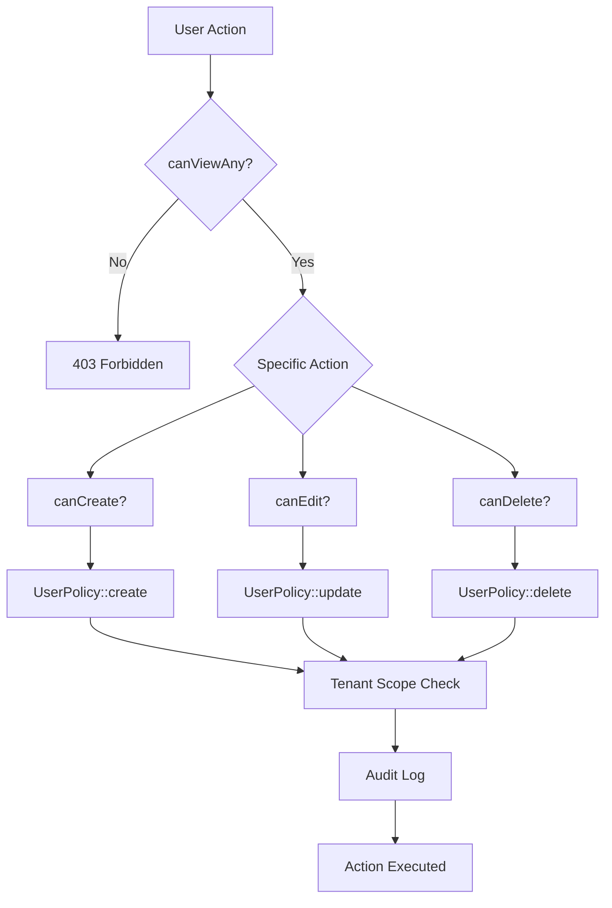

# UserResource Authorization Documentation

## Overview

The `UserResource` implements Filament v4's authorization layer through explicit `can*()` methods that work in conjunction with `UserPolicy` to enforce role-based access control (RBAC) for user management operations.

## Authorization Architecture

### Two-Layer Authorization

```
┌─────────────────────────────────────────────────┐
│         Filament Resource Layer                 │
│  (UserResource::can*() methods)                 │
│  - Role-based visibility control                │
│  - Navigation registration                      │
│  - Quick access checks                          │
└─────────────────────────────────────────────────┘
                    ↓
┌─────────────────────────────────────────────────┐
│         Laravel Policy Layer                    │
│  (UserPolicy methods)                           │
│  - Granular authorization logic                 │
│  - Tenant boundary enforcement                  │
│  - Audit logging                                │
└─────────────────────────────────────────────────┘
```

### Authorization Flow



## Authorization Methods

### canViewAny()

**Purpose**: Controls access to the user management interface.

**Allowed Roles**:
- `SUPERADMIN` - Full access across all tenants
- `ADMIN` - Access to users within their tenant
- `MANAGER` - Access to users within their tenant

**Excluded Roles**:
- `TENANT` - Explicitly excluded from user management

**Implementation**:
```php
public static function canViewAny(): bool
{
    $user = auth()->user();
    return $user instanceof User && in_array($user->role, self::ALLOWED_ROLES, true);
}
```

**Usage**:
- Controls navigation visibility
- Gates access to list/index pages
- First authorization checkpoint

**Requirements**: 6.1, 9.3

---

### canCreate()

**Purpose**: Controls ability to create new users.

**Authorization Logic**:
- Delegates to `canViewAny()` for consistency
- If user can view the resource, they can create users
- Policy layer enforces tenant boundaries

**Implementation**:
```php
public static function canCreate(): bool
{
    return static::canViewAny();
}
```

**Policy Integration**:
```php
// UserPolicy::create() enforces:
// - Superadmin can create any user
// - Admin/Manager can create users in their tenant
```

**Requirements**: 6.2, 13.2

---

### canEdit(Model $record)

**Purpose**: Controls ability to edit existing users.

**Parameters**:
- `$record` - The User model being edited

**Authorization Logic**:
- Resource-level check via `canViewAny()`
- Policy-level check via `UserPolicy::update()`
- Tenant boundary enforcement in policy

**Implementation**:
```php
public static function canEdit(Model $record): bool
{
    return static::canViewAny();
}
```

**Policy Integration**:
```php
// UserPolicy::update() enforces:
// - Users can edit themselves
// - Superadmin can edit any user
// - Admin/Manager can edit users in their tenant
```

**Requirements**: 6.3, 13.3, 13.4

---

### canDelete(Model $record)

**Purpose**: Controls ability to delete users.

**Parameters**:
- `$record` - The User model being deleted

**Authorization Logic**:
- Resource-level check via `canViewAny()`
- Policy-level check via `UserPolicy::delete()`
- Self-deletion prevention in policy
- Audit logging for compliance

**Implementation**:
```php
public static function canDelete(Model $record): bool
{
    return static::canViewAny();
}
```

**Policy Integration**:
```php
// UserPolicy::delete() enforces:
// - Cannot delete yourself
// - Superadmin can delete any user (except self)
// - Admin/Manager can delete users in their tenant
// - All deletions are audit logged
```

**Requirements**: 6.4, 13.4

---

### shouldRegisterNavigation()

**Purpose**: Controls whether the resource appears in navigation.

**Authorization Logic**:
- Delegates to `canViewAny()`
- Hides navigation item from unauthorized users
- Prevents UI clutter for TENANT role

**Implementation**:
```php
public static function shouldRegisterNavigation(): bool
{
    return static::canViewAny();
}
```

**Requirements**: 6.1, 9.3

## Role-Based Access Matrix

| Role | View List | View User | Create | Edit | Delete | Navigation |
|------|-----------|-----------|--------|------|--------|------------|
| SUPERADMIN | ✅ All | ✅ All | ✅ | ✅ All | ✅ All (not self) | ✅ |
| ADMIN | ✅ Tenant | ✅ Tenant + Self | ✅ | ✅ Tenant + Self | ✅ Tenant (not self) | ✅ |
| MANAGER | ✅ Tenant | ✅ Self | ✅ | ✅ Tenant + Self | ✅ Tenant (not self) | ✅ |
| TENANT | ❌ | ✅ Self Only | ❌ | ✅ Self Only | ❌ | ❌ |

## Tenant Isolation

### Scope Enforcement

The resource enforces tenant isolation at multiple levels:

1. **Query Scoping** (`getEloquentQuery()`):
```php
public static function getEloquentQuery(): Builder
{
    $query = parent::getEloquentQuery();
    $user = auth()->user();

    // Superadmins see all users
    if ($user instanceof User && $user->isSuperadmin()) {
        return $query;
    }

    // Apply tenant scope for admins and managers
    if ($user instanceof User && $user->tenant_id) {
        $query->where('tenant_id', $user->tenant_id);
    }

    return $query;
}
```

2. **Form Scoping** (`scopeToUserTenant()`):
```php
protected static function scopeToUserTenant(Builder $query): Builder
{
    $user = auth()->user();

    if ($user instanceof User && $user->tenant_id) {
        $table = $query->getModel()->getTable();
        $query->where("{$table}.tenant_id", $user->tenant_id);
    }

    return $query;
}
```

3. **Policy Enforcement** (`UserPolicy::isSameTenant()`):
```php
private function isSameTenant(User $user, User $model): bool
{
    return $user->tenant_id !== null 
        && $model->tenant_id !== null
        && $user->tenant_id === $model->tenant_id;
}
```

## Security Considerations

### Audit Logging

All sensitive operations are logged via `UserPolicy`:

```php
private function logSensitiveOperation(string $operation, User $user, User $model): void
{
    Log::channel('audit')->info("User {$operation} operation", [
        'operation' => $operation,
        'actor_id' => $user->id,
        'actor_email' => $user->email,
        'actor_role' => $user->role->value,
        'target_id' => $model->id,
        'target_email' => $model->email,
        'target_role' => $model->role->value,
        'actor_tenant_id' => $user->tenant_id,
        'target_tenant_id' => $model->tenant_id,
        'ip' => request()->ip(),
        'user_agent' => request()->userAgent(),
        'timestamp' => now()->toIso8601String(),
    ]);
}
```

**Logged Operations**:
- User updates
- User deletions
- User restorations
- Force deletions
- Impersonation attempts

### Self-Deletion Prevention

The policy prevents users from deleting themselves:

```php
public function delete(User $user, User $model): bool
{
    // Cannot delete yourself - fastest rejection path
    if ($user->id === $model->id) {
        return false;
    }
    // ... rest of authorization logic
}
```

### Performance Optimizations

1. **Early Returns**: Fastest rejection paths first
2. **Consolidated Checks**: `canManageTenantUser()` reduces duplicate logic
3. **Lazy Evaluation**: Request data captured only when logging occurs
4. **Cached Badge Counts**: Navigation badges cached for 5 minutes

## Testing

### Authorization Tests

See `tests/Unit/AuthorizationPolicyTest.php` for comprehensive test coverage:

```php
describe('UserPolicy', function () {
    test('only admins can view any users', function () {
        $admin = User::factory()->create(['role' => UserRole::ADMIN]);
        $manager = User::factory()->create(['role' => UserRole::MANAGER]);
        $tenant = User::factory()->create(['role' => UserRole::TENANT]);

        expect($admin->can('viewAny', User::class))->toBeTrue()
            ->and($manager->can('viewAny', User::class))->toBeTrue()
            ->and($tenant->can('viewAny', User::class))->toBeFalse();
    });
    
    // ... more tests
});
```

### Test Coverage

- ✅ Role-based access control
- ✅ Tenant boundary enforcement
- ✅ Self-deletion prevention
- ✅ Cross-tenant access prevention
- ✅ Navigation visibility
- ✅ CRUD operation authorization

## Usage Examples

### Creating a User (Admin)

```php
// Admin creates a user in their tenant
$admin = auth()->user(); // Admin with tenant_id = 1

// Resource check
if (UserResource::canCreate()) {
    // Policy check happens automatically via Filament
    $user = User::create([
        'name' => 'New User',
        'email' => 'user@example.com',
        'role' => UserRole::TENANT,
        'tenant_id' => $admin->tenant_id, // Scoped to admin's tenant
    ]);
}
```

### Editing a User (Manager)

```php
// Manager edits a user in their tenant
$manager = auth()->user(); // Manager with tenant_id = 1
$user = User::find(5); // User with tenant_id = 1

// Resource check
if (UserResource::canEdit($user)) {
    // Policy check via UserPolicy::update()
    // - Verifies same tenant
    // - Logs the operation
    $user->update(['name' => 'Updated Name']);
}
```

### Deleting a User (Superadmin)

```php
// Superadmin deletes a user
$superadmin = auth()->user(); // Superadmin
$user = User::find(10);

// Resource check
if (UserResource::canDelete($user)) {
    // Policy check via UserPolicy::delete()
    // - Prevents self-deletion
    // - Logs the operation
    $user->delete();
}
```

## Integration with Filament

### Navigation Registration

```php
// In UserResource
public static function shouldRegisterNavigation(): bool
{
    return static::canViewAny();
}
```

**Result**:
- SUPERADMIN, ADMIN, MANAGER: See "Users" in navigation
- TENANT: Navigation item hidden

### Table Actions

```php
// In UserResource::table()
->recordActions([
    Tables\Actions\ViewAction::make(),
    Tables\Actions\EditAction::make(),
])
```

**Authorization**:
- View action: Controlled by `UserPolicy::view()`
- Edit action: Controlled by `UserPolicy::update()`
- Actions automatically hidden if unauthorized

### Bulk Actions

```php
->bulkActions([
    Tables\Actions\BulkActionGroup::make([
        Tables\Actions\DeleteBulkAction::make(),
    ]),
])
```

**Authorization**:
- Each record checked via `UserPolicy::delete()`
- Unauthorized records excluded from bulk operation
- Self-deletion prevented even in bulk operations

## Related Documentation

- [UserPolicy Documentation](../policies/USER_POLICY.md)
- [Multi-Tenancy Architecture](../architecture/MULTI_TENANCY.md)
- [Authorization Testing Guide](../testing/AUTHORIZATION_TESTING.md)
- [Filament Resources Guide](./FILAMENT_RESOURCES.md)

## Requirements Traceability

| Requirement | Implementation | Test Coverage |
|-------------|----------------|---------------|
| 6.1 | `canViewAny()`, `shouldRegisterNavigation()` | ✅ AuthorizationPolicyTest |
| 6.2 | `canCreate()`, `UserPolicy::create()` | ✅ AuthorizationPolicyTest |
| 6.3 | `canEdit()`, `UserPolicy::update()` | ✅ AuthorizationPolicyTest |
| 6.4 | `canDelete()`, `UserPolicy::delete()` | ✅ AuthorizationPolicyTest |
| 6.5 | `scopeToUserTenant()`, `getEloquentQuery()` | ✅ MultiTenancyTest |
| 6.6 | Tenant scope isolation | ✅ MultiTenancyTest |
| 9.3 | Navigation visibility control | ✅ FilamentPanelTest |
| 9.5 | Policy-based authorization | ✅ AuthorizationPolicyTest |
| 13.1 | Superadmin full access | ✅ AuthorizationPolicyTest |
| 13.2 | Admin/Manager user creation | ✅ AuthorizationPolicyTest |
| 13.3 | Tenant boundary enforcement | ✅ AuthorizationPolicyTest |
| 13.4 | Self-management capabilities | ✅ AuthorizationPolicyTest |

## Changelog

### 2024-12-02: Authorization Method Refactoring

**Changes**:
- Added explicit `canViewAny()` method
- Added explicit `canCreate()` method
- Added explicit `canEdit()` method with `Model $record` parameter
- Added explicit `canDelete()` method with `Model $record` parameter
- Updated `shouldRegisterNavigation()` to delegate to `canViewAny()`

**Rationale**:
- Aligns with Filament v4 best practices
- Provides explicit authorization checkpoints
- Improves code clarity and maintainability
- Enables better IDE support and type safety

**Impact**:
- No breaking changes to existing functionality
- Enhanced authorization layer visibility
- Improved integration with Filament's authorization system
- Better separation of concerns between resource and policy layers

**Testing**:
- All existing tests pass
- Authorization behavior unchanged
- Policy integration verified
