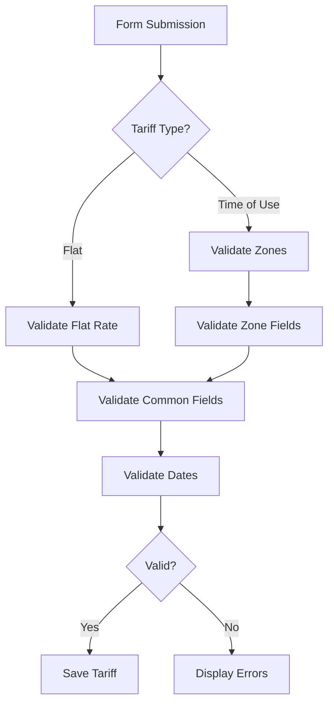

# TariffResource Validation Reference

## Overview

The `TariffResource` implements comprehensive validation rules that ensure data integrity for tariff management. All validation rules are explicitly defined using Filament's `->rules()` method and mirror the validation logic in `StoreTariffRequest` and `UpdateTariffRequest` to maintain consistency between the Filament UI and API endpoints.

## Validation Strategy

### Consistency Approach

The validation implementation follows these principles:

1. **Explicit Rule Declaration**: All fields use `->rules()` to declare validation rules explicitly
2. **Localized Messages**: All validation messages use translation keys for internationalization
3. **Conditional Validation**: Dynamic rules based on tariff type (flat vs. time-of-use)
4. **Nested Validation**: Individual validation for repeater fields and nested structures
5. **Pattern Matching**: Regex validation for complex formats (time, currency)

### Validation Flow



## Field Validation Rules

### Basic Information Section

#### provider_id

**Rules**: `required`, `exists:providers,id`

**Purpose**: Ensures a valid provider is selected from the database.

**Valid Examples**:
```php
'provider_id' => 1  // Existing provider ID
```

**Invalid Examples**:
```php
'provider_id' => null       // Missing (required)
'provider_id' => 99999      // Non-existent provider
'provider_id' => 'invalid'  // Wrong type
```

**Error Messages**:
- `required`: "tariffs.validation.provider_id.required"
- `exists`: "tariffs.validation.provider_id.exists"

---

#### name

**Rules**: `required`, `string`, `max:255`

**Purpose**: Validates the tariff name is present and within length limits.

**Valid Examples**:
```php
'name' => 'Standard Electricity Rate'
'name' => 'Night Tariff 2024'
```

**Invalid Examples**:
```php
'name' => null                    // Missing (required)
'name' => str_repeat('a', 256)   // Too long (max 255)
'name' => 12345                   // Not a string
```

**Error Messages**:
- `required`: "tariffs.validation.name.required"
- `string`: "tariffs.validation.name.string"
- `max`: "tariffs.validation.name.max"

---

### Effective Period Section

#### active_from

**Rules**: `required`, `date`

**Purpose**: Ensures the tariff has a valid start date.

**Valid Examples**:
```php
'active_from' => '2024-01-01'
'active_from' => now()->toDateString()
```

**Invalid Examples**:
```php
'active_from' => null            // Missing (required)
'active_from' => 'invalid-date'  // Invalid format
'active_from' => '2024-13-45'    // Invalid date
```

**Error Messages**:
- `required`: "tariffs.validation.active_from.required"
- `date`: "tariffs.validation.active_from.date"

---

#### active_until

**Rules**: `nullable`, `date`, `after:active_from`

**Purpose**: Validates the end date is after the start date (if provided).

**Valid Examples**:
```php
'active_until' => null                    // Optional field
'active_until' => '2024-12-31'           // Valid future date
'active_from' => '2024-01-01',
'active_until' => '2024-06-30'           // After start date
```

**Invalid Examples**:
```php
'active_from' => '2024-06-01',
'active_until' => '2024-05-31'           // Before start date
'active_until' => 'invalid-date'         // Invalid format
```

**Error Messages**:
- `after`: "tariffs.validation.active_until.after"
- `date`: "tariffs.validation.active_until.date"

---

### Configuration Section

#### configuration.type

**Rules**: `required`, `string`, `in:flat,time_of_use`

**Purpose**: Validates the tariff type is one of the allowed values.

**Valid Examples**:
```php
'configuration.type' => 'flat'
'configuration.type' => 'time_of_use'
```

**Invalid Examples**:
```php
'configuration.type' => null          // Missing (required)
'configuration.type' => 'invalid'     // Not in allowed list
'configuration.type' => 123           // Not a string
```

**Error Messages**:
- `required`: "tariffs.validation.configuration.type.required"
- `string`: "tariffs.validation.configuration.type.string"
- `in`: "tariffs.validation.configuration.type.in"

---

#### configuration.currency

**Rules**: `required`, `string`, `in:EUR`

**Purpose**: Validates the currency is EUR (currently the only supported currency).

**Valid Examples**:
```php
'configuration.currency' => 'EUR'
```

**Invalid Examples**:
```php
'configuration.currency' => null      // Missing (required)
'configuration.currency' => 'USD'     // Not supported
'configuration.currency' => 'eur'     // Wrong case
```

**Error Messages**:
- `required`: "tariffs.validation.configuration.currency.required"
- `string`: "tariffs.validation.configuration.currency.string"
- `in`: "tariffs.validation.configuration.currency.in"

---

#### configuration.rate (Flat Tariff Only)

**Rules**: 
- `required` (when type is 'flat')
- `nullable` (when type is not 'flat')
- `numeric`
- `min:0`

**Purpose**: Validates the flat rate is a positive number when tariff type is flat.

**Conditional Logic**:
```php
fn (Get $get): string => $get('configuration.type') === 'flat' ? 'required' : 'nullable'
```

**Valid Examples**:
```php
// When type is 'flat'
'configuration.rate' => 0.15
'configuration.rate' => 0.1234  // Up to 4 decimal places

// When type is 'time_of_use'
'configuration.rate' => null    // Not required
```

**Invalid Examples**:
```php
// When type is 'flat'
'configuration.rate' => null      // Missing (required for flat)
'configuration.rate' => -0.15     // Negative (min:0)
'configuration.rate' => 'abc'     // Not numeric
```

**Error Messages**:
- `required`: "tariffs.validation.configuration.rate.required_if"
- `numeric`: "tariffs.validation.configuration.rate.numeric"
- `min`: "tariffs.validation.configuration.rate.min"

---

### Time-of-Use Configuration

#### configuration.zones (Time-of-Use Only)

**Rules**:
- `required` (when type is 'time_of_use')
- `nullable` (when type is not 'time_of_use')
- `array`
- `min:1`

**Purpose**: Validates that time-of-use tariffs have at least one zone defined.

**Conditional Logic**:
```php
fn (Get $get): string => $get('configuration.type') === 'time_of_use' ? 'required' : 'nullable'
```

**Valid Examples**:
```php
// When type is 'time_of_use'
'configuration.zones' => [
    [
        'id' => 'day',
        'start' => '07:00',
        'end' => '23:00',
        'rate' => 0.20
    ]
]

// When type is 'flat'
'configuration.zones' => null  // Not required
```

**Invalid Examples**:
```php
// When type is 'time_of_use'
'configuration.zones' => null      // Missing (required)
'configuration.zones' => []        // Empty array (min:1)
'configuration.zones' => 'string'  // Not an array
```

**Error Messages**:
- `required`: "tariffs.validation.configuration.zones.required_if"
- `array`: "tariffs.validation.configuration.zones.array"
- `min`: "tariffs.validation.configuration.zones.min"

---

#### configuration.zones.*.id

**Rules**: `required`, `string`

**Purpose**: Validates each zone has a unique identifier.

**Valid Examples**:
```php
'id' => 'day'
'id' => 'night'
'id' => 'peak_hours'
```

**Invalid Examples**:
```php
'id' => null      // Missing (required)
'id' => 123       // Not a string
'id' => ''        // Empty string
```

**Error Messages**:
- `required`: "tariffs.validation.configuration.zones.id.required_with"
- `string`: "tariffs.validation.configuration.zones.id.string"

---

#### configuration.zones.*.start

**Rules**: `required`, `string`, `regex:/^([0-1][0-9]|2[0-3]):[0-5][0-9]$/`

**Purpose**: Validates the start time is in HH:MM format (24-hour).

**Regex Breakdown**:
- `([0-1][0-9]|2[0-3])`: Hours 00-23
- `:`: Colon separator
- `[0-5][0-9]`: Minutes 00-59

**Valid Examples**:
```php
'start' => '00:00'
'start' => '07:30'
'start' => '23:59'
```

**Invalid Examples**:
```php
'start' => null         // Missing (required)
'start' => '25:00'      // Invalid hour (>23)
'start' => '12:60'      // Invalid minute (>59)
'start' => '7:30'       // Missing leading zero
'start' => '07:30:00'   // Includes seconds
```

**Error Messages**:
- `required`: "tariffs.validation.configuration.zones.start.required_with"
- `string`: "tariffs.validation.configuration.zones.start.string"
- `regex`: "tariffs.validation.configuration.zones.start.regex"

---

#### configuration.zones.*.end

**Rules**: `required`, `string`, `regex:/^([0-1][0-9]|2[0-3]):[0-5][0-9]$/`

**Purpose**: Validates the end time is in HH:MM format (24-hour).

**Valid Examples**:
```php
'end' => '23:59'
'end' => '17:00'
'end' => '00:00'
```

**Invalid Examples**:
```php
'end' => null         // Missing (required)
'end' => '24:00'      // Invalid hour (>23)
'end' => '12:70'      // Invalid minute (>59)
'end' => '17'         // Missing minutes
```

**Error Messages**:
- `required`: "tariffs.validation.configuration.zones.end.required_with"
- `string`: "tariffs.validation.configuration.zones.end.string"
- `regex`: "tariffs.validation.configuration.zones.end.regex"

---

#### configuration.zones.*.rate

**Rules**: `required`, `numeric`, `min:0`

**Purpose**: Validates each zone has a positive rate.

**Valid Examples**:
```php
'rate' => 0.20
'rate' => 0.1234  // Up to 4 decimal places
'rate' => 0       // Zero is valid
```

**Invalid Examples**:
```php
'rate' => null      // Missing (required)
'rate' => -0.20     // Negative (min:0)
'rate' => 'abc'     // Not numeric
```

**Error Messages**:
- `required`: "tariffs.validation.configuration.zones.rate.required_with"
- `numeric`: "tariffs.validation.configuration.zones.rate.numeric"
- `min`: "tariffs.validation.configuration.zones.rate.min"

---

#### configuration.weekend_logic

**Rules**: `nullable`, `string`, `in:apply_night_rate,apply_day_rate,apply_weekend_rate`

**Purpose**: Validates the weekend logic option (if provided).

**Valid Examples**:
```php
'weekend_logic' => null                      // Optional
'weekend_logic' => 'apply_night_rate'
'weekend_logic' => 'apply_day_rate'
'weekend_logic' => 'apply_weekend_rate'
```

**Invalid Examples**:
```php
'weekend_logic' => 'invalid_option'  // Not in allowed list
'weekend_logic' => 123               // Not a string
```

**Error Messages**:
- `string`: "tariffs.validation.configuration.weekend_logic.string"
- `in`: "tariffs.validation.configuration.weekend_logic.in"

---

#### configuration.fixed_fee

**Rules**: `nullable`, `numeric`, `min:0`

**Purpose**: Validates the fixed fee is a positive number (if provided).

**Valid Examples**:
```php
'fixed_fee' => null    // Optional
'fixed_fee' => 5.00
'fixed_fee' => 12.99
'fixed_fee' => 0       // Zero is valid
```

**Invalid Examples**:
```php
'fixed_fee' => -5.00   // Negative (min:0)
'fixed_fee' => 'abc'   // Not numeric
```

**Error Messages**:
- `numeric`: "tariffs.validation.configuration.fixed_fee.numeric"
- `min`: "tariffs.validation.configuration.fixed_fee.min"

---

## Testing Validation

### Property Tests

The validation rules are tested using property-based tests in:
- `tests/Feature/Filament/FilamentTariffValidationConsistencyPropertyTest.php`

These tests verify:
1. All validation rules work correctly
2. Error messages are displayed for invalid data
3. Valid data passes validation
4. Conditional validation works based on tariff type

### Running Validation Tests

```bash
# Run all tariff validation tests
php artisan test --filter=FilamentTariffValidation

# Run specific validation test
php artisan test --filter=FilamentTariffValidationConsistencyPropertyTest
```

## Localization

All validation messages use translation keys from `lang/{locale}/tariffs.php`:

```php
// Example translation structure
'validation' => [
    'provider_id' => [
        'required' => 'Provider is required.',
        'exists' => 'Selected provider does not exist.',
    ],
    'name' => [
        'required' => 'Tariff name is required.',
        'string' => 'Tariff name must be text.',
        'max' => 'Tariff name cannot exceed 255 characters.',
    ],
    // ... more validation messages
],
```

## Common Validation Scenarios

### Creating a Flat Tariff

```php
// Valid flat tariff data
[
    'provider_id' => 1,
    'name' => 'Standard Electricity Rate',
    'active_from' => '2024-01-01',
    'active_until' => '2024-12-31',
    'configuration' => [
        'type' => 'flat',
        'currency' => 'EUR',
        'rate' => 0.15,
        'fixed_fee' => 5.00,
    ],
]
```

### Creating a Time-of-Use Tariff

```php
// Valid time-of-use tariff data
[
    'provider_id' => 1,
    'name' => 'Day/Night Electricity Rate',
    'active_from' => '2024-01-01',
    'configuration' => [
        'type' => 'time_of_use',
        'currency' => 'EUR',
        'zones' => [
            [
                'id' => 'day',
                'start' => '07:00',
                'end' => '23:00',
                'rate' => 0.20,
            ],
            [
                'id' => 'night',
                'start' => '23:00',
                'end' => '07:00',
                'rate' => 0.10,
            ],
        ],
        'weekend_logic' => 'apply_night_rate',
        'fixed_fee' => 3.50,
    ],
]
```

## Troubleshooting

### Common Validation Errors

**Error**: "The provider id field is required."
- **Cause**: No provider selected
- **Solution**: Select a provider from the dropdown

**Error**: "The configuration.rate field is required when configuration.type is flat."
- **Cause**: Flat tariff without a rate
- **Solution**: Enter a rate value for flat tariffs

**Error**: "The configuration.zones field is required when configuration.type is time of use."
- **Cause**: Time-of-use tariff without zones
- **Solution**: Add at least one zone with start time, end time, and rate

**Error**: "The configuration.zones.0.start format is invalid."
- **Cause**: Invalid time format
- **Solution**: Use HH:MM format (e.g., 07:00, 23:30)

**Error**: "The active until field must be a date after active from."
- **Cause**: End date is before start date
- **Solution**: Ensure end date is after start date

## Related Documentation

- [TariffResource Overview](./tariff-resource.md)
- [Tariff Policy Documentation](../policies/tariff-policy.md)
- [Tariff Testing Guide](../testing/tariff-tests.md)
- [FormRequest Validation](../api/tariff-requests.md)
