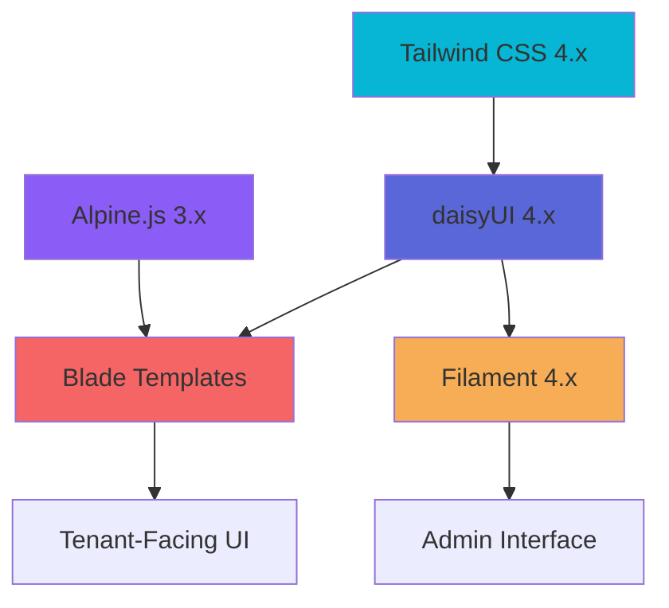

# Design System Integration - daisyUI

## Overview

This document describes the integration of daisyUI 4.x into the Vilnius Utilities Billing Platform, establishing a consistent design system across tenant-facing and admin interfaces.

## Date

**Integration Started**: 2025-11-29  
**Status**: Planning Phase  
**Target Completion**: Q1 2026

## Motivation

### Problems Addressed

1. **Inconsistent UI**: Custom Tailwind components lack consistency across the application
2. **Maintenance Burden**: Custom CSS and component code requires ongoing maintenance
3. **Accessibility Gaps**: Custom components don't consistently meet WCAG AA standards
4. **Developer Experience**: Verbose Tailwind utility classes reduce code readability
5. **Design Iteration**: Changes to design require updates across multiple files

### Benefits

1. **Consistency**: Unified design language across all interfaces
2. **Maintainability**: Reduced custom CSS and component code
3. **Accessibility**: Built-in WCAG 2.1 AA compliance
4. **Productivity**: Semantic component classes improve development speed
5. **Theming**: Easy theme customization and dark mode support

## Architecture

### Technology Stack

- **Base**: Tailwind CSS 4.x (via Vite compilation)
- **Component Library**: daisyUI 4.x
- **JavaScript**: Alpine.js 3.x (CDN)
- **Admin Interface**: Filament 4.x (with custom theming)
- **Template Engine**: Blade (following blade-guardrails.md)

### Integration Points



### Directory Structure

```
design/
├── README.md                          # Design system overview
├── INTEGRATION_GUIDE.md               # Step-by-step integration
├── COMPONENT_AUDIT.md                 # Component inventory
├── MIGRATION_PLAN.md                  # Migration strategy
├── components/                        # Component documentation
│   ├── actions/                       # Buttons, dropdowns, modals
│   ├── data-display/                  # Cards, badges, tables
│   ├── data-input/                    # Forms, inputs, selects
│   ├── feedback/                      # Alerts, toasts, progress
│   ├── layout/                        # Containers, dividers
│   └── navigation/                    # Navbar, breadcrumbs, tabs
├── themes/                            # Custom theme configurations
│   ├── default.json                   # Default theme
│   ├── dark.json                      # Dark mode theme
│   └── custom.json                    # Custom brand theme
├── examples/                          # Usage examples
│   ├── dashboard.blade.php            # Dashboard example
│   ├── forms.blade.php                # Form examples
│   ├── tables.blade.php               # Table examples
│   └── modals.blade.php               # Modal examples
└── tokens/                            # Design tokens
    ├── colors.md                      # Color palette
    ├── typography.md                  # Typography scale
    ├── spacing.md                     # Spacing system
    └── shadows.md                     # Shadow system
```

## Implementation Details

### Configuration

#### Tailwind Configuration

```javascript
// tailwind.config.js
export default {
  content: [
    "./resources/**/*.blade.php",
    "./resources/**/*.js",
    "./app/Filament/**/*.php",
    "./vendor/filament/**/*.blade.php",
  ],
  theme: {
    extend: {
      // Custom theme extensions
    },
  },
  plugins: [
    require('daisyui'),
  ],
  daisyui: {
    themes: [
      {
        light: {
          "primary": "#3b82f6",
          "secondary": "#8b5cf6",
          "accent": "#10b981",
          "neutral": "#1f2937",
          "base-100": "#ffffff",
          "info": "#3abff8",
          "success": "#36d399",
          "warning": "#fbbd23",
          "error": "#f87272",
        },
        dark: {
          "primary": "#60a5fa",
          "secondary": "#a78bfa",
          "accent": "#34d399",
          "neutral": "#374151",
          "base-100": "#1f2937",
          "info": "#3abff8",
          "success": "#36d399",
          "warning": "#fbbd23",
          "error": "#f87272",
        },
      },
    ],
    darkTheme: "dark",
    base: true,
    styled: true,
    utils: true,
  },
}
```

#### Filament Integration

```php
// app/Providers/Filament/AdminPanelProvider.php
public function panel(Panel $panel): Panel
{
    return $panel
        ->default()
        ->id('admin')
        ->path('admin')
        ->colors([
            'primary' => '#3b82f6', // daisyUI primary
        ])
        ->viteTheme('resources/css/filament/admin/theme.css')
        ->darkMode(true)
        // ... other configuration
}
```

### Component Examples

#### Button Component

```blade
<!-- Before: Custom Tailwind -->
<button class="px-4 py-2 bg-blue-500 text-white rounded hover:bg-blue-600 focus:outline-none focus:ring-2 focus:ring-blue-500 focus:ring-offset-2">
    {{ __('Save Changes') }}
</button>

<!-- After: daisyUI -->
<button class="btn btn-primary">
    {{ __('Save Changes') }}
</button>
```

#### Card Component

```blade
<!-- Before: Custom Tailwind -->
<div class="bg-white rounded-lg shadow-md p-6">
    <h3 class="text-lg font-semibold mb-2">{{ __('Property Details') }}</h3>
    <p>{{ $property->address }}</p>
    <div class="mt-4 flex justify-end">
        <button class="px-4 py-2 bg-blue-500 text-white rounded">
            {{ __('View Details') }}
        </button>
    </div>
</div>

<!-- After: daisyUI -->
<div class="card bg-base-100 shadow-xl">
    <div class="card-body">
        <h2 class="card-title">{{ __('Property Details') }}</h2>
        <p>{{ $property->address }}</p>
        <div class="card-actions justify-end">
            <button class="btn btn-primary">{{ __('View Details') }}</button>
        </div>
    </div>
</div>
```

#### Alert Component

```blade
<!-- Before: Custom Tailwind -->
@if (session('success'))
    <div class="bg-green-100 border border-green-400 text-green-700 px-4 py-3 rounded relative" role="alert">
        <span class="block sm:inline">{{ session('success') }}</span>
    </div>
@endif

<!-- After: daisyUI -->
@if (session('success'))
    <div class="alert alert-success shadow-lg">
        <div>
            <svg xmlns="http://www.w3.org/2000/svg" class="stroke-current flex-shrink-0 h-6 w-6" fill="none" viewBox="0 0 24 24">
                <path stroke-linecap="round" stroke-linejoin="round" stroke-width="2" d="M9 12l2 2 4-4m6 2a9 9 0 11-18 0 9 9 0 0118 0z" />
            </svg>
            <span>{{ session('success') }}</span>
        </div>
    </div>
@endif
```

## Multi-Tenancy Considerations

### Tenant-Aware Components

All components respect tenant context through middleware and view composers:

```blade
{{-- Tenant-scoped data display --}}
<div class="stats shadow">
    <div class="stat">
        <div class="stat-title">{{ __('Total Properties') }}</div>
        <div class="stat-value">{{ $tenantProperties->count() }}</div>
        <div class="stat-desc">{{ __('In your portfolio') }}</div>
    </div>
</div>
```

### Role-Based UI

Components adapt based on user role (provided by view composers):

```blade
<ul class="menu bg-base-200 w-56 rounded-box">
    @if ($userRole === 'superadmin')
        <li><a href="{{ route('admin.organizations.index') }}">{{ __('Organizations') }}</a></li>
    @endif
    
    @if (in_array($userRole, ['admin', 'manager']))
        <li><a href="{{ route('admin.properties.index') }}">{{ __('Properties') }}</a></li>
    @endif
    
    <li><a href="{{ route('tenant.dashboard') }}">{{ __('Dashboard') }}</a></li>
</ul>
```

## Accessibility

### WCAG 2.1 AA Compliance

daisyUI components meet WCAG 2.1 AA standards out of the box:

1. **Color Contrast**: All theme colors meet minimum contrast ratios
2. **Keyboard Navigation**: All interactive elements are keyboard accessible
3. **ARIA Attributes**: Proper ARIA labels and roles included
4. **Focus Indicators**: Visible focus states for all interactive elements
5. **Screen Reader Support**: Semantic HTML and descriptive labels

### Accessibility Testing

```php
// tests/Feature/AccessibilityTest.php
it('maintains WCAG AA color contrast', function () {
    $this->get(route('dashboard'))
        ->assertOk();
    
    // Verify color contrast ratios meet WCAG AA standards
    // This would typically use an automated accessibility testing tool
});

it('supports keyboard navigation', function () {
    $this->get(route('dashboard'))
        ->assertSee('tabindex', false);
    
    // Verify all interactive elements are keyboard accessible
});
```

## Performance

### Bundle Size Impact

- **Before**: ~150KB CSS (uncompressed)
- **After**: ~180KB CSS (includes daisyUI)
- **Impact**: +30KB (~20% increase)

### Optimization Strategies

1. **Tailwind Purging**: Remove unused daisyUI components
2. **CDN Delivery**: Use CDN for Alpine.js
3. **Lazy Loading**: Load non-critical components on demand
4. **Code Splitting**: Separate admin and tenant CSS bundles

### Performance Metrics

```bash
# Before migration
npm run build
# CSS: 150KB (uncompressed), 25KB (gzipped)

# After migration
npm run build
# CSS: 180KB (uncompressed), 30KB (gzipped)
```

## Testing Strategy

### Component Testing

```php
// tests/Feature/ComponentTest.php
it('renders button with correct daisyUI classes', function () {
    $view = $this->blade('<button class="btn btn-primary">Test</button>');
    
    $view->assertSee('Test');
    $view->assertSee('btn btn-primary', false);
});

it('applies theme correctly', function () {
    $this->get(route('dashboard'))
        ->assertSee('data-theme="light"', false);
});
```

### Visual Regression Testing

Use Percy or Chromatic for visual regression testing:

```bash
# Take baseline screenshots
npm run percy:snapshot

# Compare after changes
npm run percy:compare
```

## Migration Plan

### Phase 1: Foundation Components (Weeks 2-3)
- Buttons
- Alerts
- Badges

### Phase 2: Layout Components (Weeks 4-5)
- Navigation
- Breadcrumbs
- Footer

### Phase 3: Data Display Components (Weeks 6-7)
- Cards
- Stat Cards
- Tables

### Phase 4: Form Components (Weeks 8-9)
- Text Inputs
- Select Dropdowns
- Checkboxes/Radios
- Textareas

### Phase 5: Interactive Components (Weeks 10-11)
- Modals
- Dropdowns
- Tabs

### Phase 6: Filament Integration (Week 12)
- Theme harmonization
- Component styling
- Testing

### Phase 7: Finalization (Week 13)
- Code cleanup
- Documentation
- Deployment

## Rollback Plan

### Rollback Triggers

- Critical functionality broken
- Performance degradation >20%
- Accessibility compliance failure
- Security vulnerability introduced

### Rollback Procedure

1. Revert to previous Git commit
2. Deploy previous version
3. Investigate root cause
4. Plan remediation

## Documentation

### Component Documentation

Each component category has dedicated documentation:

- `design/components/actions/` - Action components (buttons, dropdowns, modals)
- `design/components/data-display/` - Data display components (cards, badges, tables)
- `design/components/data-input/` - Form components (inputs, selects, checkboxes)
- `design/components/feedback/` - Feedback components (alerts, toasts, progress)
- `design/components/layout/` - Layout components (containers, dividers, grids)
- `design/components/navigation/` - Navigation components (navbar, breadcrumbs, tabs)

### Usage Examples

See `design/examples/` for complete usage examples:

- `dashboard.blade.php` - Dashboard layout with stats and cards
- `forms.blade.php` - Form layouts with validation
- `tables.blade.php` - Data tables with sorting and filtering
- `modals.blade.php` - Modal dialogs with Alpine.js

## Related Documentation

- [Design System Overview](../overview/readme.md)
- [Integration Guide](../guides/INTEGRATION_GUIDE.md)
- [Component Audit](../misc/COMPONENT_AUDIT.md)
- [Migration Plan](../misc/MIGRATION_PLAN.md)
- [Frontend Guide](FRONTEND.md)
- [Blade Components](BLADE_COMPONENTS.md)
- [View Composers](VIEW_COMPOSERS.md)

## Changelog

### 2025-11-29
- Initial design system documentation created
- daisyUI 4.x integration planned
- Component audit completed
- Migration plan established

## Next Steps

1. **Week 1**: Complete Phase 0 (Preparation)
   - Install daisyUI
   - Configure Tailwind
   - Set up documentation
   - Train team

2. **Weeks 2-3**: Complete Phase 1 (Foundation Components)
   - Migrate buttons
   - Migrate alerts
   - Migrate badges

3. **Ongoing**: Continue phased migration per plan

## Support

For questions or issues:
- Review [Integration Guide](../guides/INTEGRATION_GUIDE.md)
- Check [Component Audit](../misc/COMPONENT_AUDIT.md)
- Consult [Migration Plan](../misc/MIGRATION_PLAN.md)
- Contact design system team

---

**Maintained by**: Frontend Team  
**Last Updated**: 2025-11-29  
**Next Review**: 2026-01-29
