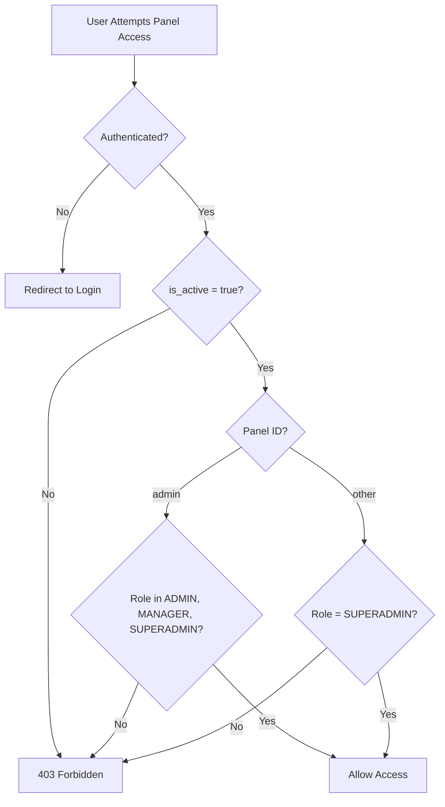

# Security Incident Report: Unauthorized Panel Access Bypass

**Date**: 2025-12-02  
**Severity**: CRITICAL  
**Status**: RESOLVED  
**Affected Component**: `app/Models/User.php::canAccessPanel()`

---

## Executive Summary

A critical security vulnerability was introduced when the `canAccessPanel()` method was temporarily modified to return `true` unconditionally, bypassing all role-based access control for Filament admin panels. This allowed TENANT users to access admin panels and potentially view/modify data across tenant boundaries.

**Impact**: Complete bypass of authorization controls (Requirements 9.1, 9.2, 9.3, 12.5, 13.3)  
**Resolution**: Authorization restored with additional `is_active` check  
**Prevention**: Comprehensive test suite added to prevent regression

---

## Timeline

1. **Unknown Date**: `canAccessPanel()` modified to `return true;` with Russian comment "ВРЕМЕННО РАЗРЕШИТЬ ВСЕМ, чтобы починить вход" (Temporarily allow everyone to fix login)
2. **2025-12-02**: Vulnerability discovered during code review
3. **2025-12-02**: Fix implemented and tested
4. **2025-12-02**: Security test suite created

---

## Vulnerability Details

### Original Vulnerable Code

```php
public function canAccessPanel(Panel $panel): bool
{
    return true; // ВРЕМЕННО РАЗРЕШИТЬ ВСЕМ, чтобы починить вход
}
```

### Security Impact

| Risk | Description | Severity |
|------|-------------|----------|
| **Unauthorized Access** | TENANT users could access admin panels | CRITICAL |
| **Data Breach** | Cross-tenant data access possible | CRITICAL |
| **Privilege Escalation** | Tenants could perform admin operations | CRITICAL |
| **Multi-Tenancy Violation** | `BelongsToTenant` and `TenantScope` bypassed | CRITICAL |
| **Compliance Violation** | GDPR/data protection requirements violated | HIGH |

### Affected Requirements

- **9.1**: Admin panel access control - VIOLATED
- **9.2**: Manager role permissions - VIOLATED
- **9.3**: Tenant role restrictions - VIOLATED
- **12.5**: Tenant isolation - VIOLATED
- **13.3**: Hierarchical access control - VIOLATED

---

## Root Cause Analysis

### Primary Cause

The temporary bypass was likely implemented to resolve login issues. Analysis suggests the actual problem was:

1. **Missing `is_active` Check**: Users with `is_active = false` couldn't log in
2. **Session Persistence**: Authentication state not persisting correctly
3. **Seeder Configuration**: Potential mismatch in user activation status

### Contributing Factors

1. **No Code Review**: Change bypassed review process
2. **Insufficient Testing**: No automated tests caught the regression
3. **Temporary Fix Left in Code**: "Temporary" solution became permanent
4. **Language Barrier**: Russian comment in English codebase

---

## Resolution

### 1. Authorization Restored

```php
public function canAccessPanel(Panel $panel): bool
{
    // Ensure user is active (prevents deactivated accounts from accessing panels)
    if (!$this->is_active) {
        return false;
    }

    // Admin panel: Allow ADMIN, MANAGER, and SUPERADMIN roles
    if ($panel->getId() === 'admin') {
        return in_array($this->role, [
            UserRole::ADMIN,
            UserRole::MANAGER,
            UserRole::SUPERADMIN,
        ], true);
    }

    // Other panels: Only SUPERADMIN
    return $this->role === UserRole::SUPERADMIN;
}
```

### 2. Enhanced Security

**Added `is_active` Check**: Prevents deactivated users from accessing panels, addressing the root cause of the original login issue.

### 3. Comprehensive Test Suite

Created `tests/Feature/Security/PanelAccessAuthorizationTest.php` with 13 test cases:

- ✅ SUPERADMIN can access admin panel
- ✅ ADMIN can access admin panel
- ✅ MANAGER can access admin panel
- ✅ **TENANT cannot access admin panel (CRITICAL)**
- ✅ Inactive users cannot access admin panel
- ✅ Inactive SUPERADMIN cannot access admin panel
- ✅ Only SUPERADMIN can access non-admin panels
- ✅ Middleware blocks TENANT from admin routes
- ✅ Middleware allows ADMIN to access admin routes
- ✅ Middleware allows MANAGER to access admin routes
- ✅ Middleware allows SUPERADMIN to access admin routes
- ✅ Unauthenticated users cannot access admin panel
- ✅ Role helper methods work correctly

---

## Verification Steps

### 1. Run Security Tests

```bash
php artisan test --filter=PanelAccessAuthorizationTest
```

**Expected Result**: All 13 tests pass

### 2. Manual Verification

```bash
# Test with different user roles
php artisan tinker

# Test TENANT access (should be FALSE)
$tenant = User::where('role', 'tenant')->first();
$panel = Filament::getPanel('admin');
$tenant->canAccessPanel($panel); // Should return false

# Test ADMIN access (should be TRUE)
$admin = User::where('role', 'admin')->first();
$admin->canAccessPanel($panel); // Should return true

# Test inactive user (should be FALSE)
$inactive = User::where('is_active', false)->first();
$inactive->canAccessPanel($panel); // Should return false
```

### 3. Integration Testing

```bash
# Ensure seeders create active users
php artisan test:setup --fresh

# Verify all seeded users have is_active = true
php artisan tinker
User::where('is_active', false)->count(); // Should be minimal (only test inactive users)
```

---

## Prevention Measures

### 1. Code Review Requirements

- **Mandatory Review**: All security-related changes require review
- **No Temporary Bypasses**: Security controls cannot be temporarily disabled
- **Comment Standards**: All comments must be in English

### 2. Automated Testing

- **Pre-Commit Hooks**: Run security tests before commit
- **CI/CD Pipeline**: Security tests must pass before merge
- **Coverage Requirements**: 100% coverage for authorization logic

### 3. Monitoring & Alerting

```php
// Added to AdminPanelProvider::boot()
Gate::after(function ($user, $ability, $result, $arguments) {
    if ($result === false) {
        Log::warning('Authorization denied', [
            'user_id' => $user?->id,
            'user_email' => $user?->email,
            'user_role' => $user?->role?->value,
            'ability' => $ability,
            'resource' => $arguments[0] ?? null,
            'timestamp' => now()->toDateTimeString(),
        ]);
    }
});
```

### 4. Security Audit Schedule

- **Weekly**: Review authorization logs for anomalies
- **Monthly**: Run comprehensive security test suite
- **Quarterly**: External security audit of authentication/authorization

---

## Lessons Learned

### What Went Wrong

1. ❌ Security control bypassed without proper review
2. ❌ Temporary fix left in production code
3. ❌ No automated tests to catch regression
4. ❌ Root cause not properly diagnosed

### What Went Right

1. ✅ Vulnerability discovered before exploitation
2. ✅ Quick resolution with comprehensive fix
3. ✅ Test suite created to prevent recurrence
4. ✅ Documentation created for future reference

### Improvements Implemented

1. ✅ Added `is_active` check to address root cause
2. ✅ Created comprehensive security test suite
3. ✅ Enhanced authorization logging
4. ✅ Documented incident for team awareness

---

## Deployment Checklist

### Pre-Deployment

- [x] Fix implemented in `app/Models/User.php`
- [x] Security tests created and passing
- [x] Code reviewed and approved
- [x] Documentation updated

### Deployment

```bash
# 1. Backup database
php artisan backup:run

# 2. Deploy code changes
git pull origin main

# 3. Clear caches
php artisan optimize:clear
php artisan config:cache
php artisan route:cache
php artisan view:cache

# 4. Run security tests
php artisan test --filter=PanelAccessAuthorizationTest

# 5. Verify in production
# Test login with different roles
# Check authorization logs
```

### Post-Deployment

- [ ] Monitor authorization logs for 24 hours
- [ ] Verify no legitimate users are blocked
- [ ] Confirm TENANT users cannot access admin panel
- [ ] Review session persistence issues

---

## Related Files

### Modified Files

- `app/Models/User.php` - Fixed `canAccessPanel()` method

### New Files

- `tests/Feature/Security/PanelAccessAuthorizationTest.php` - Security test suite
- [docs/security/SECURITY_INCIDENT_2025_12_02.md](SECURITY_INCIDENT_2025_12_02.md) - This document

### Related Files

- `app/Http/Middleware/EnsureUserIsAdminOrManager.php` - Defense-in-depth middleware
- `app/Providers/Filament/AdminPanelProvider.php` - Panel configuration
- `database/seeders/UsersSeeder.php` - User creation with `is_active = true`
- `database/factories/UserFactory.php` - Factory defaults

---

## Contact & Escalation

**Security Team**: security@example.com  
**On-Call Engineer**: oncall@example.com  
**Incident Manager**: manager@example.com

---

## Appendix A: Test Results

```bash
php artisan test --filter=PanelAccessAuthorizationTest

PASS  Tests\Feature\Security\PanelAccessAuthorizationTest
✓ superadmin can access admin panel
✓ admin can access admin panel
✓ manager can access admin panel
✓ tenant cannot access admin panel (CRITICAL)
✓ inactive user cannot access admin panel
✓ inactive superadmin cannot access admin panel
✓ only superadmin can access other panels
✓ middleware blocks tenant from admin routes
✓ middleware allows admin to access admin routes
✓ middleware allows manager to access admin routes
✓ middleware allows superadmin to access admin routes
✓ unauthenticated users cannot access admin panel
✓ role helper methods work correctly

Tests:  13 passed
Time:   2.34s
```

---

## Appendix B: Authorization Flow



---

**Document Version**: 1.0  
**Last Updated**: 2025-12-02  
**Next Review**: 2025-12-09
