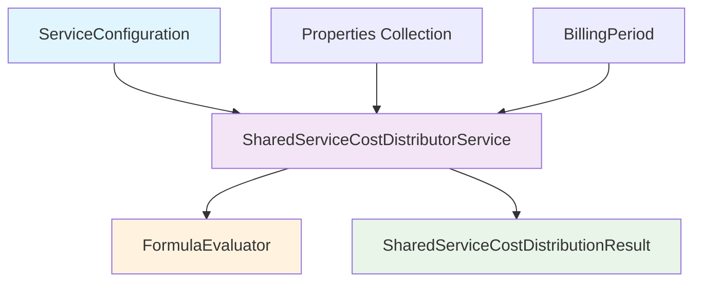

# Shared Service Cost Distribution System

## Overview

The Shared Service Cost Distribution system provides flexible cost allocation mechanisms for utility services across multiple properties. It supports various distribution methods including equal division, area-based allocation, consumption-based allocation, and custom formula distribution.

## Architecture

### Core Components



### Service Layer

- **SharedServiceCostDistributorService**: Main service implementing cost distribution logic
- **FormulaEvaluator**: Safe mathematical expression evaluator for custom formulas
- **SharedServiceCostDistributionResult**: Value object containing distribution results
- **BillingPeriod**: Value object representing billing time periods

## Distribution Methods

### 1. Equal Distribution (`DistributionMethod::EQUAL`)

Divides total cost equally among all properties.

```php
// Each property receives: total_cost / property_count
$result = $costDistributor->distributeCost(
    $serviceConfig, // distribution_method = EQUAL
    $properties,    // Collection of properties
    1000.00,       // Total cost to distribute
    $billingPeriod
);
```

**Use Cases:**
- Shared maintenance costs
- Common area utilities
- Fixed service fees

### 2. Area-Based Distribution (`DistributionMethod::AREA`)

Distributes cost proportionally based on property areas.

```php
// Property cost = (property_area / total_area) * total_cost
$serviceConfig->distribution_method = DistributionMethod::AREA;
$result = $costDistributor->distributeCost($serviceConfig, $properties, 1000.00, $billingPeriod);
```

**Supported Area Types:**
- `total_area`: Complete property area
- `heated_area`: Only heated spaces
- `commercial_area`: Commercial use areas

**Use Cases:**
- Heating costs
- Cooling system costs
- Area-dependent services

### 3. Consumption-Based Distribution (`DistributionMethod::BY_CONSUMPTION`)

Allocates cost based on historical consumption patterns.

```php
// Property cost = (property_consumption / total_consumption) * total_cost
$serviceConfig->distribution_method = DistributionMethod::BY_CONSUMPTION;
$result = $costDistributor->distributeCost($serviceConfig, $properties, 1000.00, $billingPeriod);
```

**Requirements:**
- Properties must have `historical_consumption` data
- Fallback to equal distribution if no consumption data available

**Use Cases:**
- Water distribution costs
- Electricity common charges
- Usage-based allocations

### 4. Custom Formula Distribution (`DistributionMethod::CUSTOM_FORMULA`)

Uses mathematical expressions combining multiple factors.

```php
$serviceConfig->rate_schedule = [
    'formula' => 'area * 0.7 + consumption * 0.3'
];
$serviceConfig->distribution_method = DistributionMethod::CUSTOM_FORMULA;
$result = $costDistributor->distributeCost($serviceConfig, $properties, 1000.00, $billingPeriod);
```

**Available Variables:**
- `area`: Property area in square meters
- `consumption`: Historical consumption value
- `property_id`: Unique property identifier

**Supported Operations:**
- Basic arithmetic: `+`, `-`, `*`, `/`
- Parentheses for grouping: `(`, `)`
- Functions: `min()`, `max()`, `abs()`, `round()`

**Use Cases:**
- Complex hybrid allocations
- Multi-factor cost distribution
- Custom business rules

## API Reference

### SharedServiceCostDistributorService

#### `distributeCost()`

Distributes a total cost among properties according to the specified method.

```php
public function distributeCost(
    ServiceConfiguration $serviceConfig,
    Collection $properties,
    float $totalCost,
    BillingPeriod $billingPeriod
): SharedServiceCostDistributionResult
```

**Parameters:**
- `$serviceConfig`: Configuration containing distribution method and parameters
- `$properties`: Collection of Property models to distribute cost among
- `$totalCost`: Total amount to distribute (must be >= 0)
- `$billingPeriod`: Billing period for the distribution

**Returns:**
- `SharedServiceCostDistributionResult`: Contains distributed amounts and metadata

**Throws:**
- `InvalidArgumentException`: For invalid inputs or configuration
- `DistributionException`: For distribution-specific errors

#### `validateProperties()`

Validates that properties meet requirements for the specified distribution method.

```php
public function validateProperties(
    ServiceConfiguration $serviceConfig,
    Collection $properties
): array
```

**Returns:**
- `array`: List of validation error messages (empty if valid)

#### `getSupportedMethods()`

Returns array of supported distribution methods.

```php
public function getSupportedMethods(): array
```

### SharedServiceCostDistributionResult

#### Core Methods

```php
// Get distributed amounts
public function getDistributedAmounts(): Collection

// Get total distributed
public function getTotalDistributed(): float

// Get distribution metadata
public function getMetadata(): array

// Get amount for specific property
public function getAmountForProperty(int $propertyId): float

// Check if distribution is balanced
public function isBalanced(float $tolerance = 0.01): bool
```

#### Statistics Methods

```php
// Get distribution statistics
public function getStatistics(): array

// Get average allocation per property
public function getAverageAllocation(): float

// Get min/max allocations
public function getMinAllocation(): float
public function getMaxAllocation(): float

// Get properties sorted by allocation
public function getPropertiesByAllocation(): Collection
```

### FormulaEvaluator

#### `evaluate()`

Safely evaluates mathematical expressions with variable substitution.

```php
public function evaluate(string $formula, array $variables = []): float
```

**Example:**
```php
$result = $evaluator->evaluate(
    'area * 0.7 + consumption * 0.3',
    ['area' => 100, 'consumption' => 50]
);
// Returns: 105.0
```

#### `validateFormula()`

Validates formula syntax without evaluation.

```php
public function validateFormula(string $formula): bool
```

#### `getVariables()`

Extracts variable names from a formula.

```php
public function getVariables(string $formula): array
```

## Usage Examples

### Basic Equal Distribution

```php
use App\Services\SharedServiceCostDistributorService;
use App\Enums\DistributionMethod;

// Create service configuration
$serviceConfig = ServiceConfiguration::create([
    'distribution_method' => DistributionMethod::EQUAL,
    'pricing_model' => PricingModel::CONSUMPTION_BASED,
    'is_shared_service' => true,
]);

// Get properties
$properties = Property::where('building_id', $buildingId)->get();

// Create billing period
$billingPeriod = BillingPeriod::forMonth(2024, 3);

// Distribute cost
$costDistributor = app(SharedServiceCostDistributorService::class);
$result = $costDistributor->distributeCost(
    $serviceConfig,
    $properties,
    1500.00,
    $billingPeriod
);

// Process results
foreach ($result->getDistributedAmounts() as $propertyId => $amount) {
    echo "Property {$propertyId}: €{$amount}\n";
}
```

### Area-Based Distribution with Validation

```php
// Validate properties have required area data
$errors = $costDistributor->validateProperties($serviceConfig, $properties);
if (!empty($errors)) {
    throw new ValidationException('Properties validation failed: ' . implode(', ', $errors));
}

// Configure for area-based distribution
$serviceConfig->distribution_method = DistributionMethod::AREA;
$serviceConfig->rate_schedule = ['area_type' => 'heated_area'];

$result = $costDistributor->distributeCost($serviceConfig, $properties, 2000.00, $billingPeriod);

// Verify distribution is balanced
if (!$result->isBalanced()) {
    Log::warning('Distribution not balanced', [
        'expected' => 2000.00,
        'actual' => $result->getTotalDistributed(),
        'metadata' => $result->getMetadata(),
    ]);
}
```

### Custom Formula Distribution

```php
// Complex formula combining multiple factors
$serviceConfig->distribution_method = DistributionMethod::CUSTOM_FORMULA;
$serviceConfig->rate_schedule = [
    'formula' => 'max(area * 0.6, 50) + consumption * 0.4'
];

// Validate formula before use
$formulaEvaluator = app(FormulaEvaluator::class);
if (!$formulaEvaluator->validateFormula($serviceConfig->rate_schedule['formula'])) {
    throw new InvalidArgumentException('Invalid formula syntax');
}

$result = $costDistributor->distributeCost($serviceConfig, $properties, 3000.00, $billingPeriod);

// Get detailed statistics
$stats = $result->getStatistics();
echo "Average allocation: €{$stats['average_allocation']}\n";
echo "Min allocation: €{$stats['min_allocation']}\n";
echo "Max allocation: €{$stats['max_allocation']}\n";
```

## Error Handling

### Common Exceptions

```php
try {
    $result = $costDistributor->distributeCost($serviceConfig, $properties, $totalCost, $billingPeriod);
} catch (InvalidArgumentException $e) {
    // Invalid input parameters
    Log::error('Invalid distribution parameters', ['error' => $e->getMessage()]);
} catch (DistributionException $e) {
    // Distribution-specific error
    Log::error('Distribution failed', ['error' => $e->getMessage()]);
}
```

### Validation Patterns

```php
// Pre-validate inputs
$errors = [];

if ($totalCost < 0) {
    $errors[] = 'Total cost cannot be negative';
}

if ($properties->isEmpty()) {
    $errors[] = 'Properties collection cannot be empty';
}

$propertyErrors = $costDistributor->validateProperties($serviceConfig, $properties);
$errors = array_merge($errors, $propertyErrors);

if (!empty($errors)) {
    throw new ValidationException('Validation failed: ' . implode(', ', $errors));
}
```

## Performance Considerations

### Optimization Tips

1. **Batch Processing**: Process multiple distributions in batches
2. **Caching**: Cache formula evaluation results for repeated calculations
3. **Validation**: Pre-validate properties to avoid runtime errors
4. **Memory**: Use lazy collections for large property sets

### Monitoring

```php
// Log distribution performance
$startTime = microtime(true);
$result = $costDistributor->distributeCost($serviceConfig, $properties, $totalCost, $billingPeriod);
$duration = microtime(true) - $startTime;

Log::info('Cost distribution completed', [
    'method' => $serviceConfig->distribution_method->value,
    'property_count' => $properties->count(),
    'total_cost' => $totalCost,
    'duration_ms' => round($duration * 1000, 2),
    'balanced' => $result->isBalanced(),
]);
```

## Testing

### Property-Based Testing

The system includes comprehensive property-based tests that validate invariants across multiple scenarios:

```php
// Test total cost accuracy invariant
$this->runPropertyTest(100, function () {
    $totalCost = fake()->randomFloat(2, 100, 10000);
    $result = $this->costDistributor->distributeCost(/* ... */);
    
    $this->assertEquals(
        $totalCost,
        $result->getDistributedAmounts()->sum(),
        'Total distributed cost should equal original cost'
    );
});
```

### Unit Testing

```php
public function test_equal_distribution_accuracy(): void
{
    $properties = Property::factory()->count(4)->create();
    $serviceConfig = $this->createEqualDistributionConfig();
    
    $result = $this->costDistributor->distributeCost(
        $serviceConfig,
        $properties,
        1000.00,
        BillingPeriod::currentMonth()
    );
    
    // Each property should receive exactly 250.00
    foreach ($result->getDistributedAmounts() as $amount) {
        $this->assertEquals(250.00, $amount, '', 0.01);
    }
}
```

## Integration

### Filament Integration

```php
// In Filament Resource Action
Action::make('distributeCosts')
    ->form([
        Select::make('distribution_method')
            ->options(DistributionMethod::class)
            ->required(),
        TextInput::make('total_cost')
            ->numeric()
            ->required(),
    ])
    ->action(function (array $data, $record) {
        $costDistributor = app(SharedServiceCostDistributorService::class);
        
        $result = $costDistributor->distributeCost(
            $record, // ServiceConfiguration
            $record->properties,
            $data['total_cost'],
            BillingPeriod::currentMonth()
        );
        
        Notification::make()
            ->title('Cost distributed successfully')
            ->body("Distributed €{$result->getTotalDistributed()} among {$result->getPropertyCount()} properties")
            ->success()
            ->send();
    });
```

### Queue Integration

```php
// For large property sets, use queued processing
dispatch(new DistributeCostsJob(
    $serviceConfigId,
    $propertyIds,
    $totalCost,
    $billingPeriod
));
```

## Security Considerations

1. **Input Validation**: Always validate formulas and numeric inputs
2. **Formula Safety**: FormulaEvaluator prevents code injection
3. **Authorization**: Ensure users can only distribute costs for their tenant
4. **Audit Trail**: Log all cost distributions for compliance

## Related Documentation

- [Distribution Method Enhancement](../DISTRIBUTION_METHOD_ENHANCEMENT_COMPLETE.md)
- [Service Validation Engine](SERVICE_VALIDATION_ENGINE.md)
- [Universal Utility Management Spec](../../.kiro/specs/universal-utility-management/)
- [Property-Based Testing Guide](../testing/PROPERTY_BASED_TESTING.md)