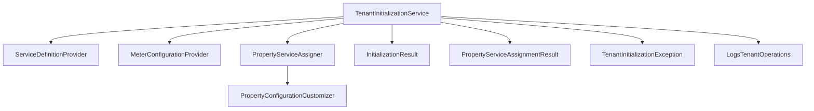

# Tenant Initialization Service Documentation

## Overview

The `TenantInitializationService` is a comprehensive service responsible for setting up new tenants with default utility service templates and property-level configurations in the multi-tenant utilities billing platform. It creates the foundational infrastructure for electricity, water, heating, and gas services while maintaining backward compatibility with existing heating systems.

## Architecture

### Core Components



### Service Dependencies

- **ServiceDefinitionProvider**: Provides default configurations for the four core utility services
- **MeterConfigurationProvider**: Creates meter configuration templates
- **PropertyServiceAssigner**: Handles assignment of services to properties
- **PropertyConfigurationCustomizer**: Customizes configurations based on property characteristics

## Key Features

### 1. Universal Service Initialization

Creates four default utility services for new tenants:

- **Electricity**: Time-of-use pricing with day/night zones
- **Water**: Consumption-based billing
- **Heating**: Hybrid pricing with seasonal adjustments and shared distribution
- **Gas**: Tiered rate structure

### 2. Property-Specific Configuration

Automatically configures services based on:

- **Property Type**: Commercial vs. residential rate structures
- **Property Size**: Enhanced monitoring for large properties (>200 sqm)
- **Building Type**: Shared services for apartment buildings
- **Regional Settings**: Lithuanian vs. EU defaults based on tenant locale

### 3. Provider Integration

Automatically assigns providers and tariffs based on:

- Service type mapping
- Active tariff periods
- Regional availability

## Usage Examples

### Basic Tenant Initialization

```php
use App\Services\TenantInitializationService;

$service = app(TenantInitializationService::class);

// Initialize universal services for a new tenant
$result = $service->initializeUniversalServices($tenant);

// Access created services
$electricityService = $result->getUtilityService('electricity');
$heatingConfig = $result->getMeterConfiguration('heating');

// Check initialization success
if ($result->isSuccessful()) {
    echo "Created {$result->getServiceCount()} services";
}
```

### Property Service Assignment

```php
// Initialize property-level service assignments
$configurations = $service->initializePropertyServiceAssignments(
    $tenant, 
    $result->utilityServices
);

// Access configurations for specific property
$propertyConfigs = $configurations->getPropertyConfigurations($propertyId);
$electricityConfig = $configurations->getPropertyServiceConfiguration($propertyId, 'electricity');

// Check assignment results
echo "Configured {$configurations->getPropertyCount()} properties";
echo "Total configurations: {$configurations->getTotalConfigurationCount()}";
```

### Meter Configuration Setup

```php
// Initialize default meter configurations
$meterConfigurations = $service->initializeDefaultMeterConfigurations(
    $tenant, 
    $serviceConfigurations
);

// Access meter configurations by property and service type
$propertyMeterConfigs = $meterConfigurations[$propertyId];
$electricityMeterConfig = $propertyMeterConfigs['electricity'];
```

### Heating Compatibility Check

```php
// Ensure backward compatibility with existing heating systems
$isCompatible = $service->ensureHeatingCompatibility($tenant);

if (!$isCompatible) {
    // Handle heating compatibility issues
    throw new TenantInitializationException('Heating service not compatible');
}
```

## Configuration Customization

### Property Type Adjustments

The service automatically applies different configurations based on property type:

#### Commercial Properties
- Higher utility rates
- Demand charges for electricity
- Commercial sewer charges for water
- Enhanced monitoring capabilities

#### Residential Properties
- Standard residential rates
- Basic monitoring
- Shared services for apartment buildings

#### Large Properties (>200 sqm)
- Enhanced monitoring enabled
- Large property flag set
- Specialized validation rules

### Regional Defaults

#### Lithuanian Settings (locale: 'lt' or timezone: 'Europe/Vilnius')
- Lithuanian utility rates (EUR/kWh, EUR/m³)
- 21% VAT rate
- Lithuanian heating season (October-April)
- Regional regulatory compliance

#### EU Default Settings
- Standard EU rates
- 20% VAT rate
- EUR currency
- EU regulatory region

## Service Definitions

### Electricity Service
```php
[
    'name' => 'Electricity Service',
    'unit_of_measurement' => 'kWh',
    'default_pricing_model' => PricingModel::TIME_OF_USE,
    'calculation_formula' => [
        'base_formula' => 'consumption * rate',
        'supports_zones' => true,
        'zone_multipliers' => ['day' => 1.0, 'night' => 0.7],
    ],
    'validation_rules' => [
        'max_consumption' => 10000,
        'variance_threshold' => 0.5,
        'require_monotonic' => true,
    ],
]
```

### Water Service
```php
[
    'name' => 'Water Service',
    'unit_of_measurement' => 'm³',
    'default_pricing_model' => PricingModel::CONSUMPTION_BASED,
    'validation_rules' => [
        'max_consumption' => 1000,
        'variance_threshold' => 0.3,
        'require_monotonic' => true,
    ],
]
```

### Heating Service
```php
[
    'name' => 'Heating Service',
    'unit_of_measurement' => 'kWh',
    'default_pricing_model' => PricingModel::HYBRID,
    'calculation_formula' => [
        'base_formula' => 'base_fee + (consumption * unit_rate * seasonal_factor)',
        'seasonal_factors' => ['winter' => 1.2, 'summer' => 0.8],
    ],
    'business_logic_config' => [
        'supports_shared_distribution' => true,
    ],
]
```

### Gas Service
```php
[
    'name' => 'Gas Service',
    'unit_of_measurement' => 'm³',
    'default_pricing_model' => PricingModel::TIERED_RATES,
    'calculation_formula' => [
        'base_formula' => 'tiered_calculation(consumption, rate_tiers)',
    ],
]
```

## Error Handling

### Exception Types

The service uses `TenantInitializationException` with specific factory methods:

```php
// Service creation failure
TenantInitializationException::serviceCreationFailed($tenant, $serviceType, $previous);

// Property assignment failure
TenantInitializationException::propertyAssignmentFailed($tenant, $previous);

// Invalid tenant data
TenantInitializationException::invalidTenantData($tenant, $reason);

// Heating compatibility failure
TenantInitializationException::heatingCompatibilityFailed($tenant, $previous);
```

### Validation Rules

The service validates tenant data before initialization:

- Tenant must be persisted to database
- Tenant name is required
- Tenant ID must be present

### Transaction Safety

All operations are wrapped in database transactions to ensure data consistency:

```php
return DB::transaction(function () use ($tenant) {
    // Service creation logic
    // Automatic rollback on exception
});
```

## Logging and Monitoring

### Operation Logging

The service uses the `LogsTenantOperations` trait to provide comprehensive logging:

```php
// Operation start
$this->logTenantOperationStart($tenant, 'universal_services_initialization');

// Operation success
$this->logTenantOperationSuccess($tenant, 'universal_services_initialization', [
    'services_created' => $result->getServiceCount(),
]);

// Operation error
$this->logTenantOperationError($tenant, 'universal_services_initialization', $exception);
```

### Performance Monitoring

- Caching for slug generation (1 hour TTL)
- Transaction-based operations for consistency
- Efficient property iteration and configuration

## Testing

### Unit Tests

```php
// Test service initialization
public function test_initializes_universal_services_successfully(): void
{
    $tenant = Organization::factory()->create();
    $result = $this->service->initializeUniversalServices($tenant);
    
    $this->assertInstanceOf(InitializationResult::class, $result);
    $this->assertTrue($result->isSuccessful());
    $this->assertEquals(4, $result->getServiceCount());
}
```

### Feature Tests

```php
// Test property-specific configurations
public function test_applies_commercial_property_adjustments(): void
{
    $office = Property::factory()->create(['type' => PropertyType::OFFICE]);
    $configurations = $this->service->initializePropertyServiceAssignments($tenant, $services);
    
    $electricityConfig = $configurations->getPropertyServiceConfiguration($office->id, 'electricity');
    $this->assertEquals(0.18, $electricityConfig->rate_schedule['zone_rates']['day']);
}
```

## Integration Points

### Models
- **Organization**: Tenant entity
- **Property**: Property entities with type and area information
- **UtilityService**: Service templates and configurations
- **ServiceConfiguration**: Property-service linkage
- **Provider**: Utility service providers
- **Tariff**: Rate structures

### Enums
- **ServiceType**: ELECTRICITY, WATER, HEATING, GAS
- **PricingModel**: TIME_OF_USE, CONSUMPTION_BASED, HYBRID, TIERED_RATES
- **DistributionMethod**: EQUAL, BY_AREA, BY_CONSUMPTION
- **MeterType**: Service-specific meter types

### Events
- Service creation events
- Property assignment events
- Configuration change events

## Performance Considerations

### Caching Strategy
- Slug generation cached for 1 hour
- Provider lookups can be cached
- Configuration templates cached per tenant

### Database Optimization
- Batch property processing
- Efficient provider queries
- Transaction-based consistency

### Memory Management
- Streaming property iteration for large tenant datasets
- Lazy loading of related models
- Efficient collection usage

## Security Considerations

### Tenant Isolation
- All operations scoped to tenant ID
- Validation of tenant ownership
- Secure configuration inheritance

### Data Validation
- Input sanitization for all configuration data
- Type safety with readonly properties
- Exception handling for invalid states

## Backward Compatibility

### Heating System Integration
- Maintains existing heating calculator compatibility
- Preserves heating-specific business logic
- Validates heating service configuration

### Migration Support
- Supports existing tenant data structures
- Gradual rollout capabilities
- Fallback mechanisms for legacy systems

## Future Enhancements

### Planned Features
- Custom service type support
- Advanced regional configuration
- Bulk tenant initialization
- Configuration templates

### Extension Points
- Custom property type handlers
- Additional regional defaults
- Provider integration plugins
- Custom validation rules

## Related Documentation

- [Universal Utility Management Specification](.kiro/specs/universal-utility-management/)
- [Service Configuration Guide](service-configuration.md)
- [Property Management Documentation](property-management.md)
- [Multi-Tenant Architecture](../architecture/multi-tenancy.md)