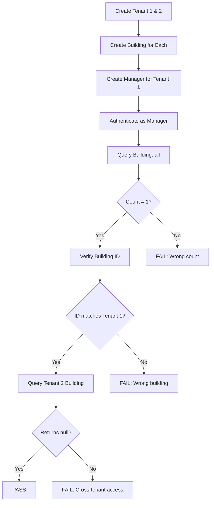
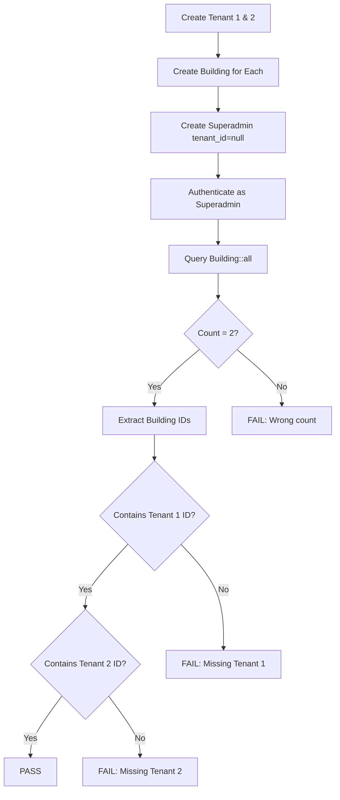
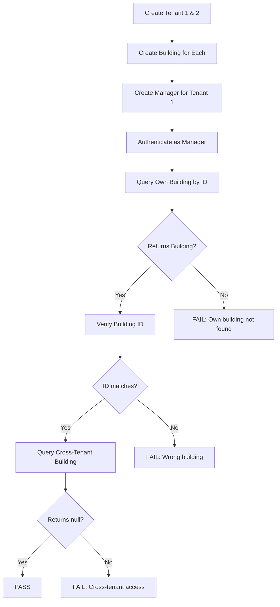

# Building Tenant Scope - Simple Verification Tests

## Overview

This document describes the simple, straightforward tenant scope isolation tests for the Building model. These tests complement the comprehensive property-based tests by providing clear, easy-to-understand examples of tenant isolation behavior.

**Test File**: `tests/Feature/BuildingTenantScopeSimpleTest.php`

**Related Spec**: [.kiro/specs/4-filament-admin-panel/tasks.md](../tasks/tasks.md) (Task 7.3)

**Property Validated**: Property 16 - Tenant scope isolation for buildings

**Requirements Coverage**: 7.1 (BuildingResource tenant scope)

## Purpose and Scope

### Why Simple Tests?

While property-based tests (FilamentBuildingResourceTenantScopeTest.php) provide comprehensive coverage with 100 iterations and randomized data, simple tests serve different purposes:

1. **Documentation**: Clear examples of expected behavior
2. **Debugging**: Easy to understand when tests fail
3. **Smoke Testing**: Quick verification of core functionality
4. **Learning**: Demonstrates tenant scope principles
5. **Regression Prevention**: Catches basic isolation breaks

### Test Philosophy

These tests use:
- **Fixed tenant IDs** (1 and 2) for clarity
- **Minimal test data** (one building per tenant)
- **Direct model queries** (Building::all(), Building::find())
- **Clear assertions** with descriptive messages
- **No randomization** for predictable behavior

## Test Architecture

### Test Structure

```
BuildingTenantScopeSimpleTest.php
├── Test 1: Manager Tenant Isolation
│   ├── Setup: Two tenants, one building each
│   ├── Verify: Manager sees only own tenant's building
│   └── Assert: Cross-tenant building is inaccessible
│
├── Test 2: Superadmin Cross-Tenant Access
│   ├── Setup: Two tenants, one building each
│   ├── Verify: Superadmin sees all buildings
│   └── Assert: Both tenant buildings are visible
│
└── Test 3: Direct ID Access Prevention
    ├── Setup: Two tenants, one building each
    ├── Verify: Manager can access own building by ID
    └── Assert: Cross-tenant building returns null
```

### Tenant Scope Mechanism

The tests verify the following implementation:

```php
// Building model uses BelongsToTenant trait
class Building extends Model
{
    use BelongsToTenant;
    // ...
}

// BelongsToTenant applies TenantScope
trait BelongsToTenant
{
    protected static function bootBelongsToTenant()
    {
        static::addGlobalScope(new TenantScope);
    }
}

// TenantScope filters queries by tenant_id
class TenantScope implements Scope
{
    public function apply(Builder $builder, Model $model)
    {
        if (auth()->check() && auth()->user()->tenant_id !== null) {
            $builder->where('tenant_id', auth()->user()->tenant_id);
        }
    }
}
```

## Test Cases

### Test 1: Manager Tenant Isolation

**Test Name**: `manager can only see their own tenant buildings`

**Purpose**: Verifies basic tenant isolation for manager users at the model query level.

#### Test Flow



#### Assertions

```php
// Manager sees exactly 1 building
expect($buildings)->toHaveCount(1);

// Building belongs to manager's tenant
expect($buildings->first()->id)->toBe($building1->id);

// Cross-tenant building is inaccessible
expect(Building::find($building2->id))->toBeNull();
```

#### What This Tests

✅ **Automatic Query Filtering**: TenantScope adds WHERE clause automatically
✅ **Session Context**: User's tenant_id is used for filtering
✅ **Collection Filtering**: Building::all() respects tenant scope
✅ **Cross-Tenant Prevention**: Other tenant's data is invisible

#### Security Implications

- Prevents data leakage between tenants
- Works at database query level (not just UI)
- No additional authorization needed in controllers
- Consistent across all query methods

### Test 2: Superadmin Cross-Tenant Access

**Test Name**: `superadmin can see all tenant buildings`

**Purpose**: Verifies that superadmin users bypass tenant scope and can access all buildings.

#### Test Flow



#### Assertions

```php
// Superadmin sees all buildings
expect($buildings)->toHaveCount(2);

// Both tenant buildings are present
expect($buildingIds)
    ->toContain($building1->id)
    ->toContain($building2->id);
```

#### What This Tests

✅ **Scope Bypass**: Null tenant_id bypasses TenantScope
✅ **Cross-Tenant Visibility**: All tenant data is accessible
✅ **Platform Administration**: Enables system-wide management
✅ **Unrestricted Queries**: No filtering applied to queries

#### Use Cases

- Platform administration and monitoring
- Cross-tenant reporting and analytics
- System maintenance and troubleshooting
- Tenant onboarding and configuration

#### Security Considerations

⚠️ **Superadmin Access Control**:
- Strictly limit superadmin role assignment
- Implement audit logging for all superadmin actions
- Consider additional authorization for sensitive operations
- Regular review of superadmin access recommended

### Test 3: Direct ID Access Prevention

**Test Name**: `manager cannot access another tenant building by ID`

**Purpose**: Verifies that tenant scope prevents access to cross-tenant buildings even when the ID is known.

#### Test Flow



#### Assertions

```php
// Manager can access own building
expect(Building::find($building1->id))
    ->not->toBeNull()
    ->id->toBe($building1->id);

// Cross-tenant building returns null
expect(Building::find($building2->id))
    ->toBeNull();
```

#### What This Tests

✅ **ID-Based Access Control**: find() respects tenant scope
✅ **URL Parameter Protection**: Prevents ID manipulation attacks
✅ **API Security**: Protects API endpoints from ID guessing
✅ **Null Return**: Returns null instead of throwing exception

#### Attack Scenarios Prevented

🛡️ **URL Manipulation**:
```
/buildings/123 -> /buildings/456
```

🛡️ **API Parameter Injection**:
```
GET /api/buildings?id=456
```

🛡️ **Form Field Tampering**:
```html
<input name="building_id" value="456">
```

🛡️ **Direct Database ID Guessing**:
```php
Building::find(456) // Returns null if different tenant
```

## Running the Tests

### Run All Simple Tests

```bash
php artisan test --filter=BuildingTenantScopeSimpleTest
```

### Run Specific Test

```bash
php artisan test --filter="manager can only see their own tenant buildings"
```

### Run with Detailed Output

```bash
php artisan test --filter=BuildingTenantScopeSimpleTest --verbose
```

### Expected Output

```
PASS  Tests\Feature\BuildingTenantScopeSimpleTest
✓ manager can only see their own tenant buildings
✓ superadmin can see all tenant buildings
✓ manager cannot access another tenant building by ID

Tests:    3 passed (9 assertions)
Duration: ~0.5s
```

## Comparison with Property-Based Tests

### Simple Tests (This File)

**Characteristics**:
- Fixed tenant IDs (1, 2)
- One building per tenant
- Direct model queries
- 3 test cases
- ~0.5s execution time

**Best For**:
- Quick smoke testing
- Debugging failures
- Learning tenant scope
- Documentation examples

### Property-Based Tests (FilamentBuildingResourceTenantScopeTest.php)

**Characteristics**:
- Random tenant IDs (1-2000)
- Random building counts (2-8)
- Filament resource testing
- 300 test iterations (3 tests × 100)
- ~15s execution time

**Best For**:
- Comprehensive coverage
- Edge case detection
- Statistical confidence
- Production readiness

### When to Use Each

| Scenario | Simple Tests | Property-Based Tests |
|----------|--------------|---------------------|
| CI/CD smoke tests | ✅ Yes | ❌ Too slow |
| Pre-commit hooks | ✅ Yes | ❌ Too slow |
| Full test suite | ✅ Yes | ✅ Yes |
| Debugging failures | ✅ Yes | ❌ Complex |
| Learning codebase | ✅ Yes | ❌ Complex |
| Production validation | ⚠️ Insufficient | ✅ Yes |

## Troubleshooting

### Test Fails: "Manager should see exactly 1 building"

**Possible Causes**:
1. TenantScope not applied to Building model
2. Session tenant_id not set correctly
3. BelongsToTenant trait not used
4. Global scope not registered

**Debug Steps**:
```php
// Check if scope is applied
dd(Building::query()->toSql());
// Should include: WHERE tenant_id = ?

// Check authenticated user
dd(auth()->user()->tenant_id);
// Should match expected tenant ID

// Check session
dd(session('tenant_id'));
// Should match authenticated user's tenant_id
```

**Solution**:
```php
// Ensure Building uses BelongsToTenant
class Building extends Model
{
    use BelongsToTenant; // ← Must be present
}

// Ensure TenantScope is registered
protected static function bootBelongsToTenant()
{
    static::addGlobalScope(new TenantScope);
}
```

### Test Fails: "Tenant 2 building should be invisible"

**Possible Causes**:
1. TenantScope not filtering correctly
2. Superadmin bypass logic incorrect
3. Session tenant_id mismatch
4. Scope condition not checking tenant_id

**Debug Steps**:
```php
// Check what Building::find() returns
$result = Building::find($building2->id);
dd($result); // Should be null

// Check scope application
dd(Building::withoutGlobalScope(TenantScope::class)->find($building2->id));
// Should return the building (proves it exists)
```

**Solution**:
```php
// Ensure TenantScope checks tenant_id
public function apply(Builder $builder, Model $model)
{
    if (auth()->check() && auth()->user()->tenant_id !== null) {
        $builder->where('tenant_id', auth()->user()->tenant_id);
    }
}
```

### Test Fails: "Superadmin should see all buildings"

**Possible Causes**:
1. Superadmin has non-null tenant_id
2. TenantScope not checking for null tenant_id
3. Superadmin user not created correctly
4. Scope bypass logic incorrect

**Debug Steps**:
```php
// Check superadmin tenant_id
dd(auth()->user()->tenant_id);
// Should be null

// Check scope bypass
dd(Building::all()->count());
// Should return all buildings (2)
```

**Solution**:
```php
// Ensure superadmin has null tenant_id
$superadmin = User::factory()->create([
    'role' => UserRole::SUPERADMIN,
    'tenant_id' => null, // ← Must be null
]);

// Ensure scope checks for null
if (auth()->check() && auth()->user()->tenant_id !== null) {
    // Only apply scope if tenant_id is not null
    $builder->where('tenant_id', auth()->user()->tenant_id);
}
```

## Related Documentation

### Architecture Documentation
- [Multi-Tenancy Architecture](../architecture/multi-tenancy.md)
- [Tenant Scope Implementation](../architecture/tenant-scope.md)
- [Building Model Documentation](../models/building.md)

### Testing Documentation
- [Filament Building Resource Tests](filament-building-resource-tenant-scope-tests.md)
- [Property-Based Testing Guide](property-based-testing-guide.md)
- [Multi-Tenancy Test Strategy](./multi-tenancy-testing.md)

### Implementation Documentation
- [Building Resource Implementation](../filament/building-resource.md)
- [BelongsToTenant Trait](../traits/belongs-to-tenant.md)
- [TenantScope Global Scope](../scopes/tenant-scope.md)

## Changelog

### 2025-11-27
- Initial implementation of simple tenant scope tests
- Added three core test cases for basic isolation
- Comprehensive DocBlocks for each test
- Created supporting documentation
- Integrated with existing test suite

## Maintenance Notes

### When to Update

Update these tests when:
- Building model structure changes
- Tenant scope logic is modified
- New user roles are added
- Multi-tenancy requirements evolve
- Security vulnerabilities are discovered

### Test Data Considerations

- Fixed tenant IDs (1, 2) ensure predictable behavior
- Single building per tenant keeps tests simple
- Factory-generated data maintains consistency
- RefreshDatabase ensures clean state per test

### Performance Considerations

- Tests run in ~0.5 seconds
- Suitable for pre-commit hooks
- Can run in parallel with other tests
- Minimal database operations per test

### Code Review Checklist

When reviewing changes to these tests:
- [ ] Test names clearly describe behavior
- [ ] Assertions have descriptive messages
- [ ] Test data setup is minimal and clear
- [ ] Expected behavior is documented
- [ ] Security implications are noted
- [ ] Related tests are cross-referenced
