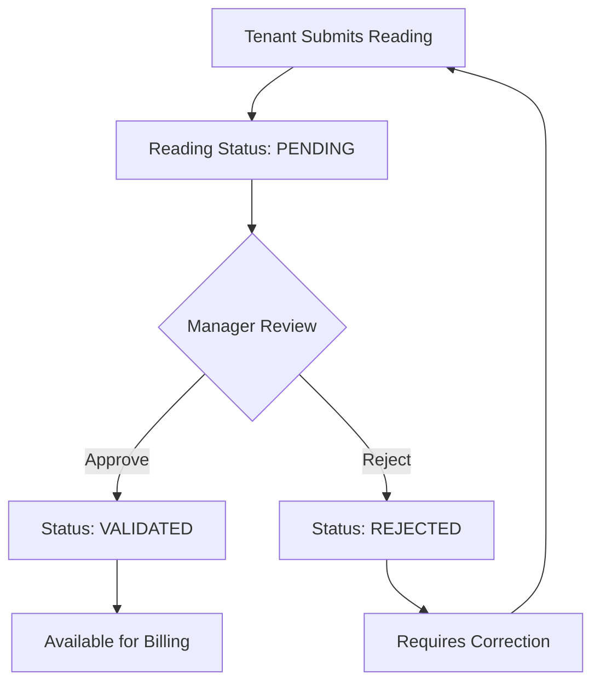

# Truth-but-Verify Workflow Documentation

## Overview

The Truth-but-Verify workflow (Gold Master v7.0) enables tenants to submit meter readings that require manager approval before being used for billing calculations. This workflow maintains data integrity while empowering tenants to participate in the meter reading process.

## Workflow Architecture



## Core Principles

### 1. Trust with Verification
- **Trust**: Tenants are trusted to provide accurate meter readings
- **Verify**: Managers validate readings before billing integration
- **Transparency**: Clear status tracking and audit trails

### 2. Role-Based Workflow
- **Tenants**: Submit readings, view status, cannot edit after submission
- **Managers**: Review, approve/reject, provide feedback
- **Admins**: Full access, can override workflow if needed

### 3. Data Integrity
- Readings cannot be modified after submission (by tenants)
- All workflow actions are audited
- Validation status prevents accidental billing of unverified readings

## Workflow States

### ValidationStatus Enum

```php
enum ValidationStatus: string
{
    case PENDING = 'pending';           // Awaiting manager review
    case VALIDATED = 'validated';       // Approved by manager
    case REJECTED = 'rejected';         // Rejected by manager
    case REQUIRES_REVIEW = 'requires_review'; // Flagged for additional review
}
```

### State Transitions

| From | To | Trigger | Actor | Notes |
|------|----|---------| ------|-------|
| - | PENDING | Reading submission | Tenant | Initial state for tenant readings |
| PENDING | VALIDATED | Manager approval | Manager+ | Reading approved for billing |
| PENDING | REJECTED | Manager rejection | Manager+ | Reading rejected with reason |
| PENDING | REQUIRES_REVIEW | System flag | System | Anomaly detection trigger |
| REJECTED | PENDING | New submission | Tenant | Tenant resubmits corrected reading |
| REQUIRES_REVIEW | VALIDATED | Manager approval | Manager+ | After additional review |
| REQUIRES_REVIEW | REJECTED | Manager rejection | Manager+ | After review, still rejected |

## Implementation Details

### User Capabilities

#### Tenant Capabilities
```php
// User model methods for tenant workflow participation
public function canCreateMeterReadings(): bool
{
    return in_array($this->role, [
        UserRole::SUPERADMIN,
        UserRole::ADMIN,
        UserRole::MANAGER,
        UserRole::TENANT, // NEW: Tenants can create
    ], true) && $this->is_active;
}

public function submissionsRequireValidation(): bool
{
    return $this->role === UserRole::TENANT;
}
```

#### Manager Capabilities
```php
public function canManageMeterReadings(): bool
{
    return in_array($this->role, [
        UserRole::SUPERADMIN,
        UserRole::ADMIN,
        UserRole::MANAGER,
    ], true) && $this->is_active;
}

public function canValidateMeterReadings(): bool
{
    return $this->canManageMeterReadings();
}
```

### Policy Authorization

#### Creation Authorization
```php
public function create(User $user): bool
{
    // All authenticated roles can create meter readings
    $canCreate = in_array($user->role, self::READING_CREATORS, true);
    
    if ($canCreate && $user->role === UserRole::TENANT) {
        $this->logSensitiveOperation('create_attempt', $user, null, [
            'workflow' => 'truth_but_verify',
            'requires_approval' => true,
        ]);
    }
    
    return $canCreate;
}
```

#### Approval Authorization
```php
public function approve(User $user, MeterReading $meterReading): bool
{
    // Only managers and above can approve readings
    if (!in_array($user->role, self::READING_MANAGERS, true)) {
        return false;
    }

    // Must be within tenant scope for managers
    if ($user->role === UserRole::MANAGER && !$this->belongsToUserTenant($user, $meterReading)) {
        return false;
    }

    // Can only approve readings that require validation
    if (!$meterReading->requiresValidation()) {
        return false;
    }

    // Can only approve pending readings
    if ($meterReading->validation_status !== ValidationStatus::PENDING) {
        return false;
    }

    return true;
}
```

### Model Methods

#### MeterReading Model Extensions
```php
// Check if reading requires validation
public function requiresValidation(): bool
{
    return $this->enteredBy?->submissionsRequireValidation() ?? false;
}

// Mark reading as validated
public function markAsValidated(int $validatedBy): void
{
    $this->update([
        'validation_status' => ValidationStatus::VALIDATED,
        'validated_by' => $validatedBy,
        'validated_at' => now(),
    ]);
}

// Mark reading as rejected
public function markAsRejected(int $validatedBy): void
{
    $this->update([
        'validation_status' => ValidationStatus::REJECTED,
        'validated_by' => $validatedBy,
        'validated_at' => now(),
    ]);
}
```

## Filament Integration

### Resource Actions

#### Approve Action
```php
Action::make('approve')
    ->label('Approve')
    ->icon('heroicon-o-check-circle')
    ->color('success')
    ->visible(fn (MeterReading $record): bool => 
        $record->validation_status === ValidationStatus::PENDING || 
        $record->validation_status === ValidationStatus::REQUIRES_REVIEW
    )
    ->requiresConfirmation()
    ->modalHeading('Approve Reading')
    ->modalDescription('Are you sure you want to approve this meter reading?')
    ->action(function (MeterReading $record): void {
        $record->markAsValidated(auth()->id());
        
        Notification::make()
            ->title('Reading Approved')
            ->body('The meter reading has been approved and is now available for billing.')
            ->success()
            ->send();
    });
```

#### Reject Action
```php
Action::make('reject')
    ->label('Reject')
    ->icon('heroicon-o-x-circle')
    ->color('danger')
    ->visible(fn (MeterReading $record): bool => 
        $record->validation_status === ValidationStatus::PENDING || 
        $record->validation_status === ValidationStatus::REQUIRES_REVIEW
    )
    ->form([
        Forms\Components\Textarea::make('validation_notes')
            ->label('Rejection Reason')
            ->required()
            ->placeholder('Please provide a reason for rejecting this reading...')
            ->rows(3),
    ])
    ->modalHeading('Reject Reading')
    ->modalDescription('Please provide a reason for rejecting this meter reading.')
    ->action(function (MeterReading $record, array $data): void {
        $record->validation_notes = $data['validation_notes'];
        $record->markAsRejected(auth()->id());
        
        Notification::make()
            ->title('Reading Rejected')
            ->body('The meter reading has been rejected and marked for review.')
            ->warning()
            ->send();
    });
```

### Table Columns

#### Validation Status Column
```php
Tables\Columns\TextColumn::make('validation_status')
    ->label('Status')
    ->badge()
    ->formatStateUsing(fn ($state): string => 
        $state instanceof ValidationStatus ? $state->getLabel() : ucfirst(str_replace('_', ' ', (string) $state))
    )
    ->color(fn ($state): string => match ($state instanceof ValidationStatus ? $state->value : (string) $state) {
        'validated' => 'success',
        'pending' => 'warning',
        'requires_review' => 'info',
        'rejected' => 'danger',
        default => 'gray',
    });
```

## Tenant Boundary Enforcement

### Property-Based Access Control

The workflow respects tenant boundaries through the `TenantBoundaryService`:

```php
// Check if tenant can access meter reading
public function canTenantAccessMeterReading(User $tenantUser, MeterReading $meterReading): bool
{
    if (!$tenantUser->tenant) {
        return false;
    }

    $cacheKey = "tenant_meter_access_{$tenantUser->tenant->id}_{$meterReading->meter_id}";
    
    return Cache::remember($cacheKey, 300, function () use ($tenantUser, $meterReading) {
        return $meterReading->meter
            ->property
            ->tenants()
            ->where('tenants.id', $tenantUser->tenant->id)
            ->exists();
    });
}

// Check if tenant can submit reading for specific meter
public function canTenantSubmitReadingForMeter(User $tenantUser, int $meterId): bool
{
    if (!$tenantUser->tenant) {
        return false;
    }

    $cacheKey = "tenant_meter_submit_{$tenantUser->tenant->id}_{$meterId}";
    
    return Cache::remember($cacheKey, 300, function () use ($tenantUser, $meterId) {
        return $tenantUser->tenant
            ->properties()
            ->whereHas('meters', function ($query) use ($meterId) {
                $query->where('id', $meterId);
            })
            ->exists();
    });
}
```

## Audit and Compliance

### Audit Logging

All workflow operations are logged for compliance:

```php
// Tenant creation attempt
$this->logSensitiveOperation('create_attempt', $user, null, [
    'workflow' => 'truth_but_verify',
    'requires_approval' => true,
]);

// Manager approval
$this->logSensitiveOperation('approve', $user, $meterReading, [
    'validation_status' => $meterReading->validation_status->value,
    'input_method' => $meterReading->input_method->value,
]);

// Manager rejection
$this->logSensitiveOperation('reject', $user, $meterReading, [
    'validation_status' => $meterReading->validation_status->value,
    'rejection_reason' => $meterReading->validation_notes,
]);
```

### Audit Trail Fields

The MeterReading model includes audit fields:

```php
// Validation tracking
'validation_status' => ValidationStatus::PENDING,
'validated_by' => null,
'validated_at' => null,
'validation_notes' => null,

// Input tracking
'input_method' => InputMethod::MANUAL,
'entered_by' => auth()->id(),
'photo_path' => null,
```

## Business Rules

### Validation Requirements

1. **Tenant Submissions**: Always require validation
2. **Manager Submissions**: Skip validation (trusted source)
3. **Admin Submissions**: Skip validation (trusted source)
4. **System Submissions**: Skip validation (automated)

### Approval Criteria

Managers should approve readings when:
- Reading value is within expected range
- Reading follows monotonic progression
- Reading date is reasonable
- No obvious data entry errors

Managers should reject readings when:
- Reading value seems incorrect
- Reading breaks monotonic sequence
- Reading date is invalid
- Obvious data entry errors

### Billing Integration

Only validated readings are used for billing:

```php
// Billing service only processes validated readings
public function calculateBilling(Property $property, Carbon $periodStart, Carbon $periodEnd): BillingResult
{
    $readings = MeterReading::query()
        ->whereHas('meter.property', fn($q) => $q->where('id', $property->id))
        ->whereBetween('reading_date', [$periodStart, $periodEnd])
        ->where('validation_status', ValidationStatus::VALIDATED) // Only validated
        ->get();
    
    // Process validated readings for billing
}
```

## Error Handling

### Validation Errors

```php
// Cannot approve non-pending reading
if ($meterReading->validation_status !== ValidationStatus::PENDING) {
    throw new InvalidOperationException('Only pending readings can be approved');
}

// Cannot edit after submission (tenant)
if ($user->role === UserRole::TENANT && $meterReading->exists) {
    throw new UnauthorizedException('Cannot edit reading after submission');
}
```

### Boundary Violations

```php
// Cross-tenant access attempt
if (!$this->belongsToUserTenant($user, $meterReading)) {
    throw new UnauthorizedException('Cannot access reading from different tenant');
}

// Property access violation
if (!$this->tenantBoundaryService->canTenantAccessMeterReading($user, $meterReading)) {
    throw new UnauthorizedException('Cannot access reading for this property');
}
```

## Testing Strategy

### Unit Tests

```php
/** @test */
public function tenant_can_create_meter_reading(): void
{
    $tenant = User::factory()->create(['role' => UserRole::TENANT]);
    
    $this->assertTrue($this->policy->create($tenant));
}

/** @test */
public function tenant_cannot_edit_after_submission(): void
{
    $tenant = User::factory()->create(['role' => UserRole::TENANT]);
    $reading = MeterReading::factory()->create(['entered_by' => $tenant->id]);
    
    $this->assertFalse($this->policy->update($tenant, $reading));
}

/** @test */
public function manager_can_approve_pending_reading(): void
{
    $manager = User::factory()->create(['role' => UserRole::MANAGER, 'tenant_id' => 1]);
    $reading = MeterReading::factory()->create([
        'tenant_id' => 1,
        'validation_status' => ValidationStatus::PENDING,
    ]);
    
    $this->assertTrue($this->policy->approve($manager, $reading));
}
```

### Feature Tests

```php
/** @test */
public function tenant_submission_workflow(): void
{
    $tenant = User::factory()->create(['role' => UserRole::TENANT]);
    $meter = Meter::factory()->create();
    
    // Tenant submits reading
    $response = $this->actingAs($tenant)
        ->postJson('/api/meter-readings', [
            'meter_id' => $meter->id,
            'value' => 1000,
            'reading_date' => now()->format('Y-m-d'),
        ]);
    
    $response->assertCreated();
    
    $reading = MeterReading::latest()->first();
    $this->assertEquals(ValidationStatus::PENDING, $reading->validation_status);
    $this->assertEquals($tenant->id, $reading->entered_by);
}

/** @test */
public function manager_approval_workflow(): void
{
    $manager = User::factory()->create(['role' => UserRole::MANAGER, 'tenant_id' => 1]);
    $reading = MeterReading::factory()->create([
        'tenant_id' => 1,
        'validation_status' => ValidationStatus::PENDING,
    ]);
    
    // Manager approves reading
    $response = $this->actingAs($manager)
        ->patchJson("/api/meter-readings/{$reading->id}/approve");
    
    $response->assertOk();
    
    $reading->refresh();
    $this->assertEquals(ValidationStatus::VALIDATED, $reading->validation_status);
    $this->assertEquals($manager->id, $reading->validated_by);
}
```

## Performance Considerations

### Caching Strategy

```php
// Cache tenant boundary checks
$cacheKey = "tenant_meter_access_{$tenantId}_{$meterId}";
Cache::remember($cacheKey, 300, function () use ($tenant, $meter) {
    return $tenant->canAccessMeter($meter);
});

// Cache validation status queries
$pendingReadings = Cache::remember("pending_readings_{$tenantId}", 60, function () use ($tenantId) {
    return MeterReading::where('tenant_id', $tenantId)
        ->where('validation_status', ValidationStatus::PENDING)
        ->count();
});
```

### Database Optimization

```php
// Index for validation status queries
Schema::table('meter_readings', function (Blueprint $table) {
    $table->index(['tenant_id', 'validation_status']);
    $table->index(['validated_by', 'validated_at']);
});

// Eager load relationships for approval workflows
MeterReading::with(['meter.property', 'enteredBy', 'validatedBy'])
    ->where('validation_status', ValidationStatus::PENDING)
    ->get();
```

## Migration Guide

### From Previous Version

1. **Update Policy**: Add tenant creation rights
2. **Add Validation Fields**: Extend MeterReading model
3. **Update UI**: Add approval/rejection actions
4. **Test Workflow**: Verify tenant submission flow
5. **Train Users**: Document new workflow for tenants/managers

### Database Changes

```php
// Migration: Add validation fields
Schema::table('meter_readings', function (Blueprint $table) {
    $table->string('validation_status')->default('pending');
    $table->unsignedBigInteger('validated_by')->nullable();
    $table->timestamp('validated_at')->nullable();
    $table->text('validation_notes')->nullable();
    
    $table->foreign('validated_by')->references('id')->on('users');
    $table->index(['validation_status', 'tenant_id']);
});
```

## Related Documentation

- [MeterReadingPolicy](../policies/METER_READING_POLICY.md)
- [User Meter Reading Capabilities](../models/USER_METER_READING_CAPABILITIES.md)
- [TenantBoundaryService](../services/TENANT_BOUNDARY_SERVICE.md)
- [MeterReading Model](../models/METER_READING.md)
- [Filament MeterReadingResource](../filament/METER_READING_RESOURCE.md)